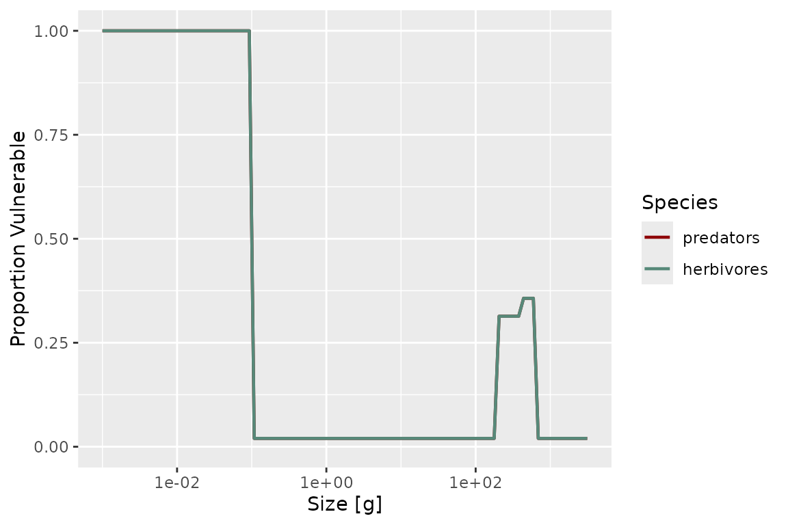
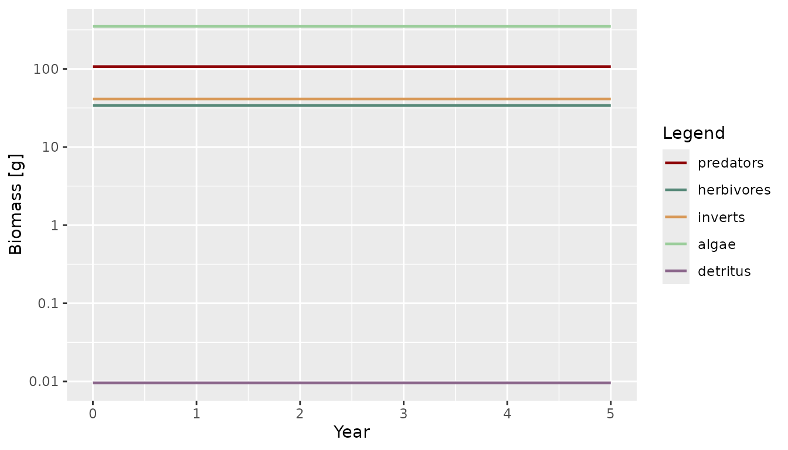

# How mizerReef extends mizer

## Overview

mizerReef is an extension package for mizer that adds three ecological
processes to a standard multispecies size-spectrum model, all motivated
by structurally complex habitats such as coral reefs:

- **predation refuge** — structural complexity lets some prey hide from
  some predators, reducing the encounter and mortality rates that would
  otherwise apply,
- **algae and detritus** — two unstructured (not size-structured)
  benthic resource pools that herbivorous and detritivorous species feed
  on,
- **senescence mortality** — an extra size-dependent mortality term
  representing non-predation death close to a species’ maximum size.

The package uses the mechanisms described in
[`vignette("guide-create-extension-package", package = "mizer")`](https://sizespectrum.org/mizer/articles/guide-create-extension-package.html):

| Extension mechanism | Used for |
|----|----|
| `.onLoad` + [`registerExtension()`](https://sizespectrum.org/mizer/reference/registerExtension.html) | Register the package with mizer so params objects know which extensions they need |
| S4 marker classes + S3 dispatch | Define `mizerReef`/`mizerReefSim` so reef-specific methods run automatically |
| `project*` rate methods | Override Encounter, FeedingLevel, PredMort and Mort to add refuge, satiation, and senescence effects |
| [`setComponent()`](https://sizespectrum.org/mizer/reference/setComponent.html) | Add algae and detritus as scalar dynamical components |
| [`utils::upgrade()`](https://rdrr.io/r/utils/upgrade.html) | Migrate objects saved with older mizerReef versions |

All of these are wired together inside
[`newReefParams()`](https://cmbeese.github.io/mizerReef/reference/newReefParams.md),
the single entry point for building a reef model.

## The `mizerReef` marker class

mizerReef defines two S4 marker subclasses:

``` r

setClass("mizerReef",    contains = "MizerParams")
setClass("mizerReefSim", contains = "MizerSim")
```

These classes carry no extra slots — all reef-specific state (refuge,
algae and detritus parameters) lives in `other_params(params)`. The
classes exist purely to trigger S3 dispatch, exactly as described for
marker classes in
[`vignette("guide-create-extension-package", package = "mizer")`](https://sizespectrum.org/mizer/articles/guide-create-extension-package.html).

### Registration via `.onLoad`

``` r

.onLoad <- function(libname, pkgname) {
    mizer::registerExtension(pkgname, requirement = "sizespectrum/mizerReef")
}
```

This registers mizerReef with mizer’s extension chain as soon as the
package is loaded.
[`newReefParams()`](https://cmbeese.github.io/mizerReef/reference/newReefParams.md)
then records the chain and coerces the result to the marker class at the
very end of construction:

``` r

params@extensions <- mizer::getRegisteredExtensions()
params <- mizer::coerceToExtensionClass(params)
```

Recording the chain in `params@extensions` is what lets
[`project()`](https://sizespectrum.org/mizer/reference/project.html)
produce a `mizerReefSim` automatically (via
[`MizerSim()`](https://sizespectrum.org/mizer/reference/MizerSim.html)’s
own call to
[`coerceToExtensionClass()`](https://sizespectrum.org/mizer/reference/coerceToExtensionClass.html)),
and what lets
[`readParams()`](https://sizespectrum.org/mizer/reference/saveParams.html)
restore the correct class — and warn about missing or outdated
extensions — when a saved object is reloaded in a later session.

#### A known gap: bundled example models and multiple extensions

mizerReef ships two pre-built example models as package data
(`caribbean_10_model`, `caribbean_3_model`). `.onLoad` also contains a
[`makeActiveBinding()`](https://rdrr.io/r/base/bindenv.html) call,
scoped to `caribbean_3_model` only, intended to re-coerce that object to
the correct class if a *second* mizer extension is loaded alongside
mizerReef, since a bundled `.rda` is fixed at save time and can’t know
in advance what else will be loaded in the same session. In the current
mizer/mizerReef versions this mechanism does not fire —
[`exists()`](https://rdrr.io/r/base/exists.html) on the bundled object
inside `.onLoad` is always `FALSE` at that point, so the active binding
is never installed. This is not mizerReef-specific: the identical
dead-code pattern exists in mizerShelf’s own current source for its
bundled `NWMed_params` object.

For everyday single-extension use this is harmless, since both bundled
objects already carry the correct class from when they were saved. It
would only matter if you loaded mizerReef together with a second
dispatching extension on one of these two specific objects — for
example, the mizerMR combination shown in
[`vignette("using-multiple-resources")`](https://cmbeese.github.io/mizerReef/articles/using-multiple-resources.md).
That combination does work (mizer’s extension chain, a separate
mechanism, correctly promotes the object’s class when both extensions
are registered), but the underlying `.onLoad` dead-code gap described
above is still unfixed upstream; see `inst/to-do-list.txt` for the
current state.

### Methods dispatched on `mizerReef`

| Method | What it adds |
|----|----|
| `projectEncounter.mizerReef()` | Recomputes encounter for refuge-blocked predators using vulnerability-reduced prey abundance |
| `projectFeedingLevel.mizerReef()` | Gives predators without a satiation response unlimited intake capacity |
| `projectPredMort.mizerReef()` | Discounts predation mortality from refuge-blocked predators by prey vulnerability |
| `projectMort.mizerReef()` | Adds senescence mortality on top of the standard mortality |
| [`getBiomass.mizerReefSim()`](https://cmbeese.github.io/mizerReef/reference/getBiomass.mizerReefSim.md) | Adds algae and detritus biomass to the species biomasses |
| [`removeSpecies.mizerReef()`](https://cmbeese.github.io/mizerReef/reference/removeSpecies.mizerReef.md) | Updates the algae/detritus encounter-rate matrices `rho` |
| [`upgrade.mizerReef()`](https://cmbeese.github.io/mizerReef/reference/upgrade.mizerReef.md) | Migrates objects created with an earlier mizerReef 2.x layout to the current one (automatic; for mizerReef 1.x objects, see [`upgradeReefParams()`](https://cmbeese.github.io/mizerReef/reference/upgradeReefParams.md) instead) |
| [`steady.mizerReef()`](https://cmbeese.github.io/mizerReef/reference/reef-steady-methods.md) | Runs [`reefSteady()`](https://cmbeese.github.io/mizerReef/reference/reefSteady.md), so the algae and detritus pools are tuned along with the fish sub-model |
| [`tuneSteadyState.mizerReef()`](https://cmbeese.github.io/mizerReef/reference/reef-steady-methods.md) | The same, under mizer 3.3’s current name for [`steady()`](https://sizespectrum.org/mizer/reference/superseded_steady.html) |

Every one of these methods calls
[`NextMethod()`](https://rdrr.io/r/base/UseMethod.html) at least once,
so multiple *dispatching* extensions can modify the same rate or generic
without silently overwriting each other’s contribution — *provided every
extension involved follows the same convention*. This is not automatic
just because a package touches a mizer model: mizer still supports an
older, non-chaining mechanism
([`mizer::setRateFunction()`](https://sizespectrum.org/mizer/reference/setRateFunction.html))
that swaps in a single named function for a rate, with no dispatch at
all, and a params object uses one mechanism or the other for a given
rate, never both. See the caveat in
[`vignette("using-multiple-resources")`](https://cmbeese.github.io/mizerReef/articles/using-multiple-resources.md)
for a concrete example (mizerReef’s dispatching encounter-rate chain
versus therMizer’s non-chaining
[`setRateFunction()`](https://sizespectrum.org/mizer/reference/setRateFunction.html)
approach, and why combining them does not currently give you both
effects together). The next two sections look at mizerReef’s own rate
methods in detail, because they illustrate both the easy case (a purely
additive modification) and a harder case that needed more thought.

## Predation refuge: a multiplicative rate modification

Three species parameters control how refuge affects a species:

- `refuge_user` — does this species hide in refuge at all?
- `blocked_pred` — is this species’ *foraging* hindered by refuge
  (i.e. is it a predator that struggles to reach prey hiding in
  structure)?
- `satiation` — does this species show a satiation response, or can it
  always find as much food as it can physically ingest?

[`reefVulnerable()`](https://cmbeese.github.io/mizerReef/reference/reefVulnerable.md)
computes, for each species and size, the proportion of individuals *not*
protected by refuge — using one of four profile methods (`"sigmoidal"`,
`"binned"`, `"competitive"`, `"noncomplex"`) set with
[`setRefuge()`](https://cmbeese.github.io/mizerReef/reference/setRefuge.md).
`"competitive"` is the most detailed: refuge is a limited resource that
same-size individuals compete for, so vulnerability depends on the
actual local density of competitors at each time step, not just on size.

``` r

plotVulnerable(params)
```



### Why this can’t be a simple additive override

mizerShelf’s `getBiomass.mizerShelf()` adds detritus and carrion biomass
*on top of* the standard result — a purely additive modification that a
single [`NextMethod()`](https://rdrr.io/r/base/UseMethod.html) call
expresses perfectly. Predation refuge is different: it *discounts* the
prey available to `blocked_pred` predators before the encounter and
predation-mortality integrals are computed, i.e. it enters
**multiplicatively**, and only for a subset of predators. A single
[`NextMethod()`](https://rdrr.io/r/base/UseMethod.html) call cannot
express “recompute this integral with different inputs for these rows
only”.

`projectEncounter.mizerReef()` and `projectPredMort.mizerReef()` solve
this by calling the rate calculation twice — once with unmodified inputs
to get the standard result, and once more with a vulnerability-modified
input to get the correction — and then combining the two by predator
row. Both calls go through
[`NextMethod()`](https://rdrr.io/r/base/UseMethod.html), so both stay
fully composable:

``` r

projectEncounter.mizerReef <- function(params, n, n_pp, n_other, t = 0, ...) {
    blocked_pred <- params@species_params$blocked_pred == TRUE
    if (!any(blocked_pred)) {
        return(NextMethod())
    }
    vulnerable <- reefVulnerable(params, n, n_pp, n_other, t,
        new_rd = reefDegrade(params, n, n_pp, n_other, t, ...))

    # Standard encounter (used as-is for predators unaffected by refuge)
    encounter <- NextMethod()
    # Encounter recomputed with vulnerability-reduced prey abundance (used
    # for predators whose foraging is blocked by refuge). Reassigning the
    # formal `n` and then calling NextMethod() bare sends the reduced prey
    # abundance down the full extension chain.
    n <- vulnerable * n
    encounter_vul <- NextMethod()
    encounter[blocked_pred, ] <- encounter_vul[blocked_pred, ]
    encounter
}
```

`projectPredMort.mizerReef()` follows the same pattern, using the
linearity of the predation-mortality calculation in `pred_rate` to
isolate the contribution of `blocked_pred` predators by zeroing out
every other predator’s row before recomputing:

``` r

projectPredMort.mizerReef <- function(params, n, n_pp, n_other, t = 0,
                                      pred_rate, ...) {
    blocked_pred <- params@species_params$blocked_pred == TRUE
    if (!any(blocked_pred)) {
        return(NextMethod())
    }
    vulnerable <- reefVulnerable(params, n, n_pp, n_other, t,
        new_rd = reefDegrade(params, n, n_pp, n_other, t, ...))

    pm <- NextMethod()
    pred_rate[!blocked_pred, ] <- 0
    pm_blocked <- NextMethod()
    pm + (vulnerable - 1) * pm_blocked
}
```

Because *both* calls go through
[`NextMethod()`](https://rdrr.io/r/base/UseMethod.html) — the standard
one and the vulnerability correction — a lower extension package’s
contribution to Encounter or PredMort is preserved for every predator,
blocked or not. The trick is that a bare
[`NextMethod()`](https://rdrr.io/r/base/UseMethod.html) forwards the
*current* values of the method’s formal arguments as bound in this
frame, not the values the generic was originally called with. So
reassigning `n <- vulnerable * n` (or zeroing rows of `pred_rate`)
before the second bare call is enough to recompute the integral with
modified inputs *through the full chain*, with no direct call to mizer’s
base rate function needed.

### A `NextMethod()` pitfall worth knowing about

The obvious way to recompute with a modified input is to pass an
override directly to
[`NextMethod()`](https://rdrr.io/r/base/UseMethod.html),
e.g. `NextMethod(n = vulnerable * n)`. This looks like it should work —
R does let you override a single argument this way — but testing
surfaced a serious problem: once a generic has more than two formal
arguments, passing an explicit named override to
[`NextMethod()`](https://rdrr.io/r/base/UseMethod.html) corrupts the
matching of the *other* arguments. A minimal reproduction:

``` r

f <- function(params, n, n_pp, n_other, t = 0, ...) UseMethod("f")
f.default <- function(params, n, n_pp, n_other, t = 0, ...) {
    cat("default sees length(n_pp) =", length(n_pp), "\n")
}
f.foo <- function(params, n, n_pp, n_other, t = 0, ...) {
    NextMethod()               # fine
    NextMethod(n = n * 2)      # n_pp comes out wrong!
}
```

Calling this with a 2×3 matrix `n` and a length-5 vector `n_pp` prints
the correct `length(n_pp) = 5` for the first call, but
`length(n_pp) = 6` for the second — `n_pp` has silently been overwritten
by (part of) the new `n`. This is why the two rate methods above never
pass an argument to
[`NextMethod()`](https://rdrr.io/r/base/UseMethod.html). Instead they
reassign the formal in the local frame (`n <- vulnerable * n`) and then
call [`NextMethod()`](https://rdrr.io/r/base/UseMethod.html) bare: the
modified value still propagates down the chain, but because no named
argument is supplied, the matching of the remaining arguments is left
intact. Reassigning-then-calling-bare gives you the composability of the
chain *and* the modified input, with none of the argument-corruption.

## Algae and detritus: two unstructured resource components

Algae and detritus are each registered as a scalar *other* component via
[`setComponent()`](https://sizespectrum.org/mizer/reference/setComponent.html)
inside
[`newReefParams()`](https://cmbeese.github.io/mizerReef/reference/newReefParams.md):

``` r

params <- mizer::setComponent(
    params, "algae",
    initial_value = 1,
    dynamics_fun = "algae_dynamics",
    encounter_fun = "encounter_contribution",
    component_params = list(rho = rho_alg, capacity = ..., growth = ...))

params <- mizer::setComponent(
    params, "detritus",
    initial_value = 1,
    dynamics_fun = "detritus_dynamics",
    encounter_fun = "encounter_contribution",
    component_params = list(rho = rho_det, capacity = ..., ...))
```

Both share the same
[`encounter_contribution()`](https://cmbeese.github.io/mizerReef/reference/encounter_contribution.md)
helper, which adds $`\rho_i(w)\,B`$ to species $`i`$’s encounter rate,
where $`B`$ is the current biomass of the component and $`\rho_i(w)`$ is
a species- and size-dependent encounter-rate coefficient stored in
`other_params(params)[[component]]` – the same location
[`setComponent()`](https://sizespectrum.org/mizer/reference/setComponent.html)’s
`component_params` argument writes to above, and what
[`mizer::getComponent()`](https://sizespectrum.org/mizer/reference/setComponent.html)/[`removeComponent()`](https://sizespectrum.org/mizer/reference/setComponent.html)
read from, so algae and detritus need no special-casing here:

``` r

encounter_contribution <- function(params, n_other, component, ...) {
    params@other_params[[component]]$rho * n_other[[component]]
}
```

`rho` is initialised in
[`newReefParams()`](https://cmbeese.github.io/mizerReef/reference/newReefParams.md)
so that each species can reach feeding level `f0` at maximum body size
once its algae, detritus, and normal prey encounter are all accounted
for.

Both components follow the same dynamical structure — production
balanced against biomass-proportional consumption, solved analytically
within each time step to avoid Euler-step instabilities:

``` math
\frac{dB}{dt} = P - c\,B \quad\Longrightarrow\quad
B(t+dt) = B(t)\,e^{-c\,dt} + \frac{P}{c}\left(1-e^{-c\,dt}\right)
```

For algae, production is a fixed, literature-informed constant growth
rate that is *not* retuned to match consumption – real algal primary
production is not driven by grazer demand, so
\[tuneUR()\]/\[tuneUR_cc()\] instead solve for the algae *biomass* that
balances this fixed production against current consumption (see
[`algae_consumption()`](https://cmbeese.github.io/mizerReef/reference/algae_consumption.md)’s
documentation for the ecological rationale and citations). For detritus,
production genuinely does depend on the rest of the system (fish
egestion, senescence) plus an external flux, so
\[tuneUR()\]/\[tuneUR_cc()\] instead solve for that external flux to
balance a given detritus biomass against consumption. Both have
getters/setters for inspecting and tuning the steady-state balance,
e.g.:

``` r

detritus_lifetime(params)
#> [1] 3.17783e-13
algae_biomass(params)
#> [1] 2.171433e-10
```

### `getBiomass.mizerReefSim()`

Standard
[`getBiomass()`](https://sizespectrum.org/mizer/reference/getBiomass.html)
only returns species biomasses. mizerReef’s method — following the same
pattern as mizerShelf’s `getBiomass.mizerShelf()` — appends the algae
and detritus biomass by reading them directly out of `n_other`:

``` r

getBiomass.mizerReefSim <- function(object, ...) {
    sim <- object
    b <- unclass(NextMethod())
    dimname_names <- names(dimnames(b))

    comp_mat <- matrix(unlist(sim@n_other),
        nrow = nrow(sim@n_other), ncol = ncol(sim@n_other))
    dimnames(comp_mat) <- dimnames(sim@n_other)

    b <- cbind(b, comp_mat[rownames(b), , drop = FALSE])
    names(dimnames(b)) <- dimname_names

    mizer::ArrayTimeBySpecies(b, value_name = "Biomass", units = "g",
                              params = sim@params)
}
```

Because
[`plotBiomass()`](https://sizespectrum.org/mizer/reference/plotBiomass.html)
calls
[`getBiomass()`](https://sizespectrum.org/mizer/reference/getBiomass.html)
internally, this single method is enough to make biomass plots include
algae and detritus alongside fish species — and it works regardless of
whether `mizer` or `mizerReef` was loaded first, since it is triggered
by S3 dispatch on the object’s class rather than by masking mizer’s
function.

``` r

sim <- project(params, t_max = 5, progress_bar = FALSE)
plotBiomass(sim)
```



## Senescence and satiation: `projectMort` and `projectFeedingLevel`

Two of the four rate methods are the simple, purely
additive/input-transform case that
[`NextMethod()`](https://rdrr.io/r/base/UseMethod.html) handles cleanly.

`projectMort.mizerReef()` adds senescence mortality,
[`reefSenMort()`](https://cmbeese.github.io/mizerReef/reference/reefSenMort.md),
on top of the standard mortality:

``` r

projectMort.mizerReef <- function(params, n, n_pp, n_other, t = 0,
                                  f_mort, pred_mort, ...) {
    mort <- NextMethod()
    if (isTRUE(params@other_params$include_sen_mort)) {
        mort <- mort + reefSenMort(params, ...)
    }
    mort
}
```

`projectFeedingLevel.mizerReef()` reassigns `params@intake_max` to `Inf`
for species without a satiation response *before* delegating — a formal
argument reassigned inside a method body is correctly picked up by a
bare [`NextMethod()`](https://rdrr.io/r/base/UseMethod.html) call
(unlike the explicit-override case described above):

``` r

projectFeedingLevel.mizerReef <- function(params, n, n_pp, n_other, t = 0,
                                          encounter, ...) {
    params@intake_max[params@species_params$satiation == FALSE] <- Inf
    fl <- NextMethod()
    fl[is.na(fl)] <- 0
    fl
}
```

## `removeSpecies.mizerReef()`

Removing a species must also drop its row from the algae and detritus
`rho` matrices, which live outside the standard mizer slots that
`removeSpecies.MizerParams()` already knows how to trim:

``` r

removeSpecies.mizerReef <- function(params, species, ...) {
    keep <- !valid_species_arg(params, species, return.logical = TRUE)
    p <- NextMethod()
    p@other_params$algae$rho <-
        p@other_params$algae$rho[keep, , drop = FALSE]
    p@other_params$detritus$rho <-
        p@other_params$detritus$rho[keep, , drop = FALSE]
    p
}
```

``` r

p2 <- removeSpecies(params, "predators")
species_params(p2)$species
#> [1] "herbivores" "inverts"
```

## Upgrading objects saved with older mizerReef versions

An earlier internal design of mizerReef 2.x (never publicly released)
stored refuge, algae, and detritus parameters in three custom S4 slots
(`refuge_params`, `algae_params`, `detritus_params`) rather than in
[`other_params()`](https://sizespectrum.org/mizer/reference/setRateFunction.html).
Since a dispatching extension’s data must live in
[`other_params()`](https://sizespectrum.org/mizer/reference/setRateFunction.html)
rather than in new S4 slots (see the checklist in
[`vignette("guide-create-extension-package", package = "mizer")`](https://sizespectrum.org/mizer/articles/guide-create-extension-package.html)),
those slots were removed from the class definition before release —
which means an object saved with that design needs to be migrated before
it can be used.
[`upgrade.mizerReef()`](https://cmbeese.github.io/mizerReef/reference/upgrade.mizerReef.md)
handles this automatically, and will also handle any future within-2.x
layout changes the same way:

``` r

upgrade.mizerReef <- function(object, ...) {
    tryCatch({
        old_refuge <- .hasSlot(object, "refuge_params")
        old_algae  <- .hasSlot(object, "algae_params")
        old_det    <- .hasSlot(object, "detritus_params")
        if (old_refuge && is.null(object@other_params$refuge_params)) {
            object@other_params$refuge_params  <- slot(object, "refuge_params")
        }
        if (old_algae && is.null(object@other_params$algae)) {
            object@other_params$algae   <- slot(object, "algae_params")
        }
        if (old_det && is.null(object@other_params$detritus)) {
            object@other_params$detritus <- slot(object, "detritus_params")
        }
    }, error = function(e) NULL)
    object
}
```

The old S4 slots were literally named `algae_params`/`detritus_params`
(`.hasSlot()`/`slot()` above read those slot names directly), which is a
coincidental naming match with an unrelated, later bug:
`other_params$ algae_params`/`detritus_params` was for a while also used
internally as a second, non-canonical copy of the live algae/detritus
component data, duplicating `other_params$algae`/`detritus` (the
location
[`mizer::setComponent()`](https://sizespectrum.org/mizer/reference/setComponent.html)/[`getComponent()`](https://sizespectrum.org/mizer/reference/setComponent.html)
actually use). That duplication has since been removed –
`other_params$algae`/`detritus` is the single storage location, which is
also why the migration above now targets it directly rather than
`other_params$algae_params`/`detritus_params`.

This method is idempotent and never touches the version stamp, per the
upgrade contract described in
[`vignette("guide-create-extension-package", package = "mizer")`](https://sizespectrum.org/mizer/articles/guide-create-extension-package.html):
mizer’s own orchestrator (triggered by
[`validParams()`](https://sizespectrum.org/mizer/reference/validParams.html),
which runs on essentially every entry point) calls it once and re-stamps
the object afterwards.

## How the pieces fit together in `newReefParams()`

``` r

newReefParams <- function(species_params, method, method_params, ...) {
    # Standard multispecies model
    params <- newMultispeciesParams(species_params, ...)

    # Predation refuge: species parameters + refuge profile
    params <- setRefuge(params, method = method, method_params = method_params, ...)
    params <- getRefuge(params, ...)

    # Algae and detritus: scalar dynamical components
    params <- setAlgaeParams(params, ...)
    params <- setDetritusParams(params, ...)
    # ... compute rho so each species reaches feeding level f0 ...
    params <- mizer::setComponent(params, "algae", ...,
                                  dynamics_fun = "algae_dynamics",
                                  encounter_fun = "encounter_contribution")
    params <- mizer::setComponent(params, "detritus", ...,
                                  dynamics_fun = "detritus_dynamics",
                                  encounter_fun = "encounter_contribution")

    # Senescence and external mortality parameters
    params <- setExtMortParams(params, ...)

    # Register the extension chain and promote to the mizerReef S4 class.
    # Rate overrides (Encounter, FeedingLevel, PredMort, Mort) are handled by
    # the project*.mizerReef methods shown above, not by setRateFunction(),
    # so they compose with other extension packages.
    params@extensions <- mizer::getRegisteredExtensions()
    params <- mizer::coerceToExtensionClass(params)
    params
}
```

The marker-class promotion happens last, after every other slot has been
populated — exactly as
[`vignette("guide-create-extension-package", package = "mizer")`](https://sizespectrum.org/mizer/articles/guide-create-extension-package.html)
recommends, so that no earlier step in construction accidentally
dispatches to a reef-specific method on a not-yet-fully-built object.

## Summary

mizerReef illustrates the following extension mechanisms working
together:

1.  **`.onLoad` +
    [`registerExtension()`](https://sizespectrum.org/mizer/reference/registerExtension.html)**
    — announces mizerReef to mizer’s extension chain as soon as the
    package is loaded.

2.  **S4 marker classes + S3 dispatch** — `mizerReef` and `mizerReefSim`
    ensure that reef-specific methods (`projectEncounter`,
    `projectFeedingLevel`, `projectPredMort`, `projectMort`,
    `getBiomass`, `removeSpecies`, `steady`, `tuneSteadyState`) are
    dispatched automatically, with every method calling
    [`NextMethod()`](https://rdrr.io/r/base/UseMethod.html) at least
    once so the standard mizer pipeline, and any other extension package
    stacked below mizerReef, keeps working. The rate methods all chain
    through [`NextMethod()`](https://rdrr.io/r/base/UseMethod.html); the
    two steady-state methods instead replace the run wholesale, because
    reaching a reef steady state means tuning the algae and detritus
    pools that mizer knows nothing about (see
    [`?reefSteady`](https://cmbeese.github.io/mizerReef/reference/reefSteady.md)).
    Before mizerReef 2.0.2 those two were not methods at all:
    [`reefSteady()`](https://cmbeese.github.io/mizerReef/reference/reefSteady.md)
    was written over
    [`mizer::steady()`](https://sizespectrum.org/mizer/reference/superseded_steady.html)
    with
    [`assignInNamespace()`](https://rdrr.io/r/utils/getFromNamespace.html),
    which replaced mizer’s generic for every model in the session, reef
    or not.

3.  **[`setComponent()`](https://sizespectrum.org/mizer/reference/setComponent.html)**
    — algae and detritus are scalar dynamical variables whose biomass
    evolves each time step and whose contribution to the encounter rate
    is automatically included via a shared
    [`encounter_contribution()`](https://cmbeese.github.io/mizerReef/reference/encounter_contribution.md)
    helper.

4.  **A multiplicative rate override, handled without a full rewrite** —
    predation refuge cannot be expressed as a purely additive
    [`NextMethod()`](https://rdrr.io/r/base/UseMethod.html) correction
    the way mizerShelf’s detritus and carrion biomass can. mizerReef
    instead calls
    [`NextMethod()`](https://rdrr.io/r/base/UseMethod.html) *twice* —
    once with unmodified inputs for the composable standard result, and
    once more with vulnerability-modified inputs to get the correction —
    and combines the two by predator row, so both calls (and any
    extension package stacked below mizerReef) stay fully composable.
    This is a pattern worth reusing for any extension whose modification
    depends on a subset of predators or a transformed input, rather than
    a term added on top.

5.  **[`utils::upgrade()`](https://rdrr.io/r/utils/upgrade.html)** —
    migrates objects created with mizerReef versions that stored data in
    custom S4 slots rather than in
    [`other_params()`](https://sizespectrum.org/mizer/reference/setRateFunction.html).

Together, these mechanisms let mizerReef add predation refuge, benthic
resource coupling, and senescence mortality to any mizer model without
modifying the mizer source code, and without the model’s behaviour
depending on the order in which `mizer` and `mizerReef` happen to be
loaded.
