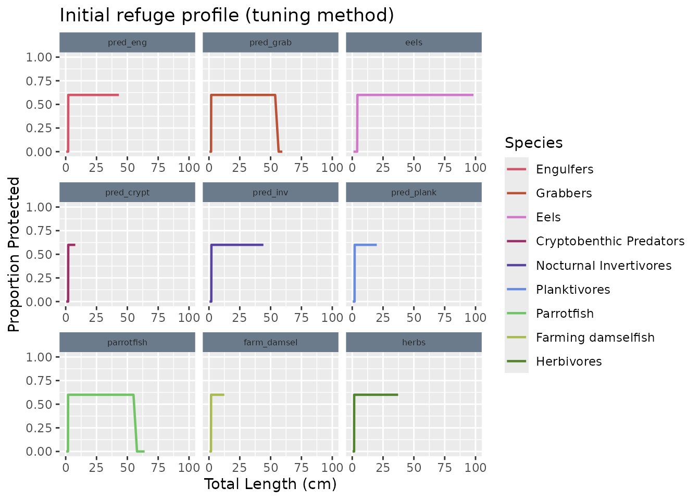

# MizerReef Steady State Recipe

## Introduction

Achieving a steady state that matches observed biomasses and growth
rates is a critical step in `MizerReef` model development. This vignette
provides a step-by-step recipe for tuning a `MizerReef` model to reach a
satisfactory steady state, using the Karpata reef example dataset.

The tuning process follows the 5-step recipe described in the [mizer
blog](https://blog.mizer.sizespectrum.org/posts/%202021-08-20-a-5-step-recipe-for-tuning-the-model-steady-state/),
with additional reef-specific steps to adjust unstructured resource
parameters and refuge dynamics.

## Prerequisites

Before starting, ensure you have:

1.  Species parameter data with reef-specific columns
2.  An interaction matrix defining predator-prey relationships  
3.  Observed biomass data for calibration
4.  A suitable refuge profile for initial tuning

``` r

library(mizerReef)
library(mizer)
library(mizerExperimental)
library(ggplot2)
library(dplyr)
library(knitr)

# Load example datasets
data("caribbean_10_species")
data("caribbean_10_interaction")
data("tuning_profile")
data("karpata_refuge")
```

## Step 1: Create Initial Parameters Object

The first step is to create a `MizerReefParams` object using your
species parameters and interaction matrix. For initial tuning, we use a
simple binned refuge method rather than the full competitive method.

**Why use a tuning profile first?** The competitive refuge method is
density-dependent, which makes it difficult to achieve a stable steady
state before the biomasses are calibrated to observed values. We start
with a simpler binned profile that approximates the final refuge shape
so that we can tune abundances first.

``` r

# Create initial parameters object with tuning refuge profile
params <- newReefParams(species_params = caribbean_10_species,
                        interaction = caribbean_10_interaction,
                        method = "binned",
                        method_params = tuning_profile)
#> No h provided for some species, so using age at maturity to calculate it.
#> Using z0 = z0pre * w_inf ^ z0exp for missing z0 values.
#> Using f0, h, lambda, kappa and the predation kernel to calculate gamma.

# Display the basic model structure
print(params)
#> An object of class "mizerReef"
#> Slot "metadata":
#> list()
#> 
#> Slot "mizer_version":
#> [1] '3.2.0'
#> 
#> Slot "extensions":
#>                mizerReef 
#> "sizespectrum/mizerReef" 
#> 
#> Slot "time_created":
#> [1] "2026-08-03 05:06:25 UTC"
#> 
#> Slot "time_modified":
#> [1] "2026-08-03 05:06:25 UTC"
#> 
#> Slot "w":
#>   [1] 1.000000e-03 1.167237e-03 1.362441e-03 1.590291e-03 1.856246e-03
#>   [6] 2.166678e-03 2.529026e-03 2.951971e-03 3.445648e-03 4.021887e-03
#>  [11] 4.694493e-03 5.479584e-03 6.395970e-03 7.465610e-03 8.714133e-03
#>  [16] 1.017145e-02 1.187249e-02 1.385801e-02 1.617557e-02 1.888072e-02
#>  [21] 2.203826e-02 2.572387e-02 3.002584e-02 3.504725e-02 4.090843e-02
#>  [26] 4.774982e-02 5.573533e-02 6.505631e-02 7.593611e-02 8.863540e-02
#>  [31] 1.034585e-01 1.207605e-01 1.409561e-01 1.645291e-01 1.920444e-01
#>  [36] 2.241612e-01 2.616491e-01 3.054064e-01 3.564815e-01 4.160982e-01
#>  [41] 4.856851e-01 5.669093e-01 6.617173e-01 7.723806e-01 9.015508e-01
#>  [46] 1.052323e+00 1.228310e+00 1.433728e+00 1.673500e+00 1.953370e+00
#>  [51] 2.280045e+00 2.661352e+00 3.106427e+00 3.625935e+00 4.232324e+00
#>  [56] 4.940123e+00 5.766292e+00 6.730627e+00 7.856234e+00 9.170083e+00
#>  [61] 1.070366e+01 1.249370e+01 1.458310e+01 1.702193e+01 1.986862e+01
#>  [66] 2.319137e+01 2.706982e+01 3.159688e+01 3.688103e+01 4.304889e+01
#>  [71] 5.024824e+01 5.865158e+01 6.846026e+01 7.990932e+01 9.327307e+01
#>  [76] 1.088717e+02 1.270791e+02 1.483313e+02 1.731377e+02 2.020927e+02
#>  [81] 2.358900e+02 2.753394e+02 3.213862e+02 3.751337e+02 4.378698e+02
#>  [86] 5.110976e+02 5.965718e+02 6.963404e+02 8.127939e+02 9.487228e+02
#>  [91] 1.107384e+03 1.292579e+03 1.508745e+03 1.761063e+03 2.055577e+03
#>  [96] 2.399344e+03 2.800602e+03 3.268965e+03 3.815655e+03 4.453772e+03
#> 
#> Slot "dw":
#>   [1] 1.672365e-04 1.952046e-04 2.278499e-04 2.659547e-04 3.104321e-04
#>   [6] 3.623477e-04 4.229454e-04 4.936774e-04 5.762383e-04 6.726063e-04
#>  [11] 7.850907e-04 9.163865e-04 1.069640e-03 1.248523e-03 1.457321e-03
#>  [16] 1.701039e-03 1.985514e-03 2.317565e-03 2.705146e-03 3.157546e-03
#>  [21] 3.685603e-03 4.301970e-03 5.021417e-03 5.861181e-03 6.841384e-03
#>  [26] 7.985514e-03 9.320983e-03 1.087979e-02 1.269929e-02 1.482308e-02
#>  [31] 1.730204e-02 2.019557e-02 2.357300e-02 2.751527e-02 3.211683e-02
#>  [36] 3.748794e-02 4.375729e-02 5.107511e-02 5.961673e-02 6.958682e-02
#>  [41] 8.122428e-02 9.480795e-02 1.106633e-01 1.291702e-01 1.507722e-01
#>  [46] 1.759869e-01 2.054183e-01 2.397717e-01 2.798703e-01 3.266749e-01
#>  [51] 3.813068e-01 4.450752e-01 5.195081e-01 6.063888e-01 7.077992e-01
#>  [56] 8.261690e-01 9.643347e-01 1.125607e+00 1.313849e+00 1.533573e+00
#>  [61] 1.790042e+00 2.089403e+00 2.438827e+00 2.846688e+00 3.322758e+00
#>  [66] 3.878445e+00 4.527062e+00 5.284152e+00 6.167856e+00 7.199347e+00
#>  [71] 8.403340e+00 9.808686e+00 1.144906e+01 1.336376e+01 1.559866e+01
#>  [76] 1.820733e+01 2.125226e+01 2.480642e+01 2.895496e+01 3.379728e+01
#>  [81] 3.944942e+01 4.604681e+01 5.374751e+01 6.273606e+01 7.322782e+01
#>  [86] 8.547419e+01 9.976859e+01 1.164535e+02 1.359288e+02 1.586611e+02
#>  [91] 1.851950e+02 2.161664e+02 2.523173e+02 2.945140e+02 3.437675e+02
#>  [96] 4.012580e+02 4.683630e+02 5.466903e+02 6.381169e+02 7.448334e+02
#> 
#> Slot "w_full":
#>   [1] 8.581293e-13 1.001640e-12 1.169151e-12 1.364675e-12 1.592899e-12
#>   [6] 1.859290e-12 2.170231e-12 2.533173e-12 2.956812e-12 3.451299e-12
#>  [11] 4.028482e-12 4.702191e-12 5.488569e-12 6.406458e-12 7.477852e-12
#>  [16] 8.728422e-12 1.018813e-11 1.189196e-11 1.388073e-11 1.620210e-11
#>  [21] 1.891168e-11 2.207440e-11 2.576605e-11 3.007507e-11 3.510472e-11
#>  [26] 4.097552e-11 4.782812e-11 5.582673e-11 6.516300e-11 7.606063e-11
#>  [31] 8.878074e-11 1.036281e-10 1.209585e-10 1.411872e-10 1.647989e-10
#>  [36] 1.923593e-10 2.245288e-10 2.620782e-10 3.059072e-10 3.570661e-10
#>  [41] 4.167806e-10 4.864815e-10 5.678390e-10 6.628024e-10 7.736472e-10
#>  [46] 9.030292e-10 1.054049e-09 1.230324e-09 1.436079e-09 1.676244e-09
#>  [51] 1.956573e-09 2.283784e-09 2.665716e-09 3.111521e-09 3.631881e-09
#>  [56] 4.239264e-09 4.948224e-09 5.775748e-09 6.741664e-09 7.869116e-09
#>  [61] 9.185120e-09 1.072121e-08 1.251419e-08 1.460701e-08 1.704984e-08
#>  [66] 1.990120e-08 2.322940e-08 2.711421e-08 3.164869e-08 3.694151e-08
#>  [71] 4.311948e-08 5.033063e-08 5.874775e-08 6.857252e-08 8.004035e-08
#>  [76] 9.342603e-08 1.090503e-07 1.272875e-07 1.485746e-07 1.734217e-07
#>  [81] 2.024241e-07 2.362768e-07 2.757909e-07 3.219132e-07 3.757489e-07
#>  [86] 4.385878e-07 5.119357e-07 5.975501e-07 6.974823e-07 8.141268e-07
#>  [91] 9.502785e-07 1.109200e-06 1.294698e-06 1.511219e-06 1.763950e-06
#>  [96] 2.058947e-06 2.403279e-06 2.805195e-06 3.274326e-06 3.821912e-06
#> [101] 4.461076e-06 5.207131e-06 6.077953e-06 7.094409e-06 8.280853e-06
#> [106] 9.665714e-06 1.128217e-05 1.316897e-05 1.537130e-05 1.794194e-05
#> [111] 2.094249e-05 2.444484e-05 2.853291e-05 3.330465e-05 3.887441e-05
#> [116] 4.537563e-05 5.296409e-05 6.182162e-05 7.216045e-05 8.422831e-05
#> [121] 9.831436e-05 1.147561e-04 1.339475e-04 1.563484e-04 1.824956e-04
#> [126] 2.130156e-04 2.486395e-04 2.902211e-04 3.387567e-04 3.954092e-04
#> [131] 4.615361e-04 5.387218e-04 6.288157e-04 7.339767e-04 8.567244e-04
#> [136] 1.000000e-03 1.167237e-03 1.362441e-03 1.590291e-03 1.856246e-03
#> [141] 2.166678e-03 2.529026e-03 2.951971e-03 3.445648e-03 4.021887e-03
#> [146] 4.694493e-03 5.479584e-03 6.395970e-03 7.465610e-03 8.714133e-03
#> [151] 1.017145e-02 1.187249e-02 1.385801e-02 1.617557e-02 1.888072e-02
#> [156] 2.203826e-02 2.572387e-02 3.002584e-02 3.504725e-02 4.090843e-02
#> [161] 4.774982e-02 5.573533e-02 6.505631e-02 7.593611e-02 8.863540e-02
#> [166] 1.034585e-01 1.207605e-01 1.409561e-01 1.645291e-01 1.920444e-01
#> [171] 2.241612e-01 2.616491e-01 3.054064e-01 3.564815e-01 4.160982e-01
#> [176] 4.856851e-01 5.669093e-01 6.617173e-01 7.723806e-01 9.015508e-01
#> [181] 1.052323e+00 1.228310e+00 1.433728e+00 1.673500e+00 1.953370e+00
#> [186] 2.280045e+00 2.661352e+00 3.106427e+00 3.625935e+00 4.232324e+00
#> [191] 4.940123e+00 5.766292e+00 6.730627e+00 7.856234e+00 9.170083e+00
#> [196] 1.070366e+01 1.249370e+01 1.458310e+01 1.702193e+01 1.986862e+01
#> [201] 2.319137e+01 2.706982e+01 3.159688e+01 3.688103e+01 4.304889e+01
#> [206] 5.024824e+01 5.865158e+01 6.846026e+01 7.990932e+01 9.327307e+01
#> [211] 1.088717e+02 1.270791e+02 1.483313e+02 1.731377e+02 2.020927e+02
#> [216] 2.358900e+02 2.753394e+02 3.213862e+02 3.751337e+02 4.378698e+02
#> [221] 5.110976e+02 5.965718e+02 6.963404e+02 8.127939e+02 9.487228e+02
#> [226] 1.107384e+03 1.292579e+03 1.508745e+03 1.761063e+03 2.055577e+03
#> [231] 2.399344e+03 2.800602e+03 3.268965e+03 3.815655e+03 4.453772e+03
#> 
#> Slot "dw_full":
#>   [1] 1.435106e-13 1.675108e-13 1.955247e-13 2.282236e-13 2.663909e-13
#>   [6] 3.109411e-13 3.629419e-13 4.236390e-13 4.944869e-13 5.771832e-13
#>  [11] 6.737093e-13 7.863781e-13 9.178892e-13 1.071394e-12 1.250570e-12
#>  [16] 1.459711e-12 1.703828e-12 1.988770e-12 2.321365e-12 2.709582e-12
#>  [21] 3.162724e-12 3.691646e-12 4.309025e-12 5.029651e-12 5.870792e-12
#>  [26] 6.852603e-12 7.998608e-12 9.336268e-12 1.089763e-11 1.272012e-11
#>  [31] 1.484738e-11 1.733041e-11 2.022868e-11 2.361166e-11 2.756039e-11
#>  [36] 3.216950e-11 3.754941e-11 4.382904e-11 5.115886e-11 5.971449e-11
#>  [41] 6.970093e-11 8.135748e-11 9.496342e-11 1.108448e-10 1.293821e-10
#>  [46] 1.510195e-10 1.762754e-10 2.057551e-10 2.401649e-10 2.803293e-10
#>  [51] 3.272105e-10 3.819321e-10 4.458051e-10 5.203600e-10 6.073832e-10
#>  [56] 7.089598e-10 8.275238e-10 9.659160e-10 1.127452e-09 1.316004e-09
#>  [61] 1.536088e-09 1.792978e-09 2.092829e-09 2.442826e-09 2.851356e-09
#>  [66] 3.328207e-09 3.884805e-09 4.534486e-09 5.292818e-09 6.177970e-09
#>  [71] 7.211152e-09 8.417120e-09 9.824770e-09 1.146783e-08 1.338567e-08
#>  [76] 1.562424e-08 1.823719e-08 2.128711e-08 2.484709e-08 2.900244e-08
#>  [81] 3.385270e-08 3.951411e-08 4.612231e-08 5.383565e-08 6.283894e-08
#>  [86] 7.334790e-08 8.561435e-08 9.993220e-08 1.166445e-07 1.361517e-07
#>  [91] 1.589213e-07 1.854987e-07 2.165209e-07 2.527311e-07 2.949969e-07
#>  [96] 3.443312e-07 4.019160e-07 4.691310e-07 5.475868e-07 6.391633e-07
#> [101] 7.460548e-07 8.708224e-07 1.016456e-06 1.186444e-06 1.384861e-06
#> [106] 1.616460e-06 1.886792e-06 2.202332e-06 2.570642e-06 3.000548e-06
#> [111] 3.502349e-06 4.088070e-06 4.771744e-06 5.569754e-06 6.501220e-06
#> [116] 7.588462e-06 8.857530e-06 1.033883e-05 1.206786e-05 1.408605e-05
#> [121] 1.644175e-05 1.919141e-05 2.240092e-05 2.614717e-05 3.051993e-05
#> [126] 3.562398e-05 4.158161e-05 4.853558e-05 5.665250e-05 6.612686e-05
#> [131] 7.718569e-05 9.009396e-05 1.051610e-04 1.227477e-04 1.432756e-04
#> [136] 1.672365e-04 1.952046e-04 2.278499e-04 2.659547e-04 3.104321e-04
#> [141] 3.623477e-04 4.229454e-04 4.936774e-04 5.762383e-04 6.726063e-04
#> [146] 7.850907e-04 9.163865e-04 1.069640e-03 1.248523e-03 1.457321e-03
#> [151] 1.701039e-03 1.985514e-03 2.317565e-03 2.705146e-03 3.157546e-03
#> [156] 3.685603e-03 4.301970e-03 5.021417e-03 5.861181e-03 6.841384e-03
#> [161] 7.985514e-03 9.320983e-03 1.087979e-02 1.269929e-02 1.482308e-02
#> [166] 1.730204e-02 2.019557e-02 2.357300e-02 2.751527e-02 3.211683e-02
#> [171] 3.748794e-02 4.375729e-02 5.107511e-02 5.961673e-02 6.958682e-02
#> [176] 8.122428e-02 9.480795e-02 1.106633e-01 1.291702e-01 1.507722e-01
#> [181] 1.759869e-01 2.054183e-01 2.397717e-01 2.798703e-01 3.266749e-01
#> [186] 3.813068e-01 4.450752e-01 5.195081e-01 6.063888e-01 7.077992e-01
#> [191] 8.261690e-01 9.643347e-01 1.125607e+00 1.313849e+00 1.533573e+00
#> [196] 1.790042e+00 2.089403e+00 2.438827e+00 2.846688e+00 3.322758e+00
#> [201] 3.878445e+00 4.527062e+00 5.284152e+00 6.167856e+00 7.199347e+00
#> [206] 8.403340e+00 9.808686e+00 1.144906e+01 1.336376e+01 1.559866e+01
#> [211] 1.820733e+01 2.125226e+01 2.480642e+01 2.895496e+01 3.379728e+01
#> [216] 3.944942e+01 4.604681e+01 5.374751e+01 6.273606e+01 7.322782e+01
#> [221] 8.547419e+01 9.976859e+01 1.164535e+02 1.359288e+02 1.586611e+02
#> [226] 1.851950e+02 2.161664e+02 2.523173e+02 2.945140e+02 3.437675e+02
#> [231] 4.012580e+02 4.683630e+02 5.466903e+02 6.381169e+02 7.448334e+02
#> 
#> Slot "w_min_idx":
#>    pred_eng   pred_grab        eels  pred_crypt    pred_inv  pred_plank 
#>           1           1           1           1           1           1 
#>  parrotfish farm_damsel       herbs     inverts 
#>           1           1           1           1 
#> 
#> Slot "maturity":
#>              w
#> sp            0.001 0.00117 0.00136 0.00159 0.00186 0.00217 0.00253 0.00295
#>   pred_eng        0       0       0       0       0       0       0       0
#>   pred_grab       0       0       0       0       0       0       0       0
#>   eels            0       0       0       0       0       0       0       0
#>   pred_crypt      0       0       0       0       0       0       0       0
#>   pred_inv        0       0       0       0       0       0       0       0
#>   pred_plank      0       0       0       0       0       0       0       0
#>   parrotfish      0       0       0       0       0       0       0       0
#>   farm_damsel     0       0       0       0       0       0       0       0
#>   herbs           0       0       0       0       0       0       0       0
#>   inverts         0       0       0       0       0       0       0       0
#>              w
#> sp            0.00345 0.00402 0.00469 0.00548 0.0064 0.00747 0.00871 0.0102
#>   pred_eng          0       0       0       0      0       0       0      0
#>   pred_grab         0       0       0       0      0       0       0      0
#>   eels              0       0       0       0      0       0       0      0
#>   pred_crypt        0       0       0       0      0       0       0      0
#>   pred_inv          0       0       0       0      0       0       0      0
#>   pred_plank        0       0       0       0      0       0       0      0
#>   parrotfish        0       0       0       0      0       0       0      0
#>   farm_damsel       0       0       0       0      0       0       0      0
#>   herbs             0       0       0       0      0       0       0      0
#>   inverts           0       0       0       0      0       0       0      0
#>              w
#> sp            0.0119 0.0139       0.0162       0.0189        0.022       0.0257
#>   pred_eng         0      0 0.000000e+00 0.000000e+00 0.000000e+00 0.000000e+00
#>   pred_grab        0      0 0.000000e+00 0.000000e+00 0.000000e+00 0.000000e+00
#>   eels             0      0 0.000000e+00 0.000000e+00 0.000000e+00 0.000000e+00
#>   pred_crypt       0      0 0.000000e+00 0.000000e+00 0.000000e+00 0.000000e+00
#>   pred_inv         0      0 0.000000e+00 0.000000e+00 0.000000e+00 0.000000e+00
#>   pred_plank       0      0 0.000000e+00 0.000000e+00 0.000000e+00 0.000000e+00
#>   parrotfish       0      0 0.000000e+00 0.000000e+00 0.000000e+00 0.000000e+00
#>   farm_damsel      0      0 0.000000e+00 0.000000e+00 0.000000e+00 0.000000e+00
#>   herbs            0      0 0.000000e+00 0.000000e+00 0.000000e+00 0.000000e+00
#>   inverts          0      0 1.226299e-08 5.756852e-08 2.702549e-07 1.268709e-06
#>              w
#> sp                    0.03        0.035       0.0409       0.0477      0.0557
#>   pred_eng    0.000000e+00 0.000000e+00 0.0000000000 0.0000000000 0.000000000
#>   pred_grab   0.000000e+00 0.000000e+00 0.0000000000 0.0000000000 0.000000000
#>   eels        0.000000e+00 0.000000e+00 0.0000000000 0.0000000000 0.000000000
#>   pred_crypt  0.000000e+00 0.000000e+00 0.0000000000 0.0000000000 0.000000000
#>   pred_inv    0.000000e+00 0.000000e+00 0.0000000000 0.0000000000 0.000000000
#>   pred_plank  0.000000e+00 0.000000e+00 0.0000000000 0.0000000000 0.000000000
#>   parrotfish  0.000000e+00 0.000000e+00 0.0000000000 0.0000000000 0.000000000
#>   farm_damsel 0.000000e+00 0.000000e+00 0.0000000000 0.0000000000 0.000000000
#>   herbs       0.000000e+00 0.000000e+00 0.0000000000 0.0000000000 0.000000000
#>   inverts     5.955916e-06 2.795939e-05 0.0001312416 0.0006158141 0.002884373
#>              w
#> sp               0.0651     0.0759    0.0886     0.103     0.121        0.141
#>   pred_eng    0.0000000 0.00000000 0.0000000 0.0000000 0.0000000 0.000000e+00
#>   pred_grab   0.0000000 0.00000000 0.0000000 0.0000000 0.0000000 0.000000e+00
#>   eels        0.0000000 0.00000000 0.0000000 0.0000000 0.0000000 0.000000e+00
#>   pred_crypt  0.0000000 0.00000000 0.0000000 0.0000000 0.0000000 2.883621e-08
#>   pred_inv    0.0000000 0.00000000 0.0000000 0.0000000 0.0000000 0.000000e+00
#>   pred_plank  0.0000000 0.00000000 0.0000000 0.0000000 0.0000000 0.000000e+00
#>   parrotfish  0.0000000 0.00000000 0.0000000 0.0000000 0.0000000 0.000000e+00
#>   farm_damsel 0.0000000 0.00000000 0.0000000 0.0000000 0.0000000 0.000000e+00
#>   herbs       0.0000000 0.00000000 0.0000000 0.0000000 0.0000000 0.000000e+00
#>   inverts     0.0133979 0.05992989 0.2303406 0.5841908 0.8683435 9.687135e-01
#>              w
#> sp                   0.165        0.192        0.224        0.262        0.305
#>   pred_eng    0.000000e+00 0.000000e+00 0.000000e+00 0.000000e+00 0.000000e+00
#>   pred_grab   0.000000e+00 0.000000e+00 0.000000e+00 0.000000e+00 0.000000e+00
#>   eels        0.000000e+00 0.000000e+00 0.000000e+00 0.000000e+00 0.000000e+00
#>   pred_crypt  1.353714e-07 6.354995e-07 2.983341e-06 1.400512e-05 6.574353e-05
#>   pred_inv    0.000000e+00 0.000000e+00 0.000000e+00 0.000000e+00 0.000000e+00
#>   pred_plank  0.000000e+00 0.000000e+00 0.000000e+00 0.000000e+00 0.000000e+00
#>   parrotfish  0.000000e+00 0.000000e+00 0.000000e+00 0.000000e+00 0.000000e+00
#>   farm_damsel 1.453539e-08 6.823628e-08 3.203347e-07 1.503807e-06 7.059572e-06
#>   herbs       0.000000e+00 0.000000e+00 0.000000e+00 0.000000e+00 0.000000e+00
#>   inverts     9.931672e-01 9.985366e-01 9.996879e-01 9.999335e-01 9.999858e-01
#>              w
#> sp                   0.356        0.416        0.486        0.567        0.662
#>   pred_eng    0.000000e+00 0.000000e+00 0.000000e+00 0.000000e+00 0.000000e+00
#>   pred_grab   0.000000e+00 0.000000e+00 0.000000e+00 0.000000e+00 0.000000e+00
#>   eels        0.000000e+00 0.000000e+00 0.000000e+00 0.000000e+00 0.000000e+00
#>   pred_crypt  3.085576e-04 1.446872e-03 6.756215e-03 3.094460e-02 1.303653e-01
#>   pred_inv    0.000000e+00 0.000000e+00 0.000000e+00 0.000000e+00 0.000000e+00
#>   pred_plank  0.000000e+00 1.631393e-08 7.658565e-08 3.595307e-07 1.687812e-06
#>   parrotfish  0.000000e+00 0.000000e+00 0.000000e+00 0.000000e+00 0.000000e+00
#>   farm_damsel 3.314025e-05 1.555576e-04 7.298446e-04 3.417037e-03 1.584127e-02
#>   herbs       0.000000e+00 0.000000e+00 0.000000e+00 0.000000e+00 0.000000e+00
#>   inverts     9.999970e-01 9.999994e-01 9.999999e-01 1.000000e+00 1.000000e+00
#>              w
#> sp                   0.772        0.902         1.05        1.23        1.43
#>   pred_eng    0.000000e+00 0.000000e+00 0.0000000000 0.000000000 0.000000000
#>   pred_grab   0.000000e+00 0.000000e+00 0.0000000000 0.000000000 0.000000000
#>   eels        0.000000e+00 0.000000e+00 0.0000000000 0.000000000 0.000000000
#>   pred_crypt  4.130568e-01 7.676425e-01 0.9394279325 0.986451353 0.997082823
#>   pred_inv    0.000000e+00 0.000000e+00 0.0000000000 0.000000000 0.000000000
#>   pred_plank  7.923372e-06 3.719512e-05 0.0001745883 0.000819075 0.003833541
#>   parrotfish  0.000000e+00 0.000000e+00 0.0000000000 0.000000000 0.000000000
#>   farm_damsel 7.025503e-02 2.618475e-01 0.6248068822 0.886591887 0.973474935
#>   herbs       0.000000e+00 0.000000e+00 0.0000000000 0.000000000 0.000000000
#>   inverts     1.000000e+00 1.000000e+00 0.9999999999 1.000000000 1.000000000
#>              w
#> sp                  1.67       1.95      2.28      2.66      3.11      3.63
#>   pred_eng    0.00000000 0.00000000 0.0000000 0.0000000 0.0000000 0.0000000
#>   pred_grab   0.00000000 0.00000000 0.0000000 0.0000000 0.0000000 0.0000000
#>   eels        0.00000000 0.00000000 0.0000000 0.0000000 0.0000000 0.0000000
#>   pred_crypt  0.99937717 0.99986726 0.9999717 0.9999940 0.9999987 0.9999997
#>   pred_inv    0.00000000 0.00000000 0.0000000 0.0000000 0.0000000 0.0000000
#>   pred_plank  0.01774521 0.07817935 0.2847633 0.6514536 0.8976907 0.9762982
#>   parrotfish  0.00000000 0.00000000 0.0000000 0.0000000 0.0000000 0.0000000
#>   farm_damsel 0.99422929 0.99876514 0.9997367 0.9999439 0.9999880 0.9999975
#>   herbs       0.00000000 0.00000000 0.0000000 0.0000000 0.0000000 0.0000000
#>   inverts     1.00000000 1.00000000 1.0000000 1.0000000 1.0000000 1.0000000
#>              w
#> sp                 4.23      4.94      5.77    6.73      7.86         9.17
#>   pred_eng    0.0000000 0.0000000 0.0000000 0.00000 0.0000000 4.305588e-08
#>   pred_grab   0.0000000 0.0000000 0.0000000 0.00000 0.0000000 0.000000e+00
#>   eels        0.0000000 0.0000000 0.0000000 0.00000 0.0000000 0.000000e+00
#>   pred_crypt  0.9999999 1.0000000 1.0000000 1.00000 1.0000000 1.000000e+00
#>   pred_inv    0.0000000 0.0000000 0.0000000 0.00000 0.0000000 4.305588e-08
#>   pred_plank  0.9948552 0.9988996 0.9997654 0.99995 0.9999894 9.999977e-01
#>   parrotfish  0.0000000 0.0000000 0.0000000 0.00000 0.0000000 0.000000e+00
#>   farm_damsel 0.9999995 0.9999999 1.0000000 1.00000 1.0000000 1.000000e+00
#>   herbs       0.0000000 0.0000000 0.0000000 0.00000 0.0000000 0.000000e+00
#>   inverts     1.0000000 1.0000000 1.0000000 1.00000 1.0000000 1.000000e+00
#>              w
#> sp                    10.7         12.5         14.6           17         19.9
#>   pred_eng    2.021255e-07 9.488761e-07 4.454476e-06 2.091116e-05 9.815972e-05
#>   pred_grab   0.000000e+00 0.000000e+00 0.000000e+00 0.000000e+00 0.000000e+00
#>   eels        0.000000e+00 0.000000e+00 0.000000e+00 0.000000e+00 0.000000e+00
#>   pred_crypt  1.000000e+00 1.000000e+00 1.000000e+00 1.000000e+00 1.000000e+00
#>   pred_inv    2.021255e-07 9.488761e-07 4.454476e-06 2.091116e-05 9.815972e-05
#>   pred_plank  9.999995e-01 9.999999e-01 1.000000e+00 1.000000e+00 1.000000e+00
#>   parrotfish  2.004083e-08 9.408154e-08 4.416650e-07 2.073390e-06 9.733438e-06
#>   farm_damsel 1.000000e+00 1.000000e+00 1.000000e+00 1.000000e+00 1.000000e+00
#>   herbs       0.000000e+00 0.000000e+00 0.000000e+00 1.253702e-08 5.885495e-08
#>   inverts     1.000000e+00 1.000000e+00 1.000000e+00 1.000000e+00 1.000000e+00
#>              w
#> sp                    23.2         27.1         31.6         36.9           43
#>   pred_eng    4.606431e-04 2.158812e-03 1.005434e-02 4.550953e-02 1.828934e-01
#>   pred_grab   1.555909e-08 7.304206e-08 3.428953e-07 1.609718e-06 7.556763e-06
#>   eels        0.000000e+00 0.000000e+00 0.000000e+00 0.000000e+00 0.000000e+00
#>   pred_crypt  1.000000e+00 1.000000e+00 1.000000e+00 1.000000e+00 1.000000e+00
#>   pred_inv    4.606431e-04 2.158812e-03 1.005434e-02 4.550953e-02 1.828934e-01
#>   pred_plank  1.000000e+00 1.000000e+00 1.000000e+00 1.000000e+00 1.000000e+00
#>   parrotfish  4.569191e-05 2.144642e-04 1.006003e-03 4.705188e-03 2.171106e-02
#>   farm_damsel 1.000000e+00 1.000000e+00 1.000000e+00 1.000000e+00 1.000000e+00
#>   herbs       2.762941e-07 1.297059e-06 6.089006e-06 2.858415e-05 1.341739e-04
#>   inverts     1.000000e+00 1.000000e+00 1.000000e+00 1.000000e+00 1.000000e+00
#>              w
#> sp                    50.2         58.7         68.5         79.9         93.3
#>   pred_eng    5.123785e-01 8.314466e-01 9.586044e-01 9.908852e-01 9.980444e-01
#>   pred_grab   3.547418e-05 1.665115e-04 7.812063e-04 3.656813e-03 1.693805e-02
#>   eels        1.737783e-08 8.158010e-08 3.829771e-07 1.797881e-06 8.440082e-06
#>   pred_crypt  1.000000e+00 1.000000e+00 1.000000e+00 1.000000e+00 1.000000e+00
#>   pred_inv    5.123785e-01 8.314466e-01 9.586044e-01 9.908852e-01 9.980444e-01
#>   pred_plank  1.000000e+00 1.000000e+00 1.000000e+00 1.000000e+00 1.000000e+00
#>   parrotfish  9.435416e-02 3.284502e-01 6.966059e-01 9.151014e-01 9.806205e-01
#>   farm_damsel 1.000000e+00 1.000000e+00 1.000000e+00 1.000000e+00 1.000000e+00
#>   herbs       6.295665e-04 2.948637e-03 1.369319e-02 6.118715e-02 2.342819e-01
#>   inverts     1.000000e+00 1.000000e+00 1.000000e+00 1.000000e+00 1.000000e+00
#>              w
#> sp                     109          127          148         173        202
#>   pred_eng    9.995828e-01 0.9999110960 0.9999810607 0.999995966 0.99999914
#>   pred_grab   7.483271e-02 0.2752136201 0.6406210593 0.893257055 0.97517682
#>   eels        3.962067e-05 0.0001859717 0.0008724435 0.004082521 0.01888059
#>   pred_crypt  1.000000e+00 1.0000000000 1.0000000000 1.000000000 1.00000000
#>   pred_inv    9.995828e-01 0.9999110960 0.9999810607 0.999995966 0.99999914
#>   pred_plank  1.000000e+00 1.0000000000 1.0000000000 1.000000000 1.00000000
#>   parrotfish  9.958079e-01 0.9991040661 0.9998090175 0.999959312 0.99999133
#>   farm_damsel 1.000000e+00 1.0000000000 1.0000000000 1.000000000 1.00000000
#>   herbs       5.895490e-01 0.8708495649 0.9693763832 0.993315597 0.99856859
#>   inverts     1.000000e+00 1.0000000000 1.0000000000 1.000000000 1.00000000
#>              w
#> sp                  236       275       321       375       438       511
#>   pred_eng    0.9999998 1.0000000 1.0000000 1.0000000 1.0000000 1.0000000
#>   pred_grab   0.9946069 0.9988463 0.9997540 0.9999476 0.9999888 0.9999976
#>   eels        0.0828553 0.2978035 0.6656578 0.9033489 0.9777169 0.9951686
#>   pred_crypt  1.0000000 1.0000000 1.0000000 1.0000000 1.0000000 1.0000000
#>   pred_inv    0.9999998 1.0000000 1.0000000 1.0000000 1.0000000 1.0000000
#>   pred_plank  1.0000000 1.0000000 1.0000000 1.0000000 1.0000000 1.0000000
#>   parrotfish  0.9999982 0.9999996 0.9999999 1.0000000 1.0000000 1.0000000
#>   farm_damsel 1.0000000 1.0000000 1.0000000 1.0000000 1.0000000 1.0000000
#>   herbs       0.9996947 0.9999350 0.9999861 0.9999970 0.9999994 0.9999999
#>   inverts     1.0000000 1.0000000 1.0000000 1.0000000 1.0000000 1.0000000
#>              w
#> sp                  597       696       813     949      1110      1290
#>   pred_eng    1.0000000 1.0000000 1.0000000 1.00000 1.0000000 1.0000000
#>   pred_grab   0.9999995 0.9999999 1.0000000 1.00000 1.0000000 1.0000000
#>   eels        0.9989669 0.9997798 0.9999531 0.99999 0.9999979 0.9999995
#>   pred_crypt  1.0000000 1.0000000 1.0000000 1.00000 1.0000000 1.0000000
#>   pred_inv    1.0000000 1.0000000 1.0000000 1.00000 1.0000000 1.0000000
#>   pred_plank  1.0000000 1.0000000 1.0000000 1.00000 1.0000000 1.0000000
#>   parrotfish  1.0000000 1.0000000 1.0000000 1.00000 1.0000000 1.0000000
#>   farm_damsel 1.0000000 1.0000000 1.0000000 1.00000 1.0000000 1.0000000
#>   herbs       1.0000000 1.0000000 1.0000000 1.00000 1.0000000 1.0000000
#>   inverts     1.0000000 1.0000000 1.0000000 1.00000 1.0000000 1.0000000
#>              w
#> sp                 1510 1760 2060 2400 2800 3270 3820 4450
#>   pred_eng    1.0000000    1    1    1    1    1    1    1
#>   pred_grab   1.0000000    1    1    1    1    1    1    1
#>   eels        0.9999999    1    1    1    1    1    1    1
#>   pred_crypt  1.0000000    1    1    1    1    1    1    1
#>   pred_inv    1.0000000    1    1    1    1    1    1    1
#>   pred_plank  1.0000000    1    1    1    1    1    1    1
#>   parrotfish  1.0000000    1    1    1    1    1    1    1
#>   farm_damsel 1.0000000    1    1    1    1    1    1    1
#>   herbs       1.0000000    1    1    1    1    1    1    1
#>   inverts     1.0000000    1    1    1    1    1    1    1
#> 
#> Slot "psi":
#>              w
#> sp            0.001 0.00117 0.00136 0.00159 0.00186 0.00217 0.00253 0.00295
#>   pred_eng        0       0       0       0       0       0       0       0
#>   pred_grab       0       0       0       0       0       0       0       0
#>   eels            0       0       0       0       0       0       0       0
#>   pred_crypt      0       0       0       0       0       0       0       0
#>   pred_inv        0       0       0       0       0       0       0       0
#>   pred_plank      0       0       0       0       0       0       0       0
#>   parrotfish      0       0       0       0       0       0       0       0
#>   farm_damsel     0       0       0       0       0       0       0       0
#>   herbs           0       0       0       0       0       0       0       0
#>   inverts         0       0       0       0       0       0       0       0
#>              w
#> sp            0.00345 0.00402 0.00469 0.00548 0.0064 0.00747 0.00871 0.0102
#>   pred_eng          0       0       0       0      0       0       0      0
#>   pred_grab         0       0       0       0      0       0       0      0
#>   eels              0       0       0       0      0       0       0      0
#>   pred_crypt        0       0       0       0      0       0       0      0
#>   pred_inv          0       0       0       0      0       0       0      0
#>   pred_plank        0       0       0       0      0       0       0      0
#>   parrotfish        0       0       0       0      0       0       0      0
#>   farm_damsel       0       0       0       0      0       0       0      0
#>   herbs             0       0       0       0      0       0       0      0
#>   inverts           0       0       0       0      0       0       0      0
#>              w
#> sp            0.0119 0.0139       0.0162       0.0189        0.022       0.0257
#>   pred_eng         0      0 0.000000e+00 0.000000e+00 0.000000e+00 0.000000e+00
#>   pred_grab        0      0 0.000000e+00 0.000000e+00 0.000000e+00 0.000000e+00
#>   eels             0      0 0.000000e+00 0.000000e+00 0.000000e+00 0.000000e+00
#>   pred_crypt       0      0 0.000000e+00 0.000000e+00 0.000000e+00 0.000000e+00
#>   pred_inv         0      0 0.000000e+00 0.000000e+00 0.000000e+00 0.000000e+00
#>   pred_plank       0      0 0.000000e+00 0.000000e+00 0.000000e+00 0.000000e+00
#>   parrotfish       0      0 0.000000e+00 0.000000e+00 0.000000e+00 0.000000e+00
#>   farm_damsel      0      0 0.000000e+00 0.000000e+00 0.000000e+00 0.000000e+00
#>   herbs            0      0 0.000000e+00 0.000000e+00 0.000000e+00 0.000000e+00
#>   inverts          0      0 8.579961e-10 4.186622e-09 2.042876e-08 9.968275e-08
#>              w
#> sp                    0.03        0.035       0.0409       0.0477       0.0557
#>   pred_eng    0.000000e+00 0.000000e+00 0.000000e+00 0.000000e+00 0.0000000000
#>   pred_grab   0.000000e+00 0.000000e+00 0.000000e+00 0.000000e+00 0.0000000000
#>   eels        0.000000e+00 0.000000e+00 0.000000e+00 0.000000e+00 0.0000000000
#>   pred_crypt  0.000000e+00 0.000000e+00 0.000000e+00 0.000000e+00 0.0000000000
#>   pred_inv    0.000000e+00 0.000000e+00 0.000000e+00 0.000000e+00 0.0000000000
#>   pred_plank  0.000000e+00 0.000000e+00 0.000000e+00 0.000000e+00 0.0000000000
#>   parrotfish  0.000000e+00 0.000000e+00 0.000000e+00 0.000000e+00 0.0000000000
#>   farm_damsel 0.000000e+00 0.000000e+00 0.000000e+00 0.000000e+00 0.0000000000
#>   herbs       0.000000e+00 0.000000e+00 0.000000e+00 0.000000e+00 0.0000000000
#>   inverts     4.864031e-07 2.373369e-06 1.157974e-05 5.647635e-05 0.0002749528
#>              w
#> sp                 0.0651      0.0759     0.0886      0.103     0.121
#>   pred_eng    0.000000000 0.000000000 0.00000000 0.00000000 0.0000000
#>   pred_grab   0.000000000 0.000000000 0.00000000 0.00000000 0.0000000
#>   eels        0.000000000 0.000000000 0.00000000 0.00000000 0.0000000
#>   pred_crypt  0.000000000 0.000000000 0.00000000 0.00000000 0.0000000
#>   pred_inv    0.000000000 0.000000000 0.00000000 0.00000000 0.0000000
#>   pred_plank  0.000000000 0.000000000 0.00000000 0.00000000 0.0000000
#>   parrotfish  0.000000000 0.000000000 0.00000000 0.00000000 0.0000000
#>   farm_damsel 0.000000000 0.000000000 0.00000000 0.00000000 0.0000000
#>   herbs       0.000000000 0.000000000 0.00000000 0.00000000 0.0000000
#>   inverts     0.001327495 0.006172053 0.02465735 0.06500104 0.1004262
#>              w
#> sp                   0.141        0.165        0.192        0.224        0.262
#>   pred_eng    0.000000e+00 0.000000e+00 0.000000e+00 0.000000e+00 0.000000e+00
#>   pred_grab   0.000000e+00 0.000000e+00 0.000000e+00 0.000000e+00 0.000000e+00
#>   eels        0.000000e+00 0.000000e+00 0.000000e+00 0.000000e+00 0.000000e+00
#>   pred_crypt  1.117796e-08 5.454323e-08 2.661454e-07 1.298663e-06 6.336800e-06
#>   pred_inv    0.000000e+00 0.000000e+00 0.000000e+00 0.000000e+00 0.000000e+00
#>   pred_plank  0.000000e+00 0.000000e+00 0.000000e+00 0.000000e+00 0.000000e+00
#>   parrotfish  0.000000e+00 0.000000e+00 0.000000e+00 0.000000e+00 0.000000e+00
#>   farm_damsel 0.000000e+00 3.646452e-09 1.779299e-08 8.682147e-08 4.236479e-07
#>   herbs       0.000000e+00 0.000000e+00 0.000000e+00 0.000000e+00 0.000000e+00
#>   inverts     1.164502e-01 1.240958e-01 1.296846e-01 1.349518e-01 1.403056e-01
#>              w
#> sp                   0.305        0.356        0.416        0.486        0.567
#>   pred_eng    0.000000e+00 0.000000e+00 0.000000e+00 0.000000e+00 0.000000e+00
#>   pred_grab   0.000000e+00 0.000000e+00 0.000000e+00 0.000000e+00 0.000000e+00
#>   eels        0.000000e+00 0.000000e+00 0.000000e+00 0.000000e+00 0.000000e+00
#>   pred_crypt  3.091904e-05 1.508339e-04 7.351610e-04 3.568170e-03 1.698700e-02
#>   pred_inv    0.000000e+00 0.000000e+00 0.000000e+00 0.000000e+00 0.000000e+00
#>   pred_plank  0.000000e+00 0.000000e+00 4.044092e-09 1.973329e-08 9.628923e-08
#>   parrotfish  0.000000e+00 0.000000e+00 0.000000e+00 0.000000e+00 0.000000e+00
#>   farm_damsel 2.067193e-06 1.008668e-05 4.921226e-05 2.399950e-04 1.167915e-03
#>   herbs       0.000000e+00 0.000000e+00 0.000000e+00 0.000000e+00 0.000000e+00
#>   inverts     1.458436e-01 1.515940e-01 1.575697e-01 1.637807e-01 1.702364e-01
#>              w
#> sp                   0.662        0.772        0.902         1.05         1.23
#>   pred_eng    0.000000e+00 0.000000e+00 0.000000e+00 0.000000e+00 0.0000000000
#>   pred_grab   0.000000e+00 0.000000e+00 0.000000e+00 0.000000e+00 0.0000000000
#>   eels        0.000000e+00 0.000000e+00 0.000000e+00 0.000000e+00 0.0000000000
#>   pred_crypt  7.438466e-02 2.449746e-01 4.732166e-01 6.019413e-01 0.6569859157
#>   pred_inv    0.000000e+00 0.000000e+00 0.000000e+00 0.000000e+00 0.0000000000
#>   pred_plank  4.698460e-07 2.292615e-06 1.118657e-05 5.457775e-05 0.0002661424
#>   parrotfish  0.000000e+00 0.000000e+00 0.000000e+00 0.000000e+00 0.0000000000
#>   farm_damsel 5.627834e-03 2.594289e-02 1.005030e-01 2.492678e-01 0.3676494072
#>   herbs       0.000000e+00 0.000000e+00 0.000000e+00 0.000000e+00 0.0000000000
#>   inverts     1.769466e-01 1.839212e-01 1.911708e-01 1.987062e-01 0.2065385137
#>              w
#> sp                   1.43        1.67      1.95      2.28      2.66      3.11
#>   pred_eng    0.000000000 0.000000000 0.0000000 0.0000000 0.0000000 0.0000000
#>   pred_grab   0.000000000 0.000000000 0.0000000 0.0000000 0.0000000 0.0000000
#>   eels        0.000000000 0.000000000 0.0000000 0.0000000 0.0000000 0.0000000
#>   pred_crypt  0.690241931 0.719099924 0.7478111 0.7773686 0.8080279 0.8398817
#>   pred_inv    0.000000000 0.000000000 0.0000000 0.0000000 0.0000000 0.0000000
#>   pred_plank  0.001294733 0.006229466 0.0285267 0.1080024 0.2568162 0.3678370
#>   parrotfish  0.000000000 0.000000000 0.0000000 0.0000000 0.0000000 0.0000000
#>   farm_damsel 0.419589497 0.445426553 0.4650960 0.4838989 0.5030769 0.5229296
#>   herbs       0.000000000 0.000000000 0.0000000 0.0000000 0.0000000 0.0000000
#>   inverts     0.214679594 0.223141569 0.2319371 0.2410793 0.2505819 0.2604590
#>              w
#> sp                 3.63      4.23      4.94      5.77      6.73      7.86
#>   pred_eng    0.0000000 0.0000000 0.0000000 0.0000000 0.0000000 0.0000000
#>   pred_grab   0.0000000 0.0000000 0.0000000 0.0000000 0.0000000 0.0000000
#>   eels        0.0000000 0.0000000 0.0000000 0.0000000 0.0000000 0.0000000
#>   pred_crypt  0.8729880 0.9073986 0.9431653 0.9803419 1.0000000 1.0000000
#>   pred_inv    0.0000000 0.0000000 0.0000000 0.0000000 0.0000000 0.0000000
#>   pred_plank  0.4158156 0.4404209 0.4596419 0.4781736 0.4971135 0.5167284
#>   parrotfish  0.0000000 0.0000000 0.0000000 0.0000000 0.0000000 0.0000000
#>   farm_damsel 0.5435469 0.5649729 0.5872426 0.6103898 0.6344494 0.6594574
#>   herbs       0.0000000 0.0000000 0.0000000 0.0000000 0.0000000 0.0000000
#>   inverts     0.2707254 0.2813966 0.2924883 0.3040172 0.3160006 0.3284563
#>              w
#> sp                    9.17         10.7         12.5         14.6           17
#>   pred_eng    1.257680e-08 6.136891e-08 2.994515e-07 1.461179e-06 7.129755e-06
#>   pred_grab   0.000000e+00 0.000000e+00 0.000000e+00 0.000000e+00 0.000000e+00
#>   eels        0.000000e+00 0.000000e+00 0.000000e+00 0.000000e+00 0.000000e+00
#>   pred_crypt  1.000000e+00 1.000000e+00 1.000000e+00 1.000000e+00 1.000000e+00
#>   pred_inv    1.184652e-08 5.780550e-08 2.820637e-07 1.376335e-06 6.715763e-06
#>   pred_plank  5.371006e-01 5.582724e-01 5.802779e-01 6.031507e-01 6.269249e-01
#>   parrotfish  0.000000e+00 4.437279e-09 2.165186e-08 1.056510e-07 5.155266e-07
#>   farm_damsel 6.854510e-01 7.124693e-01 7.405525e-01 7.697427e-01 8.000835e-01
#>   herbs       0.000000e+00 0.000000e+00 0.000000e+00 0.000000e+00 4.266317e-09
#>   inverts     3.414030e-01 3.548600e-01 3.688475e-01 3.833862e-01 3.984981e-01
#>              w
#> sp                    19.9         23.2         27.1         31.6         36.9
#>   pred_eng    3.478720e-05 1.696838e-04 8.265714e-04 4.001370e-03 1.882554e-02
#>   pred_grab   0.000000e+00 4.316381e-09 2.106193e-08 1.027724e-07 5.014808e-07
#>   eels        0.000000e+00 0.000000e+00 0.000000e+00 0.000000e+00 0.000000e+00
#>   pred_crypt  1.000000e+00 1.000000e+00 1.000000e+00 1.000000e+00 1.000000e+00
#>   pred_inv    3.276727e-05 1.598311e-04 7.785761e-04 3.769029e-03 1.773242e-02
#>   pred_plank  6.516363e-01 6.773217e-01 7.040195e-01 7.317697e-01 7.606136e-01
#>   parrotfish  2.515511e-06 1.227408e-05 5.988169e-05 2.919635e-04 1.419370e-03
#>   farm_damsel 8.316202e-01 8.644000e-01 8.984718e-01 9.338867e-01 9.706975e-01
#>   herbs       2.081764e-08 1.015804e-07 4.956644e-07 2.418600e-06 1.180138e-05
#>   inverts     4.142056e-01 4.305322e-01 4.475024e-01 4.651415e-01 4.834759e-01
#>              w
#> sp                      43         50.2         58.7         68.5         79.9
#>   pred_eng    7.863807e-02 2.289894e-01 3.862322e-01 4.628533e-01 4.972983e-01
#>   pred_grab   2.446979e-06 1.193978e-05 5.825295e-05 2.840725e-04 1.382153e-03
#>   eels        0.000000e+00 6.272913e-09 3.060889e-08 1.493571e-07 7.287922e-07
#>   pred_crypt  1.000000e+00 1.000000e+00 1.000000e+00 1.000000e+00 1.000000e+00
#>   pred_inv    7.407192e-02 2.156930e-01 3.638055e-01 4.359775e-01 4.684224e-01
#>   pred_plank  7.905946e-01 8.217573e-01 8.541483e-01 8.878160e-01 9.228109e-01
#>   parrotfish  6.807530e-03 3.075100e-02 1.112647e-01 2.452815e-01 3.349165e-01
#>   farm_damsel 1.000000e+00 1.000000e+00 1.000000e+00 1.000000e+00 1.000000e+00
#>   herbs       5.757915e-05 2.808202e-04 1.367092e-03 6.598888e-03 3.064899e-02
#>   inverts     5.025330e-01 5.223412e-01 5.429302e-01 5.643307e-01 5.865748e-01
#>              w
#> sp                    93.3          109          127          148         173
#>   pred_eng    5.206348e-01 5.419907e-01 5.635392e-01 0.5857931028 0.608892247
#>   pred_grab   6.654361e-03 3.055794e-02 1.168133e-01 0.2826267776 0.409617279
#>   eels        3.556143e-06 1.735178e-05 8.465623e-05 0.0004127994 0.002007797
#>   pred_crypt  1.000000e+00 1.000000e+00 1.000000e+00 1.0000000000 1.000000000
#>   pred_inv    4.904039e-01 5.105197e-01 5.308171e-01 0.5517787724 0.573536655
#>   pred_plank  9.591851e-01 9.969931e-01 1.000000e+00 1.0000000000 1.000000000
#>   parrotfish  3.730422e-01 3.937516e-01 4.106267e-01 0.4271134731 0.444015640
#>   farm_damsel 1.000000e+00 1.000000e+00 1.000000e+00 1.0000000000 1.000000000
#>   herbs       1.219788e-01 3.190474e-01 4.898558e-01 0.5667704902 0.603659121
#>   inverts     6.096957e-01 6.337279e-01 6.587074e-01 0.6846715473 0.711659084
#>              w
#> sp                    202        236       275       321       375       438
#>   pred_eng    0.632894819 0.65784193 0.6837720 0.7107241 0.7387386 0.7678573
#>   pred_grab   0.464809397 0.49275691 0.5143629 0.5351233 0.5563238 0.5782761
#>   eels        0.009651544 0.04402417 0.1644714 0.3821214 0.5390084 0.6063772
#>   pred_crypt  1.000000000 1.00000000 1.0000000 1.0000000 1.0000000 1.0000000
#>   pred_inv    0.596145507 0.61964405 0.6440685 0.6694556 0.6958434 0.7232713
#>   pred_plank  1.000000000 1.00000000 1.0000000 1.0000000 1.0000000 1.0000000
#>   parrotfish  0.461532079 0.47972745 0.4986375 0.5182923 0.5387218 0.5599564
#>   farm_damsel 1.000000000 1.00000000 1.0000000 1.0000000 1.0000000 1.0000000
#>   herbs       0.630771598 0.65637398 0.6824101 0.7093448 0.7373129 0.7663771
#>   inverts     0.739710383 0.76886737 0.7991736 0.8306745 0.8634170 0.8974501
#>              w
#> sp                  511       597       696       813       949      1110
#>   pred_eng    0.7981237 0.8295832 0.8622827 0.8962710 0.9315992 0.9683198
#>   pred_grab   0.6010752 0.6247688 0.6493954 0.6749925 0.7015986 0.7292533
#>   eels        0.6415287 0.6693608 0.6963109 0.7238827 0.7524436 0.7821087
#>   pred_crypt  1.0000000 1.0000000 1.0000000 1.0000000 1.0000000 1.0000000
#>   pred_inv    0.7517803 0.7814131 0.8122138 0.8442287 0.8775054 0.9120939
#>   pred_plank  1.0000000 1.0000000 1.0000000 1.0000000 1.0000000 1.0000000
#>   parrotfish  0.5820281 0.6049698 0.6288157 0.6536016 0.6793645 0.7061428
#>   farm_damsel 1.0000000 1.0000000 1.0000000 1.0000000 1.0000000 1.0000000
#>   herbs       0.7965856 0.8279846 0.8606210 0.8945440 0.9298040 0.9664538
#>   inverts     0.9328247 0.9695936 1.0000000 1.0000000 1.0000000 1.0000000
#>              w
#> sp                 1290      1510      1760      2060      2400      2800
#>   pred_eng    1.0000000 1.0000000 1.0000000 1.0000000 1.0000000 1.0000000
#>   pred_grab   0.7579981 0.7878760 0.8189315 0.8512111 0.8847631 0.9196376
#>   eels        0.8129382 0.8449819 0.8782884 0.9129078 0.9488916 0.9862939
#>   pred_crypt  1.0000000 1.0000000 1.0000000 1.0000000 1.0000000 1.0000000
#>   pred_inv    0.9480457 0.9854146 1.0000000 1.0000000 1.0000000 1.0000000
#>   pred_plank  1.0000000 1.0000000 1.0000000 1.0000000 1.0000000 1.0000000
#>   parrotfish  0.7339767 0.7629077 0.7929790 0.8242357 0.8567244 0.8904937
#>   farm_damsel 1.0000000 1.0000000 1.0000000 1.0000000 1.0000000 1.0000000
#>   herbs       1.0000000 1.0000000 1.0000000 1.0000000 1.0000000 1.0000000
#>   inverts     1.0000000 1.0000000 1.0000000 1.0000000 1.0000000 1.0000000
#>              w
#> sp                 3270      3820 4450
#>   pred_eng    1.0000000 1.0000000    1
#>   pred_grab   0.9558867 0.9935647    1
#>   eels        1.0000000 1.0000000    1
#>   pred_crypt  1.0000000 1.0000000    1
#>   pred_inv    1.0000000 1.0000000    1
#>   pred_plank  1.0000000 1.0000000    1
#>   parrotfish  0.9255941 0.9620780    1
#>   farm_damsel 1.0000000 1.0000000    1
#>   herbs       1.0000000 1.0000000    1
#>   inverts     1.0000000 1.0000000    1
#> 
#> Slot "initial_n":
#>              w
#> sp                  0.001     0.00117     0.00136     0.00159     0.00186
#>   pred_eng      226353999   190947253   161078902   135882618   114627587
#>   pred_grab      77064562    65009969    54840979    46262644    39026148
#>   eels          100539154    84812619    71546059    60354681    50913881
#>   pred_crypt  35025383849 29546643208 24924898143 21026095691 17737151722
#>   pred_inv      180329577   152122063   128326826   108253687    91320429
#>   pred_plank   2290660431  1932350742  1630088572  1375106855  1160009888
#>   parrotfish     68188069    57521955    48524256    40933994    34531017
#>   farm_damsel  5787031957  4881812836  4118189902  3474014395  2930602111
#>   herbs         224700983   189552805   159902576   134890295   113790485
#>   inverts       409412799   345371630   291347908   245774685   207330117
#>              w
#> sp                0.00217     0.00253     0.00295    0.00345    0.00402
#>   pred_eng       96697310    81571723    68812111   58048383   48968339
#>   pred_grab      32921600    27771938    23427795   19763173   16671778
#>   eels           42949830    36231532    30564123   25783222   21750159
#>   pred_crypt  14962670951 12622180015 10647793355 8982244208 7577223592
#>   pred_inv       77035904    64985794    54820586   46245440   39011636
#>   pred_plank    978558820   825490691   696365785  587438855  495550494
#>   parrotfish     29129606    24573095    20729322   17486800   14751480
#>   farm_damsel  2472191463  2085486327  1759270382 1484081788 1251938744
#>   herbs          95991150    80976022    68309591   57624468   48610733
#>   inverts       174899125   147541054   124462387  104993731   88570402
#>              w
#> sp               0.00469    0.00548     0.0064    0.00747    0.00871     0.0102
#>   pred_eng      41308613   34847037   29396194   24797982   20919032   17646835
#>   pred_grab     14063945   11864035   10008238    8442730    7122101    6008048
#>   eels          18347955   15477931   13056842   11014465    9291560    7838156
#>   pred_crypt  6391979113 5392132947 4548684720 3837170352 3236952486 2730621900
#>   pred_inv      32909358   27761610   23419084   19755824   16665578   14058715
#>   pred_plank   418035494  352645545  297484023  250950977  211696723  178582698
#>   parrotfish    12444024   10497505    8855464    7470275    6301759    5316026
#>   farm_damsel 1056107980  890909456  751551616  633992408  534822047  451164112
#>   herbs         41006945   34592557   29181520   24616888   20766265   17517964
#>   inverts       74716042   63028809   53169717   44852803   37836838   31918324
#>              w
#> sp                0.0119     0.0139     0.0162     0.0189      0.022    0.0257
#>   pred_eng      14886482   12557909   10593576    8936507    7538641   6359432
#>   pred_grab      5068257    4275470    3606692    3042526    2566608   2165134
#>   eels           6612096    5577819    4705325    3969309    3348421   2824655
#>   pred_crypt  2303492557 1943175641 1639220218 1382810111 1166508186 984040641
#>   pred_inv      11859623   10004517    8439590    7119453    6005814   5066372
#>   pred_plank   150648435  127083705  107205018   90435794   76289646  64356267
#>   parrotfish     4484482    3783011    3191264    2692080    2270980   1915749
#>   farm_damsel  380592119  321059138  270838425  228473336  192735080 162587073
#>   herbs         14777769   12466201   10516213    8871246    7483588   6312990
#>   inverts       26925596   22713840   19160896   16163710   13635350  11502482
#>              w
#> sp                 0.03     0.035    0.0409      0.0477      0.0557      0.0651
#>   pred_eng      5364677   4525523   3817632   3220470.2   2716717.8   2291763.3
#>   pred_grab     1826460   1540761   1299752   1096442.4    924934.7    780254.6
#>   eels          2382817   2010092   1695669   1430429.1   1206678.5   1017927.5
#>   pred_crypt  830115034 700266779 590729648 498326534.4 420377300.5 354621041.8
#>   pred_inv      4273880   3605351   3041395   2565653.9   2164329.2   1825780.5
#>   pred_plank   54289531  45797454  38633725  32590560.0  27492679.4  23192219.5
#>   parrotfish    1616083   1363292   1150043    970151.4    818398.4    690382.8
#>   farm_damsel 137154878 115700837  97602681  82335473.9  69456394.3  58591886.1
#>   herbs         5325499   4492474   3789752   3196951.7   2696878.2   2275027.1
#>   inverts       9703240   8185440   6905057   5824954.3   4913803.3   4145176.4
#>              w
#> sp                 0.0759      0.0886       0.103       0.121       0.141
#>   pred_eng      1933281.1   1630873.4   1375768.9   1160568.4    979030.0
#>   pred_grab      658205.6    555247.7    468394.8    395127.5    333320.9
#>   eels           858701.2    724381.4    611072.2    515487.1    434853.6
#>   pred_crypt  299150508.7 252356787.4 212882633.7 179583106.1 151492357.2
#>   pred_inv      1540188.2   1299268.9   1096034.7    924590.7    779964.4
#>   pred_plank   19564446.1  16504136.3  13922526.2  11744736.8   9907601.6
#>   parrotfish     582391.8    491292.9    414443.9    349615.7    294928.1
#>   farm_damsel  49426826.0  41695383.0  35173307.7  29671428.5  25030164.3
#>   herbs         1919162.8   1618963.5   1365722.0   1152093.0    971880.3
#>   inverts       3496779.6   2949806.3   2488391.7   2099152.5   1770798.9
#>              w
#> sp                  0.165       0.192      0.224      0.262      0.305
#>   pred_eng       825888.2    696701.1   587721.7   495789.1   418236.8
#>   pred_grab      281182.2    237199.1   200095.9   168796.5   142393.0
#>   eels           366832.9    309452.2   261047.0   220213.5   185767.3
#>   pred_crypt  127795619.5 107805572.9 90942409.4 76717015.7 64716786.6
#>   pred_inv       657960.8    555041.3   468220.6   394980.6   333196.9
#>   pred_plank    8357834.7   7050485.5  5947634.4  5017293.5  4232478.4
#>   parrotfish     248794.9    209877.9   177048.4   149354.1   125991.8
#>   farm_damsel  21114895.9  17812061.6 15025863.3 12675487.7 10692762.5
#>   herbs          819856.9    691613.2   583429.7   492168.4   415182.5
#>   inverts       1493807.0   1260142.7  1063028.6   896747.6   756476.5
#>              w
#> sp                 0.356      0.416       0.486       0.567       0.662
#>   pred_eng      352815.3   297627.3   251071.81   211798.65   178668.68
#>   pred_grab     120119.6   101330.3    85480.00    72109.04    60829.60
#>   eels          156709.2   132196.4   111518.01    94074.14    79358.87
#>   pred_crypt  54593657.3 46054008.2 38850148.05 32773130.14 27646691.53
#>   pred_inv      281077.6   237110.9   200021.53   168733.76   142340.09
#>   pred_plank   3570425.7  3011932.6  2540800.05  2143363.02  1808093.88
#>   parrotfish    106283.9    89658.8    75634.19    63803.34    53823.09
#>   farm_damsel  9020179.2  7609224.7  6418974.57  5414905.72  4567895.33
#>   herbs         350238.8   295453.7   249238.28   210251.93   177363.90
#>   inverts       638147.0   538326.7   454120.59   383086.14   323163.04
#>              w
#> sp                  0.772       0.902        1.05        1.23        1.43
#>   pred_eng      150720.97   127144.89   107256.64    90479.34    76326.38
#>   pred_grab      51314.51    43287.80    36516.63    30804.63    25986.11
#>   eels           66945.40    56473.67    47639.94    40188.01    33901.72
#>   pred_crypt  23322140.71 19674044.78 16596591.32 14000519.29 11810530.04
#>   pred_inv      120074.97   101292.60    85448.21    72082.23    60806.98
#>   pred_plank   1525268.22  1286682.71  1085417.23   915634.09   772408.78
#>   parrotfish     45403.98    38301.80    32310.55    27256.47    22992.96
#>   farm_damsel  3853376.00  3250623.22  2742154.23  2313220.97  1951382.32
#>   herbs         149620.29   126216.38   106473.36    89818.59    75768.98
#>   inverts       272613.23   229970.52   193998.07   163652.50   138053.65
#>              w
#> sp                  1.67       1.95       2.28       2.66        3.11
#>   pred_eng      64387.25   54315.67   45819.50   38652.33   32606.252
#>   pred_grab     21921.31   18492.33   15599.72   13159.58   11101.136
#>   eels          28598.74   24125.27   20351.55   17168.12   14482.647
#>   pred_crypt  9963103.30 8404654.74 7089981.82 5980952.68 5045400.089
#>   pred_inv      51295.43   43271.70   36503.05   30793.17   25976.442
#>   pred_plank   651587.05  549664.50  463684.88  391154.36  329969.213
#>   parrotfish    19396.35   16362.34   13802.91   11643.83    9822.479
#>   farm_damsel 1646143.19 1388650.18 1171434.74  988196.57  833620.887
#>   herbs         63917.05   53919.01   45484.89   38370.06   32368.135
#>   inverts      116459.02   98242.27   82875.02   69911.54   58975.838
#>              w
#> sp                   3.63        4.23        4.94        5.77       6.73
#>   pred_eng      27505.917   23203.386   19573.866   16512.083  13929.230
#>   pred_grab      9364.674    7899.833    6664.125    5621.709   4742.350
#>   eels          12217.242   10306.197    8694.081    7334.135   6186.915
#>   pred_crypt  4256188.509 3590426.984 3028805.210 2555033.437      0.000
#>   pred_inv      21913.155   18485.456   15593.924   13154.691  11097.008
#>   pred_plank   278354.768  234813.958  198083.889  167099.211 140961.218
#>   parrotfish     8286.027    6989.910    5896.534    4974.187   4196.114
#>   farm_damsel  703224.239  593224.496  500431.133  422152.694 356118.725
#>   herbs         27305.047   23033.937   19430.922   16391.498  13827.507
#>   inverts       49750.720   41968.613   35403.798   29865.865  25194.187
#>              w
#> sp                  7.86       9.17       10.7       12.5       14.6         17
#>   pred_eng     11750.392   9912.372   8361.859   7053.880   5950.498   5019.709
#>   pred_grab     4000.542   3374.770   2846.881   2401.567   2025.909   1709.012
#>   eels          5219.145   4402.756   3714.068   3133.106   2643.020   2229.593
#>   pred_crypt       0.000      0.000      0.000      0.000      0.000      0.000
#>   pred_inv      9361.192   7896.895   6661.647   5619.619   4740.587   3999.055
#>   pred_plank  118911.782 100311.363  84620.459  71383.957  60217.936  50798.526
#>   parrotfish    3539.750   2986.055   2518.970   2124.948   1792.559   1512.164
#>   farm_damsel 300413.921 253422.574 213781.708 180341.545 152132.160 128335.343
#>   herbs        11664.581   9839.984   8300.794   7002.367   5907.043   4983.051
#>   inverts      21253.262  17928.784  15124.328  12758.550  10762.832   9079.288
#>              w
#> sp                  19.9      23.2       27.1       31.6       36.9         43
#>   pred_eng      4234.516  3572.145  3013.3828  2542.0234  2144.3950  1808.9645
#>   pred_grab     1441.685  1216.174  1025.9374   865.4582   730.0815   615.8807
#>   eels          1880.836  1586.632  1338.4475  1129.0849   952.4712   803.4837
#>   pred_crypt       0.000     0.000     0.0000     0.0000     0.0000     0.0000
#>   pred_inv      3373.515  2845.823  2400.6735  2025.1553  1708.3765  1441.1488
#>   pred_plank   42852.519 36149.442 30494.8739 25724.8047 21700.8793 18306.3843
#>   parrotfish    1275.628  1076.092   907.7673   765.7725   645.9888   544.9420
#>   farm_damsel 108260.872 91326.490 77041.0173 64990.1072 54824.2245     0.0000
#>   herbs         4203.593  3546.058  2991.3767  2523.4595  2128.7349  1795.7540
#>   inverts       7659.088  6461.038  5450.3896  4597.8287  3878.6271  3271.9245
#>              w
#> sp                  50.2       58.7       68.5      79.9      93.3       109
#>   pred_eng     1526.0026  1287.3022  1085.9398  916.0750  772.7807  651.9008
#>   pred_grab     519.5434   438.2754   369.7195  311.8872  263.1012  221.9464
#>   eels          677.8012   571.7782   482.3395  406.8910  343.2443  289.5533
#>   pred_crypt      0.0000     0.0000     0.0000    0.0000    0.0000    0.0000
#>   pred_inv     1215.7214  1025.5558   865.1363  729.8100  615.6516  519.3502
#>   pred_plank  15442.8630 13027.2595 10989.5095 9270.5084 7820.3969 6597.1148
#>   parrotfish    459.7011   387.7937   327.1342  275.9632  232.7965  196.3820
#>   farm_damsel     0.0000     0.0000     0.0000    0.0000    0.0000    0.0000
#>   herbs        1514.8585  1277.9013  1078.0094  909.3851  767.1372  647.1401
#>   inverts      2760.1235  2328.3795  1964.1697 1656.9304 1397.7500 1179.1111
#>              w
#> sp                 127      148      173       202       236       275
#>   pred_eng    549.9292 463.9081 391.3427 330.12809 278.48879 234.92702
#>   pred_grab   187.2291 157.9423 133.2367 112.39552  94.81439  79.98333
#>   eels        244.2608 206.0530 173.8218 146.63226 123.69575 104.34701
#>   pred_crypt    0.0000   0.0000   0.0000   0.00000   0.00000   0.00000
#>   pred_inv    438.1124 369.5820 311.7712 263.00334 221.86383 187.15945
#>   pred_plank    0.0000   0.0000   0.0000   0.00000   0.00000   0.00000
#>   parrotfish  165.6636 139.7501 117.8901  99.44952  83.89343  70.77065
#>   farm_damsel   0.0000   0.0000   0.0000   0.00000   0.00000   0.00000
#>   herbs       545.9131 460.5203 388.4848 327.71723 276.45505 233.21139
#>   inverts     994.6722 839.0836 707.8325 597.11189 503.71045 424.91906
#>              w
#> sp                  321       375       438       511       597      696
#>   pred_eng    198.17926 167.17967 141.02909 118.96904 100.35966 84.66120
#>   pred_grab    67.47218  56.91805  48.01481  40.50424  34.16849 28.82378
#>   eels         88.02484  74.25582  62.64058  52.84221  44.57653 37.60378
#>   pred_crypt    0.00000   0.00000   0.00000   0.00000   0.00000  0.00000
#>   pred_inv    157.88359 133.18713 112.35373  94.77913  79.95359 67.44709
#>   pred_plank    0.00000   0.00000   0.00000   0.00000   0.00000  0.00000
#>   parrotfish   59.70056  50.36208  42.48434  35.83886  30.23287 25.50379
#>   farm_damsel   0.00000   0.00000   0.00000   0.00000   0.00000  0.00000
#>   herbs       196.73200 165.95879 139.99918 118.10023  99.62676 84.04294
#>   inverts     358.45237 302.38253 255.08325 215.18262 181.52332  0.00000
#>              w
#> sp                 813      949     1110     1290     1510      1760      2060
#>   pred_eng    71.41833 60.24693 50.82298  0.00000  0.00000  0.000000  0.000000
#>   pred_grab   24.31511 20.51169 17.30321 14.59661 12.31338 10.387294  8.762493
#>   eels        31.72172 26.75975 22.57393 19.04287 16.06415 13.551362 11.431631
#>   pred_crypt   0.00000  0.00000  0.00000  0.00000  0.00000  0.000000  0.000000
#>   pred_inv    56.89688 47.99696 40.48918 34.15578 28.81306  0.000000  0.000000
#>   pred_plank   0.00000  0.00000  0.00000  0.00000  0.00000  0.000000  0.000000
#>   parrotfish  21.51443 18.14910 15.31018 12.91533 10.89509  9.190859  7.753207
#>   farm_damsel  0.00000  0.00000  0.00000  0.00000  0.00000  0.000000  0.000000
#>   herbs       70.89677 59.80696 50.45183  0.00000  0.00000  0.000000  0.000000
#>   inverts      0.00000  0.00000  0.00000  0.00000  0.00000  0.000000  0.000000
#>              w
#> sp                2400     2800     3270     3820     4450
#>   pred_eng    0.000000 0.000000 0.000000 0.000000 0.000000
#>   pred_grab   7.391846 6.235599 5.260214 4.437401 0.000000
#>   eels        9.643472 8.135021 0.000000 0.000000 0.000000
#>   pred_crypt  0.000000 0.000000 0.000000 0.000000 0.000000
#>   pred_inv    0.000000 0.000000 0.000000 0.000000 0.000000
#>   pred_plank  0.000000 0.000000 0.000000 0.000000 0.000000
#>   parrotfish  6.540435 5.517367 4.654329 3.926290 3.312132
#>   farm_damsel 0.000000 0.000000 0.000000 0.000000 0.000000
#>   herbs       0.000000 0.000000 0.000000 0.000000 0.000000
#>   inverts     0.000000 0.000000 0.000000 0.000000 0.000000
#> 
#> Slot "intake_max":
#>              w
#> sp                 0.001    0.00117    0.00136    0.00159    0.00186   0.00217
#>   pred_eng    0.11627907 0.13057820 0.14663574 0.16466791 0.18491755 0.2076573
#>   pred_grab   0.05661532 0.06357745 0.07139574 0.08017546 0.09003484 0.1011067
#>   eels        0.12446374 0.13976937 0.15695717 0.17625859 0.19793357 0.2222740
#>   pred_crypt  0.30378560 0.34114289 0.38309412 0.43020419 0.48310751 0.5425165
#>   pred_inv    0.46511626 0.52231281 0.58654296 0.65867166 0.73967021 0.8306294
#>   pred_plank  0.10118446 0.11362738 0.12760043 0.14329178 0.16091274 0.1807006
#>   parrotfish  0.15461372 0.17362696 0.19497832 0.21895530 0.24588080 0.2761174
#>   farm_damsel 0.07705689 0.08653277 0.09717393 0.10912366 0.12254288 0.1376123
#>   herbs       0.14167524 0.15909741 0.17866203 0.20063256 0.22530486 0.2530112
#>   inverts     1.98867764 2.23323046 2.50785656 2.81625415 3.16257619 3.5514863
#>              w
#> sp              0.00253   0.00295   0.00345   0.00402   0.00469   0.00548
#>   pred_eng    0.2331935 0.2618699 0.2940727 0.3302356 0.3708455 0.4164494
#>   pred_grab   0.1135400 0.1275023 0.1431816 0.1607890 0.1805616 0.2027658
#>   eels        0.2496076 0.2803025 0.3147720 0.3534803 0.3969487 0.4457625
#>   pred_crypt  0.6092311 0.6841499 0.7682815 0.8627591 0.9688548 1.0879974
#>   pred_inv    0.9327740 1.0474796 1.1762909 1.3209424 1.4833821 1.6657974
#>   pred_plank  0.2029218 0.2278756 0.2558981 0.2873665 0.3227047 0.3623886
#>   parrotfish  0.3100723 0.3482027 0.3910220 0.4391070 0.4931051 0.5537436
#>   farm_damsel 0.1545348 0.1735384 0.1948788 0.2188436 0.2457553 0.2759765
#>   herbs       0.2841246 0.3190642 0.3583003 0.4023614 0.4518408 0.5074049
#>   inverts     3.9882218 4.4786637 5.0294165 5.6478968 6.3424333 7.1223786
#>              w
#> sp               0.0064   0.00747    0.00871     0.0102     0.0119     0.0139
#>   pred_eng    0.4676612 0.5251707  0.5897523  0.6622757  0.7437174  0.8351743
#>   pred_grab   0.2277004 0.2557013  0.2871456  0.3224566  0.3621099  0.4066395
#>   eels        0.5005790 0.5621365  0.6312639  0.7088921  0.7960664  0.8939607
#>   pred_crypt  1.2217912 1.3720380  1.5407611  1.7302324  1.9430036  2.1819398
#>   pred_inv    1.8706448 2.1006829  2.3590093  2.6491027  2.9748697  3.3406971
#>   pred_plank  0.4069524 0.4569964  0.5131945  0.5763033  0.6471728  0.7267573
#>   parrotfish  0.6218388 0.6983079  0.7841807  0.8806134  0.9889047  1.1105129
#>   farm_damsel 0.3099141 0.3480250  0.3908225  0.4388830  0.4928535  0.5534610
#>   herbs       0.5698017 0.6398717  0.7185584  0.8069214  0.9061506  1.0175823
#>   inverts     7.9982359 8.9817996 10.0863147 11.3266548 12.7195227 14.2836752
#>              w
#> sp                0.0162     0.0189      0.022     0.0257       0.03      0.035
#>   pred_eng     0.9378778  1.0532111  1.1827271  1.3281701  1.4914987  1.6749121
#>   pred_grab    0.4566450  0.5127998  0.5758601  0.6466751  0.7261984  0.8155009
#>   eels         1.0038933  1.1273447  1.2659772  1.4216577  1.5964826  1.7928061
#>   pred_crypt   2.4502585  2.7515731  3.0899412  3.4699192  3.8966241  4.3758020
#>   pred_inv     3.7515112  4.2128442  4.7309086  5.3126806  5.9659946  6.6996484
#>   pred_plank   0.8161285  0.9164900  1.0291931  1.1557556  1.2978819  1.4574858
#>   parrotfish   1.2470755  1.4004316  1.5726463  1.7660386  1.9832130  2.2270938
#>   farm_damsel  0.6215215  0.6979517  0.7837806  0.8801641  0.9884001  1.1099463
#>   herbs        1.1427170  1.2832398  1.4410432  1.6182519  1.8172526  2.0407248
#>   inverts     16.0401756 18.0126774 20.2277428 22.7152004 25.5085472 28.6453990
#>              w
#> sp                0.0409    0.0477    0.0557    0.0651    0.0759    0.0886
#>   pred_eng     1.8808803  2.112177  2.371917  2.663598  2.991147  3.358976
#>   pred_grab    0.9157852  1.028402  1.154867  1.296884  1.456365  1.635458
#>   eels         2.0132721  2.260849  2.538872  2.851084  3.201689  3.595409
#>   pred_crypt   4.9139057  5.518181  6.196766  6.958799  7.814540  8.775514
#>   pred_inv     7.5235214  8.448708  9.487668 10.654391 11.964589 13.435905
#>   pred_plank   1.6367165  1.837988  2.064010  2.317827  2.602856  2.922935
#>   parrotfish   2.5009652  2.808515  3.153886  3.541727  3.977263  4.466357
#>   farm_damsel  1.2464392  1.399717  1.571844  1.765138  1.982201  2.225957
#>   herbs        2.2916780  2.573492  2.889960  3.245346  3.644435  4.092600
#>   inverts     32.1679976 36.123779 40.566014 45.554521 51.156478 57.447322
#>              w
#> sp                0.103     0.121     0.141     0.165      0.192      0.224
#>   pred_eng     3.772038  4.235895  4.756794  5.341750   5.998638   6.736306
#>   pred_grab    1.836574  2.062423  2.316044  2.600854   2.920688   3.279852
#>   eels         4.037545  4.534053  5.091617  5.717746   6.420872   7.210463
#>   pred_crypt   9.854662 11.066515 12.427393 13.955621  15.671780  17.598979
#>   pred_inv    15.088153 16.943582 19.027178 21.366999  23.994554  26.945226
#>   pred_plank   3.282376  3.686019  4.139298  4.648318   5.219934   5.861842
#>   parrotfish   5.015596  5.632377  6.325005  7.102807   7.976258   8.957119
#>   farm_damsel  2.499689  2.807082  3.152277  3.539920   3.975233   4.464078
#>   herbs        4.595878  5.161045  5.795712  6.508426   7.308784   8.207564
#>   inverts     64.511767 72.444945 81.353687 91.357960 102.592484 115.208546
#>              w
#> sp                 0.262      0.305      0.356      0.416      0.486      0.567
#>   pred_eng      7.564687   8.494937   9.539581  10.712688  12.030054  13.509421
#>   pred_grab     3.683184   4.136115   4.644744   5.215920   5.857335   6.577626
#>   eels          8.097152   9.092880  10.211055  11.466735  12.876828  14.460325
#>   pred_crypt   19.763171  22.193499  24.922691  27.987499  31.429194  35.294123
#>   pred_inv     30.258750  33.979746  38.158323  42.850751  48.120218  54.037685
#>   pred_plank    6.582688   7.392178   8.301214   9.322035  10.468390  11.755715
#>   parrotfish   10.058598  11.295530  12.684571  14.244425  15.996099  17.963180
#>   farm_damsel   5.013037   5.629503   6.321778   7.099183   7.972188   8.952548
#>   herbs         9.216869  10.350291  11.623093  13.052415  14.657504  16.459975
#>   inverts     129.376038 145.285743 163.151905 183.215116 205.745551 231.046612
#>              w
#> sp                 0.662     0.772      0.902      1.05      1.23      1.43
#>   pred_eng     15.170710  17.03629  19.131288  21.48391  24.12584  27.09266
#>   pred_grab     7.386494   8.29483   9.314867  10.46034  11.74667  13.19119
#>   eels         16.238549  18.23544  20.477905  22.99613  25.82402  28.99966
#>   pred_crypt   39.634332  44.50827  49.981565  56.12793  63.03012  70.78110
#>   pred_inv     60.682839  68.14516  76.525150  85.93565  96.50337 108.37064
#>   pred_plank   13.201346  14.82475  16.647787  18.69501  20.99398  23.57567
#>   parrotfish   20.172159  22.65278  25.438452  28.56668  32.07960  36.02451
#>   farm_damsel  10.053466  11.28977  12.678099  14.23716  15.98794  17.95402
#>   herbs        18.484100  20.75714  23.309697  26.17615  29.39510  33.00989
#>   inverts     259.459010 291.36535 327.195302 367.43135 412.61533 463.35570
#>              w
#> sp                 1.67      1.95      2.28      2.66      3.11      3.63
#>   pred_eng     30.42431  34.16567  38.36711  43.08521  48.38351  54.33336
#>   pred_grab    14.81335  16.63498  18.68063  20.97784  23.55754  26.45447
#>   eels         32.56583  36.57053  41.06770  46.11791  51.78914  58.15779
#>   pred_crypt   79.48523  89.25974 100.23624 112.56255 126.40465 141.94896
#>   pred_inv    121.69726 136.66269 153.46845 172.34086 193.53406 217.33344
#>   pred_plank   26.47483  29.73050  33.38654  37.49217  42.10268  47.28015
#>   parrotfish   40.45454  45.42934  51.01590  57.28946  64.33450  72.24587
#>   farm_damsel  20.16187  22.64122  25.42547  28.55211  32.06324  36.00613
#>   herbs        37.06920  41.62770  46.74676  52.49533  58.95082  66.20015
#>   inverts     520.33575 584.32278 656.17846 736.87042 827.48527 929.24327
#>              w
#> sp                  4.23       4.94       5.77       6.73       7.86       9.17
#>   pred_eng      61.01487   68.51803   76.94387   86.40585   97.03141  108.96361
#>   pred_grab     29.70764   33.36087   37.46334   42.07030   47.24379   53.05349
#>   eels          65.30960   73.34089   82.35981   92.48781  103.86127  116.63336
#>   pred_crypt   159.40479  179.00721  201.02018  225.74015  253.50000  284.67355
#>   pred_inv     244.05949  274.07212  307.77548  345.62342  388.12562  435.85443
#>   pred_plank    53.09431   59.62346   66.95551   75.18920   84.43541   94.81865
#>   parrotfish    81.13014   91.10692  102.31057  114.89196  129.02053  144.88651
#>   farm_damsel   40.43390   45.40616   50.98988   57.26023   64.30167   72.20901
#>   herbs         74.34096   83.48285   93.74896  105.27751  118.22375  132.76203
#>   inverts     1043.51471 1171.83840 1315.94239 1477.76722 1659.49207 1863.56409
#>              w
#> sp                  10.7       12.5       14.6         17       19.9      23.2
#>   pred_eng     122.36314  137.41045  154.30817  173.28385  194.59301  218.5226
#>   pred_grab     59.57761   66.90402   75.13138   84.37048   94.74574  106.3969
#>   eels         130.97607  147.08253  165.16965  185.48099  208.29006  233.9040
#>   pred_crypt   319.68059  358.99254  403.13878  452.71379  508.38518  570.9026
#>   pred_inv     489.45257  549.64182  617.23269  693.13539  778.37203  874.0904
#>   pred_plank   106.47875  119.57271  134.27688  150.78925  169.33219  190.1554
#>   parrotfish   162.70358  182.71166  205.18018  230.41172  258.74604  290.5647
#>   farm_damsel   81.08874   91.06043  102.25837  114.83334  128.95470  144.8126
#>   herbs        149.08812  167.42187  188.01017  211.13027  237.09350  266.2495
#>   inverts     2092.73137 2350.07994 2639.07534 2963.60923 3328.05190 3737.3110
#>              w
#> sp                 27.1      31.6      36.9        43      50.2      58.7
#>   pred_eng     245.3949  275.5717  309.4595  347.5145  390.2493  438.2393
#>   pred_grab    119.4808  134.1736  150.6733  169.2020  190.0092  213.3751
#>   eels         262.6678  294.9687  331.2418  371.9755  417.7183  469.0861
#>   pred_crypt   641.1080  719.9467  808.4804  907.9013 1019.5483 1144.9247
#>   pred_inv     981.5796 1102.2870 1237.8381 1390.0582 1560.9972 1752.9571
#>   pred_plank   213.5393  239.7988  269.2875  302.4024  339.5896  381.3499
#>   parrotfish   326.2962  366.4217  411.4815  462.0824  518.9059  582.7171
#>   farm_damsel  162.6206  182.6184  205.0755  230.2942  258.6140  290.4165
#>   herbs        298.9909  335.7586  377.0477  423.4142  475.4825  533.9538
#>   inverts     4196.8978 4713.0011 5292.5711 5943.4122 6674.2889 7495.0434
#>              w
#> sp                 68.5      79.9       93.3        109        127        148
#>   pred_eng     492.1307  552.6493   620.6100   696.9280   782.6310   878.8732
#>   pred_grab    239.6144  269.0804   302.1699   339.3285   381.0566   427.9161
#>   eels         526.7709  591.5493   664.2936   745.9835   837.7190   940.7355
#>   pred_crypt  1285.7191 1443.8273  1621.3784  1820.7635  2044.6675  2296.1056
#>   pred_inv    1968.5227 2210.5971  2482.4399  2787.7119  3130.5240  3515.4926
#>   pred_plank   428.2454  480.9079   540.0464   606.4573   681.0349   764.7835
#>   parrotfish   654.3753  734.8456   825.2114   926.6898  1040.6472  1168.6183
#>   farm_damsel  326.1297  366.2347   411.2716   461.8467   518.6412   582.4198
#>   herbs        599.6155  673.3518   756.1556   849.1420   953.5632  1070.8253
#>   inverts     8416.7282 9451.7550 10614.0617 11919.3002 13385.0473 15031.0411
#>              w
#> sp                   173        202        236        275        321        375
#>   pred_eng      986.9505  1108.3183  1244.6111  1397.6641  1569.5385  1762.5486
#>   pred_grab     480.5381   539.6311   605.9909   680.5112   764.1954   858.1705
#>   eels         1056.4201  1186.3308  1332.2170  1496.0432  1680.0154  1886.6113
#>   pred_crypt   2578.4636  2895.5439  3251.6164  3651.4760  4100.5075  4604.7574
#>   pred_inv     3947.8018  4433.2732  4978.4443  5590.6564  6278.1538  7050.1946
#>   pred_plank    858.8309   964.4435  1083.0436  1216.2283  1365.7910  1533.7459
#>   parrotfish   1312.3263  1473.7065  1654.9320  1858.4432  2086.9808  2343.6222
#>   farm_damsel   654.0415   734.4706   824.7904   926.2170  1040.1163  1168.0221
#>   herbs        1202.5075  1350.3829  1516.4430  1702.9239  1912.3368  2147.5018
#>   inverts     16879.4469 18955.1561 21286.1205 23903.7296 26843.2329 30144.2144
#>              w
#> sp                   438       511       597       696       813       949
#>   pred_eng     1979.2938  2222.693  2496.023  2802.965  3147.653  3534.728
#>   pred_grab     963.7019  1082.211  1215.293  1364.741  1532.566  1721.030
#>   eels         2118.6127  2379.144  2671.713  3000.261  3369.211  3783.531
#>   pred_crypt   5171.0163  5806.910  6521.000  7322.904  8223.421  9234.676
#>   pred_inv     7917.1752  8890.771  9984.092 11211.861 12590.613 14138.913
#>   pred_plank   1722.3546  1934.157  2172.005  2439.102  2739.045  3075.872
#>   parrotfish   2631.8234  2955.466  3318.907  3727.041  4185.365  4700.050
#>   farm_damsel  1311.6567  1472.955  1654.088  1857.495  2085.916  2342.426
#>   herbs        2411.5856  2708.145  3041.172  3415.153  3835.123  4306.738
#>   inverts     33851.1262 38013.887 42688.552 47938.074 53833.142 60453.142
#>              w
#> sp                 1110      1290      1510      1760       2060       2400
#>   pred_eng     3969.403  4457.531  5005.685  5621.246   6312.506   7088.771
#>   pred_grab    1932.670  2170.335  2437.227  2736.939   3073.507   3451.464
#>   eels         4248.802  4771.288  5358.026  6016.916   6756.832   7587.737
#>   pred_crypt  10370.288 11645.549 13077.632 14685.822  16491.776  18519.812
#>   pred_inv    15877.611 17830.122 20022.738 22484.986  25250.023  28355.083
#>   pred_plank   3454.120  3878.883  4355.879  4891.532   5493.057   6168.552
#>   parrotfish   5278.028  5927.080  6655.949  7474.448   8393.600   9425.783
#>   farm_damsel  2630.481  2953.958  3317.213  3725.140   4183.230   4697.652
#>   herbs        4836.349  5431.087  6098.962  6848.967   7691.202   8637.009
#>   inverts     67887.221 76235.488 85610.362 96138.089 107960.438 121236.611
#>              w
#> sp                  2800       3270       3820       4450
#>   pred_eng      7960.495   8939.418  10038.721  11273.208
#>   pred_grab     3875.900   4352.529   4887.771   5488.833
#>   eels          8520.820   9568.647  10745.329  12066.709
#>   pred_crypt   20797.241  23354.732  26226.723  29451.891
#>   pred_inv     31841.981  35757.671  40154.884  45092.834
#>   pred_plank    6927.115   7778.960   8735.559   9809.793
#>   parrotfish   10584.895  11886.547  13348.267  14989.737
#>   farm_damsel   5275.335   5924.056   6652.553   7470.634
#>   herbs         9699.124  10891.850  12231.249  13735.357
#>   inverts     136145.390 152887.540 171688.515 192801.494
#> 
#> Slot "search_vol":
#>              w
#> sp                   0.001      0.00117      0.00136      0.00159      0.00186
#>   pred_eng    1.879474e-13 2.126980e-13 2.407079e-13 2.724065e-13 3.082795e-13
#>   pred_grab   9.442574e-14 1.068606e-13 1.209329e-13 1.368585e-13 1.548812e-13
#>   eels        2.129376e-13 2.409792e-13 2.727135e-13 3.086268e-13 3.492696e-13
#>   pred_crypt  1.071477e-12 1.212579e-12 1.372262e-12 1.552974e-12 1.757484e-12
#>   pred_inv    7.620344e-13 8.623859e-13 9.759527e-13 1.104475e-12 1.249922e-12
#>   pred_plank  9.319955e-14 1.054729e-13 1.193625e-13 1.350813e-13 1.528700e-13
#>   parrotfish  5.105019e-13 5.777294e-13 6.538100e-13 7.399096e-13 8.373475e-13
#>   farm_damsel 2.544256e-13 2.879307e-13 3.258480e-13 3.687585e-13 4.173200e-13
#>   herbs       4.677818e-13 5.293835e-13 5.990975e-13 6.779920e-13 7.672761e-13
#>   inverts     3.402311e-12 3.850357e-12 4.357407e-12 4.931230e-12 5.580619e-12
#>              w
#> sp                 0.00217      0.00253      0.00295      0.00345      0.00402
#>   pred_eng    3.488765e-13 3.948197e-13 4.468131e-13 5.056535e-13 5.722425e-13
#>   pred_grab   1.752774e-13 1.983595e-13 2.244812e-13 2.540430e-13 2.874976e-13
#>   eels        3.952646e-13 4.473166e-13 5.062232e-13 5.728873e-13 6.483302e-13
#>   pred_crypt  1.988925e-12 2.250844e-12 2.547256e-12 2.882702e-12 3.262322e-12
#>   pred_inv    1.414523e-12 1.600800e-12 1.811608e-12 2.050177e-12 2.320163e-12
#>   pred_plank  1.730013e-13 1.957836e-13 2.215662e-13 2.507440e-13 2.837643e-13
#>   parrotfish  9.476170e-13 1.072408e-12 1.213632e-12 1.373454e-12 1.554323e-12
#>   farm_damsel 4.722764e-13 5.344700e-13 6.048539e-13 6.845065e-13 7.746485e-13
#>   herbs       8.683179e-13 9.826659e-13 1.112072e-12 1.258520e-12 1.424253e-12
#>   inverts     6.315525e-12 7.147210e-12 8.088419e-12 9.153574e-12 1.035900e-11
#>              w
#> sp                 0.00469      0.00548       0.0064      0.00747      0.00871
#>   pred_eng    6.476005e-13 7.328824e-13 8.293949e-13 9.386171e-13 1.062223e-12
#>   pred_grab   3.253579e-13 3.682039e-13 4.166924e-13 4.715662e-13 5.336662e-13
#>   eels        7.337082e-13 8.303295e-13 9.396747e-13 1.063420e-12 1.203460e-12
#>   pred_crypt  3.691933e-12 4.178121e-12 4.728333e-12 5.351002e-12 6.055671e-12
#>   pred_inv    2.625703e-12 2.971479e-12 3.362790e-12 3.805632e-12 4.306792e-12
#>   pred_plank  3.211329e-13 3.634226e-13 4.112813e-13 4.654425e-13 5.267362e-13
#>   parrotfish  1.759010e-12 1.990652e-12 2.252799e-12 2.549468e-12 2.885205e-12
#>   farm_damsel 8.766611e-13 9.921078e-13 1.122757e-12 1.270612e-12 1.437938e-12
#>   herbs       1.611811e-12 1.824069e-12 2.064279e-12 2.336122e-12 2.643764e-12
#>   inverts     1.172317e-11 1.326698e-11 1.501409e-11 1.699128e-11 1.922885e-11
#>              w
#> sp                  0.0102       0.0119       0.0139       0.0162       0.0189
#>   pred_eng    1.202106e-12 1.360410e-12 1.539561e-12 1.742304e-12 1.971746e-12
#>   pred_grab   6.039442e-13 6.834770e-13 7.734834e-13 8.753427e-13 9.906157e-13
#>   eels        1.361943e-12 1.541296e-12 1.744267e-12 1.973968e-12 2.233918e-12
#>   pred_crypt  6.853136e-12 7.755618e-12 8.776948e-12 9.932776e-12 1.124081e-11
#>   pred_inv    4.873949e-12 5.515795e-12 6.242164e-12 7.064189e-12 7.994465e-12
#>   pred_plank  5.961016e-13 6.746016e-13 7.634392e-13 8.639757e-13 9.777518e-13
#>   parrotfish  3.265155e-12 3.695140e-12 4.181749e-12 4.732439e-12 5.355650e-12
#>   farm_damsel 1.627299e-12 1.841596e-12 2.084114e-12 2.358569e-12 2.669166e-12
#>   herbs       2.991918e-12 3.385921e-12 3.831810e-12 4.336417e-12 4.907475e-12
#>   inverts     2.176108e-11 2.462677e-11 2.786985e-11 3.154000e-11 3.569347e-11
#>              w
#> sp                   0.022       0.0257         0.03        0.035       0.0409
#>   pred_eng    2.231404e-12 2.525255e-12 2.857803e-12 3.234144e-12 3.660046e-12
#>   pred_grab   1.121069e-12 1.268701e-12 1.435775e-12 1.624851e-12 1.838826e-12
#>   eels        2.528100e-12 2.861023e-12 3.237789e-12 3.664170e-12 4.146701e-12
#>   pred_crypt  1.272110e-11 1.439633e-11 1.629217e-11 1.843767e-11 2.086571e-11
#>   pred_inv    9.047248e-12 1.023867e-11 1.158699e-11 1.311287e-11 1.483969e-11
#>   pred_plank  1.106511e-12 1.252226e-12 1.417131e-12 1.603751e-12 1.814948e-12
#>   parrotfish  6.060930e-12 6.859088e-12 7.762354e-12 8.784571e-12 9.941402e-12
#>   farm_damsel 3.020666e-12 3.418454e-12 3.868627e-12 4.378083e-12 4.954628e-12
#>   herbs       5.553736e-12 6.285101e-12 7.112780e-12 8.049455e-12 9.109480e-12
#>   inverts     4.039391e-11 4.571334e-11 5.173328e-11 5.854599e-11 6.625585e-11
#>              w
#> sp                  0.0477       0.0557       0.0651       0.0759       0.0886
#>   pred_eng    4.142033e-12 4.687494e-12 5.304785e-12 6.003367e-12 6.793944e-12
#>   pred_grab   2.080979e-12 2.355021e-12 2.665152e-12 3.016123e-12 3.413313e-12
#>   eels        4.692776e-12 5.310763e-12 6.010132e-12 6.801600e-12 7.697296e-12
#>   pred_crypt  2.361350e-11 2.672313e-11 3.024228e-11 3.422485e-11 3.873189e-11
#>   pred_inv    1.679391e-11 1.900549e-11 2.150830e-11 2.434071e-11 2.754611e-11
#>   pred_plank  2.053956e-12 2.324440e-12 2.630543e-12 2.976957e-12 3.368989e-12
#>   parrotfish  1.125058e-11 1.273215e-11 1.440884e-11 1.630632e-11 1.845369e-11
#>   farm_damsel 5.607098e-12 6.345492e-12 7.181123e-12 8.126798e-12 9.197008e-12
#>   herbs       1.030910e-11 1.166669e-11 1.320307e-11 1.494177e-11 1.690943e-11
#>   inverts     7.498102e-11 8.485519e-11 9.602969e-11 1.086757e-10 1.229871e-10
#>              w
#> sp                   0.103        0.121        0.141        0.165        0.192
#>   pred_eng    7.688632e-12 8.701140e-12 9.846985e-12 1.114372e-11 1.261123e-11
#>   pred_grab   3.862809e-12 4.371499e-12 4.947177e-12 5.598666e-12 6.335948e-12
#>   eels        8.710945e-12 9.858080e-12 1.115628e-11 1.262544e-11 1.428807e-11
#>   pred_crypt  4.383245e-11 4.960470e-11 5.613710e-11 6.352974e-11 7.189590e-11
#>   pred_inv    3.117363e-11 3.527886e-11 3.992470e-11 4.518234e-11 5.113236e-11
#>   pred_plank  3.812648e-12 4.314731e-12 4.882934e-12 5.525963e-12 6.253671e-12
#>   parrotfish  2.088383e-11 2.363400e-11 2.674634e-11 3.026854e-11 3.425458e-11
#>   farm_damsel 1.040815e-11 1.177879e-11 1.332993e-11 1.508533e-11 1.707191e-11
#>   herbs       1.913622e-11 2.165625e-11 2.450814e-11 2.773559e-11 3.138806e-11
#>   inverts     1.391832e-10 1.575121e-10 1.782547e-10 2.017289e-10 2.282944e-10
#>              w
#> sp                   0.224        0.262        0.305        0.356        0.416
#>   pred_eng    1.427199e-11 1.615145e-11 1.827842e-11 2.068549e-11 2.340954e-11
#>   pred_grab   7.170323e-12 8.114576e-12 9.183176e-12 1.039250e-11 1.176108e-11
#>   eels        1.616965e-11 1.829902e-11 2.070880e-11 2.343592e-11 2.652217e-11
#>   pred_crypt  8.136380e-11 9.207852e-11 1.042043e-10 1.179268e-10 1.334565e-10
#>   pred_inv    5.786592e-11 6.548623e-11 7.411005e-11 8.386953e-11 9.491422e-11
#>   pred_plank  7.077211e-12 8.009202e-12 9.063926e-12 1.025755e-11 1.160835e-11
#>   parrotfish  3.876553e-11 4.387052e-11 4.964778e-11 5.618585e-11 6.358491e-11
#>   farm_damsel 1.932009e-11 2.186433e-11 2.474362e-11 2.800209e-11 3.168965e-11
#>   herbs       3.552153e-11 4.019932e-11 4.549313e-11 5.148407e-11 5.826396e-11
#>   inverts     2.583582e-10 2.923812e-10 3.308845e-10 3.744584e-10 4.237704e-10
#>              w
#> sp                   0.486        0.567        0.662        0.772        0.902
#>   pred_eng    2.649232e-11 2.998107e-11 3.392925e-11 3.839735e-11 4.345386e-11
#>   pred_grab   1.330988e-11 1.506265e-11 1.704623e-11 1.929103e-11 2.183145e-11
#>   eels        3.001485e-11 3.396748e-11 3.844062e-11 4.350283e-11 4.923167e-11
#>   pred_crypt  1.510312e-10 1.709204e-10 1.934287e-10 2.189011e-10 2.477280e-10
#>   pred_inv    1.074134e-10 1.215585e-10 1.375665e-10 1.556825e-10 1.761841e-10
#>   pred_plank  1.313704e-11 1.486705e-11 1.682487e-11 1.904052e-11 2.154795e-11
#>   parrotfish  7.195834e-11 8.143447e-11 9.215849e-11 1.042947e-10 1.180292e-10
#>   farm_damsel 3.586283e-11 4.058557e-11 4.593025e-11 5.197876e-11 5.882379e-11
#>   herbs       6.593668e-11 7.461982e-11 8.444643e-11 9.556709e-11 1.081522e-10
#>   inverts     4.795763e-10 5.427313e-10 6.142030e-10 6.950868e-10 7.866221e-10
#>              w
#> sp                    1.05         1.23         1.43         1.67         1.95
#>   pred_eng    4.917626e-11 5.565223e-11 6.298102e-11 7.127493e-11 8.066105e-11
#>   pred_grab   2.470641e-11 2.795997e-11 3.164200e-11 3.580890e-11 4.052454e-11
#>   eels        5.571494e-11 6.305199e-11 7.135524e-11 8.075194e-11 9.138608e-11
#>   pred_crypt  2.803511e-10 3.172702e-10 3.590512e-10 4.063343e-10 4.598441e-10
#>   pred_inv    1.993856e-10 2.256425e-10 2.553572e-10 2.889849e-10 3.270410e-10
#>   pred_plank  2.438558e-11 2.759689e-11 3.123110e-11 3.534389e-11 3.999830e-11
#>   parrotfish  1.335724e-10 1.511624e-10 1.710688e-10 1.935967e-10 2.190912e-10
#>   farm_damsel 6.657023e-11 7.533680e-11 8.525783e-11 9.648535e-11 1.091914e-10
#>   herbs       1.223947e-10 1.385127e-10 1.567533e-10 1.773960e-10 2.007571e-10
#>   inverts     8.902116e-10 1.007443e-09 1.140112e-09 1.290252e-09 1.460164e-09
#>              w
#> sp                    2.28         2.66         3.11         3.63         4.23
#>   pred_eng    9.128322e-11 1.033042e-10 1.169083e-10 1.323038e-10 1.497267e-10
#>   pred_grab   4.586117e-11 5.190058e-11 5.873532e-11 6.647011e-11 7.522350e-11
#>   eels        1.034206e-10 1.170400e-10 1.324529e-10 1.498954e-10 1.696350e-10
#>   pred_crypt  5.204005e-10 5.889315e-10 6.664873e-10 7.542563e-10 8.535836e-10
#>   pred_inv    3.701087e-10 4.188480e-10 4.740056e-10 5.364270e-10 6.070685e-10
#>   pred_plank  4.526563e-11 5.122662e-11 5.797260e-11 6.560695e-11 7.424667e-11
#>   parrotfish  2.479431e-10 2.805945e-10 3.175457e-10 3.593630e-10 4.066872e-10
#>   farm_damsel 1.235707e-10 1.398436e-10 1.582595e-10 1.791005e-10 2.026861e-10
#>   herbs       2.271946e-10 2.571137e-10 2.909727e-10 3.292906e-10 3.726545e-10
#>   inverts     1.652451e-09 1.870061e-09 2.116328e-09 2.395025e-09 2.710423e-09
#>              w
#> sp                    4.94         5.77         6.73         7.86         9.17
#>   pred_eng    1.694441e-10 1.917580e-10 2.170104e-10 2.455883e-10 2.779296e-10
#>   pred_grab   8.512961e-11 9.634024e-11 1.090272e-10 1.233849e-10 1.396333e-10
#>   eels        1.919741e-10 2.172550e-10 2.458651e-10 2.782428e-10 3.148843e-10
#>   pred_crypt  9.659911e-10 1.093202e-09 1.237164e-09 1.400085e-09 1.584461e-09
#>   pred_inv    6.870128e-10 7.774848e-10 8.798710e-10 9.957403e-10 1.126868e-09
#>   pred_plank  8.402414e-11 9.508919e-11 1.076114e-10 1.217826e-10 1.378201e-10
#>   parrotfish  4.602434e-10 5.208524e-10 5.894429e-10 6.670661e-10 7.549114e-10
#>   farm_damsel 2.293776e-10 2.595841e-10 2.937685e-10 3.324546e-10 3.762352e-10
#>   herbs       4.217291e-10 4.772661e-10 5.401168e-10 6.112443e-10 6.917384e-10
#>   inverts     3.067356e-09 3.471293e-09 3.928424e-09 4.445754e-09 5.031211e-09
#>              w
#> sp                    10.7         12.5         14.6           17         19.9
#>   pred_eng    3.145299e-10 3.559500e-10 4.028247e-10 4.558723e-10 5.159057e-10
#>   pred_grab   1.580215e-10 1.788312e-10 2.023813e-10 2.290326e-10 2.591937e-10
#>   eels        3.563511e-10 4.032786e-10 4.563860e-10 5.164870e-10 5.845027e-10
#>   pred_crypt  1.793117e-09 2.029251e-09 2.296481e-09 2.598902e-09 2.941149e-09
#>   pred_inv    1.275265e-09 1.443203e-09 1.633257e-09 1.848339e-09 2.091745e-09
#>   pred_plank  1.559694e-10 1.765089e-10 1.997532e-10 2.260585e-10 2.558279e-10
#>   parrotfish  8.543249e-10 9.668301e-10 1.094151e-09 1.238239e-09 1.401301e-09
#>   farm_damsel 4.257812e-10 4.818519e-10 5.453065e-10 6.171174e-10 6.983850e-10
#>   herbs       7.828328e-10 8.859232e-10 1.002590e-09 1.134620e-09 1.284037e-09
#>   inverts     5.693767e-09 6.443573e-09 7.292121e-09 8.252413e-09 9.339165e-09
#>              w
#> sp                    23.2         27.1         31.6         36.9           43
#>   pred_eng    5.838448e-10 6.607307e-10 7.477417e-10 8.462110e-10 9.576477e-10
#>   pred_grab   2.933267e-10 3.319546e-10 3.756693e-10 4.251409e-10 4.811272e-10
#>   eels        6.614752e-10 7.485842e-10 8.471646e-10 9.587268e-10 1.084981e-09
#>   pred_crypt  3.328466e-09 3.766788e-09 4.262833e-09 4.824201e-09 5.459495e-09
#>   pred_inv    2.367204e-09 2.678939e-09 3.031726e-09 3.430971e-09 3.882792e-09
#>   pred_plank  2.895176e-10 3.276439e-10 3.707910e-10 4.196201e-10 4.748795e-10
#>   parrotfish  1.585837e-09 1.794674e-09 2.031013e-09 2.298475e-09 2.601159e-09
#>   farm_damsel 7.903546e-10 8.944356e-10 1.012223e-09 1.145522e-09 1.296374e-09
#>   herbs       1.453130e-09 1.644491e-09 1.861053e-09 2.106133e-09 2.383487e-09
#>   inverts     1.056903e-08 1.196086e-08 1.353597e-08 1.531851e-08 1.733579e-08
#>              w
#> sp                    50.2         58.7         68.5         79.9         93.3
#>   pred_eng    1.083759e-09 1.226479e-09 1.387992e-09 1.570776e-09 1.777630e-09
#>   pred_grab   5.444864e-10 6.161893e-10 6.973346e-10 7.891659e-10 8.930904e-10
#>   eels        1.227861e-09 1.389556e-09 1.572546e-09 1.779633e-09 2.013991e-09
#>   pred_crypt  6.178450e-09 6.992084e-09 7.912865e-09 8.954902e-09 1.013416e-08
#>   pred_inv    4.394113e-09 4.972769e-09 5.627628e-09 6.368725e-09 7.207416e-09
#>   pred_plank  5.374159e-10 6.081876e-10 6.882792e-10 7.789180e-10 8.814930e-10
#>   parrotfish  2.943703e-09 3.331356e-09 3.770059e-09 4.266535e-09 4.828390e-09
#>   farm_damsel 1.467092e-09 1.660292e-09 1.878935e-09 2.126370e-09 2.406389e-09
#>   herbs       2.697366e-09 3.052580e-09 3.454571e-09 3.909500e-09 4.424338e-09
#>   inverts     1.961872e-08 2.220229e-08 2.512608e-08 2.843491e-08 3.217948e-08
#>              w
#> sp                     109          127          148          173          202
#>   pred_eng    2.011724e-09 2.276646e-09 2.576455e-09 2.915746e-09 3.299717e-09
#>   pred_grab   1.010701e-09 1.143799e-09 1.294424e-09 1.464886e-09 1.657795e-09
#>   eels        2.279211e-09 2.579358e-09 2.919031e-09 3.303435e-09 3.738462e-09
#>   pred_crypt  1.146872e-08 1.297903e-08 1.468822e-08 1.662250e-08 1.881150e-08
#>   pred_inv    8.156554e-09 9.230682e-09 1.044626e-08 1.182192e-08 1.337874e-08
#>   pred_plank  9.975759e-10 1.128946e-09 1.277615e-09 1.445863e-09 1.636268e-09
#>   parrotfish  5.464236e-09 6.183816e-09 6.998157e-09 7.919737e-09 8.962679e-09
#>   farm_damsel 2.723284e-09 3.081911e-09 3.487764e-09 3.947064e-09 4.466849e-09
#>   herbs       5.006975e-09 5.666339e-09 6.412533e-09 7.256993e-09 8.212659e-09
#>   inverts     3.641716e-08 4.121290e-08 4.664019e-08 5.278219e-08 5.973302e-08
#>              w
#> sp                     236          275          321          375          438
#>   pred_eng    3.734254e-09 4.226014e-09 4.782533e-09 5.412340e-09 6.125086e-09
#>   pred_grab   1.876109e-09 2.123172e-09 2.402770e-09 2.719188e-09 3.077275e-09
#>   eels        4.230776e-09 4.787922e-09 5.418439e-09 6.131988e-09 6.939503e-09
#>   pred_crypt  2.128877e-08 2.409226e-08 2.726495e-08 3.085544e-08 3.491877e-08
#>   pred_inv    1.514057e-08 1.713441e-08 1.939083e-08 2.194439e-08 2.483422e-08
#>   pred_plank  1.851746e-09 2.095601e-09 2.371568e-09 2.683878e-09 3.037315e-09
#>   parrotfish  1.014297e-08 1.147868e-08 1.299030e-08 1.470098e-08 1.663694e-08
#>   farm_damsel 5.055084e-09 5.720783e-09 6.474148e-09 7.326722e-09 8.291570e-09
#>   herbs       9.294176e-09 1.051812e-08 1.190324e-08 1.347076e-08 1.524471e-08
#>   inverts     6.759920e-08 7.650127e-08 8.657565e-08 9.797671e-08 1.108792e-07
#>              w
#> sp                     511          597          696          813          949
#>   pred_eng    6.931693e-09 7.844520e-09 8.877557e-09 1.004663e-08 1.136967e-08
#>   pred_grab   3.482519e-09 3.941128e-09 4.460131e-09 5.047482e-09 5.712180e-09
#>   eels        7.853360e-09 8.887561e-09 1.005795e-08 1.138248e-08 1.288142e-08
#>   pred_crypt  3.951718e-08 4.472116e-08 5.061045e-08 5.727529e-08 6.481781e-08
#>   pred_inv    2.810462e-08 3.180568e-08 3.599414e-08 4.073418e-08 4.609842e-08
#>   pred_plank  3.437296e-09 3.889950e-09 4.402213e-09 4.981937e-09 5.638003e-09
#>   parrotfish  1.882784e-08 2.130726e-08 2.411319e-08 2.728863e-08 3.088224e-08
#>   farm_damsel 9.383479e-09 1.061918e-08 1.201761e-08 1.360020e-08 1.539119e-08
#>   herbs       1.725227e-08 1.952421e-08 2.209533e-08 2.500505e-08 2.829794e-08
#>   inverts     1.254807e-07 1.420052e-07 1.607057e-07 1.818688e-07 2.058190e-07
#>              w
#> sp                    1110         1290         1510         1760         2060
#>   pred_eng    1.286693e-08 1.456136e-08 1.647893e-08 1.864902e-08 2.110489e-08
#>   pred_grab   6.464411e-09 7.315703e-09 8.279100e-09 9.369367e-09 1.060321e-08
#>   eels        1.457777e-08 1.649750e-08 1.867004e-08 2.112867e-08 2.391109e-08
#>   pred_crypt  7.335361e-08 8.301347e-08 9.394543e-08 1.063170e-07 1.203178e-07
#>   pred_inv    5.216907e-08 5.903917e-08 6.681398e-08 7.561264e-08 8.556999e-08
#>   pred_plank  6.380466e-09 7.220703e-09 8.171590e-09 9.247699e-09 1.046552e-08
#>   parrotfish  3.494909e-08 3.955150e-08 4.476000e-08 5.065440e-08 5.732503e-08
#>   farm_damsel 1.741804e-08 1.971181e-08 2.230764e-08 2.524531e-08 2.856984e-08
#>   herbs       3.202446e-08 3.624173e-08 4.101437e-08 4.641551e-08 5.252792e-08
#>   inverts     2.329231e-07 2.635965e-07 2.983092e-07 3.375933e-07 3.820506e-07
#>              w
#> sp                    2400         2800         3270         3820         4450
#>   pred_eng    2.388418e-08 2.702946e-08 3.058894e-08 3.461717e-08 3.917587e-08
#>   pred_grab   1.199954e-08 1.357974e-08 1.536804e-08 1.739185e-08 1.968216e-08
#>   eels        2.705992e-08 3.062341e-08 3.465618e-08 3.922001e-08 4.438486e-08
#>   pred_crypt  1.361623e-07 1.540934e-07 1.743858e-07 1.973505e-07 2.233394e-07
#>   pred_inv    9.683862e-08 1.095912e-07 1.240232e-07 1.403556e-07 1.588389e-07
#>   pred_plank  1.184371e-08 1.340340e-08 1.516848e-08 1.716600e-08 1.942657e-08
#>   parrotfish  6.487411e-08 7.341731e-08 8.308556e-08 9.402702e-08 1.064093e-07
#>   farm_damsel 3.233217e-08 3.658996e-08 4.140845e-08 4.686149e-08 5.303264e-08
#>   herbs       5.944527e-08 6.727356e-08 7.613275e-08 8.615859e-08 9.750473e-08
#>   inverts     4.323625e-07 4.892998e-07 5.537353e-07 6.266561e-07 7.091798e-07
#> 
#> Slot "metab":
#>              w
#> sp                   0.001      0.00117      0.00136      0.00159      0.00186
#>   pred_eng    0.0008435120 0.0009472408 0.0010637255 0.0011945345 0.0013414295
#>   pred_grab   0.0008435120 0.0009472408 0.0010637255 0.0011945345 0.0013414295
#>   eels        0.0008435120 0.0009472408 0.0010637255 0.0011945345 0.0013414295
#>   pred_crypt  0.0008435120 0.0009472408 0.0010637255 0.0011945345 0.0013414295
#>   pred_inv    0.0008435120 0.0009472408 0.0010637255 0.0011945345 0.0013414295
#>   pred_plank  0.0008435120 0.0009472408 0.0010637255 0.0011945345 0.0013414295
#>   parrotfish  0.0005623413 0.0006314939 0.0007091503 0.0007963564 0.0008942864
#>   farm_damsel 0.0005623413 0.0006314939 0.0007091503 0.0007963564 0.0008942864
#>   herbs       0.0005623413 0.0006314939 0.0007091503 0.0007963564 0.0008942864
#>   inverts     0.0005623413 0.0006314939 0.0007091503 0.0007963564 0.0008942864
#>              w
#> sp                0.00217     0.00253     0.00295     0.00345     0.00402
#>   pred_eng    0.001506389 0.001691633 0.001899658 0.002133263 0.002395596
#>   pred_grab   0.001506389 0.001691633 0.001899658 0.002133263 0.002395596
#>   eels        0.001506389 0.001691633 0.001899658 0.002133263 0.002395596
#>   pred_crypt  0.001506389 0.001691633 0.001899658 0.002133263 0.002395596
#>   pred_inv    0.001506389 0.001691633 0.001899658 0.002133263 0.002395596
#>   pred_plank  0.001506389 0.001691633 0.001899658 0.002133263 0.002395596
#>   parrotfish  0.001004259 0.001127755 0.001266438 0.001422176 0.001597064
#>   farm_damsel 0.001004259 0.001127755 0.001266438 0.001422176 0.001597064
#>   herbs       0.001004259 0.001127755 0.001266438 0.001422176 0.001597064
#>   inverts     0.001004259 0.001127755 0.001266438 0.001422176 0.001597064
#>              w
#> sp                0.00469     0.00548      0.0064     0.00747     0.00871
#>   pred_eng    0.002690189 0.003021008 0.003392510 0.003809695 0.004278183
#>   pred_grab   0.002690189 0.003021008 0.003392510 0.003809695 0.004278183
#>   eels        0.002690189 0.003021008 0.003392510 0.003809695 0.004278183
#>   pred_crypt  0.002690189 0.003021008 0.003392510 0.003809695 0.004278183
#>   pred_inv    0.002690189 0.003021008 0.003392510 0.003809695 0.004278183
#>   pred_plank  0.002690189 0.003021008 0.003392510 0.003809695 0.004278183
#>   parrotfish  0.001793459 0.002014006 0.002261673 0.002539797 0.002852122
#>   farm_damsel 0.001793459 0.002014006 0.002261673 0.002539797 0.002852122
#>   herbs       0.001793459 0.002014006 0.002261673 0.002539797 0.002852122
#>   inverts     0.001793459 0.002014006 0.002261673 0.002539797 0.002852122
#>              w
#> sp                 0.0102      0.0119      0.0139      0.0162      0.0189
#>   pred_eng    0.004804282 0.005395077 0.006058524 0.006803556 0.007640207
#>   pred_grab   0.004804282 0.005395077 0.006058524 0.006803556 0.007640207
#>   eels        0.004804282 0.005395077 0.006058524 0.006803556 0.007640207
#>   pred_crypt  0.004804282 0.005395077 0.006058524 0.006803556 0.007640207
#>   pred_inv    0.004804282 0.005395077 0.006058524 0.006803556 0.007640207
#>   pred_plank  0.004804282 0.005395077 0.006058524 0.006803556 0.007640207
#>   parrotfish  0.003202855 0.003596718 0.004039016 0.004535704 0.005093471
#>   farm_damsel 0.003202855 0.003596718 0.004039016 0.004535704 0.005093471
#>   herbs       0.003202855 0.003596718 0.004039016 0.004535704 0.005093471
#>   inverts     0.003202855 0.003596718 0.004039016 0.004535704 0.005093471
#>              w
#> sp                  0.022      0.0257       0.03       0.035      0.0409
#>   pred_eng    0.008579743 0.009634816 0.01081963 0.012150153 0.013644289
#>   pred_grab   0.008579743 0.009634816 0.01081963 0.012150153 0.013644289
#>   eels        0.008579743 0.009634816 0.01081963 0.012150153 0.013644289
#>   pred_crypt  0.008579743 0.009634816 0.01081963 0.012150153 0.013644289
#>   pred_inv    0.008579743 0.009634816 0.01081963 0.012150153 0.013644289
#>   pred_plank  0.008579743 0.009634816 0.01081963 0.012150153 0.013644289
#>   parrotfish  0.005719829 0.006423211 0.00721309 0.008100102 0.009096192
#>   farm_damsel 0.005719829 0.006423211 0.00721309 0.008100102 0.009096192
#>   herbs       0.005719829 0.006423211 0.00721309 0.008100102 0.009096192
#>   inverts     0.005719829 0.006423211 0.00721309 0.008100102 0.009096192
#>              w
#> sp                0.0477     0.0557     0.0651     0.0759     0.0886      0.103
#>   pred_eng    0.01532216 0.01720637 0.01932228 0.02169839 0.02436670 0.02736313
#>   pred_grab   0.01532216 0.01720637 0.01932228 0.02169839 0.02436670 0.02736313
#>   eels        0.01532216 0.01720637 0.01932228 0.02169839 0.02436670 0.02736313
#>   pred_crypt  0.01532216 0.01720637 0.01932228 0.02169839 0.02436670 0.02736313
#>   pred_inv    0.01532216 0.01720637 0.01932228 0.02169839 0.02436670 0.02736313
#>   pred_plank  0.01532216 0.01720637 0.01932228 0.02169839 0.02436670 0.02736313
#>   parrotfish  0.01021477 0.01147091 0.01288152 0.01446559 0.01624446 0.01824209
#>   farm_damsel 0.01021477 0.01147091 0.01288152 0.01446559 0.01624446 0.01824209
#>   herbs       0.01021477 0.01147091 0.01288152 0.01446559 0.01624446 0.01824209
#>   inverts     0.01021477 0.01147091 0.01288152 0.01446559 0.01624446 0.01824209
#>              w
#> sp                 0.121      0.141      0.165      0.192      0.224      0.262
#>   pred_eng    0.03072805 0.03450675 0.03875014 0.04351534 0.04886654 0.05487578
#>   pred_grab   0.03072805 0.03450675 0.03875014 0.04351534 0.04886654 0.05487578
#>   eels        0.03072805 0.03450675 0.03875014 0.04351534 0.04886654 0.05487578
#>   pred_crypt  0.03072805 0.03450675 0.03875014 0.04351534 0.04886654 0.05487578
#>   pred_inv    0.03072805 0.03450675 0.03875014 0.04351534 0.04886654 0.05487578
#>   pred_plank  0.03072805 0.03450675 0.03875014 0.04351534 0.04886654 0.05487578
#>   parrotfish  0.02048536 0.02300450 0.02583343 0.02901023 0.03257769 0.03658385
#>   farm_damsel 0.02048536 0.02300450 0.02583343 0.02901023 0.03257769 0.03658385
#>   herbs       0.02048536 0.02300450 0.02583343 0.02901023 0.03257769 0.03658385
#>   inverts     0.02048536 0.02300450 0.02583343 0.02901023 0.03257769 0.03658385
#>              w
#> sp                 0.305      0.356      0.416      0.486      0.567      0.662
#>   pred_eng    0.06162400 0.06920206 0.07771202 0.08726846 0.09800009 0.11005141
#>   pred_grab   0.06162400 0.06920206 0.07771202 0.08726846 0.09800009 0.11005141
#>   eels        0.06162400 0.06920206 0.07771202 0.08726846 0.09800009 0.11005141
#>   pred_crypt  0.06162400 0.06920206 0.07771202 0.08726846 0.09800009 0.11005141
#>   pred_inv    0.06162400 0.06920206 0.07771202 0.08726846 0.09800009 0.11005141
#>   pred_plank  0.06162400 0.06920206 0.07771202 0.08726846 0.09800009 0.11005141
#>   parrotfish  0.04108266 0.04613471 0.05180801 0.05817897 0.06533339 0.07336761
#>   farm_damsel 0.04108266 0.04613471 0.05180801 0.05817897 0.06533339 0.07336761
#>   herbs       0.04108266 0.04613471 0.05180801 0.05817897 0.06533339 0.07336761
#>   inverts     0.04108266 0.04613471 0.05180801 0.05817897 0.06533339 0.07336761
#>              w
#> sp                 0.772     0.902      1.05      1.23      1.43      1.67
#>   pred_eng    0.12358472 0.1387823 0.1558487 0.1750138 0.1965357 0.2207042
#>   pred_grab   0.12358472 0.1387823 0.1558487 0.1750138 0.1965357 0.2207042
#>   eels        0.12358472 0.1387823 0.1558487 0.1750138 0.1965357 0.2207042
#>   pred_crypt  0.12358472 0.1387823 0.1558487 0.1750138 0.1965357 0.2207042
#>   pred_inv    0.12358472 0.1387823 0.1558487 0.1750138 0.1965357 0.2207042
#>   pred_plank  0.12358472 0.1387823 0.1558487 0.1750138 0.1965357 0.2207042
#>   parrotfish  0.08238981 0.0925215 0.1038991 0.1166758 0.1310238 0.1471361
#>   farm_damsel 0.08238981 0.0925215 0.1038991 0.1166758 0.1310238 0.1471361
#>   herbs       0.08238981 0.0925215 0.1038991 0.1166758 0.1310238 0.1471361
#>   inverts     0.08238981 0.0925215 0.1038991 0.1166758 0.1310238 0.1471361
#>              w
#> sp                 1.95      2.28      2.66      3.11      3.63      4.23
#>   pred_eng    0.2478447 0.2783228 0.3125489 0.3509839 0.3941452 0.4426143
#>   pred_grab   0.2478447 0.2783228 0.3125489 0.3509839 0.3941452 0.4426143
#>   eels        0.2478447 0.2783228 0.3125489 0.3509839 0.3941452 0.4426143
#>   pred_crypt  0.2478447 0.2783228 0.3125489 0.3509839 0.3941452 0.4426143
#>   pred_inv    0.2478447 0.2783228 0.3125489 0.3509839 0.3941452 0.4426143
#>   pred_plank  0.2478447 0.2783228 0.3125489 0.3509839 0.3941452 0.4426143
#>   parrotfish  0.1652298 0.1855486 0.2083659 0.2339892 0.2627635 0.2950762
#>   farm_damsel 0.1652298 0.1855486 0.2083659 0.2339892 0.2627635 0.2950762
#>   herbs       0.1652298 0.1855486 0.2083659 0.2339892 0.2627635 0.2950762
#>   inverts     0.1652298 0.1855486 0.2083659 0.2339892 0.2627635 0.2950762
#>              w
#> sp                 4.94      5.77      6.73      7.86      9.17      10.7
#>   pred_eng    0.4970437 0.5581665 0.6268056 0.7038856 0.7904442 0.8876471
#>   pred_grab   0.4970437 0.5581665 0.6268056 0.7038856 0.7904442 0.8876471
#>   eels        0.4970437 0.5581665 0.6268056 0.7038856 0.7904442 0.8876471
#>   pred_crypt  0.4970437 0.5581665 0.6268056 0.7038856 0.7904442 0.8876471
#>   pred_inv    0.4970437 0.5581665 0.6268056 0.7038856 0.7904442 0.8876471
#>   pred_plank  0.4970437 0.5581665 0.6268056 0.7038856 0.7904442 0.8876471
#>   parrotfish  0.3313625 0.3721110 0.4178704 0.4692570 0.5269628 0.5917648
#>   farm_damsel 0.3313625 0.3721110 0.4178704 0.4692570 0.5269628 0.5917648
#>   herbs       0.3313625 0.3721110 0.4178704 0.4692570 0.5269628 0.5917648
#>   inverts     0.3313625 0.3721110 0.4178704 0.4692570 0.5269628 0.5917648
#>              w
#> sp                 12.5      14.6        17      19.9     23.2     27.1
#>   pred_eng    0.9968034 1.1193829 1.2570363 1.4116173 1.585207 1.780145
#>   pred_grab   0.9968034 1.1193829 1.2570363 1.4116173 1.585207 1.780145
#>   eels        0.9968034 1.1193829 1.2570363 1.4116173 1.585207 1.780145
#>   pred_crypt  0.9968034 1.1193829 1.2570363 1.4116173 1.585207 1.780145
#>   pred_inv    0.9968034 1.1193829 1.2570363 1.4116173 1.585207 1.780145
#>   pred_plank  0.9968034 1.1193829 1.2570363 1.4116173 1.585207 1.780145
#>   parrotfish  0.6645356 0.7462552 0.8380242 0.9410782 1.056805 1.186763
#>   farm_damsel 0.6645356 0.7462552 0.8380242 0.9410782 1.056805 1.186763
#>   herbs       0.6645356 0.7462552 0.8380242 0.9410782 1.056805 1.186763
#>   inverts     0.6645356 0.7462552 0.8380242 0.9410782 1.056805 1.186763
#>              w
#> sp                31.6     36.9       43     50.2     58.7     68.5     79.9
#>   pred_eng    1.999053 2.244882 2.520941 2.830948 3.179077 3.570016 4.009030
#>   pred_grab   1.999053 2.244882 2.520941 2.830948 3.179077 3.570016 4.009030
#>   eels        1.999053 2.244882 2.520941 2.830948 3.179077 3.570016 4.009030
#>   pred_crypt  1.999053 2.244882 2.520941 2.830948 3.179077 3.570016 4.009030
#>   pred_inv    1.999053 2.244882 2.520941 2.830948 3.179077 3.570016 4.009030
#>   pred_plank  1.999053 2.244882 2.520941 2.830948 3.179077 3.570016 4.009030
#>   parrotfish  1.332702 1.496588 1.680627 1.887299 2.119385 2.380011 2.672687
#>   farm_damsel 1.332702 1.496588 1.680627 1.887299 2.119385 2.380011 2.672687
#>   herbs       1.332702 1.496588 1.680627 1.887299 2.119385 2.380011 2.672687
#>   inverts     1.332702 1.496588 1.680627 1.887299 2.119385 2.380011 2.672687
#>              w
#> sp                93.3      109      127      148      173      202      236
#>   pred_eng    4.502031 5.055657 5.677365 6.375525 7.159539 8.039966 9.028662
#>   pred_grab   4.502031 5.055657 5.677365 6.375525 7.159539 8.039966 9.028662
#>   eels        4.502031 5.055657 5.677365 6.375525 7.159539 8.039966 9.028662
#>   pred_crypt  4.502031 5.055657 5.677365 6.375525 7.159539 8.039966 9.028662
#>   pred_inv    4.502031 5.055657 5.677365 6.375525 7.159539 8.039966 9.028662
#>   pred_plank  4.502031 5.055657 5.677365 6.375525 7.159539 8.039966 9.028662
#>   parrotfish  3.001354 3.370438 3.784910 4.250350 4.773026 5.359978 6.019108
#>   farm_damsel 3.001354 3.370438 3.784910 4.250350 4.773026 5.359978 6.019108
#>   herbs       3.001354 3.370438 3.784910 4.250350 4.773026 5.359978 6.019108
#>   inverts     3.001354 3.370438 3.784910 4.250350 4.773026 5.359978 6.019108
#>              w
#> sp                  275       321       375       438      511      597
#>   pred_eng    10.138940 11.385751 12.785886 14.358200 16.12386 18.10666
#>   pred_grab   10.138940 11.385751 12.785886 14.358200 16.12386 18.10666
#>   eels        10.138940 11.385751 12.785886 14.358200 16.12386 18.10666
#>   pred_crypt  10.138940 11.385751 12.785886 14.358200 16.12386 18.10666
#>   pred_inv    10.138940 11.385751 12.785886 14.358200 16.12386 18.10666
#>   pred_plank  10.138940 11.385751 12.785886 14.358200 16.12386 18.10666
#>   parrotfish   6.759293  7.590501  8.523924  9.572133 10.74924 12.07111
#>   farm_damsel  6.759293  7.590501  8.523924  9.572133 10.74924 12.07111
#>   herbs        6.759293  7.590501  8.523924  9.572133 10.74924 12.07111
#>   inverts      6.759293  7.590501  8.523924  9.572133 10.74924 12.07111
#>              w
#> sp                 696      813      949     1110     1290     1510     1760
#>   pred_eng    20.33328 22.83372 25.64164 28.79486 32.33583 36.31225 40.77767
#>   pred_grab   20.33328 22.83372 25.64164 28.79486 32.33583 36.31225 40.77767
#>   eels        20.33328 22.83372 25.64164 28.79486 32.33583 36.31225 40.77767
#>   pred_crypt  20.33328 22.83372 25.64164 28.79486 32.33583 36.31225 40.77767
#>   pred_inv    20.33328 22.83372 25.64164 28.79486 32.33583 36.31225 40.77767
#>   pred_plank  20.33328 22.83372 25.64164 28.79486 32.33583 36.31225 40.77767
#>   parrotfish  13.55552 15.22248 17.09442 19.19657 21.55722 24.20817 27.18511
#>   farm_damsel 13.55552 15.22248 17.09442 19.19657 21.55722 24.20817 27.18511
#>   herbs       13.55552 15.22248 17.09442 19.19657 21.55722 24.20817 27.18511
#>   inverts     13.55552 15.22248 17.09442 19.19657 21.55722 24.20817 27.18511
#>              w
#> sp                2060     2400     2800     3270     3820     4450
#>   pred_eng    45.79220 51.42338 57.74705 64.84835 72.82292 81.77815
#>   pred_grab   45.79220 51.42338 57.74705 64.84835 72.82292 81.77815
#>   eels        45.79220 51.42338 57.74705 64.84835 72.82292 81.77815
#>   pred_crypt  45.79220 51.42338 57.74705 64.84835 72.82292 81.77815
#>   pred_inv    45.79220 51.42338 57.74705 64.84835 72.82292 81.77815
#>   pred_plank  45.79220 51.42338 57.74705 64.84835 72.82292 81.77815
#>   parrotfish  30.52813 34.28226 38.49803 43.23224 48.54862 54.51876
#>   farm_damsel 30.52813 34.28226 38.49803 43.23224 48.54862 54.51876
#>   herbs       30.52813 34.28226 38.49803 43.23224 48.54862 54.51876
#>   inverts     30.52813 34.28226 38.49803 43.23224 48.54862 54.51876
#> 
#> Slot "pred_kernel":
#> [1] NA
#> 
#> Slot "ft_pred_kernel_e":
#>              k
#> sp                      1                   2                    3
#>   pred_eng    31.69719+0i 22.48785-19.939476i   3.255119-25.37648i
#>   pred_grab   31.27012+0i 23.40241-18.323724i   6.343106-24.68941i
#>   eels        30.85581+0i 23.87026-17.141966i   8.349707-23.94629i
#>   pred_crypt  15.99951+0i 14.51069- 6.200911i  10.471255-10.93283i
#>   pred_inv    31.52542+0i 22.93337-19.221185i   4.675729-25.12175i
#>   pred_plank  48.07470+0i 15.08752-39.620532i -21.217137-19.57967i
#>   parrotfish  16.20244+0i 13.27942- 8.859096i   5.863811-14.09548i
#>   farm_damsel 16.20244+0i 13.27942- 8.859096i   5.863811-14.09548i
#>   herbs       16.20244+0i 13.27942- 8.859096i   5.863811-14.09548i
#>   inverts     30.85581+0i 23.87026-17.141966i   8.349707-23.94629i
#>              k
#> sp                               4                       5
#>   pred_eng    -10.583092-16.33234i -12.45163419- 4.075374i
#>   pred_grab    -7.365901-18.20712i -11.26193341- 7.395896i
#>   eels         -4.991072-19.11323i  -9.99140850- 9.493732i
#>   pred_crypt    5.003785-13.20643i  -0.47796342-12.797068i
#>   pred_inv     -9.165307-17.25988i -12.01199448- 5.610479i
#>   pred_plank  -13.543677+ 5.96850i  -0.01239607+ 5.382679i
#>   parrotfish   -2.730259-13.90583i  -8.99522414- 9.060250i
#>   farm_damsel  -2.730259-13.90583i  -8.99522414- 9.060250i
#>   herbs        -2.730259-13.90583i  -8.99522414- 9.060250i
#>   inverts      -4.991072-19.11323i  -9.99140850- 9.493732i
#>              k
#> sp                                 6                      7
#>   pred_eng     -7.236538+ 2.5050690i -2.16417254+3.0316953i
#>   pred_grab    -8.079866- 0.1741376i -3.63489831+1.8335434i
#>   eels         -8.201366- 2.1798433i -4.42569704+0.6570531i
#>   pred_crypt   -4.743484-10.2336926i -7.09776951-6.5257208i
#>   pred_inv     -7.711752+ 1.3361962i -2.86726114+2.5684055i
#>   pred_plank    1.283586+ 0.2452374i -0.02345413-0.5673262i
#>   parrotfish  -10.937074- 2.2312597i -8.77169263+3.5687251i
#>   farm_damsel -10.937074- 2.2312597i -8.77169263+3.5687251i
#>   herbs       -10.937074- 2.2312597i -8.77169263+3.5687251i
#>   inverts      -8.201366- 2.1798433i -4.42569704+0.6570531i
#>              k
#> sp                                  8                       9
#>   pred_eng    -0.003672968+1.3344805i  0.20415525+0.06269600i
#>   pred_grab   -1.051547874+1.1169057i -0.27754748+0.09523272i
#>   eels        -1.781180235+0.6600306i -0.70361133-0.05522735i
#>   pred_crypt  -7.493285977-2.7686407i -6.40123822+0.20210136i
#>   pred_inv    -0.467321568+1.2986018i  0.01043870+0.10854941i
#>   pred_plank  -0.256137552-0.3211078i -0.19828396-0.24883654i
#>   parrotfish  -4.380612153+6.4479384i -0.05555901+6.22570230i
#>   farm_damsel -4.380612153+6.4479384i -0.05555901+6.22570230i
#>   herbs       -4.380612153+6.4479384i -0.05555901+6.22570230i
#>   inverts     -1.781180235+0.6600306i -0.70361133-0.05522735i
#>              k
#> sp                               10                    11                    12
#>   pred_eng    -0.0726584-0.3646452i -0.2326552-0.3909584i -0.2571451-0.3431969i
#>   pred_grab   -0.2580210-0.4117411i -0.3371530-0.5311435i -0.3535404-0.5154075i
#>   eels        -0.4643007-0.5226932i -0.4517749-0.6718359i -0.4415688-0.6725977i
#>   pred_crypt  -4.5399528+1.9907522i -2.5939882+2.6291160i -1.0275237+2.4294804i
#>   pred_inv    -0.1392565-0.3738983i -0.2715066-0.4477043i -0.2966813-0.4144256i
#>   pred_plank  -0.1628425-0.2346097i -0.1415611-0.2207909i -0.1251043-0.2068266i
#>   parrotfish   2.6414525+4.0379349i  3.3391688+1.4224586i  2.6048287-0.4921344i
#>   farm_damsel  2.6414525+4.0379349i  3.3391688+1.4224586i  2.6048287-0.4921344i
#>   herbs        2.6414525+4.0379349i  3.3391688+1.4224586i  2.6048287-0.4921344i
#>   inverts     -0.4643007-0.5226932i -0.4517749-0.6718359i -0.4415688-0.6725977i
#>              k
#> sp                                13                    14
#>   pred_eng    -0.23600993-0.3108901i -0.2118944-0.2923572i
#>   pred_grab   -0.33038858-0.4808612i -0.2998365-0.4517724i
#>   eels        -0.40953278-0.6362121i -0.3723258-0.5982768i
#>   pred_crypt  -0.02953052+1.7958974i  0.4341304+1.0738999i
#>   pred_inv    -0.27592633-0.3807259i -0.2492258-0.3576120i
#>   pred_plank  -0.11200725-0.1938037i -0.1014954-0.1818700i
#>   parrotfish   1.34168037-1.3183655i  0.2633974-1.2704258i
#>   farm_damsel  1.34168037-1.3183655i  0.2633974-1.2704258i
#>   herbs        1.34168037-1.3183655i  0.2633974-1.2704258i
#>   inverts     -0.40953278-0.6362121i -0.3723258-0.5982768i
#>              k
#> sp                               15                      16
#>   pred_eng    -0.1925823-0.2780414i -0.17708478-0.26473226i
#>   pred_grab   -0.2729347-0.4271452i -0.25075991-0.40478175i
#>   eels        -0.3391743-0.5640522i -0.31160915-0.53293805i
#>   pred_crypt   0.5185914+0.4767893i  0.40245756+0.08383682i
#>   pred_inv    -0.2266620-0.3390833i -0.20831178-0.32214092i
#>   pred_plank  -0.0929628-0.1710050i -0.08595878-0.16113637i
#>   parrotfish  -0.3258900-0.8068636i -0.46748346-0.32118836i
#>   farm_damsel -0.3258900-0.8068636i -0.46748346-0.32118836i
#>   herbs       -0.3258900-0.8068636i -0.46748346-0.32118836i
#>   inverts     -0.3391743-0.5640522i -0.31160915-0.53293805i
#>              k
#> sp                                 17                     18
#>   pred_eng    -0.1642067-0.252062421i -0.15332393-0.2401183i
#>   pred_grab   -0.2323960-0.384020601i -0.21700668-0.3647474i
#>   eels        -0.2888176-0.504363875i -0.26981008-0.4780845i
#>   pred_crypt   0.2261401-0.119059792i  0.07094098-0.1888604i
#>   pred_inv    -0.1930959-0.306221553i -0.18029004-0.2913216i
#>   pred_plank  -0.0801484-0.152172271i -0.07528078-0.1440181i
#>   parrotfish  -0.3583799-0.008104958i -0.18639581+0.1142040i
#>   farm_damsel -0.3583799-0.008104958i -0.18639581+0.1142040i
#>   herbs       -0.3583799-0.008104958i -0.18639581+0.1142040i
#>   inverts     -0.2888176-0.504363875i -0.26981008-0.4780845i
#>              k
#> sp                                19                       20
#>   pred_eng    -0.14405339-0.2289377i -0.136105673-0.21850562i
#>   pred_grab   -0.20399003-0.3469011i -0.192894368-0.33039371i
#>   eels        -0.25380807-0.4539254i -0.240220737-0.43170790i
#>   pred_crypt  -0.03322997-0.1865963i -0.088235157-0.15747908i
#>   pred_inv    -0.16941687-0.2774432i -0.160119362-0.26454541i
#>   pred_plank  -0.07116597-0.1365842i -0.067658628-0.12978902i
#>   parrotfish  -0.05594853+0.1145715i  0.008186076+0.06971399i
#>   farm_damsel -0.05594853+0.1145715i  0.008186076+0.06971399i
#>   herbs       -0.05594853+0.1145715i  0.008186076+0.06971399i
#>   inverts     -0.25380807-0.4539254i -0.240220737-0.43170790i
#>              k
#> sp                                21                       22
#>   pred_eng    -0.12924979-0.2087839i -0.12330033-0.199725343i
#>   pred_grab   -0.18336827-0.3151215i -0.17513466-0.300977713i
#>   eels        -0.22859309-0.4112511i -0.21857027-0.392381818i
#>   pred_crypt  -0.10889379-0.1267454i -0.11079991-0.104100213i
#>   pred_inv    -0.15211639-0.2525658i -0.14518416-0.241434683i
#>   pred_plank  -0.06464629-0.1235600i -0.06204101-0.117833414i
#>   parrotfish   0.02378313+0.0269296i  0.01719520+0.002128186i
#>   farm_damsel  0.02378313+0.0269296i  0.01719520+0.002128186i
#>   herbs        0.02378313+0.0269296i  0.01719520+0.002128186i
#>   inverts     -0.22859309-0.4112511i -0.21857027-0.392381818i
#>              k
#> sp                                   23                         24
#>   pred_eng    -0.118108069-0.191279958i -0.1135523069-0.183398179i
#>   pred_grab   -0.167973433-0.287859532i -0.1617084579-0.275671072i
#>   eels        -0.209872852-0.374940374i -0.2022788511-0.358782207i
#>   pred_crypt  -0.105092869-0.090430141i -0.0978545785-0.083210787i
#>   pred_inv    -0.139143620-0.231081767i -0.1338506687-0.221439503i
#>   pred_plank  -0.059773313-0.112553335i -0.0577878052-0.107671126i
#>   parrotfish   0.006512692-0.006896242i -0.0008288741-0.007532471i
#>   farm_damsel  0.006512692-0.006896242i -0.0008288741-0.007532471i
#>   herbs        0.006512692-0.006896242i -0.0008288741-0.007532471i
#>   inverts     -0.209872852-0.374940374i -0.2022788511-0.358782207i
#>              k
#> sp                                   25                        26
#>   pred_eng    -0.109534877-0.176032711i -0.105975444-0.169139412i
#>   pred_grab   -0.156197766-0.264324633i -0.151326062-0.253740889i
#>   eels        -0.195610415-0.343778020i -0.189723839-0.329812859i
#>   pred_crypt  -0.091525617-0.079584465i -0.086591741-0.077528832i
#>   pred_inv    -0.129188573-0.212444778i -0.125062142-0.204039582i
#>   pred_plank  -0.056039900-0.103144356i -0.054493420-0.098936005i
#>   parrotfish  -0.004063332-0.005586565i -0.004776674-0.003811546i
#>   farm_damsel -0.004063332-0.005586565i -0.004776674-0.003811546i
#>   herbs       -0.004063332-0.005586565i -0.004776674-0.003811546i
#>   inverts     -0.195610415-0.343778020i -0.189723839-0.329812859i
#>              k
#> sp                                   27                        28
#>   pred_eng    -0.102807858-0.162677638i -0.099977322-0.156610294i
#>   pred_grab   -0.146999035-0.243848566i -0.143139000-0.234583859i
#>   eels        -0.184502091-0.316784843i -0.179849129-0.304603779i
#>   pred_crypt  -0.082787779-0.075954640i -0.079723489-0.074414421i
#>   pred_inv    -0.121393231-0.196171137i -0.118117274-0.188791715i
#>   pred_plank  -0.053118773-0.095013721i -0.051891580-0.091349171i
#>   parrotfish  -0.004511565-0.002855418i -0.004096576-0.002506905i
#>   farm_damsel -0.004511565-0.002855418i -0.004096576-0.002506905i
#>   herbs       -0.004511565-0.002855418i -0.004096576-0.002506905i
#>   inverts     -0.184502091-0.316784843i -0.179849129-0.304603779i
#>              k
#> sp                                   29                        30
#>   pred_eng    -0.097438176-0.150903705i -0.095152153-0.145527396i
#>   pred_grab   -0.139681547-0.225889753i -0.136572930-0.217715331i
#>   eels        -0.175685582-0.293189817i -0.171945411-0.282472198i
#>   pred_crypt  -0.077107873-0.072792378i -0.074774591-0.071100270i
#>   pred_inv    -0.115180593-0.181858318i -0.112538294-0.175332278i
#>   pred_plank  -0.050791613-0.087917476i -0.049801983-0.084696735i
#>   parrotfish  -0.003797043-0.002435426i -0.003619719-0.002437214i
#>   farm_damsel -0.003797043-0.002435426i -0.003619719-0.002437214i
#>   herbs       -0.003797043-0.002435426i -0.003619719-0.002437214i
#>   inverts     -0.175685582-0.293189817i -0.171945411-0.282472198i
#>              k
#> sp                                   31                        32
#>   pred_eng    -0.093087013-0.140453839i -0.091215448-0.135658184i
#>   pred_grab   -0.133768037-0.210015100i -0.131228788-0.202748385i
#>   eels        -0.168573324-0.272388124i -0.165522749-0.262881764i
#>   pred_crypt  -0.072642889-0.069377660i -0.070676329-0.067656874i
#>   pred_inv    -0.110152616-0.169178847i -0.107991627-0.163366799i
#>   pred_plank  -0.048908502-0.081667611i -0.048099183-0.078812984i
#>   parrotfish  -0.003510055-0.002434173i -0.003426839-0.002412707i
#>   farm_damsel -0.003510055-0.002434173i -0.003426839-0.002412707i
#>   herbs       -0.003510055-0.002434173i -0.003426839-0.002412707i
#>   inverts     -0.168573324-0.272388124i -0.165522749-0.262881764i
#>              k
#> sp                                  33                      34
#>   pred_eng    -0.08951421-0.131117997i -0.08796343-0.12681302i
#>   pred_grab   -0.12892287-0.195878766i -0.12682272-0.18937358i
#>   eels        -0.16275424-0.253903376i -0.16023423-0.24540855i
#>   pred_crypt  -0.06885676-0.065957394i -0.06717201-0.06428934i
#>   pred_inv    -0.10602818-0.157868054i -0.10423911-0.15265734i
#>   pred_plank  -0.04736385-0.076117654i -0.04669380-0.07356809i
#>   parrotfish  -0.00335166-0.002378887i -0.00327946-0.00233957i
#>   farm_damsel -0.00335166-0.002378887i -0.00327946-0.00233957i
#>   herbs       -0.00335166-0.002378887i -0.00327946-0.00233957i
#>   inverts     -0.16275424-0.253903376i -0.16023423-0.24540855i
#>              k
#> sp                                  35                        36
#>   pred_eng    -0.08654603-0.122724937i -0.085247270-0.118837175i
#>   pred_grab   -0.12490471-0.183203494i -0.123148529-0.177342099i
#>   eels        -0.15793398-0.237357542i -0.155828785-0.229714708i
#>   pred_crypt  -0.06561141-0.062657633i -0.064164838-0.061064613i
#>   pred_inv    -0.10260450-0.147711867i -0.101107213-0.143011083i
#>   pred_plank  -0.04608159-0.071152199i -0.045520788-0.068859174i
#>   parrotfish  -0.00320998-0.002298386i -0.003143771-0.002256663i
#>   farm_damsel -0.00320998-0.002298386i -0.003143771-0.002256663i
#>   herbs       -0.00320998-0.002298386i -0.003143771-0.002256663i
#>   inverts     -0.15793398-0.237357542i -0.155828785-0.229714708i
#>              k
#> sp                                   37                        38
#>   pred_eng    -0.084054398-0.115134714i -0.082956318-0.111603925i
#>   pred_grab   -0.121536588-0.171765585i -0.120053633-0.166452441i
#>   eels        -0.153897332-0.222448002i -0.152121133-0.215528553i
#>   pred_crypt  -0.062822647-0.059511393i -0.061575889-0.057998403i
#>   pred_inv    -0.099732419-0.138536392i -0.098467225-0.134270961i
#>   pred_plank  -0.045005849-0.066679304i -0.044531940-0.064603854i
#>   parrotfish  -0.003081101-0.002214763i -0.003021937-0.002172797i
#>   farm_damsel -0.003081101-0.002214763i -0.003021937-0.002172797i
#>   herbs       -0.003081101-0.002214763i -0.003021937-0.002172797i
#>   inverts     -0.153897332-0.222448002i -0.152121133-0.215528553i
#>              k
#> sp                                  39                        40
#>   pred_eng    -0.08194335-0.108232422i -0.081007004-0.105008929i
#>   pred_grab   -0.11868637-0.161383193i -0.117423188-0.156540180i
#>   eels        -0.15048410-0.208930288i -0.148972173-0.202629610i
#>   pred_crypt  -0.06041637-0.056525625i -0.059336651-0.055092712i
#>   pred_inv    -0.09730039-0.130199516i -0.096222076-0.126308179i
#>   pred_plank  -0.04409486-0.062624945i -0.043690912-0.060735454i
#>   parrotfish  -0.00296611-0.002130847i -0.002913417-0.002089008i
#>   farm_damsel -0.00296611-0.002130847i -0.002913417-0.002089008i
#>   herbs       -0.00296611-0.002130847i -0.002913417-0.002089008i
#>   inverts     -0.15048410-0.208930288i -0.148972173-0.202629610i
#>              k
#> sp                                  41                        42
#>   pred_eng    -0.08013984-0.101923167i -0.079335284-0.098965747i
#>   pred_grab   -0.11625388-0.151907348i -0.115169458-0.147470082i
#>   eels        -0.14757303-0.196605121i -0.146275842-0.190837372i
#>   pred_crypt  -0.05833000-0.053699054i -0.057390329-0.052343849i
#>   pred_inv    -0.09522364-0.122584315i -0.094297486-0.119016403i
#>   pred_plank  -0.04331688-0.058928925i -0.042969900-0.057199498i
#>   parrotfish  -0.00286366-0.002047373i -0.002816655-0.002006023i
#>   farm_damsel -0.00286366-0.002047373i -0.002816655-0.002006023i
#>   herbs       -0.00286366-0.002047373i -0.002816655-0.002006023i
#>   inverts     -0.14757303-0.196605121i -0.146275842-0.190837372i
#>              k
#> sp                                  43                        44
#>   pred_eng    -0.07858753-0.096128084i -0.077891434-0.093402310i
#>   pred_grab   -0.11416201-0.143215051i -0.113224498-0.139130071i
#>   eels        -0.14507103-0.185308651i -0.143950138-0.180002798i
#>   pred_crypt  -0.05651213-0.051026146i -0.055690436-0.049744890i
#>   pred_inv    -0.09343688-0.115593917i -0.092635853-0.112307227i
#>   pred_plank  -0.04264747-0.055541836i -0.042347343-0.053951075i
#>   parrotfish  -0.00277223-0.001965028i -0.002730223-0.001924445i
#>   farm_damsel -0.00277223-0.001965028i -0.002730223-0.001924445i
#>   herbs       -0.00277223-0.001965028i -0.002730223-0.001924445i
#>   inverts     -0.14507103-0.185308651i -0.143950138-0.180002798i
#>              k
#> sp                                   45                       46
#>   pred_eng    -0.077242413-0.090781210i -0.07663639-0.088258149i
#>   pred_grab   -0.112350694-0.135203988i -0.11153504-0.131426573i
#>   eels        -0.142905645-0.174905040i -0.14193086-0.170001846i
#>   pred_crypt  -0.054920723-0.048498955i -0.05419891-0.047287173i
#>   pred_inv    -0.091889121-0.109147503i -0.09119196-0.106106642i
#>   pred_plank  -0.042067551-0.052422769i -0.04180632-0.050952849i
#>   parrotfish  -0.002690483-0.001884318i -0.00265287-0.001844682i
#>   farm_damsel -0.002690483-0.001884318i -0.00265287-0.001844682i
#>   herbs       -0.002690483-0.001884318i -0.00265287-0.001844682i
#>   inverts     -0.142905645-0.174905040i -0.14193086-0.170001846i
#>              k
#> sp                                  47                        48
#>   pred_eng    -0.07606971-0.085827023i -0.075539112-0.083482204i
#>   pred_grab   -0.11077257-0.127788429i -0.110058849-0.124280910i
#>   eels        -0.14101982-0.165280802i -0.140167181-0.160730498i
#>   pred_crypt  -0.05352128-0.046108350i -0.052884464-0.044961287i
#>   pred_inv    -0.09054016-0.103177189i -0.089929933-0.100352280i
#>   pred_plank  -0.04156208-0.049537582i -0.041333405-0.048173538i
#>   parrotfish  -0.00261725-0.001805567i -0.002583502-0.001766992i
#>   farm_damsel -0.00261725-0.001805567i -0.002583502-0.001766992i
#>   herbs       -0.00261725-0.001805567i -0.002583502-0.001766992i
#>   inverts     -0.14101982-0.165280802i -0.140167181-0.160730498i
#>              k
#> sp                                   49                       50
#>   pred_eng    -0.075041661-0.081218498i -0.074574716-0.07903110i
#>   pred_grab   -0.109389889-0.120896047i -0.108762106-0.11762649i
#>   eels        -0.139368150-0.156340429i -0.138618421-0.15210091i
#>   pred_crypt  -0.052285407-0.043844792i -0.051721317-0.04275769i
#>   pred_inv    -0.089357898-0.097625584i -0.088821003-0.09499125i
#>   pred_plank  -0.041119035-0.046857561i -0.040917827-0.04558674i
#>   parrotfish  -0.002551509-0.001728973i -0.002521164-0.00169152i
#>   farm_damsel -0.002551509-0.001728973i -0.002521164-0.00169152i
#>   herbs       -0.002551509-0.001728973i -0.002521164-0.00169152i
#>   inverts     -0.139368150-0.156340429i -0.138618421-0.15210091i
#>              k
#> sp                                   51                        52
#>   pred_eng    -0.074135895-0.076915569i -0.073723047-0.074867779i
#>   pred_grab   -0.108172270-0.114465426i -0.107617464-0.111406574i
#>   eels        -0.137914116-0.148002987i -0.137251732-0.144038393i
#>   pred_crypt  -0.051189650-0.041698815i -0.050688089-0.040667052i
#>   pred_inv    -0.088316500-0.092443870i -0.087841903-0.089978427i
#>   pred_plank  -0.040728751-0.044358391i -0.040550877-0.043170026i
#>   parrotfish  -0.002492368-0.001654639i -0.002465028-0.001618332i
#>   farm_damsel -0.002492368-0.001654639i -0.002465028-0.001618332i
#>   herbs       -0.002492368-0.001654639i -0.002465028-0.001618332i
#>   inverts     -0.137914116-0.148002987i -0.137251732-0.144038393i
#>              k
#> sp                                   53                        54
#>   pred_eng    -0.073334222-0.072883905i -0.072967653-0.070960392i
#>   pred_grab   -0.107095048-0.108444092i -0.106602628-0.105572562i
#>   eels        -0.136628100-0.140199459i -0.136040349-0.136479071i
#>   pred_crypt  -0.050214514-0.039661302i -0.049766987-0.038680505i
#>   pred_inv    -0.087394965-0.087590269i -0.086973647-0.085275078i
#>   pred_plank  -0.040383364-0.042019344i -0.040225449-0.040904210i
#>   parrotfish  -0.002439055-0.001582598i -0.002414371-0.001547435i
#>   farm_damsel -0.002439055-0.001582598i -0.002414371-0.001547435i
#>   herbs       -0.002439055-0.001582598i -0.002414371-0.001547435i
#>   inverts     -0.136628100-0.140199459i -0.136040349-0.136479071i
#>              k
#> sp                                   55                        56
#>   pred_eng    -0.072621734-0.069093930i -0.072295001-0.067281434i
#>   pred_grab   -0.106138030-0.102786948i -0.105699276-0.100082560i
#>   eels        -0.135485871-0.132870622i -0.134962293-0.129367966i
#>   pred_crypt  -0.049343733-0.037723638i -0.048943125-0.036789712i
#>   pred_inv    -0.086576094-0.083028832i -0.086200622-0.080847789i
#>   pred_plank  -0.040076437-0.039822641i -0.039935697-0.038772793i
#>   parrotfish  -0.002390898-0.001512837i -0.002368567-0.001478797i
#>   farm_damsel -0.002390898-0.001512837i -0.002368567-0.001478797i
#>   herbs       -0.002390898-0.001512837i -0.002368567-0.001478797i
#>   inverts     -0.135485871-0.132870622i -0.134962293-0.129367966i
#>              k
#> sp                                   57                        58
#>   pred_eng    -0.071986120-0.065520027i -0.071693874-0.063807021i
#>   pred_grab   -0.105284561-0.097455026i -0.104892239-0.094900270i
#>   eels        -0.134467453-0.125965376i -0.133999380-0.122657512i
#>   pred_crypt  -0.048563668-0.035877777i -0.048203989-0.034986922i
#>   pred_inv    -0.085845691-0.078728456i -0.085509898-0.076667574i
#>   pred_plank  -0.039802653-0.037752947i -0.039676779-0.036761502i
#>   parrotfish  -0.002347312-0.001445307i -0.002327073-0.001412357i
#>   farm_damsel -0.002347312-0.001445307i -0.002327073-0.001412357i
#>   herbs       -0.002347312-0.001445307i -0.002327073-0.001412357i
#>   inverts     -0.134467453-0.125965376i -0.133999380-0.122657512i
#>              k
#> sp                                   59                        60
#>   pred_eng    -0.071417148-0.062139902i -0.071154920-0.060516317i
#>   pred_grab   -0.104520805-0.092414478i -0.104168879-0.089994085i
#>   eels        -0.133556267-0.119439387i -0.133136464-0.116306337i
#>   pred_crypt  -0.047862826-0.034116268i -0.047539015-0.033264977i
#>   pred_inv    -0.085191959-0.074662095i -0.084890696-0.072709168i
#>   pred_plank  -0.039557595-0.035796960i -0.039444660-0.034857923i
#>   parrotfish  -0.002307792-0.001379938i -0.002289415-0.001348037i
#>   farm_damsel -0.002307792-0.001379938i -0.002289415-0.001348037i
#>   herbs       -0.002307792-0.001379938i -0.002289415-0.001348037i
#>   inverts     -0.133556267-0.119439387i -0.133136464-0.116306337i
#>              k
#> sp                                   61                        62
#>   pred_eng    -0.070906254-0.058934059i -0.070670289-0.057391059i
#>   pred_grab   -0.103835196-0.087635752i -0.103518594-0.085336346i
#>   eels        -0.132738455-0.113253997i -0.132360851-0.110278274i
#>   pred_crypt  -0.047231481-0.032432242i -0.046939236-0.031617292i
#>   pred_inv    -0.084605030-0.070806118i -0.084333970-0.068950441i
#>   pred_plank  -0.039337569-0.033943082i -0.039235951-0.033051208i
#>   parrotfish  -0.002271894-0.001316644i -0.002255182-0.001285745i
#>   farm_damsel -0.002271894-0.001316644i -0.002255182-0.001285745i
#>   herbs       -0.002271894-0.001316644i -0.002255182-0.001285745i
#>   inverts     -0.132738455-0.113253997i -0.132360851-0.110278274i
#>              k
#> sp                                  63                        64
#>   pred_eng    -0.070446233-0.05588537i -0.070233356-0.054415167i
#>   pred_grab   -0.103218006-0.08309293i -0.102932446-0.080902740i
#>   eels        -0.132002371-0.10737533i -0.131661839-0.104541557i
#>   pred_crypt  -0.046661364-0.03081939i -0.046397017-0.030037824i
#>   pred_inv    -0.084076604-0.06713978i -0.083832091-0.065371925i
#>   pred_plank  -0.039139465-0.03218115i -0.039047795-0.031331831i
#>   parrotfish  -0.002239236-0.00125533i -0.002224015-0.001225384i
#>   farm_damsel -0.002239236-0.00125533i -0.002224015-0.001225384i
#>   herbs       -0.002239236-0.00125533i -0.002224015-0.001225384i
#>   inverts     -0.132002371-0.10737533i -0.131661839-0.104541557i
#>              k
#> sp                                   65                       66
#>   pred_eng    -0.070030985-0.052978727i -0.06983850-0.051574427i
#>   pred_grab   -0.102661008-0.078763177i -0.10240285-0.076671794i
#>   eels        -0.131338169-0.101773566i -0.13103036-0.099068163i
#>   pred_crypt  -0.046145412-0.029271921i -0.04590582-0.028521032i
#>   pred_inv    -0.083599657-0.063644790i -0.08337859-0.061956415i
#>   pred_plank  -0.038960653-0.030502229i -0.03887777-0.029691388i
#>   parrotfish  -0.002209481-0.001195897i -0.00219560-0.001166853i
#>   farm_damsel -0.002209481-0.001195897i -0.00219560-0.001166853i
#>   herbs       -0.002209481-0.001195897i -0.00219560-0.001166853i
#>   inverts     -0.131338169-0.101773566i -0.13103036-0.099068163i
#>              k
#> sp                                   67                        68
#>   pred_eng    -0.069655324-0.050200737i -0.069480927-0.048856214i
#>   pred_grab   -0.102157209-0.074626284i -0.101923358-0.072624469i
#>   eels        -0.130737482-0.096422340i -0.130458682-0.093833258i
#>   pred_crypt  -0.045677575-0.027784537i -0.045460041-0.027061842i
#>   pred_inv    -0.083168218-0.060304949i -0.082967940-0.058688647i
#>   pred_plank  -0.038798896-0.028898405i -0.038723805-0.028122431i
#>   parrotfish  -0.002182337-0.001138242i -0.002169662-0.001110049i
#>   farm_damsel -0.002182337-0.001138242i -0.002169662-0.001110049i
#>   herbs       -0.002182337-0.001138242i -0.002169662-0.001110049i
#>   inverts     -0.130737482-0.096422340i -0.130458682-0.093833258i
#>              k
#> sp                                   69                       70
#>   pred_eng    -0.069314817-0.047539491i -0.06915654-0.046249278i
#>   pred_grab   -0.101700637-0.070664294i -0.10148843-0.068743813i
#>   eels        -0.130193166-0.091298238i -0.12994020-0.088814747i
#>   pred_crypt  -0.045252642-0.026352378i -0.04505483-0.025655601i
#>   pred_inv    -0.082777186-0.057105857i -0.08259543-0.055555018i
#>   pred_plank  -0.038652283-0.027362661i -0.03858413-0.026618336i
#>   parrotfish  -0.002157545-0.001082263i -0.00214596-0.001054871i
#>   farm_damsel -0.002157545-0.001082263i -0.00214596-0.001054871i
#>   herbs       -0.002157545-0.001082263i -0.00214596-0.001054871i
#>   inverts     -0.130193166-0.091298238i -0.12994020-0.088814747i
#>              k
#> sp                                   71                        72
#>   pred_eng    -0.069005660-0.044984351i -0.068861796-0.043743550i
#>   pred_grab   -0.101286168-0.066861185i -0.101093319-0.065014668i
#>   eels        -0.129699097-0.086380387i -0.129469227-0.083992888i
#>   pred_crypt  -0.044866116-0.024970989i -0.044686017-0.024298042i
#>   pred_inv    -0.082422182-0.054034655i -0.082256991-0.052543365i
#>   pred_plank  -0.038519175-0.025888738i -0.038457235-0.025173185i
#>   parrotfish  -0.002134881-0.001027861i -0.002124284-0.001001221i
#>   farm_damsel -0.002134881-0.001027861i -0.002124284-0.001001221i
#>   herbs       -0.002134881-0.001027861i -0.002124284-0.001001221i
#>   inverts     -0.129699097-0.086380387i -0.129469227-0.083992888i
#>              k
#> sp                                    73                         74
#>   pred_eng    -0.068724576-0.0425257765i -0.068593660-0.0413299857i
#>   pred_grab   -0.100909390-0.0632026068i -0.100733921-0.0614234326i
#>   eels        -0.129249999-0.0816500974i -0.129040865-0.0793499736i
#>   pred_crypt  -0.044514099-0.0236362816i -0.044349956-0.0229852476i
#>   pred_inv    -0.082099435-0.0510798211i -0.081949121-0.0496427625i
#>   pred_plank  -0.038398158-0.0244710325i -0.038341795-0.0237816684i
#>   parrotfish  -0.002114147-0.0009749375i -0.002104447-0.0009490004i
#>   farm_damsel -0.002114147-0.0009749375i -0.002104447-0.0009490004i
#>   herbs       -0.002114147-0.0009749375i -0.002104447-0.0009490004i
#>   inverts     -0.129249999-0.0816500974i -0.129040865-0.0793499736i
#>              k
#> sp                                    75                         76
#>   pred_eng    -0.068468729-0.0401551852i -0.068349488-0.0390004307i
#>   pred_grab   -0.100566486-0.0596756540i -0.100406686-0.0579578532i
#>   eels        -0.128841314-0.0770905766i -0.128650869-0.0748700619i
#>   pred_crypt  -0.044193204-0.0223444993i -0.044043489-0.0217136138i
#>   pred_inv    -0.081805684-0.0482309908i -0.081668784-0.0468433664i
#>   pred_plank  -0.038288010-0.0231045111i -0.038236676-0.0224390077i
#>   parrotfish  -0.002095167-0.0009233976i -0.002086286-0.0008981178i
#>   farm_damsel -0.002095167-0.0009233976i -0.002086286-0.0008981178i
#>   herbs       -0.002095167-0.0009233976i -0.002086286-0.0008981178i
#>   inverts     -0.128841314-0.0770905766i -0.128650869-0.0748700619i
#>              k
#> sp                                    77                         78
#>   pred_eng    -0.068235660-0.0378648230i -0.068126987-0.0367475054i
#>   pred_grab   -0.100254149-0.0562686803i -0.100108528-0.0546068494i
#>   eels        -0.128469087-0.0726866747i -0.128295553-0.0705387433i
#>   pred_crypt  -0.043900478-0.0210921846i -0.043763858-0.0204798214i
#>   pred_inv    -0.081538101-0.0454788044i -0.081413340-0.0441362708i
#>   pred_plank  -0.038187672-0.0217846321i -0.038140888-0.0211408833i
#>   parrotfish  -0.002077788-0.0008731502i -0.002069655-0.0008484837i
#>   farm_damsel -0.002077788-0.0008731502i -0.002069655-0.0008484837i
#>   herbs       -0.002077788-0.0008731502i -0.002069655-0.0008484837i
#>   inverts     -0.128469087-0.0726866747i -0.128295553-0.0705387433i
#>              k
#> sp                                   79                         80
#>   pred_eng    -0.068023228-0.035647660i -0.067924157-0.0345645077i
#>   pred_grab   -0.099969498-0.052971134i -0.099836758-0.0513603648i
#>   eels        -0.128129881-0.068424674i -0.127971707-0.0663429458i
#>   pred_crypt  -0.043633339-0.019876149i -0.043508648-0.0192808063i
#>   pred_inv    -0.081294223-0.042814780i -0.081180491-0.0415133895i
#>   pred_plank  -0.038096221-0.020507283i -0.038053572-0.0198833768i
#>   parrotfish  -0.002061873-0.000824108i -0.002054427-0.0008000125i
#>   farm_damsel -0.002061873-0.000824108i -0.002054427-0.0008000125i
#>   herbs       -0.002061873-0.000824108i -0.002054427-0.0008000125i
#>   inverts     -0.128129881-0.068424674i -0.127971707-0.0663429458i
#>              k
#> sp                                    81                         82
#>   pred_eng    -0.067829564-0.0334973014i -0.067739251-0.0324453282i
#>   pred_grab   -0.099710023-0.0497734225i -0.099589028-0.0482092384i
#>   eels        -0.127820694-0.0642921064i -0.127676525-0.0622707668i
#>   pred_crypt  -0.043389529-0.0186934462i -0.043275741-0.0181137340i
#>   pred_inv    -0.081071902-0.0402312011i -0.080968228-0.0389673541i
#>   pred_plank  -0.038012851-0.0192687279i -0.037973973-0.0186629205i
#>   parrotfish  -0.002047302-0.0007761873i -0.002040487-0.0007526224i
#>   farm_damsel -0.002047302-0.0007761873i -0.002040487-0.0007526224i
#>   herbs       -0.002047302-0.0007761873i -0.002040487-0.0007526224i
#>   inverts     -0.127820694-0.0642921064i -0.127676525-0.0622707668i
#>              k
#> sp                                    83                         84
#>   pred_eng    -0.067653034-0.0314079052i -0.067570740-0.0303843779i
#>   pred_grab   -0.099473525-0.0466667892i -0.099363282-0.0451450945i
#>   eels        -0.127538904-0.0602775983i -0.127407554-0.0583113280i
#>   pred_crypt  -0.043167062-0.0175413476i -0.043063278-0.0169759762i
#>   pred_inv    -0.080869259-0.0377210253i -0.080774793-0.0364914256i
#>   pred_plank  -0.037936859-0.0180655562i -0.037901434-0.0174762536i
#>   parrotfish  -0.002033969-0.0007293082i -0.002027737-0.0007062354i
#>   farm_damsel -0.002033969-0.0007293082i -0.002027737-0.0007062354i
#>   herbs       -0.002033969-0.0007293082i -0.002027737-0.0007062354i
#>   inverts     -0.127538904-0.0602775983i -0.127407554-0.0583113280i
#>              k
#> sp                                    85                         86
#>   pred_eng    -0.067492206-0.0293741187i -0.067417281-0.0283765249i
#>   pred_grab   -0.099258081-0.0436432146i -0.099157718-0.0421602470i
#>   eels        -0.127282214-0.0563707356i -0.127162641-0.0544546500i
#>   pred_crypt  -0.042964194-0.0164173200i -0.042869624-0.0158650896i
#>   pred_inv    -0.080684647-0.0352777984i -0.080598644-0.0340794175i
#>   pred_plank  -0.037867628-0.0168946469i -0.037835376-0.0163203851i
#>   parrotfish  -0.002021779-0.0006833946i -0.002016086-0.0006607769i
#>   farm_damsel -0.002021779-0.0006833946i -0.002016086-0.0006607769i
#>   herbs       -0.002021779-0.0006833946i -0.002016086-0.0006607769i
#>   inverts     -0.127282214-0.0563707356i -0.127162641-0.0544546500i
#>              k
#> sp                                    87                         88
#>   pred_eng    -0.067345822-0.0273910175i -0.067277696-0.0264170396i
#>   pred_grab   -0.099062001-0.0406953253i -0.098970752-0.0392476159i
#>   eels        -0.127048606-0.0525619467i -0.126939897-0.0506915440i
#>   pred_crypt  -0.042779392-0.0153190054i -0.042693336-0.0147787970i
#>   pred_inv    -0.080516621-0.0328955852i -0.080438425-0.0317256302i
#>   pred_plank  -0.037804616-0.0157531311i -0.037775291-0.0151925608i
#>   parrotfish  -0.002010648-0.0006383735i -0.002005456-0.0006161758i
#>   farm_damsel -0.002010648-0.0006383735i -0.002005456-0.0006161758i
#>   herbs       -0.002010648-0.0006383735i -0.002005456-0.0006161758i
#>   inverts     -0.127048606-0.0525619467i -0.126939897-0.0506915440i
#>              k
#> sp                                    89                         90
#>   pred_eng    -0.067212777-0.0254540549i -0.067150949-0.0245015469i
#>   pred_grab   -0.098883802-0.0378163167i -0.098800993-0.0364006549i
#>   eels        -0.126836311-0.0488424014i -0.126737661-0.0470135164i
#>   pred_crypt  -0.042611302-0.0142442028i -0.042533146-0.0137149696i
#>   pred_inv    -0.080363912-0.0305689066i -0.080292947-0.0294247920i
#>   pred_plank  -0.037747347-0.0146383623i -0.037720733-0.0140902350i
#>   parrotfish  -0.002000502-0.0005941755i -0.001995777-0.0005723642i
#>   farm_damsel -0.002000502-0.0005941755i -0.001995777-0.0005723642i
#>   herbs       -0.002000502-0.0005941755i -0.001995777-0.0005723642i
#>   inverts     -0.126836311-0.0488424014i -0.126737661-0.0470135164i
#>              k
#> sp                                    91                         92
#>   pred_eng    -0.067092101-0.0235590170i -0.067036129-0.0226259840i
#>   pred_grab   -0.098722178-0.0349998851i -0.098647217-0.0336132879i
#>   eels        -0.126643770-0.0452039221i -0.126554473-0.0434126855i
#>   pred_crypt  -0.042458732-0.0131908519i -0.042387934-0.0126716117i
#>   pred_inv    -0.080225403-0.0282926859i -0.080161161-0.0271720087i
#>   pred_plank  -0.037695402-0.0135478893i -0.037671310-0.0130110455i
#>   parrotfish  -0.001991274-0.0005507341i -0.001986987-0.0005292773i
#>   farm_damsel -0.001991274-0.0005507341i -0.001986987-0.0005292773i
#>   herbs       -0.001991274-0.0005507341i -0.001986987-0.0005292773i
#>   inverts     -0.126643770-0.0452039221i -0.126554473-0.0434126855i
#>              k
#> sp                                   93                        94
#>   pred_eng    -0.066982937-0.021701983i -0.06693243-0.0207865632i
#>   pred_grab   -0.098575982-0.032240168i -0.09850835-0.0308798525i
#>   eels        -0.126469615-0.041638905i -0.12638905-0.0398817088i
#>   pred_crypt  -0.042320633-0.012157018i -0.04225672-0.0116468462i
#>   pred_inv    -0.080100111-0.026062200i -0.08004215-0.0249627184i
#>   pred_plank  -0.037648414-0.012479433i -0.03762668-0.0119527915i
#>   parrotfish  -0.001982907-0.000507986i -0.00197903-0.0004868528i
#>   farm_damsel -0.001982907-0.000507986i -0.00197903-0.0004868528i
#>   herbs       -0.001982907-0.000507986i -0.00197903-0.0004868528i
#>   inverts     -0.126469615-0.041638905i -0.12638905-0.0398817088i
#>              k
#> sp                                    95                         96
#>   pred_eng    -0.066884536-0.0198792895i -0.066839162-0.0189797390i
#>   pred_grab   -0.098444206-0.0295316905i -0.098383445-0.0281950505i
#>   eels        -0.126312643-0.0381402524i -0.126240265-0.0364137175i
#>   pred_crypt  -0.042196078-0.0111408784i -0.042138623-0.0106389020i
#>   pred_inv    -0.079987175-0.0238730385i -0.079935099-0.0227926516i
#>   pred_plank  -0.037606059-0.0114308670i -0.037586529-0.0109134145i
#>   parrotfish  -0.001975349-0.0004658702i -0.001971858-0.0004450311i
#>   farm_damsel -0.001975349-0.0004658702i -0.001971858-0.0004450311i
#>   herbs       -0.001975349-0.0004658702i -0.001971858-0.0004450311i
#>   inverts     -0.126312643-0.0381402524i -0.126240265-0.0364137175i
#>              k
#> sp                                    97                         98
#>   pred_eng    -0.066796238-0.0180875016i -0.066755695-0.0172021788i
#>   pred_grab   -0.098325966-0.0268693200i -0.098271676-0.0255539037i
#>   eels        -0.126171799-0.0347013102i -0.126107131-0.0330022592i
#>   pred_crypt  -0.042084257-0.0101407103i -0.042032895-0.0096461016i
#>   pred_inv    -0.079885836-0.0217210641i -0.079839306-0.0206577961i
#>   pred_plank  -0.037568053-0.0104001960i -0.037550602-0.0098909804i
#>   parrotfish  -0.001968553-0.0004243283i -0.001965428-0.0004037549i
#>   farm_damsel -0.001968553-0.0004243283i -0.001965428-0.0004037549i
#>   herbs       -0.001968553-0.0004243283i -0.001965428-0.0004037549i
#>   inverts     -0.126171799-0.0347013102i -0.126107131-0.0330022592i
#>              k
#> sp                                   99                        100
#>   pred_eng    -0.06671747-0.0163233831i -0.066681495-0.0154507368i
#>   pred_grab   -0.09822049-0.0242482230i -0.098172319-0.0229517142i
#>   eels        -0.12604616-0.0313158145i -0.125988786-0.0296412460i
#>   pred_crypt  -0.04198446-0.0091548792i -0.041938865-0.0086668509i
#>   pred_inv    -0.07979543-0.0196023810i -0.079754149-0.0185543646i
#>   pred_plank  -0.03753415-0.0093855430i -0.037518665-0.0088836649i
#>   parrotfish  -0.00196248-0.0003833041i -0.001959703-0.0003629691i
#>   farm_damsel -0.00196248-0.0003833041i -0.001959703-0.0003629691i
#>   herbs       -0.00196248-0.0003833041i -0.001959703-0.0003629691i
#>   inverts     -0.12604616-0.0313158145i -0.125988786-0.0296412460i
#>              k
#> sp                                   101                        102
#>   pred_eng    -0.066647720-0.0145838721i -0.066616092-0.0137224298i
#>   pred_grab   -0.098127096-0.0216638281i -0.098084746-0.0203840287i
#>   eels        -0.125934920-0.0279778420i -0.125884478-0.0263249081i
#>   pred_crypt  -0.041896052-0.0081818289i -0.041855952-0.0076996291i
#>   pred_inv    -0.079715388-0.0175133039i -0.079679091-0.0164787668i
#>   pred_plank  -0.037504128-0.0083851328i -0.037490514-0.0078897386i
#>   parrotfish  -0.001957094-0.0003427435i -0.001954649-0.0003226205i
#>   farm_damsel -0.001957094-0.0003427435i -0.001954649-0.0003226205i
#>   herbs       -0.001957094-0.0003427435i -0.001954649-0.0003226205i
#>   inverts     -0.125934920-0.0279778420i -0.125884478-0.0263249081i
#>              k
#> sp                                  103                        104
#>   pred_eng    -0.066586561-0.012866059i -0.066559082-0.0120144164i
#>   pred_grab   -0.098045206-0.019111792i -0.098008413-0.0178466064i
#>   eels        -0.125837381-0.024681766i -0.125793559-0.0230477523i
#>   pred_crypt  -0.041818506-0.007220071i -0.041783656-0.0067429792i
#>   pred_inv    -0.079645200-0.015450331i -0.079613664-0.0144275829i
#>   pred_plank  -0.037477804-0.007397279i -0.037465976-0.0069075552i
#>   parrotfish  -0.001952365-0.000302594i -0.001950239-0.0002826575i
#>   farm_damsel -0.001952365-0.000302594i -0.001950239-0.0002826575i
#>   herbs       -0.001952365-0.000302594i -0.001950239-0.0002826575i
#>   inverts     -0.125837381-0.024681766i -0.125793559-0.0230477523i
#>              k
#> sp                                   105                       106
#>   pred_eng    -0.066533613-0.0111671657i -0.066510117-0.010323977i
#>   pred_grab   -0.097974313-0.0165879694i -0.097942854-0.015335389i
#>   eels        -0.125752944-0.0214222169i -0.125715474-0.019804523i
#>   pred_crypt  -0.041751351-0.0062681789i -0.041721544-0.005795500i
#>   pred_inv    -0.079584436-0.0134101183i -0.079557472-0.012397540i
#>   pred_plank  -0.037455014-0.0064203723i -0.037444901-0.005935539i
#>   parrotfish  -0.001948266-0.0002628048i -0.001946446-0.000243030i
#>   farm_damsel -0.001948266-0.0002628048i -0.001946446-0.000243030i
#>   herbs       -0.001948266-0.0002628048i -0.001946446-0.000243030i
#>   inverts     -0.125752944-0.0214222169i -0.125715474-0.019804523i
#>              k
#> sp                                   107                        108
#>   pred_eng    -0.066488558-0.0094845265i -0.066468904-0.0086484958i
#>   pred_grab   -0.097913989-0.0140883829i -0.097887675-0.0128464754i
#>   eels        -0.125681095-0.0181940441i -0.125649754-0.0165901663i
#>   pred_crypt  -0.041694192-0.0053247748i -0.041669253-0.0048558379i
#>   pred_inv    -0.079532731-0.0113894590i -0.079510176-0.0103854916i
#>   pred_plank  -0.037435622-0.0054528691i -0.037427163-0.0049721770i
#>   parrotfish  -0.001944775-0.0002233267i -0.001943251-0.0002036892i
#>   farm_damsel -0.001944775-0.0002233267i -0.001943251-0.0002036892i
#>   herbs       -0.001944775-0.0002233267i -0.001943251-0.0002036892i
#>   inverts     -0.125681095-0.0181940441i -0.125649754-0.0165901663i
#>              k
#> sp                                   109                        110
#>   pred_eng    -0.066451127-0.0078155714i -0.066435200-0.0069854444i
#>   pred_grab   -0.097863874-0.0116091992i -0.097842549-0.0103760936i
#>   eels        -0.125621406-0.0149922838i -0.125596009-0.0133998001i
#>   pred_crypt  -0.041646694-0.0043885265i -0.041626480-0.0039226795i
#>   pred_inv    -0.079489775-0.0093852608i -0.079471497-0.0083883949i
#>   pred_plank  -0.037419511-0.0044932817i -0.037412656-0.0040160044i
#>   parrotfish  -0.001941872-0.0001841114i -0.001940636-0.0001645876i
#>   farm_damsel -0.001941872-0.0001841114i -0.001940636-0.0001645876i
#>   herbs       -0.001941872-0.0001841114i -0.001940636-0.0001645876i
#>   inverts     -0.125621406-0.0149922838i -0.125596009-0.0133998001i
#>              k
#> sp                                   111                        112
#>   pred_eng    -0.066421100-0.0061578097i -0.066408806-0.0053323659i
#>   pred_grab   -0.097823672-0.0091467037i -0.097807213-0.0079205801i
#>   eels        -0.125573525-0.0118121264i -0.125553922-0.0102286807i
#>   pred_crypt  -0.041608584-0.0034581379i -0.041592980-0.0029947444i
#>   pred_inv    -0.079455316-0.0073945271i -0.079441208-0.0064032946i
#>   pred_plank  -0.037406587-0.0035401687i -0.037401296-0.0030656001i
#>   parrotfish  -0.001939541-0.0001451118i -0.001938587-0.0001256783i
#>   farm_damsel -0.001939541-0.0001451118i -0.001938587-0.0001256783i
#>   herbs       -0.001939541-0.0001451118i -0.001938587-0.0001256783i
#>   inverts     -0.125573525-0.0118121264i -0.125553922-0.0102286807i
#>              k
#> sp                                   113                        114
#>   pred_eng    -0.066398301-0.0045088148i -0.066389570-3.686861e-03i
#>   pred_grab   -0.097793149-0.0066972780i -0.097781459-5.476357e-03i
#>   eels        -0.125537172-0.0086488873i -0.125523250-7.072175e-03i
#>   pred_crypt  -0.041579645-0.0025323429i -0.041568562-2.070779e-03i
#>   pred_inv    -0.079429153-0.0054143386i -0.079419133-4.427304e-03i
#>   pred_plank  -0.037396775-0.0025921261i -0.037393017-2.119576e-03i
#>   parrotfish  -0.001937771-0.0001062815i -0.001937092-8.691553e-05i
#>   farm_damsel -0.001937771-0.0001062815i -0.001937092-8.691553e-05i
#>   herbs       -0.001937771-0.0001062815i -0.001937092-8.691553e-05i
#>   inverts     -0.125537172-0.0086488873i -0.125523250-7.072175e-03i
#>              k
#> sp                                   115                        116
#>   pred_eng    -0.066382600-2.866210e-03i -0.066377381-2.046571e-03i
#>   pred_grab   -0.097772128-4.257378e-03i -0.097765141-3.039909e-03i
#>   eels        -0.125512136-5.497979e-03i -0.125503815-3.925735e-03i
#>   pred_crypt  -0.041559713-1.609898e-03i -0.041553088-1.149549e-03i
#>   pred_inv    -0.079411135-3.441836e-03i -0.079405146-2.457587e-03i
#>   pred_plank  -0.037390017-1.647779e-03i -0.037387771-1.176568e-03i
#>   parrotfish  -0.001936551-6.757483e-05i -0.001936145-4.825375e-05i
#>   farm_damsel -0.001936551-6.757483e-05i -0.001936145-4.825375e-05i
#>   herbs       -0.001936551-6.757483e-05i -0.001936145-4.825375e-05i
#>   inverts     -0.125512136-5.497979e-03i -0.125503815-3.925735e-03i
#>              k
#> sp                                   117                       118
#>   pred_eng    -0.066373906-1.227654e-03i -0.06637217-4.091700e-04i
#>   pred_grab   -0.097760489-1.823515e-03i -0.09775816-6.077668e-04i
#>   eels        -0.125498274-2.354885e-03i -0.12549551-7.848688e-04i
#>   pred_crypt  -0.041548676-6.895779e-04i -0.04154647-2.298341e-04i
#>   pred_inv    -0.079401158-1.474205e-03i -0.07939917-4.913439e-04i
#>   pred_plank  -0.037386275-7.057738e-04i -0.03738553-2.352302e-04i
#>   parrotfish  -0.001935875-2.894665e-05i -0.00193574-9.647952e-06i
#>   farm_damsel -0.001935875-2.894665e-05i -0.00193574-9.647952e-06i
#>   herbs       -0.001935875-2.894665e-05i -0.00193574-9.647952e-06i
#>   inverts     -0.125498274-2.354885e-03i -0.12549551-7.848688e-04i
#>              k
#> sp                                  119                        120
#>   pred_eng    -0.06637217+4.091700e-04i -0.066373906+1.227654e-03i
#>   pred_grab   -0.09775816+6.077668e-04i -0.097760489+1.823515e-03i
#>   eels        -0.12549551+7.848688e-04i -0.125498274+2.354885e-03i
#>   pred_crypt  -0.04154647+2.298341e-04i -0.041548676+6.895779e-04i
#>   pred_inv    -0.07939917+4.913439e-04i -0.079401158+1.474205e-03i
#>   pred_plank  -0.03738553+2.352302e-04i -0.037386275+7.057738e-04i
#>   parrotfish  -0.00193574+9.647952e-06i -0.001935875+2.894665e-05i
#>   farm_damsel -0.00193574+9.647952e-06i -0.001935875+2.894665e-05i
#>   herbs       -0.00193574+9.647952e-06i -0.001935875+2.894665e-05i
#>   inverts     -0.12549551+7.848688e-04i -0.125498274+2.354885e-03i
#>              k
#> sp                                   121                        122
#>   pred_eng    -0.066377381+2.046571e-03i -0.066382600+2.866210e-03i
#>   pred_grab   -0.097765141+3.039909e-03i -0.097772128+4.257378e-03i
#>   eels        -0.125503815+3.925735e-03i -0.125512136+5.497979e-03i
#>   pred_crypt  -0.041553088+1.149549e-03i -0.041559713+1.609898e-03i
#>   pred_inv    -0.079405146+2.457587e-03i -0.079411135+3.441836e-03i
#>   pred_plank  -0.037387771+1.176568e-03i -0.037390017+1.647779e-03i
#>   parrotfish  -0.001936145+4.825375e-05i -0.001936551+6.757483e-05i
#>   farm_damsel -0.001936145+4.825375e-05i -0.001936551+6.757483e-05i
#>   herbs       -0.001936145+4.825375e-05i -0.001936551+6.757483e-05i
#>   inverts     -0.125503815+3.925735e-03i -0.125512136+5.497979e-03i
#>              k
#> sp                                   123                        124
#>   pred_eng    -0.066389570+3.686861e-03i -0.066398301+0.0045088148i
#>   pred_grab   -0.097781459+5.476357e-03i -0.097793149+0.0066972780i
#>   eels        -0.125523250+7.072175e-03i -0.125537172+0.0086488873i
#>   pred_crypt  -0.041568562+2.070779e-03i -0.041579645+0.0025323429i
#>   pred_inv    -0.079419133+4.427304e-03i -0.079429153+0.0054143386i
#>   pred_plank  -0.037393017+2.119576e-03i -0.037396775+0.0025921261i
#>   parrotfish  -0.001937092+8.691553e-05i -0.001937771+0.0001062815i
#>   farm_damsel -0.001937092+8.691553e-05i -0.001937771+0.0001062815i
#>   herbs       -0.001937092+8.691553e-05i -0.001937771+0.0001062815i
#>   inverts     -0.125523250+7.072175e-03i -0.125537172+0.0086488873i
#>              k
#> sp                                   125                        126
#>   pred_eng    -0.066408806+0.0053323659i -0.066421100+0.0061578097i
#>   pred_grab   -0.097807213+0.0079205801i -0.097823672+0.0091467037i
#>   eels        -0.125553922+0.0102286807i -0.125573525+0.0118121264i
#>   pred_crypt  -0.041592980+0.0029947444i -0.041608584+0.0034581379i
#>   pred_inv    -0.079441208+0.0064032946i -0.079455316+0.0073945271i
#>   pred_plank  -0.037401296+0.0030656001i -0.037406587+0.0035401687i
#>   parrotfish  -0.001938587+0.0001256783i -0.001939541+0.0001451118i
#>   farm_damsel -0.001938587+0.0001256783i -0.001939541+0.0001451118i
#>   herbs       -0.001938587+0.0001256783i -0.001939541+0.0001451118i
#>   inverts     -0.125553922+0.0102286807i -0.125573525+0.0118121264i
#>              k
#> sp                                   127                        128
#>   pred_eng    -0.066435200+0.0069854444i -0.066451127+0.0078155714i
#>   pred_grab   -0.097842549+0.0103760936i -0.097863874+0.0116091992i
#>   eels        -0.125596009+0.0133998001i -0.125621406+0.0149922838i
#>   pred_crypt  -0.041626480+0.0039226795i -0.041646694+0.0043885265i
#>   pred_inv    -0.079471497+0.0083883949i -0.079489775+0.0093852608i
#>   pred_plank  -0.037412656+0.0040160044i -0.037419511+0.0044932817i
#>   parrotfish  -0.001940636+0.0001645876i -0.001941872+0.0001841114i
#>   farm_damsel -0.001940636+0.0001645876i -0.001941872+0.0001841114i
#>   herbs       -0.001940636+0.0001645876i -0.001941872+0.0001841114i
#>   inverts     -0.125596009+0.0133998001i -0.125621406+0.0149922838i
#>              k
#> sp                                   129                        130
#>   pred_eng    -0.066468904+0.0086484958i -0.066488558+0.0094845265i
#>   pred_grab   -0.097887675+0.0128464754i -0.097913989+0.0140883829i
#>   eels        -0.125649754+0.0165901663i -0.125681095+0.0181940441i
#>   pred_crypt  -0.041669253+0.0048558379i -0.041694192+0.0053247748i
#>   pred_inv    -0.079510176+0.0103854916i -0.079532731+0.0113894590i
#>   pred_plank  -0.037427163+0.0049721770i -0.037435622+0.0054528691i
#>   parrotfish  -0.001943251+0.0002036892i -0.001944775+0.0002233267i
#>   farm_damsel -0.001943251+0.0002036892i -0.001944775+0.0002233267i
#>   herbs       -0.001943251+0.0002036892i -0.001944775+0.0002233267i
#>   inverts     -0.125649754+0.0165901663i -0.125681095+0.0181940441i
#>              k
#> sp                                  131                        132
#>   pred_eng    -0.066510117+0.010323977i -0.066533613+0.0111671657i
#>   pred_grab   -0.097942854+0.015335389i -0.097974313+0.0165879694i
#>   eels        -0.125715474+0.019804523i -0.125752944+0.0214222169i
#>   pred_crypt  -0.041721544+0.005795500i -0.041751351+0.0062681789i
#>   pred_inv    -0.079557472+0.012397540i -0.079584436+0.0134101183i
#>   pred_plank  -0.037444901+0.005935539i -0.037455014+0.0064203723i
#>   parrotfish  -0.001946446+0.000243030i -0.001948266+0.0002628048i
#>   farm_damsel -0.001946446+0.000243030i -0.001948266+0.0002628048i
#>   herbs       -0.001946446+0.000243030i -0.001948266+0.0002628048i
#>   inverts     -0.125715474+0.019804523i -0.125752944+0.0214222169i
#>              k
#> sp                                   133                       134
#>   pred_eng    -0.066559082+0.0120144164i -0.066586561+0.012866059i
#>   pred_grab   -0.098008413+0.0178466064i -0.098045206+0.019111792i
#>   eels        -0.125793559+0.0230477523i -0.125837381+0.024681766i
#>   pred_crypt  -0.041783656+0.0067429792i -0.041818506+0.007220071i
#>   pred_inv    -0.079613664+0.0144275829i -0.079645200+0.015450331i
#>   pred_plank  -0.037465976+0.0069075552i -0.037477804+0.007397279i
#>   parrotfish  -0.001950239+0.0002826575i -0.001952365+0.000302594i
#>   farm_damsel -0.001950239+0.0002826575i -0.001952365+0.000302594i
#>   herbs       -0.001950239+0.0002826575i -0.001952365+0.000302594i
#>   inverts     -0.125793559+0.0230477523i -0.125837381+0.024681766i
#>              k
#> sp                                   135                        136
#>   pred_eng    -0.066616092+0.0137224298i -0.066647720+0.0145838721i
#>   pred_grab   -0.098084746+0.0203840287i -0.098127096+0.0216638281i
#>   eels        -0.125884478+0.0263249081i -0.125934920+0.0279778420i
#>   pred_crypt  -0.041855952+0.0076996291i -0.041896052+0.0081818289i
#>   pred_inv    -0.079679091+0.0164787668i -0.079715388+0.0175133039i
#>   pred_plank  -0.037490514+0.0078897386i -0.037504128+0.0083851328i
#>   parrotfish  -0.001954649+0.0003226205i -0.001957094+0.0003427435i
#>   farm_damsel -0.001954649+0.0003226205i -0.001957094+0.0003427435i
#>   herbs       -0.001954649+0.0003226205i -0.001957094+0.0003427435i
#>   inverts     -0.125884478+0.0263249081i -0.125934920+0.0279778420i
#>              k
#> sp                                   137                       138
#>   pred_eng    -0.066681495+0.0154507368i -0.06671747+0.0163233831i
#>   pred_grab   -0.098172319+0.0229517142i -0.09822049+0.0242482230i
#>   eels        -0.125988786+0.0296412460i -0.12604616+0.0313158145i
#>   pred_crypt  -0.041938865+0.0086668509i -0.04198446+0.0091548792i
#>   pred_inv    -0.079754149+0.0185543646i -0.07979543+0.0196023810i
#>   pred_plank  -0.037518665+0.0088836649i -0.03753415+0.0093855430i
#>   parrotfish  -0.001959703+0.0003629691i -0.00196248+0.0003833041i
#>   farm_damsel -0.001959703+0.0003629691i -0.00196248+0.0003833041i
#>   herbs       -0.001959703+0.0003629691i -0.00196248+0.0003833041i
#>   inverts     -0.125988786+0.0296412460i -0.12604616+0.0313158145i
#>              k
#> sp                                   139                        140
#>   pred_eng    -0.066755695+0.0172021788i -0.066796238+0.0180875016i
#>   pred_grab   -0.098271676+0.0255539037i -0.098325966+0.0268693200i
#>   eels        -0.126107131+0.0330022592i -0.126171799+0.0347013102i
#>   pred_crypt  -0.042032895+0.0096461016i -0.042084257+0.0101407103i
#>   pred_inv    -0.079839306+0.0206577961i -0.079885836+0.0217210641i
#>   pred_plank  -0.037550602+0.0098909804i -0.037568053+0.0104001960i
#>   parrotfish  -0.001965428+0.0004037549i -0.001968553+0.0004243283i
#>   farm_damsel -0.001965428+0.0004037549i -0.001968553+0.0004243283i
#>   herbs       -0.001965428+0.0004037549i -0.001968553+0.0004243283i
#>   inverts     -0.126107131+0.0330022592i -0.126171799+0.0347013102i
#>              k
#> sp                                   141                        142
#>   pred_eng    -0.066839162+0.0189797390i -0.066884536+0.0198792895i
#>   pred_grab   -0.098383445+0.0281950505i -0.098444206+0.0295316905i
#>   eels        -0.126240265+0.0364137175i -0.126312643+0.0381402524i
#>   pred_crypt  -0.042138623+0.0106389020i -0.042196078+0.0111408784i
#>   pred_inv    -0.079935099+0.0227926516i -0.079987175+0.0238730385i
#>   pred_plank  -0.037586529+0.0109134145i -0.037606059+0.0114308670i
#>   parrotfish  -0.001971858+0.0004450311i -0.001975349+0.0004658702i
#>   farm_damsel -0.001971858+0.0004450311i -0.001975349+0.0004658702i
#>   herbs       -0.001971858+0.0004450311i -0.001975349+0.0004658702i
#>   inverts     -0.126240265+0.0364137175i -0.126312643+0.0381402524i
#>              k
#> sp                                  143                       144
#>   pred_eng    -0.06693243+0.0207865632i -0.066982937+0.021701983i
#>   pred_grab   -0.09850835+0.0308798525i -0.098575982+0.032240168i
#>   eels        -0.12638905+0.0398817088i -0.126469615+0.041638905i
#>   pred_crypt  -0.04225672+0.0116468462i -0.042320633+0.012157018i
#>   pred_inv    -0.08004215+0.0249627184i -0.080100111+0.026062200i
#>   pred_plank  -0.03762668+0.0119527915i -0.037648414+0.012479433i
#>   parrotfish  -0.00197903+0.0004868528i -0.001982907+0.000507986i
#>   farm_damsel -0.00197903+0.0004868528i -0.001982907+0.000507986i
#>   herbs       -0.00197903+0.0004868528i -0.001982907+0.000507986i
#>   inverts     -0.12638905+0.0398817088i -0.126469615+0.041638905i
#>              k
#> sp                                   145                        146
#>   pred_eng    -0.067036129+0.0226259840i -0.067092101+0.0235590170i
#>   pred_grab   -0.098647217+0.0336132879i -0.098722178+0.0349998851i
#>   eels        -0.126554473+0.0434126855i -0.126643770+0.0452039221i
#>   pred_crypt  -0.042387934+0.0126716117i -0.042458732+0.0131908519i
#>   pred_inv    -0.080161161+0.0271720087i -0.080225403+0.0282926859i
#>   pred_plank  -0.037671310+0.0130110455i -0.037695402+0.0135478893i
#>   parrotfish  -0.001986987+0.0005292773i -0.001991274+0.0005507341i
#>   farm_damsel -0.001986987+0.0005292773i -0.001991274+0.0005507341i
#>   herbs       -0.001986987+0.0005292773i -0.001991274+0.0005507341i
#>   inverts     -0.126554473+0.0434126855i -0.126643770+0.0452039221i
#>              k
#> sp                                   147                        148
#>   pred_eng    -0.067150949+0.0245015469i -0.067212777+0.0254540549i
#>   pred_grab   -0.098800993+0.0364006549i -0.098883802+0.0378163167i
#>   eels        -0.126737661+0.0470135164i -0.126836311+0.0488424014i
#>   pred_crypt  -0.042533146+0.0137149696i -0.042611302+0.0142442028i
#>   pred_inv    -0.080292947+0.0294247920i -0.080363912+0.0305689066i
#>   pred_plank  -0.037720733+0.0140902350i -0.037747347+0.0146383623i
#>   parrotfish  -0.001995777+0.0005723642i -0.002000502+0.0005941755i
#>   farm_damsel -0.001995777+0.0005723642i -0.002000502+0.0005941755i
#>   herbs       -0.001995777+0.0005723642i -0.002000502+0.0005941755i
#>   inverts     -0.126737661+0.0470135164i -0.126836311+0.0488424014i
#>              k
#> sp                                   149                        150
#>   pred_eng    -0.067277696+0.0264170396i -0.067345822+0.0273910175i
#>   pred_grab   -0.098970752+0.0392476159i -0.099062001+0.0406953253i
#>   eels        -0.126939897+0.0506915440i -0.127048606+0.0525619467i
#>   pred_crypt  -0.042693336+0.0147787970i -0.042779392+0.0153190054i
#>   pred_inv    -0.080438425+0.0317256302i -0.080516621+0.0328955852i
#>   pred_plank  -0.037775291+0.0151925608i -0.037804616+0.0157531311i
#>   parrotfish  -0.002005456+0.0006161758i -0.002010648+0.0006383735i
#>   farm_damsel -0.002005456+0.0006161758i -0.002010648+0.0006383735i
#>   herbs       -0.002005456+0.0006161758i -0.002010648+0.0006383735i
#>   inverts     -0.126939897+0.0506915440i -0.127048606+0.0525619467i
#>              k
#> sp                                   151                        152
#>   pred_eng    -0.067417281+0.0283765249i -0.067492206+0.0293741187i
#>   pred_grab   -0.099157718+0.0421602470i -0.099258081+0.0436432146i
#>   eels        -0.127162641+0.0544546500i -0.127282214+0.0563707356i
#>   pred_crypt  -0.042869624+0.0158650896i -0.042964194+0.0164173200i
#>   pred_inv    -0.080598644+0.0340794175i -0.080684647+0.0352777984i
#>   pred_plank  -0.037835376+0.0163203851i -0.037867628+0.0168946469i
#>   parrotfish  -0.002016086+0.0006607769i -0.002021779+0.0006833946i
#>   farm_damsel -0.002016086+0.0006607769i -0.002021779+0.0006833946i
#>   herbs       -0.002016086+0.0006607769i -0.002021779+0.0006833946i
#>   inverts     -0.127162641+0.0544546500i -0.127282214+0.0563707356i
#>              k
#> sp                                   153                        154
#>   pred_eng    -0.067570740+0.0303843779i -0.067653034+0.0314079052i
#>   pred_grab   -0.099363282+0.0451450945i -0.099473525+0.0466667892i
#>   eels        -0.127407554+0.0583113280i -0.127538904+0.0602775983i
#>   pred_crypt  -0.043063278+0.0169759762i -0.043167062+0.0175413476i
#>   pred_inv    -0.080774793+0.0364914256i -0.080869259+0.0377210253i
#>   pred_plank  -0.037901434+0.0174762536i -0.037936859+0.0180655562i
#>   parrotfish  -0.002027737+0.0007062354i -0.002033969+0.0007293082i
#>   farm_damsel -0.002027737+0.0007062354i -0.002033969+0.0007293082i
#>   herbs       -0.002027737+0.0007062354i -0.002033969+0.0007293082i
#>   inverts     -0.127407554+0.0583113280i -0.127538904+0.0602775983i
#>              k
#> sp                                   155                        156
#>   pred_eng    -0.067739251+0.0324453282i -0.067829564+0.0334973014i
#>   pred_grab   -0.099589028+0.0482092384i -0.099710023+0.0497734225i
#>   eels        -0.127676525+0.0622707668i -0.127820694+0.0642921064i
#>   pred_crypt  -0.043275741+0.0181137340i -0.043389529+0.0186934462i
#>   pred_inv    -0.080968228+0.0389673541i -0.081071902+0.0402312011i
#>   pred_plank  -0.037973973+0.0186629205i -0.038012851+0.0192687279i
#>   parrotfish  -0.002040487+0.0007526224i -0.002047302+0.0007761873i
#>   farm_damsel -0.002040487+0.0007526224i -0.002047302+0.0007761873i
#>   herbs       -0.002040487+0.0007526224i -0.002047302+0.0007761873i
#>   inverts     -0.127676525+0.0622707668i -0.127820694+0.0642921064i
#>              k
#> sp                                   157                       158
#>   pred_eng    -0.067924157+0.0345645077i -0.068023228+0.035647660i
#>   pred_grab   -0.099836758+0.0513603648i -0.099969498+0.052971134i
#>   eels        -0.127971707+0.0663429458i -0.128129881+0.068424674i
#>   pred_crypt  -0.043508648+0.0192808063i -0.043633339+0.019876149i
#>   pred_inv    -0.081180491+0.0415133895i -0.081294223+0.042814780i
#>   pred_plank  -0.038053572+0.0198833768i -0.038096221+0.020507283i
#>   parrotfish  -0.002054427+0.0008000125i -0.002061873+0.000824108i
#>   farm_damsel -0.002054427+0.0008000125i -0.002061873+0.000824108i
#>   herbs       -0.002054427+0.0008000125i -0.002061873+0.000824108i
#>   inverts     -0.127971707+0.0663429458i -0.128129881+0.068424674i
#>              k
#> sp                                   159                        160
#>   pred_eng    -0.068126987+0.0367475054i -0.068235660+0.0378648230i
#>   pred_grab   -0.100108528+0.0546068494i -0.100254149+0.0562686803i
#>   eels        -0.128295553+0.0705387433i -0.128469087+0.0726866747i
#>   pred_crypt  -0.043763858+0.0204798214i -0.043900478+0.0210921846i
#>   pred_inv    -0.081413340+0.0441362708i -0.081538101+0.0454788044i
#>   pred_plank  -0.038140888+0.0211408833i -0.038187672+0.0217846321i
#>   parrotfish  -0.002069655+0.0008484837i -0.002077788+0.0008731502i
#>   farm_damsel -0.002069655+0.0008484837i -0.002077788+0.0008731502i
#>   herbs       -0.002069655+0.0008484837i -0.002077788+0.0008731502i
#>   inverts     -0.128295553+0.0705387433i -0.128469087+0.0726866747i
#>              k
#> sp                                   161                        162
#>   pred_eng    -0.068349488+0.0390004307i -0.068468729+0.0401551852i
#>   pred_grab   -0.100406686+0.0579578532i -0.100566486+0.0596756540i
#>   eels        -0.128650869+0.0748700619i -0.128841314+0.0770905766i
#>   pred_crypt  -0.044043489+0.0217136138i -0.044193204+0.0223444993i
#>   pred_inv    -0.081668784+0.0468433664i -0.081805684+0.0482309908i
#>   pred_plank  -0.038236676+0.0224390077i -0.038288010+0.0231045111i
#>   parrotfish  -0.002086286+0.0008981178i -0.002095167+0.0009233976i
#>   farm_damsel -0.002086286+0.0008981178i -0.002095167+0.0009233976i
#>   herbs       -0.002086286+0.0008981178i -0.002095167+0.0009233976i
#>   inverts     -0.128650869+0.0748700619i -0.128841314+0.0770905766i
#>              k
#> sp                                   163                        164
#>   pred_eng    -0.068593660+0.0413299857i -0.068724576+0.0425257765i
#>   pred_grab   -0.100733921+0.0614234326i -0.100909390+0.0632026068i
#>   eels        -0.129040865+0.0793499736i -0.129249999+0.0816500974i
#>   pred_crypt  -0.044349956+0.0229852476i -0.044514099+0.0236362816i
#>   pred_inv    -0.081949121+0.0496427625i -0.082099435+0.0510798211i
#>   pred_plank  -0.038341795+0.0237816684i -0.038398158+0.0244710325i
#>   parrotfish  -0.002104447+0.0009490004i -0.002114147+0.0009749375i
#>   farm_damsel -0.002104447+0.0009490004i -0.002114147+0.0009749375i
#>   herbs       -0.002104447+0.0009490004i -0.002114147+0.0009749375i
#>   inverts     -0.129040865+0.0793499736i -0.129249999+0.0816500974i
#>              k
#> sp                                  165                       166
#>   pred_eng    -0.068861796+0.043743550i -0.069005660+0.044984351i
#>   pred_grab   -0.101093319+0.065014668i -0.101286168+0.066861185i
#>   eels        -0.129469227+0.083992888i -0.129699097+0.086380387i
#>   pred_crypt  -0.044686017+0.024298042i -0.044866116+0.024970989i
#>   pred_inv    -0.082256991+0.052543365i -0.082422182+0.054034655i
#>   pred_plank  -0.038457235+0.025173185i -0.038519175+0.025888738i
#>   parrotfish  -0.002124284+0.001001221i -0.002134881+0.001027861i
#>   farm_damsel -0.002124284+0.001001221i -0.002134881+0.001027861i
#>   herbs       -0.002124284+0.001001221i -0.002134881+0.001027861i
#>   inverts     -0.129469227+0.083992888i -0.129699097+0.086380387i
#>              k
#> sp                                 167                       168
#>   pred_eng    -0.06915654+0.046249278i -0.069314817+0.047539491i
#>   pred_grab   -0.10148843+0.068743813i -0.101700637+0.070664294i
#>   eels        -0.12994020+0.088814747i -0.130193166+0.091298238i
#>   pred_crypt  -0.04505483+0.025655601i -0.045252642+0.026352378i
#>   pred_inv    -0.08259543+0.055555018i -0.082777186+0.057105857i
#>   pred_plank  -0.03858413+0.026618336i -0.038652283+0.027362661i
#>   parrotfish  -0.00214596+0.001054871i -0.002157545+0.001082263i
#>   farm_damsel -0.00214596+0.001054871i -0.002157545+0.001082263i
#>   herbs       -0.00214596+0.001054871i -0.002157545+0.001082263i
#>   inverts     -0.12994020+0.088814747i -0.130193166+0.091298238i
#>              k
#> sp                                  169                       170
#>   pred_eng    -0.069480927+0.048856214i -0.069655324+0.050200737i
#>   pred_grab   -0.101923358+0.072624469i -0.102157209+0.074626284i
#>   eels        -0.130458682+0.093833258i -0.130737482+0.096422340i
#>   pred_crypt  -0.045460041+0.027061842i -0.045677575+0.027784537i
#>   pred_inv    -0.082967940+0.058688647i -0.083168218+0.060304949i
#>   pred_plank  -0.038723805+0.028122431i -0.038798896+0.028898405i
#>   parrotfish  -0.002169662+0.001110049i -0.002182337+0.001138242i
#>   farm_damsel -0.002169662+0.001110049i -0.002182337+0.001138242i
#>   herbs       -0.002169662+0.001110049i -0.002182337+0.001138242i
#>   inverts     -0.130458682+0.093833258i -0.130737482+0.096422340i
#>              k
#> sp                                 171                       172
#>   pred_eng    -0.06983850+0.051574427i -0.070030985+0.052978727i
#>   pred_grab   -0.10240285+0.076671794i -0.102661008+0.078763177i
#>   eels        -0.13103036+0.099068163i -0.131338169+0.101773566i
#>   pred_crypt  -0.04590582+0.028521032i -0.046145412+0.029271921i
#>   pred_inv    -0.08337859+0.061956415i -0.083599657+0.063644790i
#>   pred_plank  -0.03887777+0.029691388i -0.038960653+0.030502229i
#>   parrotfish  -0.00219560+0.001166853i -0.002209481+0.001195897i
#>   farm_damsel -0.00219560+0.001166853i -0.002209481+0.001195897i
#>   herbs       -0.00219560+0.001166853i -0.002209481+0.001195897i
#>   inverts     -0.13103036+0.099068163i -0.131338169+0.101773566i
#>              k
#> sp                                  173                      174
#>   pred_eng    -0.070233356+0.054415167i -0.070446233+0.05588537i
#>   pred_grab   -0.102932446+0.080902740i -0.103218006+0.08309293i
#>   eels        -0.131661839+0.104541557i -0.132002371+0.10737533i
#>   pred_crypt  -0.046397017+0.030037824i -0.046661364+0.03081939i
#>   pred_inv    -0.083832091+0.065371925i -0.084076604+0.06713978i
#>   pred_plank  -0.039047795+0.031331831i -0.039139465+0.03218115i
#>   parrotfish  -0.002224015+0.001225384i -0.002239236+0.00125533i
#>   farm_damsel -0.002224015+0.001225384i -0.002239236+0.00125533i
#>   herbs       -0.002224015+0.001225384i -0.002239236+0.00125533i
#>   inverts     -0.131661839+0.104541557i -0.132002371+0.10737533i
#>              k
#> sp                                  175                       176
#>   pred_eng    -0.070670289+0.057391059i -0.070906254+0.058934059i
#>   pred_grab   -0.103518594+0.085336346i -0.103835196+0.087635752i
#>   eels        -0.132360851+0.110278274i -0.132738455+0.113253997i
#>   pred_crypt  -0.046939236+0.031617292i -0.047231481+0.032432242i
#>   pred_inv    -0.084333970+0.068950441i -0.084605030+0.070806118i
#>   pred_plank  -0.039235951+0.033051208i -0.039337569+0.033943082i
#>   parrotfish  -0.002255182+0.001285745i -0.002271894+0.001316644i
#>   farm_damsel -0.002255182+0.001285745i -0.002271894+0.001316644i
#>   herbs       -0.002255182+0.001285745i -0.002271894+0.001316644i
#>   inverts     -0.132360851+0.110278274i -0.132738455+0.113253997i
#>              k
#> sp                                  177                       178
#>   pred_eng    -0.071154920+0.060516317i -0.071417148+0.062139902i
#>   pred_grab   -0.104168879+0.089994085i -0.104520805+0.092414478i
#>   eels        -0.133136464+0.116306337i -0.133556267+0.119439387i
#>   pred_crypt  -0.047539015+0.033264977i -0.047862826+0.034116268i
#>   pred_inv    -0.084890696+0.072709168i -0.085191959+0.074662095i
#>   pred_plank  -0.039444660+0.034857923i -0.039557595+0.035796960i
#>   parrotfish  -0.002289415+0.001348037i -0.002307792+0.001379938i
#>   farm_damsel -0.002289415+0.001348037i -0.002307792+0.001379938i
#>   herbs       -0.002289415+0.001348037i -0.002307792+0.001379938i
#>   inverts     -0.133136464+0.116306337i -0.133556267+0.119439387i
#>              k
#> sp                                  179                       180
#>   pred_eng    -0.071693874+0.063807021i -0.071986120+0.065520027i
#>   pred_grab   -0.104892239+0.094900270i -0.105284561+0.097455026i
#>   eels        -0.133999380+0.122657512i -0.134467453+0.125965376i
#>   pred_crypt  -0.048203989+0.034986922i -0.048563668+0.035877777i
#>   pred_inv    -0.085509898+0.076667574i -0.085845691+0.078728456i
#>   pred_plank  -0.039676779+0.036761502i -0.039802653+0.037752947i
#>   parrotfish  -0.002327073+0.001412357i -0.002347312+0.001445307i
#>   farm_damsel -0.002327073+0.001412357i -0.002347312+0.001445307i
#>   herbs       -0.002327073+0.001412357i -0.002347312+0.001445307i
#>   inverts     -0.133999380+0.122657512i -0.134467453+0.125965376i
#>              k
#> sp                                  181                       182
#>   pred_eng    -0.072295001+0.067281434i -0.072621734+0.069093930i
#>   pred_grab   -0.105699276+0.100082560i -0.106138030+0.102786948i
#>   eels        -0.134962293+0.129367966i -0.135485871+0.132870622i
#>   pred_crypt  -0.048943125+0.036789712i -0.049343733+0.037723638i
#>   pred_inv    -0.086200622+0.080847789i -0.086576094+0.083028832i
#>   pred_plank  -0.039935697+0.038772793i -0.040076437+0.039822641i
#>   parrotfish  -0.002368567+0.001478797i -0.002390898+0.001512837i
#>   farm_damsel -0.002368567+0.001478797i -0.002390898+0.001512837i
#>   herbs       -0.002368567+0.001478797i -0.002390898+0.001512837i
#>   inverts     -0.134962293+0.129367966i -0.135485871+0.132870622i
#>              k
#> sp                                  183                       184
#>   pred_eng    -0.072967653+0.070960392i -0.073334222+0.072883905i
#>   pred_grab   -0.106602628+0.105572562i -0.107095048+0.108444092i
#>   eels        -0.136040349+0.136479071i -0.136628100+0.140199459i
#>   pred_crypt  -0.049766987+0.038680505i -0.050214514+0.039661302i
#>   pred_inv    -0.086973647+0.085275078i -0.087394965+0.087590269i
#>   pred_plank  -0.040225449+0.040904210i -0.040383364+0.042019344i
#>   parrotfish  -0.002414371+0.001547435i -0.002439055+0.001582598i
#>   farm_damsel -0.002414371+0.001547435i -0.002439055+0.001582598i
#>   herbs       -0.002414371+0.001547435i -0.002439055+0.001582598i
#>   inverts     -0.136040349+0.136479071i -0.136628100+0.140199459i
#>              k
#> sp                                  185                       186
#>   pred_eng    -0.073723047+0.074867779i -0.074135895+0.076915569i
#>   pred_grab   -0.107617464+0.111406574i -0.108172270+0.114465426i
#>   eels        -0.137251732+0.144038393i -0.137914116+0.148002987i
#>   pred_crypt  -0.050688089+0.040667052i -0.051189650+0.041698815i
#>   pred_inv    -0.087841903+0.089978427i -0.088316500+0.092443870i
#>   pred_plank  -0.040550877+0.043170026i -0.040728751+0.044358391i
#>   parrotfish  -0.002465028+0.001618332i -0.002492368+0.001654639i
#>   farm_damsel -0.002465028+0.001618332i -0.002492368+0.001654639i
#>   herbs       -0.002465028+0.001618332i -0.002492368+0.001654639i
#>   inverts     -0.137251732+0.144038393i -0.137914116+0.148002987i
#>              k
#> sp                                 187                       188
#>   pred_eng    -0.074574716+0.07903110i -0.075041661+0.081218498i
#>   pred_grab   -0.108762106+0.11762649i -0.109389889+0.120896047i
#>   eels        -0.138618421+0.15210091i -0.139368150+0.156340429i
#>   pred_crypt  -0.051721317+0.04275769i -0.052285407+0.043844792i
#>   pred_inv    -0.088821003+0.09499125i -0.089357898+0.097625584i
#>   pred_plank  -0.040917827+0.04558674i -0.041119035+0.046857561i
#>   parrotfish  -0.002521164+0.00169152i -0.002551509+0.001728973i
#>   farm_damsel -0.002521164+0.00169152i -0.002551509+0.001728973i
#>   herbs       -0.002521164+0.00169152i -0.002551509+0.001728973i
#>   inverts     -0.138618421+0.15210091i -0.139368150+0.156340429i
#>              k
#> sp                                  189                      190
#>   pred_eng    -0.075539112+0.083482204i -0.07606971+0.085827023i
#>   pred_grab   -0.110058849+0.124280910i -0.11077257+0.127788429i
#>   eels        -0.140167181+0.160730498i -0.14101982+0.165280802i
#>   pred_crypt  -0.052884464+0.044961287i -0.05352128+0.046108350i
#>   pred_inv    -0.089929933+0.100352280i -0.09054016+0.103177189i
#>   pred_plank  -0.041333405+0.048173538i -0.04156208+0.049537582i
#>   parrotfish  -0.002583502+0.001766992i -0.00261725+0.001805567i
#>   farm_damsel -0.002583502+0.001766992i -0.00261725+0.001805567i
#>   herbs       -0.002583502+0.001766992i -0.00261725+0.001805567i
#>   inverts     -0.140167181+0.160730498i -0.14101982+0.165280802i
#>              k
#> sp                                 191                       192
#>   pred_eng    -0.07663639+0.088258149i -0.077242413+0.090781210i
#>   pred_grab   -0.11153504+0.131426573i -0.112350694+0.135203988i
#>   eels        -0.14193086+0.170001846i -0.142905645+0.174905040i
#>   pred_crypt  -0.05419891+0.047287173i -0.054920723+0.048498955i
#>   pred_inv    -0.09119196+0.106106642i -0.091889121+0.109147503i
#>   pred_plank  -0.04180632+0.050952849i -0.042067551+0.052422769i
#>   parrotfish  -0.00265287+0.001844682i -0.002690483+0.001884318i
#>   farm_damsel -0.00265287+0.001844682i -0.002690483+0.001884318i
#>   herbs       -0.00265287+0.001844682i -0.002690483+0.001884318i
#>   inverts     -0.14193086+0.170001846i -0.142905645+0.174905040i
#>              k
#> sp                                  193                      194
#>   pred_eng    -0.077891434+0.093402310i -0.07858753+0.096128084i
#>   pred_grab   -0.113224498+0.139130071i -0.11416201+0.143215051i
#>   eels        -0.143950138+0.180002798i -0.14507103+0.185308651i
#>   pred_crypt  -0.055690436+0.049744890i -0.05651213+0.051026146i
#>   pred_inv    -0.092635853+0.112307227i -0.09343688+0.115593917i
#>   pred_plank  -0.042347343+0.053951075i -0.04264747+0.055541836i
#>   parrotfish  -0.002730223+0.001924445i -0.00277223+0.001965028i
#>   farm_damsel -0.002730223+0.001924445i -0.00277223+0.001965028i
#>   herbs       -0.002730223+0.001924445i -0.00277223+0.001965028i
#>   inverts     -0.143950138+0.180002798i -0.14507103+0.185308651i
#>              k
#> sp                                  195                      196
#>   pred_eng    -0.079335284+0.098965747i -0.08013984+0.101923167i
#>   pred_grab   -0.115169458+0.147470082i -0.11625388+0.151907348i
#>   eels        -0.146275842+0.190837372i -0.14757303+0.196605121i
#>   pred_crypt  -0.057390329+0.052343849i -0.05833000+0.053699054i
#>   pred_inv    -0.094297486+0.119016403i -0.09522364+0.122584315i
#>   pred_plank  -0.042969900+0.057199498i -0.04331688+0.058928925i
#>   parrotfish  -0.002816655+0.002006023i -0.00286366+0.002047373i
#>   farm_damsel -0.002816655+0.002006023i -0.00286366+0.002047373i
#>   herbs       -0.002816655+0.002006023i -0.00286366+0.002047373i
#>   inverts     -0.146275842+0.190837372i -0.14757303+0.196605121i
#>              k
#> sp                                  197                      198
#>   pred_eng    -0.081007004+0.105008929i -0.08194335+0.108232422i
#>   pred_grab   -0.117423188+0.156540180i -0.11868637+0.161383193i
#>   eels        -0.148972173+0.202629610i -0.15048410+0.208930288i
#>   pred_crypt  -0.059336651+0.055092712i -0.06041637+0.056525625i
#>   pred_inv    -0.096222076+0.126308179i -0.09730039+0.130199516i
#>   pred_plank  -0.043690912+0.060735454i -0.04409486+0.062624945i
#>   parrotfish  -0.002913417+0.002089008i -0.00296611+0.002130847i
#>   farm_damsel -0.002913417+0.002089008i -0.00296611+0.002130847i
#>   herbs       -0.002913417+0.002089008i -0.00296611+0.002130847i
#>   inverts     -0.148972173+0.202629610i -0.15048410+0.208930288i
#>              k
#> sp                                  199                       200
#>   pred_eng    -0.082956318+0.111603925i -0.084054398+0.115134714i
#>   pred_grab   -0.120053633+0.166452441i -0.121536588+0.171765585i
#>   eels        -0.152121133+0.215528553i -0.153897332+0.222448002i
#>   pred_crypt  -0.061575889+0.057998403i -0.062822647+0.059511393i
#>   pred_inv    -0.098467225+0.134270961i -0.099732419+0.138536392i
#>   pred_plank  -0.044531940+0.064603854i -0.045005849+0.066679304i
#>   parrotfish  -0.003021937+0.002172797i -0.003081101+0.002214763i
#>   farm_damsel -0.003021937+0.002172797i -0.003081101+0.002214763i
#>   herbs       -0.003021937+0.002172797i -0.003081101+0.002214763i
#>   inverts     -0.152121133+0.215528553i -0.153897332+0.222448002i
#>              k
#> sp                                  201                      202
#>   pred_eng    -0.085247270+0.118837175i -0.08654603+0.122724937i
#>   pred_grab   -0.123148529+0.177342099i -0.12490471+0.183203494i
#>   eels        -0.155828785+0.229714708i -0.15793398+0.237357542i
#>   pred_crypt  -0.064164838+0.061064613i -0.06561141+0.062657633i
#>   pred_inv    -0.101107213+0.143011083i -0.10260450+0.147711867i
#>   pred_plank  -0.045520788+0.068859174i -0.04608159+0.071152199i
#>   parrotfish  -0.003143771+0.002256663i -0.00320998+0.002298386i
#>   farm_damsel -0.003143771+0.002256663i -0.00320998+0.002298386i
#>   herbs       -0.003143771+0.002256663i -0.00320998+0.002298386i
#>   inverts     -0.155828785+0.229714708i -0.15793398+0.237357542i
#>              k
#> sp                                203                      204
#>   pred_eng    -0.08796343+0.12681302i -0.08951421+0.131117997i
#>   pred_grab   -0.12682272+0.18937358i -0.12892287+0.195878766i
#>   eels        -0.16023423+0.24540855i -0.16275424+0.253903376i
#>   pred_crypt  -0.06717201+0.06428934i -0.06885676+0.065957394i
#>   pred_inv    -0.10423911+0.15265734i -0.10602818+0.157868054i
#>   pred_plank  -0.04669380+0.07356809i -0.04736385+0.076117654i
#>   parrotfish  -0.00327946+0.00233957i -0.00335166+0.002378887i
#>   farm_damsel -0.00327946+0.00233957i -0.00335166+0.002378887i
#>   herbs       -0.00327946+0.00233957i -0.00335166+0.002378887i
#>   inverts     -0.16023423+0.24540855i -0.16275424+0.253903376i
#>              k
#> sp                                  205                       206
#>   pred_eng    -0.091215448+0.135658184i -0.093087013+0.140453839i
#>   pred_grab   -0.131228788+0.202748385i -0.133768037+0.210015100i
#>   eels        -0.165522749+0.262881764i -0.168573324+0.272388124i
#>   pred_crypt  -0.070676329+0.067656874i -0.072642889+0.069377660i
#>   pred_inv    -0.107991627+0.163366799i -0.110152616+0.169178847i
#>   pred_plank  -0.048099183+0.078812984i -0.048908502+0.081667611i
#>   parrotfish  -0.003426839+0.002412707i -0.003510055+0.002434173i
#>   farm_damsel -0.003426839+0.002412707i -0.003510055+0.002434173i
#>   herbs       -0.003426839+0.002412707i -0.003510055+0.002434173i
#>   inverts     -0.165522749+0.262881764i -0.168573324+0.272388124i
#>              k
#> sp                                  207                       208
#>   pred_eng    -0.095152153+0.145527396i -0.097438176+0.150903705i
#>   pred_grab   -0.136572930+0.217715331i -0.139681547+0.225889753i
#>   eels        -0.171945411+0.282472198i -0.175685582+0.293189817i
#>   pred_crypt  -0.074774591+0.071100270i -0.077107873+0.072792378i
#>   pred_inv    -0.112538294+0.175332278i -0.115180593+0.181858318i
#>   pred_plank  -0.049801983+0.084696735i -0.050791613+0.087917476i
#>   parrotfish  -0.003619719+0.002437214i -0.003797043+0.002435426i
#>   farm_damsel -0.003619719+0.002437214i -0.003797043+0.002435426i
#>   herbs       -0.003619719+0.002437214i -0.003797043+0.002435426i
#>   inverts     -0.171945411+0.282472198i -0.175685582+0.293189817i
#>              k
#> sp                                  209                       210
#>   pred_eng    -0.099977322+0.156610294i -0.102807858+0.162677638i
#>   pred_grab   -0.143139000+0.234583859i -0.146999035+0.243848566i
#>   eels        -0.179849129+0.304603779i -0.184502091+0.316784843i
#>   pred_crypt  -0.079723489+0.074414421i -0.082787779+0.075954640i
#>   pred_inv    -0.118117274+0.188791715i -0.121393231+0.196171137i
#>   pred_plank  -0.051891580+0.091349171i -0.053118773+0.095013721i
#>   parrotfish  -0.004096576+0.002506905i -0.004511565+0.002855418i
#>   farm_damsel -0.004096576+0.002506905i -0.004511565+0.002855418i
#>   herbs       -0.004096576+0.002506905i -0.004511565+0.002855418i
#>   inverts     -0.179849129+0.304603779i -0.184502091+0.316784843i
#>              k
#> sp                                  211                       212
#>   pred_eng    -0.105975444+0.169139412i -0.109534877+0.176032711i
#>   pred_grab   -0.151326062+0.253740889i -0.156197766+0.264324633i
#>   eels        -0.189723839+0.329812859i -0.195610415+0.343778020i
#>   pred_crypt  -0.086591741+0.077528832i -0.091525617+0.079584465i
#>   pred_inv    -0.125062142+0.204039582i -0.129188573+0.212444778i
#>   pred_plank  -0.054493420+0.098936005i -0.056039900+0.103144356i
#>   parrotfish  -0.004776674+0.003811546i -0.004063332+0.005586565i
#>   farm_damsel -0.004776674+0.003811546i -0.004063332+0.005586565i
#>   herbs       -0.004776674+0.003811546i -0.004063332+0.005586565i
#>   inverts     -0.189723839+0.329812859i -0.195610415+0.343778020i
#>              k
#> sp                                   213                       214
#>   pred_eng    -0.1135523069+0.183398179i -0.118108069+0.191279958i
#>   pred_grab   -0.1617084579+0.275671072i -0.167973433+0.287859532i
#>   eels        -0.2022788511+0.358782207i -0.209872852+0.374940374i
#>   pred_crypt  -0.0978545785+0.083210787i -0.105092869+0.090430141i
#>   pred_inv    -0.1338506687+0.221439503i -0.139143620+0.231081767i
#>   pred_plank  -0.0577878052+0.107671126i -0.059773313+0.112553335i
#>   parrotfish  -0.0008288741+0.007532471i  0.006512692+0.006896242i
#>   farm_damsel -0.0008288741+0.007532471i  0.006512692+0.006896242i
#>   herbs       -0.0008288741+0.007532471i  0.006512692+0.006896242i
#>   inverts     -0.2022788511+0.358782207i -0.209872852+0.374940374i
#>              k
#> sp                                 215                    216
#>   pred_eng    -0.12330033+0.199725343i -0.12924979+0.2087839i
#>   pred_grab   -0.17513466+0.300977713i -0.18336827+0.3151215i
#>   eels        -0.21857027+0.392381818i -0.22859309+0.4112511i
#>   pred_crypt  -0.11079991+0.104100213i -0.10889379+0.1267454i
#>   pred_inv    -0.14518416+0.241434683i -0.15211639+0.2525658i
#>   pred_plank  -0.06204101+0.117833414i -0.06464629+0.1235600i
#>   parrotfish   0.01719520-0.002128186i  0.02378313-0.0269296i
#>   farm_damsel  0.01719520-0.002128186i  0.02378313-0.0269296i
#>   herbs        0.01719520-0.002128186i  0.02378313-0.0269296i
#>   inverts     -0.21857027+0.392381818i -0.22859309+0.4112511i
#>              k
#> sp                                 217                    218
#>   pred_eng    -0.136105673+0.21850562i -0.14405339+0.2289377i
#>   pred_grab   -0.192894368+0.33039371i -0.20399003+0.3469011i
#>   eels        -0.240220737+0.43170790i -0.25380807+0.4539254i
#>   pred_crypt  -0.088235157+0.15747908i -0.03322997+0.1865963i
#>   pred_inv    -0.160119362+0.26454541i -0.16941687+0.2774432i
#>   pred_plank  -0.067658628+0.12978902i -0.07116597+0.1365842i
#>   parrotfish   0.008186076-0.06971399i -0.05594853-0.1145715i
#>   farm_damsel  0.008186076-0.06971399i -0.05594853-0.1145715i
#>   herbs        0.008186076-0.06971399i -0.05594853-0.1145715i
#>   inverts     -0.240220737+0.43170790i -0.25380807+0.4539254i
#>              k
#> sp                               219                     220
#>   pred_eng    -0.15332393+0.2401183i -0.1642067+0.252062421i
#>   pred_grab   -0.21700668+0.3647474i -0.2323960+0.384020601i
#>   eels        -0.26981008+0.4780845i -0.2888176+0.504363875i
#>   pred_crypt   0.07094098+0.1888604i  0.2261401+0.119059792i
#>   pred_inv    -0.18029004+0.2913216i -0.1930959+0.306221553i
#>   pred_plank  -0.07528078+0.1440181i -0.0801484+0.152172271i
#>   parrotfish  -0.18639581-0.1142040i -0.3583799+0.008104958i
#>   farm_damsel -0.18639581-0.1142040i -0.3583799+0.008104958i
#>   herbs       -0.18639581-0.1142040i -0.3583799+0.008104958i
#>   inverts     -0.26981008+0.4780845i -0.2888176+0.504363875i
#>              k
#> sp                                221                   222
#>   pred_eng    -0.17708478+0.26473226i -0.1925823+0.2780414i
#>   pred_grab   -0.25075991+0.40478175i -0.2729347+0.4271452i
#>   eels        -0.31160915+0.53293805i -0.3391743+0.5640522i
#>   pred_crypt   0.40245756-0.08383682i  0.5185914-0.4767893i
#>   pred_inv    -0.20831178+0.32214092i -0.2266620+0.3390833i
#>   pred_plank  -0.08595878+0.16113637i -0.0929628+0.1710050i
#>   parrotfish  -0.46748346+0.32118836i -0.3258900+0.8068636i
#>   farm_damsel -0.46748346+0.32118836i -0.3258900+0.8068636i
#>   herbs       -0.46748346+0.32118836i -0.3258900+0.8068636i
#>   inverts     -0.31160915+0.53293805i -0.3391743+0.5640522i
#>              k
#> sp                              223                    224
#>   pred_eng    -0.2118944+0.2923572i -0.23600993+0.3108901i
#>   pred_grab   -0.2998365+0.4517724i -0.33038858+0.4808612i
#>   eels        -0.3723258+0.5982768i -0.40953278+0.6362121i
#>   pred_crypt   0.4341304-1.0738999i -0.02953052-1.7958974i
#>   pred_inv    -0.2492258+0.3576120i -0.27592633+0.3807259i
#>   pred_plank  -0.1014954+0.1818700i -0.11200725+0.1938037i
#>   parrotfish   0.2633974+1.2704258i  1.34168037+1.3183655i
#>   farm_damsel  0.2633974+1.2704258i  1.34168037+1.3183655i
#>   herbs        0.2633974+1.2704258i  1.34168037+1.3183655i
#>   inverts     -0.3723258+0.5982768i -0.40953278+0.6362121i
#>              k
#> sp                              225                   226                   227
#>   pred_eng    -0.2571451+0.3431969i -0.2326552+0.3909584i -0.0726584+0.3646452i
#>   pred_grab   -0.3535404+0.5154075i -0.3371530+0.5311435i -0.2580210+0.4117411i
#>   eels        -0.4415688+0.6725977i -0.4517749+0.6718359i -0.4643007+0.5226932i
#>   pred_crypt  -1.0275237-2.4294804i -2.5939882-2.6291160i -4.5399528-1.9907522i
#>   pred_inv    -0.2966813+0.4144256i -0.2715066+0.4477043i -0.1392565+0.3738983i
#>   pred_plank  -0.1251043+0.2068266i -0.1415611+0.2207909i -0.1628425+0.2346097i
#>   parrotfish   2.6048287+0.4921344i  3.3391688-1.4224586i  2.6414525-4.0379349i
#>   farm_damsel  2.6048287+0.4921344i  3.3391688-1.4224586i  2.6414525-4.0379349i
#>   herbs        2.6048287+0.4921344i  3.3391688-1.4224586i  2.6414525-4.0379349i
#>   inverts     -0.4415688+0.6725977i -0.4517749+0.6718359i -0.4643007+0.5226932i
#>              k
#> sp                                228                     229
#>   pred_eng     0.20415525-0.06269600i -0.003672968-1.3344805i
#>   pred_grab   -0.27754748-0.09523272i -1.051547874-1.1169057i
#>   eels        -0.70361133+0.05522735i -1.781180235-0.6600306i
#>   pred_crypt  -6.40123822-0.20210136i -7.493285977+2.7686407i
#>   pred_inv     0.01043870-0.10854941i -0.467321568-1.2986018i
#>   pred_plank  -0.19828396+0.24883654i -0.256137552+0.3211078i
#>   parrotfish  -0.05555901-6.22570230i -4.380612153-6.4479384i
#>   farm_damsel -0.05555901-6.22570230i -4.380612153-6.4479384i
#>   herbs       -0.05555901-6.22570230i -4.380612153-6.4479384i
#>   inverts     -0.70361133+0.05522735i -1.781180235-0.6600306i
#>              k
#> sp                               230                    231
#>   pred_eng    -2.16417254-3.0316953i  -7.236538- 2.5050690i
#>   pred_grab   -3.63489831-1.8335434i  -8.079866+ 0.1741376i
#>   eels        -4.42569704-0.6570531i  -8.201366+ 2.1798433i
#>   pred_crypt  -7.09776951+6.5257208i  -4.743484+10.2336926i
#>   pred_inv    -2.86726114-2.5684055i  -7.711752- 1.3361962i
#>   pred_plank  -0.02345413+0.5673262i   1.283586- 0.2452374i
#>   parrotfish  -8.77169263-3.5687251i -10.937074+ 2.2312597i
#>   farm_damsel -8.77169263-3.5687251i -10.937074+ 2.2312597i
#>   herbs       -8.77169263-3.5687251i -10.937074+ 2.2312597i
#>   inverts     -4.42569704-0.6570531i  -8.201366+ 2.1798433i
#>              k
#> sp                                232                  233                  234
#>   pred_eng    -12.45163419+ 4.075374i -10.583092+16.33234i   3.255119+25.37648i
#>   pred_grab   -11.26193341+ 7.395896i  -7.365901+18.20712i   6.343106+24.68941i
#>   eels         -9.99140850+ 9.493732i  -4.991072+19.11323i   8.349707+23.94629i
#>   pred_crypt   -0.47796342+12.797068i   5.003785+13.20643i  10.471255+10.93283i
#>   pred_inv    -12.01199448+ 5.610479i  -9.165307+17.25988i   4.675729+25.12175i
#>   pred_plank   -0.01239607- 5.382679i -13.543677- 5.96850i -21.217137+19.57967i
#>   parrotfish   -8.99522414+ 9.060250i  -2.730259+13.90583i   5.863811+14.09548i
#>   farm_damsel  -8.99522414+ 9.060250i  -2.730259+13.90583i   5.863811+14.09548i
#>   herbs        -8.99522414+ 9.060250i  -2.730259+13.90583i   5.863811+14.09548i
#>   inverts      -9.99140850+ 9.493732i  -4.991072+19.11323i   8.349707+23.94629i
#>              k
#> sp                            235
#>   pred_eng    22.48785+19.939476i
#>   pred_grab   23.40241+18.323724i
#>   eels        23.87026+17.141966i
#>   pred_crypt  14.51069+ 6.200911i
#>   pred_inv    22.93337+19.221185i
#>   pred_plank  15.08752+39.620532i
#>   parrotfish  13.27942+ 8.859096i
#>   farm_damsel 13.27942+ 8.859096i
#>   herbs       13.27942+ 8.859096i
#>   inverts     23.87026+17.141966i
#> 
#> Slot "ft_pred_kernel_p":
#>              k
#> sp                      1                   2                    3
#>   pred_eng    31.69719+0i 22.48785+19.939476i   3.255119+25.37648i
#>   pred_grab   31.27012+0i 23.40241+18.323724i   6.343106+24.68941i
#>   eels        30.85581+0i 23.87026+17.141966i   8.349707+23.94629i
#>   pred_crypt  15.99951+0i 14.51069+ 6.200911i  10.471255+10.93283i
#>   pred_inv    31.52542+0i 22.93337+19.221185i   4.675729+25.12175i
#>   pred_plank  48.07470+0i 15.08752+39.620532i -21.217137+19.57967i
#>   parrotfish  16.20244+0i 13.27942+ 8.859096i   5.863811+14.09548i
#>   farm_damsel 16.20244+0i 13.27942+ 8.859096i   5.863811+14.09548i
#>   herbs       16.20244+0i 13.27942+ 8.859096i   5.863811+14.09548i
#>   inverts     30.85581+0i 23.87026+17.141966i   8.349707+23.94629i
#>              k
#> sp                               4                       5
#>   pred_eng    -10.583092+16.33234i -12.45163419+ 4.075374i
#>   pred_grab    -7.365901+18.20712i -11.26193341+ 7.395896i
#>   eels         -4.991072+19.11323i  -9.99140850+ 9.493732i
#>   pred_crypt    5.003785+13.20643i  -0.47796342+12.797068i
#>   pred_inv     -9.165307+17.25988i -12.01199448+ 5.610479i
#>   pred_plank  -13.543677- 5.96850i  -0.01239607- 5.382679i
#>   parrotfish   -2.730259+13.90583i  -8.99522414+ 9.060250i
#>   farm_damsel  -2.730259+13.90583i  -8.99522414+ 9.060250i
#>   herbs        -2.730259+13.90583i  -8.99522414+ 9.060250i
#>   inverts      -4.991072+19.11323i  -9.99140850+ 9.493732i
#>              k
#> sp                                 6                      7
#>   pred_eng     -7.236538- 2.5050690i -2.16417254-3.0316953i
#>   pred_grab    -8.079866+ 0.1741376i -3.63489831-1.8335434i
#>   eels         -8.201366+ 2.1798433i -4.42569704-0.6570531i
#>   pred_crypt   -4.743484+10.2336926i -7.09776951+6.5257208i
#>   pred_inv     -7.711752- 1.3361962i -2.86726114-2.5684055i
#>   pred_plank    1.283586- 0.2452374i -0.02345413+0.5673262i
#>   parrotfish  -10.937074+ 2.2312597i -8.77169263-3.5687251i
#>   farm_damsel -10.937074+ 2.2312597i -8.77169263-3.5687251i
#>   herbs       -10.937074+ 2.2312597i -8.77169263-3.5687251i
#>   inverts      -8.201366+ 2.1798433i -4.42569704-0.6570531i
#>              k
#> sp                                  8                       9
#>   pred_eng    -0.003672968-1.3344805i  0.20415525-0.06269600i
#>   pred_grab   -1.051547874-1.1169057i -0.27754748-0.09523272i
#>   eels        -1.781180235-0.6600306i -0.70361133+0.05522735i
#>   pred_crypt  -7.493285977+2.7686407i -6.40123822-0.20210136i
#>   pred_inv    -0.467321568-1.2986018i  0.01043870-0.10854941i
#>   pred_plank  -0.256137552+0.3211078i -0.19828396+0.24883654i
#>   parrotfish  -4.380612153-6.4479384i -0.05555901-6.22570230i
#>   farm_damsel -4.380612153-6.4479384i -0.05555901-6.22570230i
#>   herbs       -4.380612153-6.4479384i -0.05555901-6.22570230i
#>   inverts     -1.781180235-0.6600306i -0.70361133+0.05522735i
#>              k
#> sp                               10                    11                    12
#>   pred_eng    -0.0726584+0.3646452i -0.2326552+0.3909584i -0.2571451+0.3431969i
#>   pred_grab   -0.2580210+0.4117411i -0.3371530+0.5311435i -0.3535404+0.5154075i
#>   eels        -0.4643007+0.5226932i -0.4517749+0.6718359i -0.4415688+0.6725977i
#>   pred_crypt  -4.5399528-1.9907522i -2.5939882-2.6291160i -1.0275237-2.4294804i
#>   pred_inv    -0.1392565+0.3738983i -0.2715066+0.4477043i -0.2966813+0.4144256i
#>   pred_plank  -0.1628425+0.2346097i -0.1415611+0.2207909i -0.1251043+0.2068266i
#>   parrotfish   2.6414525-4.0379349i  3.3391688-1.4224586i  2.6048287+0.4921344i
#>   farm_damsel  2.6414525-4.0379349i  3.3391688-1.4224586i  2.6048287+0.4921344i
#>   herbs        2.6414525-4.0379349i  3.3391688-1.4224586i  2.6048287+0.4921344i
#>   inverts     -0.4643007+0.5226932i -0.4517749+0.6718359i -0.4415688+0.6725977i
#>              k
#> sp                                13                    14
#>   pred_eng    -0.23600993+0.3108901i -0.2118944+0.2923572i
#>   pred_grab   -0.33038858+0.4808612i -0.2998365+0.4517724i
#>   eels        -0.40953278+0.6362121i -0.3723258+0.5982768i
#>   pred_crypt  -0.02953052-1.7958974i  0.4341304-1.0738999i
#>   pred_inv    -0.27592633+0.3807259i -0.2492258+0.3576120i
#>   pred_plank  -0.11200725+0.1938037i -0.1014954+0.1818700i
#>   parrotfish   1.34168037+1.3183655i  0.2633974+1.2704258i
#>   farm_damsel  1.34168037+1.3183655i  0.2633974+1.2704258i
#>   herbs        1.34168037+1.3183655i  0.2633974+1.2704258i
#>   inverts     -0.40953278+0.6362121i -0.3723258+0.5982768i
#>              k
#> sp                               15                      16
#>   pred_eng    -0.1925823+0.2780414i -0.17708478+0.26473226i
#>   pred_grab   -0.2729347+0.4271452i -0.25075991+0.40478175i
#>   eels        -0.3391743+0.5640522i -0.31160915+0.53293805i
#>   pred_crypt   0.5185914-0.4767893i  0.40245756-0.08383682i
#>   pred_inv    -0.2266620+0.3390833i -0.20831178+0.32214092i
#>   pred_plank  -0.0929628+0.1710050i -0.08595878+0.16113637i
#>   parrotfish  -0.3258900+0.8068636i -0.46748346+0.32118836i
#>   farm_damsel -0.3258900+0.8068636i -0.46748346+0.32118836i
#>   herbs       -0.3258900+0.8068636i -0.46748346+0.32118836i
#>   inverts     -0.3391743+0.5640522i -0.31160915+0.53293805i
#>              k
#> sp                                 17                     18
#>   pred_eng    -0.1642067+0.252062421i -0.15332393+0.2401183i
#>   pred_grab   -0.2323960+0.384020601i -0.21700668+0.3647474i
#>   eels        -0.2888176+0.504363875i -0.26981008+0.4780845i
#>   pred_crypt   0.2261401+0.119059792i  0.07094098+0.1888604i
#>   pred_inv    -0.1930959+0.306221553i -0.18029004+0.2913216i
#>   pred_plank  -0.0801484+0.152172271i -0.07528078+0.1440181i
#>   parrotfish  -0.3583799+0.008104958i -0.18639581-0.1142040i
#>   farm_damsel -0.3583799+0.008104958i -0.18639581-0.1142040i
#>   herbs       -0.3583799+0.008104958i -0.18639581-0.1142040i
#>   inverts     -0.2888176+0.504363875i -0.26981008+0.4780845i
#>              k
#> sp                                19                       20
#>   pred_eng    -0.14405339+0.2289377i -0.136105673+0.21850562i
#>   pred_grab   -0.20399003+0.3469011i -0.192894368+0.33039371i
#>   eels        -0.25380807+0.4539254i -0.240220737+0.43170790i
#>   pred_crypt  -0.03322997+0.1865963i -0.088235157+0.15747908i
#>   pred_inv    -0.16941687+0.2774432i -0.160119362+0.26454541i
#>   pred_plank  -0.07116597+0.1365842i -0.067658628+0.12978902i
#>   parrotfish  -0.05594853-0.1145715i  0.008186076-0.06971399i
#>   farm_damsel -0.05594853-0.1145715i  0.008186076-0.06971399i
#>   herbs       -0.05594853-0.1145715i  0.008186076-0.06971399i
#>   inverts     -0.25380807+0.4539254i -0.240220737+0.43170790i
#>              k
#> sp                                21                       22
#>   pred_eng    -0.12924979+0.2087839i -0.12330033+0.199725343i
#>   pred_grab   -0.18336827+0.3151215i -0.17513466+0.300977713i
#>   eels        -0.22859309+0.4112511i -0.21857027+0.392381818i
#>   pred_crypt  -0.10889379+0.1267454i -0.11079991+0.104100213i
#>   pred_inv    -0.15211639+0.2525658i -0.14518416+0.241434683i
#>   pred_plank  -0.06464629+0.1235600i -0.06204101+0.117833414i
#>   parrotfish   0.02378313-0.0269296i  0.01719520-0.002128186i
#>   farm_damsel  0.02378313-0.0269296i  0.01719520-0.002128186i
#>   herbs        0.02378313-0.0269296i  0.01719520-0.002128186i
#>   inverts     -0.22859309+0.4112511i -0.21857027+0.392381818i
#>              k
#> sp                                   23                         24
#>   pred_eng    -0.118108069+0.191279958i -0.1135523069+0.183398179i
#>   pred_grab   -0.167973433+0.287859532i -0.1617084579+0.275671072i
#>   eels        -0.209872852+0.374940374i -0.2022788511+0.358782207i
#>   pred_crypt  -0.105092869+0.090430141i -0.0978545785+0.083210787i
#>   pred_inv    -0.139143620+0.231081767i -0.1338506687+0.221439503i
#>   pred_plank  -0.059773313+0.112553335i -0.0577878052+0.107671126i
#>   parrotfish   0.006512692+0.006896242i -0.0008288741+0.007532471i
#>   farm_damsel  0.006512692+0.006896242i -0.0008288741+0.007532471i
#>   herbs        0.006512692+0.006896242i -0.0008288741+0.007532471i
#>   inverts     -0.209872852+0.374940374i -0.2022788511+0.358782207i
#>              k
#> sp                                   25                        26
#>   pred_eng    -0.109534877+0.176032711i -0.105975444+0.169139412i
#>   pred_grab   -0.156197766+0.264324633i -0.151326062+0.253740889i
#>   eels        -0.195610415+0.343778020i -0.189723839+0.329812859i
#>   pred_crypt  -0.091525617+0.079584465i -0.086591741+0.077528832i
#>   pred_inv    -0.129188573+0.212444778i -0.125062142+0.204039582i
#>   pred_plank  -0.056039900+0.103144356i -0.054493420+0.098936005i
#>   parrotfish  -0.004063332+0.005586565i -0.004776674+0.003811546i
#>   farm_damsel -0.004063332+0.005586565i -0.004776674+0.003811546i
#>   herbs       -0.004063332+0.005586565i -0.004776674+0.003811546i
#>   inverts     -0.195610415+0.343778020i -0.189723839+0.329812859i
#>              k
#> sp                                   27                        28
#>   pred_eng    -0.102807858+0.162677638i -0.099977322+0.156610294i
#>   pred_grab   -0.146999035+0.243848566i -0.143139000+0.234583859i
#>   eels        -0.184502091+0.316784843i -0.179849129+0.304603779i
#>   pred_crypt  -0.082787779+0.075954640i -0.079723489+0.074414421i
#>   pred_inv    -0.121393231+0.196171137i -0.118117274+0.188791715i
#>   pred_plank  -0.053118773+0.095013721i -0.051891580+0.091349171i
#>   parrotfish  -0.004511565+0.002855418i -0.004096576+0.002506905i
#>   farm_damsel -0.004511565+0.002855418i -0.004096576+0.002506905i
#>   herbs       -0.004511565+0.002855418i -0.004096576+0.002506905i
#>   inverts     -0.184502091+0.316784843i -0.179849129+0.304603779i
#>              k
#> sp                                   29                        30
#>   pred_eng    -0.097438176+0.150903705i -0.095152153+0.145527396i
#>   pred_grab   -0.139681547+0.225889753i -0.136572930+0.217715331i
#>   eels        -0.175685582+0.293189817i -0.171945411+0.282472198i
#>   pred_crypt  -0.077107873+0.072792378i -0.074774591+0.071100270i
#>   pred_inv    -0.115180593+0.181858318i -0.112538294+0.175332278i
#>   pred_plank  -0.050791613+0.087917476i -0.049801983+0.084696735i
#>   parrotfish  -0.003797043+0.002435426i -0.003619719+0.002437214i
#>   farm_damsel -0.003797043+0.002435426i -0.003619719+0.002437214i
#>   herbs       -0.003797043+0.002435426i -0.003619719+0.002437214i
#>   inverts     -0.175685582+0.293189817i -0.171945411+0.282472198i
#>              k
#> sp                                   31                        32
#>   pred_eng    -0.093087013+0.140453839i -0.091215448+0.135658184i
#>   pred_grab   -0.133768037+0.210015100i -0.131228788+0.202748385i
#>   eels        -0.168573324+0.272388124i -0.165522749+0.262881764i
#>   pred_crypt  -0.072642889+0.069377660i -0.070676329+0.067656874i
#>   pred_inv    -0.110152616+0.169178847i -0.107991627+0.163366799i
#>   pred_plank  -0.048908502+0.081667611i -0.048099183+0.078812984i
#>   parrotfish  -0.003510055+0.002434173i -0.003426839+0.002412707i
#>   farm_damsel -0.003510055+0.002434173i -0.003426839+0.002412707i
#>   herbs       -0.003510055+0.002434173i -0.003426839+0.002412707i
#>   inverts     -0.168573324+0.272388124i -0.165522749+0.262881764i
#>              k
#> sp                                  33                      34
#>   pred_eng    -0.08951421+0.131117997i -0.08796343+0.12681302i
#>   pred_grab   -0.12892287+0.195878766i -0.12682272+0.18937358i
#>   eels        -0.16275424+0.253903376i -0.16023423+0.24540855i
#>   pred_crypt  -0.06885676+0.065957394i -0.06717201+0.06428934i
#>   pred_inv    -0.10602818+0.157868054i -0.10423911+0.15265734i
#>   pred_plank  -0.04736385+0.076117654i -0.04669380+0.07356809i
#>   parrotfish  -0.00335166+0.002378887i -0.00327946+0.00233957i
#>   farm_damsel -0.00335166+0.002378887i -0.00327946+0.00233957i
#>   herbs       -0.00335166+0.002378887i -0.00327946+0.00233957i
#>   inverts     -0.16275424+0.253903376i -0.16023423+0.24540855i
#>              k
#> sp                                  35                        36
#>   pred_eng    -0.08654603+0.122724937i -0.085247270+0.118837175i
#>   pred_grab   -0.12490471+0.183203494i -0.123148529+0.177342099i
#>   eels        -0.15793398+0.237357542i -0.155828785+0.229714708i
#>   pred_crypt  -0.06561141+0.062657633i -0.064164838+0.061064613i
#>   pred_inv    -0.10260450+0.147711867i -0.101107213+0.143011083i
#>   pred_plank  -0.04608159+0.071152199i -0.045520788+0.068859174i
#>   parrotfish  -0.00320998+0.002298386i -0.003143771+0.002256663i
#>   farm_damsel -0.00320998+0.002298386i -0.003143771+0.002256663i
#>   herbs       -0.00320998+0.002298386i -0.003143771+0.002256663i
#>   inverts     -0.15793398+0.237357542i -0.155828785+0.229714708i
#>              k
#> sp                                   37                        38
#>   pred_eng    -0.084054398+0.115134714i -0.082956318+0.111603925i
#>   pred_grab   -0.121536588+0.171765585i -0.120053633+0.166452441i
#>   eels        -0.153897332+0.222448002i -0.152121133+0.215528553i
#>   pred_crypt  -0.062822647+0.059511393i -0.061575889+0.057998403i
#>   pred_inv    -0.099732419+0.138536392i -0.098467225+0.134270961i
#>   pred_plank  -0.045005849+0.066679304i -0.044531940+0.064603854i
#>   parrotfish  -0.003081101+0.002214763i -0.003021937+0.002172797i
#>   farm_damsel -0.003081101+0.002214763i -0.003021937+0.002172797i
#>   herbs       -0.003081101+0.002214763i -0.003021937+0.002172797i
#>   inverts     -0.153897332+0.222448002i -0.152121133+0.215528553i
#>              k
#> sp                                  39                        40
#>   pred_eng    -0.08194335+0.108232422i -0.081007004+0.105008929i
#>   pred_grab   -0.11868637+0.161383193i -0.117423188+0.156540180i
#>   eels        -0.15048410+0.208930288i -0.148972173+0.202629610i
#>   pred_crypt  -0.06041637+0.056525625i -0.059336651+0.055092712i
#>   pred_inv    -0.09730039+0.130199516i -0.096222076+0.126308179i
#>   pred_plank  -0.04409486+0.062624945i -0.043690912+0.060735454i
#>   parrotfish  -0.00296611+0.002130847i -0.002913417+0.002089008i
#>   farm_damsel -0.00296611+0.002130847i -0.002913417+0.002089008i
#>   herbs       -0.00296611+0.002130847i -0.002913417+0.002089008i
#>   inverts     -0.15048410+0.208930288i -0.148972173+0.202629610i
#>              k
#> sp                                  41                        42
#>   pred_eng    -0.08013984+0.101923167i -0.079335284+0.098965747i
#>   pred_grab   -0.11625388+0.151907348i -0.115169458+0.147470082i
#>   eels        -0.14757303+0.196605121i -0.146275842+0.190837372i
#>   pred_crypt  -0.05833000+0.053699054i -0.057390329+0.052343849i
#>   pred_inv    -0.09522364+0.122584315i -0.094297486+0.119016403i
#>   pred_plank  -0.04331688+0.058928925i -0.042969900+0.057199498i
#>   parrotfish  -0.00286366+0.002047373i -0.002816655+0.002006023i
#>   farm_damsel -0.00286366+0.002047373i -0.002816655+0.002006023i
#>   herbs       -0.00286366+0.002047373i -0.002816655+0.002006023i
#>   inverts     -0.14757303+0.196605121i -0.146275842+0.190837372i
#>              k
#> sp                                  43                        44
#>   pred_eng    -0.07858753+0.096128084i -0.077891434+0.093402310i
#>   pred_grab   -0.11416201+0.143215051i -0.113224498+0.139130071i
#>   eels        -0.14507103+0.185308651i -0.143950138+0.180002798i
#>   pred_crypt  -0.05651213+0.051026146i -0.055690436+0.049744890i
#>   pred_inv    -0.09343688+0.115593917i -0.092635853+0.112307227i
#>   pred_plank  -0.04264747+0.055541836i -0.042347343+0.053951075i
#>   parrotfish  -0.00277223+0.001965028i -0.002730223+0.001924445i
#>   farm_damsel -0.00277223+0.001965028i -0.002730223+0.001924445i
#>   herbs       -0.00277223+0.001965028i -0.002730223+0.001924445i
#>   inverts     -0.14507103+0.185308651i -0.143950138+0.180002798i
#>              k
#> sp                                   45                       46
#>   pred_eng    -0.077242413+0.090781210i -0.07663639+0.088258149i
#>   pred_grab   -0.112350694+0.135203988i -0.11153504+0.131426573i
#>   eels        -0.142905645+0.174905040i -0.14193086+0.170001846i
#>   pred_crypt  -0.054920723+0.048498955i -0.05419891+0.047287173i
#>   pred_inv    -0.091889121+0.109147503i -0.09119196+0.106106642i
#>   pred_plank  -0.042067551+0.052422769i -0.04180632+0.050952849i
#>   parrotfish  -0.002690483+0.001884318i -0.00265287+0.001844682i
#>   farm_damsel -0.002690483+0.001884318i -0.00265287+0.001844682i
#>   herbs       -0.002690483+0.001884318i -0.00265287+0.001844682i
#>   inverts     -0.142905645+0.174905040i -0.14193086+0.170001846i
#>              k
#> sp                                  47                        48
#>   pred_eng    -0.07606971+0.085827023i -0.075539112+0.083482204i
#>   pred_grab   -0.11077257+0.127788429i -0.110058849+0.124280910i
#>   eels        -0.14101982+0.165280802i -0.140167181+0.160730498i
#>   pred_crypt  -0.05352128+0.046108350i -0.052884464+0.044961287i
#>   pred_inv    -0.09054016+0.103177189i -0.089929933+0.100352280i
#>   pred_plank  -0.04156208+0.049537582i -0.041333405+0.048173538i
#>   parrotfish  -0.00261725+0.001805567i -0.002583502+0.001766992i
#>   farm_damsel -0.00261725+0.001805567i -0.002583502+0.001766992i
#>   herbs       -0.00261725+0.001805567i -0.002583502+0.001766992i
#>   inverts     -0.14101982+0.165280802i -0.140167181+0.160730498i
#>              k
#> sp                                   49                       50
#>   pred_eng    -0.075041661+0.081218498i -0.074574716+0.07903110i
#>   pred_grab   -0.109389889+0.120896047i -0.108762106+0.11762649i
#>   eels        -0.139368150+0.156340429i -0.138618421+0.15210091i
#>   pred_crypt  -0.052285407+0.043844792i -0.051721317+0.04275769i
#>   pred_inv    -0.089357898+0.097625584i -0.088821003+0.09499125i
#>   pred_plank  -0.041119035+0.046857561i -0.040917827+0.04558674i
#>   parrotfish  -0.002551509+0.001728973i -0.002521164+0.00169152i
#>   farm_damsel -0.002551509+0.001728973i -0.002521164+0.00169152i
#>   herbs       -0.002551509+0.001728973i -0.002521164+0.00169152i
#>   inverts     -0.139368150+0.156340429i -0.138618421+0.15210091i
#>              k
#> sp                                   51                        52
#>   pred_eng    -0.074135895+0.076915569i -0.073723047+0.074867779i
#>   pred_grab   -0.108172270+0.114465426i -0.107617464+0.111406574i
#>   eels        -0.137914116+0.148002987i -0.137251732+0.144038393i
#>   pred_crypt  -0.051189650+0.041698815i -0.050688089+0.040667052i
#>   pred_inv    -0.088316500+0.092443870i -0.087841903+0.089978427i
#>   pred_plank  -0.040728751+0.044358391i -0.040550877+0.043170026i
#>   parrotfish  -0.002492368+0.001654639i -0.002465028+0.001618332i
#>   farm_damsel -0.002492368+0.001654639i -0.002465028+0.001618332i
#>   herbs       -0.002492368+0.001654639i -0.002465028+0.001618332i
#>   inverts     -0.137914116+0.148002987i -0.137251732+0.144038393i
#>              k
#> sp                                   53                        54
#>   pred_eng    -0.073334222+0.072883905i -0.072967653+0.070960392i
#>   pred_grab   -0.107095048+0.108444092i -0.106602628+0.105572562i
#>   eels        -0.136628100+0.140199459i -0.136040349+0.136479071i
#>   pred_crypt  -0.050214514+0.039661302i -0.049766987+0.038680505i
#>   pred_inv    -0.087394965+0.087590269i -0.086973647+0.085275078i
#>   pred_plank  -0.040383364+0.042019344i -0.040225449+0.040904210i
#>   parrotfish  -0.002439055+0.001582598i -0.002414371+0.001547435i
#>   farm_damsel -0.002439055+0.001582598i -0.002414371+0.001547435i
#>   herbs       -0.002439055+0.001582598i -0.002414371+0.001547435i
#>   inverts     -0.136628100+0.140199459i -0.136040349+0.136479071i
#>              k
#> sp                                   55                        56
#>   pred_eng    -0.072621734+0.069093930i -0.072295001+0.067281434i
#>   pred_grab   -0.106138030+0.102786948i -0.105699276+0.100082560i
#>   eels        -0.135485871+0.132870622i -0.134962293+0.129367966i
#>   pred_crypt  -0.049343733+0.037723638i -0.048943125+0.036789712i
#>   pred_inv    -0.086576094+0.083028832i -0.086200622+0.080847789i
#>   pred_plank  -0.040076437+0.039822641i -0.039935697+0.038772793i
#>   parrotfish  -0.002390898+0.001512837i -0.002368567+0.001478797i
#>   farm_damsel -0.002390898+0.001512837i -0.002368567+0.001478797i
#>   herbs       -0.002390898+0.001512837i -0.002368567+0.001478797i
#>   inverts     -0.135485871+0.132870622i -0.134962293+0.129367966i
#>              k
#> sp                                   57                        58
#>   pred_eng    -0.071986120+0.065520027i -0.071693874+0.063807021i
#>   pred_grab   -0.105284561+0.097455026i -0.104892239+0.094900270i
#>   eels        -0.134467453+0.125965376i -0.133999380+0.122657512i
#>   pred_crypt  -0.048563668+0.035877777i -0.048203989+0.034986922i
#>   pred_inv    -0.085845691+0.078728456i -0.085509898+0.076667574i
#>   pred_plank  -0.039802653+0.037752947i -0.039676779+0.036761502i
#>   parrotfish  -0.002347312+0.001445307i -0.002327073+0.001412357i
#>   farm_damsel -0.002347312+0.001445307i -0.002327073+0.001412357i
#>   herbs       -0.002347312+0.001445307i -0.002327073+0.001412357i
#>   inverts     -0.134467453+0.125965376i -0.133999380+0.122657512i
#>              k
#> sp                                   59                        60
#>   pred_eng    -0.071417148+0.062139902i -0.071154920+0.060516317i
#>   pred_grab   -0.104520805+0.092414478i -0.104168879+0.089994085i
#>   eels        -0.133556267+0.119439387i -0.133136464+0.116306337i
#>   pred_crypt  -0.047862826+0.034116268i -0.047539015+0.033264977i
#>   pred_inv    -0.085191959+0.074662095i -0.084890696+0.072709168i
#>   pred_plank  -0.039557595+0.035796960i -0.039444660+0.034857923i
#>   parrotfish  -0.002307792+0.001379938i -0.002289415+0.001348037i
#>   farm_damsel -0.002307792+0.001379938i -0.002289415+0.001348037i
#>   herbs       -0.002307792+0.001379938i -0.002289415+0.001348037i
#>   inverts     -0.133556267+0.119439387i -0.133136464+0.116306337i
#>              k
#> sp                                   61                        62
#>   pred_eng    -0.070906254+0.058934059i -0.070670289+0.057391059i
#>   pred_grab   -0.103835196+0.087635752i -0.103518594+0.085336346i
#>   eels        -0.132738455+0.113253997i -0.132360851+0.110278274i
#>   pred_crypt  -0.047231481+0.032432242i -0.046939236+0.031617292i
#>   pred_inv    -0.084605030+0.070806118i -0.084333970+0.068950441i
#>   pred_plank  -0.039337569+0.033943082i -0.039235951+0.033051208i
#>   parrotfish  -0.002271894+0.001316644i -0.002255182+0.001285745i
#>   farm_damsel -0.002271894+0.001316644i -0.002255182+0.001285745i
#>   herbs       -0.002271894+0.001316644i -0.002255182+0.001285745i
#>   inverts     -0.132738455+0.113253997i -0.132360851+0.110278274i
#>              k
#> sp                                  63                        64
#>   pred_eng    -0.070446233+0.05588537i -0.070233356+0.054415167i
#>   pred_grab   -0.103218006+0.08309293i -0.102932446+0.080902740i
#>   eels        -0.132002371+0.10737533i -0.131661839+0.104541557i
#>   pred_crypt  -0.046661364+0.03081939i -0.046397017+0.030037824i
#>   pred_inv    -0.084076604+0.06713978i -0.083832091+0.065371925i
#>   pred_plank  -0.039139465+0.03218115i -0.039047795+0.031331831i
#>   parrotfish  -0.002239236+0.00125533i -0.002224015+0.001225384i
#>   farm_damsel -0.002239236+0.00125533i -0.002224015+0.001225384i
#>   herbs       -0.002239236+0.00125533i -0.002224015+0.001225384i
#>   inverts     -0.132002371+0.10737533i -0.131661839+0.104541557i
#>              k
#> sp                                   65                       66
#>   pred_eng    -0.070030985+0.052978727i -0.06983850+0.051574427i
#>   pred_grab   -0.102661008+0.078763177i -0.10240285+0.076671794i
#>   eels        -0.131338169+0.101773566i -0.13103036+0.099068163i
#>   pred_crypt  -0.046145412+0.029271921i -0.04590582+0.028521032i
#>   pred_inv    -0.083599657+0.063644790i -0.08337859+0.061956415i
#>   pred_plank  -0.038960653+0.030502229i -0.03887777+0.029691388i
#>   parrotfish  -0.002209481+0.001195897i -0.00219560+0.001166853i
#>   farm_damsel -0.002209481+0.001195897i -0.00219560+0.001166853i
#>   herbs       -0.002209481+0.001195897i -0.00219560+0.001166853i
#>   inverts     -0.131338169+0.101773566i -0.13103036+0.099068163i
#>              k
#> sp                                   67                        68
#>   pred_eng    -0.069655324+0.050200737i -0.069480927+0.048856214i
#>   pred_grab   -0.102157209+0.074626284i -0.101923358+0.072624469i
#>   eels        -0.130737482+0.096422340i -0.130458682+0.093833258i
#>   pred_crypt  -0.045677575+0.027784537i -0.045460041+0.027061842i
#>   pred_inv    -0.083168218+0.060304949i -0.082967940+0.058688647i
#>   pred_plank  -0.038798896+0.028898405i -0.038723805+0.028122431i
#>   parrotfish  -0.002182337+0.001138242i -0.002169662+0.001110049i
#>   farm_damsel -0.002182337+0.001138242i -0.002169662+0.001110049i
#>   herbs       -0.002182337+0.001138242i -0.002169662+0.001110049i
#>   inverts     -0.130737482+0.096422340i -0.130458682+0.093833258i
#>              k
#> sp                                   69                       70
#>   pred_eng    -0.069314817+0.047539491i -0.06915654+0.046249278i
#>   pred_grab   -0.101700637+0.070664294i -0.10148843+0.068743813i
#>   eels        -0.130193166+0.091298238i -0.12994020+0.088814747i
#>   pred_crypt  -0.045252642+0.026352378i -0.04505483+0.025655601i
#>   pred_inv    -0.082777186+0.057105857i -0.08259543+0.055555018i
#>   pred_plank  -0.038652283+0.027362661i -0.03858413+0.026618336i
#>   parrotfish  -0.002157545+0.001082263i -0.00214596+0.001054871i
#>   farm_damsel -0.002157545+0.001082263i -0.00214596+0.001054871i
#>   herbs       -0.002157545+0.001082263i -0.00214596+0.001054871i
#>   inverts     -0.130193166+0.091298238i -0.12994020+0.088814747i
#>              k
#> sp                                   71                        72
#>   pred_eng    -0.069005660+0.044984351i -0.068861796+0.043743550i
#>   pred_grab   -0.101286168+0.066861185i -0.101093319+0.065014668i
#>   eels        -0.129699097+0.086380387i -0.129469227+0.083992888i
#>   pred_crypt  -0.044866116+0.024970989i -0.044686017+0.024298042i
#>   pred_inv    -0.082422182+0.054034655i -0.082256991+0.052543365i
#>   pred_plank  -0.038519175+0.025888738i -0.038457235+0.025173185i
#>   parrotfish  -0.002134881+0.001027861i -0.002124284+0.001001221i
#>   farm_damsel -0.002134881+0.001027861i -0.002124284+0.001001221i
#>   herbs       -0.002134881+0.001027861i -0.002124284+0.001001221i
#>   inverts     -0.129699097+0.086380387i -0.129469227+0.083992888i
#>              k
#> sp                                    73                         74
#>   pred_eng    -0.068724576+0.0425257765i -0.068593660+0.0413299857i
#>   pred_grab   -0.100909390+0.0632026068i -0.100733921+0.0614234326i
#>   eels        -0.129249999+0.0816500974i -0.129040865+0.0793499736i
#>   pred_crypt  -0.044514099+0.0236362816i -0.044349956+0.0229852476i
#>   pred_inv    -0.082099435+0.0510798211i -0.081949121+0.0496427625i
#>   pred_plank  -0.038398158+0.0244710325i -0.038341795+0.0237816684i
#>   parrotfish  -0.002114147+0.0009749375i -0.002104447+0.0009490004i
#>   farm_damsel -0.002114147+0.0009749375i -0.002104447+0.0009490004i
#>   herbs       -0.002114147+0.0009749375i -0.002104447+0.0009490004i
#>   inverts     -0.129249999+0.0816500974i -0.129040865+0.0793499736i
#>              k
#> sp                                    75                         76
#>   pred_eng    -0.068468729+0.0401551852i -0.068349488+0.0390004307i
#>   pred_grab   -0.100566486+0.0596756540i -0.100406686+0.0579578532i
#>   eels        -0.128841314+0.0770905766i -0.128650869+0.0748700619i
#>   pred_crypt  -0.044193204+0.0223444993i -0.044043489+0.0217136138i
#>   pred_inv    -0.081805684+0.0482309908i -0.081668784+0.0468433664i
#>   pred_plank  -0.038288010+0.0231045111i -0.038236676+0.0224390077i
#>   parrotfish  -0.002095167+0.0009233976i -0.002086286+0.0008981178i
#>   farm_damsel -0.002095167+0.0009233976i -0.002086286+0.0008981178i
#>   herbs       -0.002095167+0.0009233976i -0.002086286+0.0008981178i
#>   inverts     -0.128841314+0.0770905766i -0.128650869+0.0748700619i
#>              k
#> sp                                    77                         78
#>   pred_eng    -0.068235660+0.0378648230i -0.068126987+0.0367475054i
#>   pred_grab   -0.100254149+0.0562686803i -0.100108528+0.0546068494i
#>   eels        -0.128469087+0.0726866747i -0.128295553+0.0705387433i
#>   pred_crypt  -0.043900478+0.0210921846i -0.043763858+0.0204798214i
#>   pred_inv    -0.081538101+0.0454788044i -0.081413340+0.0441362708i
#>   pred_plank  -0.038187672+0.0217846321i -0.038140888+0.0211408833i
#>   parrotfish  -0.002077788+0.0008731502i -0.002069655+0.0008484837i
#>   farm_damsel -0.002077788+0.0008731502i -0.002069655+0.0008484837i
#>   herbs       -0.002077788+0.0008731502i -0.002069655+0.0008484837i
#>   inverts     -0.128469087+0.0726866747i -0.128295553+0.0705387433i
#>              k
#> sp                                   79                         80
#>   pred_eng    -0.068023228+0.035647660i -0.067924157+0.0345645077i
#>   pred_grab   -0.099969498+0.052971134i -0.099836758+0.0513603648i
#>   eels        -0.128129881+0.068424674i -0.127971707+0.0663429458i
#>   pred_crypt  -0.043633339+0.019876149i -0.043508648+0.0192808063i
#>   pred_inv    -0.081294223+0.042814780i -0.081180491+0.0415133895i
#>   pred_plank  -0.038096221+0.020507283i -0.038053572+0.0198833768i
#>   parrotfish  -0.002061873+0.000824108i -0.002054427+0.0008000125i
#>   farm_damsel -0.002061873+0.000824108i -0.002054427+0.0008000125i
#>   herbs       -0.002061873+0.000824108i -0.002054427+0.0008000125i
#>   inverts     -0.128129881+0.068424674i -0.127971707+0.0663429458i
#>              k
#> sp                                    81                         82
#>   pred_eng    -0.067829564+0.0334973014i -0.067739251+0.0324453282i
#>   pred_grab   -0.099710023+0.0497734225i -0.099589028+0.0482092384i
#>   eels        -0.127820694+0.0642921064i -0.127676525+0.0622707668i
#>   pred_crypt  -0.043389529+0.0186934462i -0.043275741+0.0181137340i
#>   pred_inv    -0.081071902+0.0402312011i -0.080968228+0.0389673541i
#>   pred_plank  -0.038012851+0.0192687279i -0.037973973+0.0186629205i
#>   parrotfish  -0.002047302+0.0007761873i -0.002040487+0.0007526224i
#>   farm_damsel -0.002047302+0.0007761873i -0.002040487+0.0007526224i
#>   herbs       -0.002047302+0.0007761873i -0.002040487+0.0007526224i
#>   inverts     -0.127820694+0.0642921064i -0.127676525+0.0622707668i
#>              k
#> sp                                    83                         84
#>   pred_eng    -0.067653034+0.0314079052i -0.067570740+0.0303843779i
#>   pred_grab   -0.099473525+0.0466667892i -0.099363282+0.0451450945i
#>   eels        -0.127538904+0.0602775983i -0.127407554+0.0583113280i
#>   pred_crypt  -0.043167062+0.0175413476i -0.043063278+0.0169759762i
#>   pred_inv    -0.080869259+0.0377210253i -0.080774793+0.0364914256i
#>   pred_plank  -0.037936859+0.0180655562i -0.037901434+0.0174762536i
#>   parrotfish  -0.002033969+0.0007293082i -0.002027737+0.0007062354i
#>   farm_damsel -0.002033969+0.0007293082i -0.002027737+0.0007062354i
#>   herbs       -0.002033969+0.0007293082i -0.002027737+0.0007062354i
#>   inverts     -0.127538904+0.0602775983i -0.127407554+0.0583113280i
#>              k
#> sp                                    85                         86
#>   pred_eng    -0.067492206+0.0293741187i -0.067417281+0.0283765249i
#>   pred_grab   -0.099258081+0.0436432146i -0.099157718+0.0421602470i
#>   eels        -0.127282214+0.0563707356i -0.127162641+0.0544546500i
#>   pred_crypt  -0.042964194+0.0164173200i -0.042869624+0.0158650896i
#>   pred_inv    -0.080684647+0.0352777984i -0.080598644+0.0340794175i
#>   pred_plank  -0.037867628+0.0168946469i -0.037835376+0.0163203851i
#>   parrotfish  -0.002021779+0.0006833946i -0.002016086+0.0006607769i
#>   farm_damsel -0.002021779+0.0006833946i -0.002016086+0.0006607769i
#>   herbs       -0.002021779+0.0006833946i -0.002016086+0.0006607769i
#>   inverts     -0.127282214+0.0563707356i -0.127162641+0.0544546500i
#>              k
#> sp                                    87                         88
#>   pred_eng    -0.067345822+0.0273910175i -0.067277696+0.0264170396i
#>   pred_grab   -0.099062001+0.0406953253i -0.098970752+0.0392476159i
#>   eels        -0.127048606+0.0525619467i -0.126939897+0.0506915440i
#>   pred_crypt  -0.042779392+0.0153190054i -0.042693336+0.0147787970i
#>   pred_inv    -0.080516621+0.0328955852i -0.080438425+0.0317256302i
#>   pred_plank  -0.037804616+0.0157531311i -0.037775291+0.0151925608i
#>   parrotfish  -0.002010648+0.0006383735i -0.002005456+0.0006161758i
#>   farm_damsel -0.002010648+0.0006383735i -0.002005456+0.0006161758i
#>   herbs       -0.002010648+0.0006383735i -0.002005456+0.0006161758i
#>   inverts     -0.127048606+0.0525619467i -0.126939897+0.0506915440i
#>              k
#> sp                                    89                         90
#>   pred_eng    -0.067212777+0.0254540549i -0.067150949+0.0245015469i
#>   pred_grab   -0.098883802+0.0378163167i -0.098800993+0.0364006549i
#>   eels        -0.126836311+0.0488424014i -0.126737661+0.0470135164i
#>   pred_crypt  -0.042611302+0.0142442028i -0.042533146+0.0137149696i
#>   pred_inv    -0.080363912+0.0305689066i -0.080292947+0.0294247920i
#>   pred_plank  -0.037747347+0.0146383623i -0.037720733+0.0140902350i
#>   parrotfish  -0.002000502+0.0005941755i -0.001995777+0.0005723642i
#>   farm_damsel -0.002000502+0.0005941755i -0.001995777+0.0005723642i
#>   herbs       -0.002000502+0.0005941755i -0.001995777+0.0005723642i
#>   inverts     -0.126836311+0.0488424014i -0.126737661+0.0470135164i
#>              k
#> sp                                    91                         92
#>   pred_eng    -0.067092101+0.0235590170i -0.067036129+0.0226259840i
#>   pred_grab   -0.098722178+0.0349998851i -0.098647217+0.0336132879i
#>   eels        -0.126643770+0.0452039221i -0.126554473+0.0434126855i
#>   pred_crypt  -0.042458732+0.0131908519i -0.042387934+0.0126716117i
#>   pred_inv    -0.080225403+0.0282926859i -0.080161161+0.0271720087i
#>   pred_plank  -0.037695402+0.0135478893i -0.037671310+0.0130110455i
#>   parrotfish  -0.001991274+0.0005507341i -0.001986987+0.0005292773i
#>   farm_damsel -0.001991274+0.0005507341i -0.001986987+0.0005292773i
#>   herbs       -0.001991274+0.0005507341i -0.001986987+0.0005292773i
#>   inverts     -0.126643770+0.0452039221i -0.126554473+0.0434126855i
#>              k
#> sp                                   93                        94
#>   pred_eng    -0.066982937+0.021701983i -0.06693243+0.0207865632i
#>   pred_grab   -0.098575982+0.032240168i -0.09850835+0.0308798525i
#>   eels        -0.126469615+0.041638905i -0.12638905+0.0398817088i
#>   pred_crypt  -0.042320633+0.012157018i -0.04225672+0.0116468462i
#>   pred_inv    -0.080100111+0.026062200i -0.08004215+0.0249627184i
#>   pred_plank  -0.037648414+0.012479433i -0.03762668+0.0119527915i
#>   parrotfish  -0.001982907+0.000507986i -0.00197903+0.0004868528i
#>   farm_damsel -0.001982907+0.000507986i -0.00197903+0.0004868528i
#>   herbs       -0.001982907+0.000507986i -0.00197903+0.0004868528i
#>   inverts     -0.126469615+0.041638905i -0.12638905+0.0398817088i
#>              k
#> sp                                    95                         96
#>   pred_eng    -0.066884536+0.0198792895i -0.066839162+0.0189797390i
#>   pred_grab   -0.098444206+0.0295316905i -0.098383445+0.0281950505i
#>   eels        -0.126312643+0.0381402524i -0.126240265+0.0364137175i
#>   pred_crypt  -0.042196078+0.0111408784i -0.042138623+0.0106389020i
#>   pred_inv    -0.079987175+0.0238730385i -0.079935099+0.0227926516i
#>   pred_plank  -0.037606059+0.0114308670i -0.037586529+0.0109134145i
#>   parrotfish  -0.001975349+0.0004658702i -0.001971858+0.0004450311i
#>   farm_damsel -0.001975349+0.0004658702i -0.001971858+0.0004450311i
#>   herbs       -0.001975349+0.0004658702i -0.001971858+0.0004450311i
#>   inverts     -0.126312643+0.0381402524i -0.126240265+0.0364137175i
#>              k
#> sp                                    97                         98
#>   pred_eng    -0.066796238+0.0180875016i -0.066755695+0.0172021788i
#>   pred_grab   -0.098325966+0.0268693200i -0.098271676+0.0255539037i
#>   eels        -0.126171799+0.0347013102i -0.126107131+0.0330022592i
#>   pred_crypt  -0.042084257+0.0101407103i -0.042032895+0.0096461016i
#>   pred_inv    -0.079885836+0.0217210641i -0.079839306+0.0206577961i
#>   pred_plank  -0.037568053+0.0104001960i -0.037550602+0.0098909804i
#>   parrotfish  -0.001968553+0.0004243283i -0.001965428+0.0004037549i
#>   farm_damsel -0.001968553+0.0004243283i -0.001965428+0.0004037549i
#>   herbs       -0.001968553+0.0004243283i -0.001965428+0.0004037549i
#>   inverts     -0.126171799+0.0347013102i -0.126107131+0.0330022592i
#>              k
#> sp                                   99                        100
#>   pred_eng    -0.06671747+0.0163233831i -0.066681495+0.0154507368i
#>   pred_grab   -0.09822049+0.0242482230i -0.098172319+0.0229517142i
#>   eels        -0.12604616+0.0313158145i -0.125988786+0.0296412460i
#>   pred_crypt  -0.04198446+0.0091548792i -0.041938865+0.0086668509i
#>   pred_inv    -0.07979543+0.0196023810i -0.079754149+0.0185543646i
#>   pred_plank  -0.03753415+0.0093855430i -0.037518665+0.0088836649i
#>   parrotfish  -0.00196248+0.0003833041i -0.001959703+0.0003629691i
#>   farm_damsel -0.00196248+0.0003833041i -0.001959703+0.0003629691i
#>   herbs       -0.00196248+0.0003833041i -0.001959703+0.0003629691i
#>   inverts     -0.12604616+0.0313158145i -0.125988786+0.0296412460i
#>              k
#> sp                                   101                        102
#>   pred_eng    -0.066647720+0.0145838721i -0.066616092+0.0137224298i
#>   pred_grab   -0.098127096+0.0216638281i -0.098084746+0.0203840287i
#>   eels        -0.125934920+0.0279778420i -0.125884478+0.0263249081i
#>   pred_crypt  -0.041896052+0.0081818289i -0.041855952+0.0076996291i
#>   pred_inv    -0.079715388+0.0175133039i -0.079679091+0.0164787668i
#>   pred_plank  -0.037504128+0.0083851328i -0.037490514+0.0078897386i
#>   parrotfish  -0.001957094+0.0003427435i -0.001954649+0.0003226205i
#>   farm_damsel -0.001957094+0.0003427435i -0.001954649+0.0003226205i
#>   herbs       -0.001957094+0.0003427435i -0.001954649+0.0003226205i
#>   inverts     -0.125934920+0.0279778420i -0.125884478+0.0263249081i
#>              k
#> sp                                  103                        104
#>   pred_eng    -0.066586561+0.012866059i -0.066559082+0.0120144164i
#>   pred_grab   -0.098045206+0.019111792i -0.098008413+0.0178466064i
#>   eels        -0.125837381+0.024681766i -0.125793559+0.0230477523i
#>   pred_crypt  -0.041818506+0.007220071i -0.041783656+0.0067429792i
#>   pred_inv    -0.079645200+0.015450331i -0.079613664+0.0144275829i
#>   pred_plank  -0.037477804+0.007397279i -0.037465976+0.0069075552i
#>   parrotfish  -0.001952365+0.000302594i -0.001950239+0.0002826575i
#>   farm_damsel -0.001952365+0.000302594i -0.001950239+0.0002826575i
#>   herbs       -0.001952365+0.000302594i -0.001950239+0.0002826575i
#>   inverts     -0.125837381+0.024681766i -0.125793559+0.0230477523i
#>              k
#> sp                                   105                       106
#>   pred_eng    -0.066533613+0.0111671657i -0.066510117+0.010323977i
#>   pred_grab   -0.097974313+0.0165879694i -0.097942854+0.015335389i
#>   eels        -0.125752944+0.0214222169i -0.125715474+0.019804523i
#>   pred_crypt  -0.041751351+0.0062681789i -0.041721544+0.005795500i
#>   pred_inv    -0.079584436+0.0134101183i -0.079557472+0.012397540i
#>   pred_plank  -0.037455014+0.0064203723i -0.037444901+0.005935539i
#>   parrotfish  -0.001948266+0.0002628048i -0.001946446+0.000243030i
#>   farm_damsel -0.001948266+0.0002628048i -0.001946446+0.000243030i
#>   herbs       -0.001948266+0.0002628048i -0.001946446+0.000243030i
#>   inverts     -0.125752944+0.0214222169i -0.125715474+0.019804523i
#>              k
#> sp                                   107                        108
#>   pred_eng    -0.066488558+0.0094845265i -0.066468904+0.0086484958i
#>   pred_grab   -0.097913989+0.0140883829i -0.097887675+0.0128464754i
#>   eels        -0.125681095+0.0181940441i -0.125649754+0.0165901663i
#>   pred_crypt  -0.041694192+0.0053247748i -0.041669253+0.0048558379i
#>   pred_inv    -0.079532731+0.0113894590i -0.079510176+0.0103854916i
#>   pred_plank  -0.037435622+0.0054528691i -0.037427163+0.0049721770i
#>   parrotfish  -0.001944775+0.0002233267i -0.001943251+0.0002036892i
#>   farm_damsel -0.001944775+0.0002233267i -0.001943251+0.0002036892i
#>   herbs       -0.001944775+0.0002233267i -0.001943251+0.0002036892i
#>   inverts     -0.125681095+0.0181940441i -0.125649754+0.0165901663i
#>              k
#> sp                                   109                        110
#>   pred_eng    -0.066451127+0.0078155714i -0.066435200+0.0069854444i
#>   pred_grab   -0.097863874+0.0116091992i -0.097842549+0.0103760936i
#>   eels        -0.125621406+0.0149922838i -0.125596009+0.0133998001i
#>   pred_crypt  -0.041646694+0.0043885265i -0.041626480+0.0039226795i
#>   pred_inv    -0.079489775+0.0093852608i -0.079471497+0.0083883949i
#>   pred_plank  -0.037419511+0.0044932817i -0.037412656+0.0040160044i
#>   parrotfish  -0.001941872+0.0001841114i -0.001940636+0.0001645876i
#>   farm_damsel -0.001941872+0.0001841114i -0.001940636+0.0001645876i
#>   herbs       -0.001941872+0.0001841114i -0.001940636+0.0001645876i
#>   inverts     -0.125621406+0.0149922838i -0.125596009+0.0133998001i
#>              k
#> sp                                   111                        112
#>   pred_eng    -0.066421100+0.0061578097i -0.066408806+0.0053323659i
#>   pred_grab   -0.097823672+0.0091467037i -0.097807213+0.0079205801i
#>   eels        -0.125573525+0.0118121264i -0.125553922+0.0102286807i
#>   pred_crypt  -0.041608584+0.0034581379i -0.041592980+0.0029947444i
#>   pred_inv    -0.079455316+0.0073945271i -0.079441208+0.0064032946i
#>   pred_plank  -0.037406587+0.0035401687i -0.037401296+0.0030656001i
#>   parrotfish  -0.001939541+0.0001451118i -0.001938587+0.0001256783i
#>   farm_damsel -0.001939541+0.0001451118i -0.001938587+0.0001256783i
#>   herbs       -0.001939541+0.0001451118i -0.001938587+0.0001256783i
#>   inverts     -0.125573525+0.0118121264i -0.125553922+0.0102286807i
#>              k
#> sp                                   113                        114
#>   pred_eng    -0.066398301+0.0045088148i -0.066389570+3.686861e-03i
#>   pred_grab   -0.097793149+0.0066972780i -0.097781459+5.476357e-03i
#>   eels        -0.125537172+0.0086488873i -0.125523250+7.072175e-03i
#>   pred_crypt  -0.041579645+0.0025323429i -0.041568562+2.070779e-03i
#>   pred_inv    -0.079429153+0.0054143386i -0.079419133+4.427304e-03i
#>   pred_plank  -0.037396775+0.0025921261i -0.037393017+2.119576e-03i
#>   parrotfish  -0.001937771+0.0001062815i -0.001937092+8.691553e-05i
#>   farm_damsel -0.001937771+0.0001062815i -0.001937092+8.691553e-05i
#>   herbs       -0.001937771+0.0001062815i -0.001937092+8.691553e-05i
#>   inverts     -0.125537172+0.0086488873i -0.125523250+7.072175e-03i
#>              k
#> sp                                   115                        116
#>   pred_eng    -0.066382600+2.866210e-03i -0.066377381+2.046571e-03i
#>   pred_grab   -0.097772128+4.257378e-03i -0.097765141+3.039909e-03i
#>   eels        -0.125512136+5.497979e-03i -0.125503815+3.925735e-03i
#>   pred_crypt  -0.041559713+1.609898e-03i -0.041553088+1.149549e-03i
#>   pred_inv    -0.079411135+3.441836e-03i -0.079405146+2.457587e-03i
#>   pred_plank  -0.037390017+1.647779e-03i -0.037387771+1.176568e-03i
#>   parrotfish  -0.001936551+6.757483e-05i -0.001936145+4.825375e-05i
#>   farm_damsel -0.001936551+6.757483e-05i -0.001936145+4.825375e-05i
#>   herbs       -0.001936551+6.757483e-05i -0.001936145+4.825375e-05i
#>   inverts     -0.125512136+5.497979e-03i -0.125503815+3.925735e-03i
#>              k
#> sp                                   117                       118
#>   pred_eng    -0.066373906+1.227654e-03i -0.06637217+4.091700e-04i
#>   pred_grab   -0.097760489+1.823515e-03i -0.09775816+6.077668e-04i
#>   eels        -0.125498274+2.354885e-03i -0.12549551+7.848688e-04i
#>   pred_crypt  -0.041548676+6.895779e-04i -0.04154647+2.298341e-04i
#>   pred_inv    -0.079401158+1.474205e-03i -0.07939917+4.913439e-04i
#>   pred_plank  -0.037386275+7.057738e-04i -0.03738553+2.352302e-04i
#>   parrotfish  -0.001935875+2.894665e-05i -0.00193574+9.647952e-06i
#>   farm_damsel -0.001935875+2.894665e-05i -0.00193574+9.647952e-06i
#>   herbs       -0.001935875+2.894665e-05i -0.00193574+9.647952e-06i
#>   inverts     -0.125498274+2.354885e-03i -0.12549551+7.848688e-04i
#>              k
#> sp                                  119                        120
#>   pred_eng    -0.06637217-4.091700e-04i -0.066373906-1.227654e-03i
#>   pred_grab   -0.09775816-6.077668e-04i -0.097760489-1.823515e-03i
#>   eels        -0.12549551-7.848688e-04i -0.125498274-2.354885e-03i
#>   pred_crypt  -0.04154647-2.298341e-04i -0.041548676-6.895779e-04i
#>   pred_inv    -0.07939917-4.913439e-04i -0.079401158-1.474205e-03i
#>   pred_plank  -0.03738553-2.352302e-04i -0.037386275-7.057738e-04i
#>   parrotfish  -0.00193574-9.647952e-06i -0.001935875-2.894665e-05i
#>   farm_damsel -0.00193574-9.647952e-06i -0.001935875-2.894665e-05i
#>   herbs       -0.00193574-9.647952e-06i -0.001935875-2.894665e-05i
#>   inverts     -0.12549551-7.848688e-04i -0.125498274-2.354885e-03i
#>              k
#> sp                                   121                        122
#>   pred_eng    -0.066377381-2.046571e-03i -0.066382600-2.866210e-03i
#>   pred_grab   -0.097765141-3.039909e-03i -0.097772128-4.257378e-03i
#>   eels        -0.125503815-3.925735e-03i -0.125512136-5.497979e-03i
#>   pred_crypt  -0.041553088-1.149549e-03i -0.041559713-1.609898e-03i
#>   pred_inv    -0.079405146-2.457587e-03i -0.079411135-3.441836e-03i
#>   pred_plank  -0.037387771-1.176568e-03i -0.037390017-1.647779e-03i
#>   parrotfish  -0.001936145-4.825375e-05i -0.001936551-6.757483e-05i
#>   farm_damsel -0.001936145-4.825375e-05i -0.001936551-6.757483e-05i
#>   herbs       -0.001936145-4.825375e-05i -0.001936551-6.757483e-05i
#>   inverts     -0.125503815-3.925735e-03i -0.125512136-5.497979e-03i
#>              k
#> sp                                   123                        124
#>   pred_eng    -0.066389570-3.686861e-03i -0.066398301-0.0045088148i
#>   pred_grab   -0.097781459-5.476357e-03i -0.097793149-0.0066972780i
#>   eels        -0.125523250-7.072175e-03i -0.125537172-0.0086488873i
#>   pred_crypt  -0.041568562-2.070779e-03i -0.041579645-0.0025323429i
#>   pred_inv    -0.079419133-4.427304e-03i -0.079429153-0.0054143386i
#>   pred_plank  -0.037393017-2.119576e-03i -0.037396775-0.0025921261i
#>   parrotfish  -0.001937092-8.691553e-05i -0.001937771-0.0001062815i
#>   farm_damsel -0.001937092-8.691553e-05i -0.001937771-0.0001062815i
#>   herbs       -0.001937092-8.691553e-05i -0.001937771-0.0001062815i
#>   inverts     -0.125523250-7.072175e-03i -0.125537172-0.0086488873i
#>              k
#> sp                                   125                        126
#>   pred_eng    -0.066408806-0.0053323659i -0.066421100-0.0061578097i
#>   pred_grab   -0.097807213-0.0079205801i -0.097823672-0.0091467037i
#>   eels        -0.125553922-0.0102286807i -0.125573525-0.0118121264i
#>   pred_crypt  -0.041592980-0.0029947444i -0.041608584-0.0034581379i
#>   pred_inv    -0.079441208-0.0064032946i -0.079455316-0.0073945271i
#>   pred_plank  -0.037401296-0.0030656001i -0.037406587-0.0035401687i
#>   parrotfish  -0.001938587-0.0001256783i -0.001939541-0.0001451118i
#>   farm_damsel -0.001938587-0.0001256783i -0.001939541-0.0001451118i
#>   herbs       -0.001938587-0.0001256783i -0.001939541-0.0001451118i
#>   inverts     -0.125553922-0.0102286807i -0.125573525-0.0118121264i
#>              k
#> sp                                   127                        128
#>   pred_eng    -0.066435200-0.0069854444i -0.066451127-0.0078155714i
#>   pred_grab   -0.097842549-0.0103760936i -0.097863874-0.0116091992i
#>   eels        -0.125596009-0.0133998001i -0.125621406-0.0149922838i
#>   pred_crypt  -0.041626480-0.0039226795i -0.041646694-0.0043885265i
#>   pred_inv    -0.079471497-0.0083883949i -0.079489775-0.0093852608i
#>   pred_plank  -0.037412656-0.0040160044i -0.037419511-0.0044932817i
#>   parrotfish  -0.001940636-0.0001645876i -0.001941872-0.0001841114i
#>   farm_damsel -0.001940636-0.0001645876i -0.001941872-0.0001841114i
#>   herbs       -0.001940636-0.0001645876i -0.001941872-0.0001841114i
#>   inverts     -0.125596009-0.0133998001i -0.125621406-0.0149922838i
#>              k
#> sp                                   129                        130
#>   pred_eng    -0.066468904-0.0086484958i -0.066488558-0.0094845265i
#>   pred_grab   -0.097887675-0.0128464754i -0.097913989-0.0140883829i
#>   eels        -0.125649754-0.0165901663i -0.125681095-0.0181940441i
#>   pred_crypt  -0.041669253-0.0048558379i -0.041694192-0.0053247748i
#>   pred_inv    -0.079510176-0.0103854916i -0.079532731-0.0113894590i
#>   pred_plank  -0.037427163-0.0049721770i -0.037435622-0.0054528691i
#>   parrotfish  -0.001943251-0.0002036892i -0.001944775-0.0002233267i
#>   farm_damsel -0.001943251-0.0002036892i -0.001944775-0.0002233267i
#>   herbs       -0.001943251-0.0002036892i -0.001944775-0.0002233267i
#>   inverts     -0.125649754-0.0165901663i -0.125681095-0.0181940441i
#>              k
#> sp                                  131                        132
#>   pred_eng    -0.066510117-0.010323977i -0.066533613-0.0111671657i
#>   pred_grab   -0.097942854-0.015335389i -0.097974313-0.0165879694i
#>   eels        -0.125715474-0.019804523i -0.125752944-0.0214222169i
#>   pred_crypt  -0.041721544-0.005795500i -0.041751351-0.0062681789i
#>   pred_inv    -0.079557472-0.012397540i -0.079584436-0.0134101183i
#>   pred_plank  -0.037444901-0.005935539i -0.037455014-0.0064203723i
#>   parrotfish  -0.001946446-0.000243030i -0.001948266-0.0002628048i
#>   farm_damsel -0.001946446-0.000243030i -0.001948266-0.0002628048i
#>   herbs       -0.001946446-0.000243030i -0.001948266-0.0002628048i
#>   inverts     -0.125715474-0.019804523i -0.125752944-0.0214222169i
#>              k
#> sp                                   133                       134
#>   pred_eng    -0.066559082-0.0120144164i -0.066586561-0.012866059i
#>   pred_grab   -0.098008413-0.0178466064i -0.098045206-0.019111792i
#>   eels        -0.125793559-0.0230477523i -0.125837381-0.024681766i
#>   pred_crypt  -0.041783656-0.0067429792i -0.041818506-0.007220071i
#>   pred_inv    -0.079613664-0.0144275829i -0.079645200-0.015450331i
#>   pred_plank  -0.037465976-0.0069075552i -0.037477804-0.007397279i
#>   parrotfish  -0.001950239-0.0002826575i -0.001952365-0.000302594i
#>   farm_damsel -0.001950239-0.0002826575i -0.001952365-0.000302594i
#>   herbs       -0.001950239-0.0002826575i -0.001952365-0.000302594i
#>   inverts     -0.125793559-0.0230477523i -0.125837381-0.024681766i
#>              k
#> sp                                   135                        136
#>   pred_eng    -0.066616092-0.0137224298i -0.066647720-0.0145838721i
#>   pred_grab   -0.098084746-0.0203840287i -0.098127096-0.0216638281i
#>   eels        -0.125884478-0.0263249081i -0.125934920-0.0279778420i
#>   pred_crypt  -0.041855952-0.0076996291i -0.041896052-0.0081818289i
#>   pred_inv    -0.079679091-0.0164787668i -0.079715388-0.0175133039i
#>   pred_plank  -0.037490514-0.0078897386i -0.037504128-0.0083851328i
#>   parrotfish  -0.001954649-0.0003226205i -0.001957094-0.0003427435i
#>   farm_damsel -0.001954649-0.0003226205i -0.001957094-0.0003427435i
#>   herbs       -0.001954649-0.0003226205i -0.001957094-0.0003427435i
#>   inverts     -0.125884478-0.0263249081i -0.125934920-0.0279778420i
#>              k
#> sp                                   137                       138
#>   pred_eng    -0.066681495-0.0154507368i -0.06671747-0.0163233831i
#>   pred_grab   -0.098172319-0.0229517142i -0.09822049-0.0242482230i
#>   eels        -0.125988786-0.0296412460i -0.12604616-0.0313158145i
#>   pred_crypt  -0.041938865-0.0086668509i -0.04198446-0.0091548792i
#>   pred_inv    -0.079754149-0.0185543646i -0.07979543-0.0196023810i
#>   pred_plank  -0.037518665-0.0088836649i -0.03753415-0.0093855430i
#>   parrotfish  -0.001959703-0.0003629691i -0.00196248-0.0003833041i
#>   farm_damsel -0.001959703-0.0003629691i -0.00196248-0.0003833041i
#>   herbs       -0.001959703-0.0003629691i -0.00196248-0.0003833041i
#>   inverts     -0.125988786-0.0296412460i -0.12604616-0.0313158145i
#>              k
#> sp                                   139                        140
#>   pred_eng    -0.066755695-0.0172021788i -0.066796238-0.0180875016i
#>   pred_grab   -0.098271676-0.0255539037i -0.098325966-0.0268693200i
#>   eels        -0.126107131-0.0330022592i -0.126171799-0.0347013102i
#>   pred_crypt  -0.042032895-0.0096461016i -0.042084257-0.0101407103i
#>   pred_inv    -0.079839306-0.0206577961i -0.079885836-0.0217210641i
#>   pred_plank  -0.037550602-0.0098909804i -0.037568053-0.0104001960i
#>   parrotfish  -0.001965428-0.0004037549i -0.001968553-0.0004243283i
#>   farm_damsel -0.001965428-0.0004037549i -0.001968553-0.0004243283i
#>   herbs       -0.001965428-0.0004037549i -0.001968553-0.0004243283i
#>   inverts     -0.126107131-0.0330022592i -0.126171799-0.0347013102i
#>              k
#> sp                                   141                        142
#>   pred_eng    -0.066839162-0.0189797390i -0.066884536-0.0198792895i
#>   pred_grab   -0.098383445-0.0281950505i -0.098444206-0.0295316905i
#>   eels        -0.126240265-0.0364137175i -0.126312643-0.0381402524i
#>   pred_crypt  -0.042138623-0.0106389020i -0.042196078-0.0111408784i
#>   pred_inv    -0.079935099-0.0227926516i -0.079987175-0.0238730385i
#>   pred_plank  -0.037586529-0.0109134145i -0.037606059-0.0114308670i
#>   parrotfish  -0.001971858-0.0004450311i -0.001975349-0.0004658702i
#>   farm_damsel -0.001971858-0.0004450311i -0.001975349-0.0004658702i
#>   herbs       -0.001971858-0.0004450311i -0.001975349-0.0004658702i
#>   inverts     -0.126240265-0.0364137175i -0.126312643-0.0381402524i
#>              k
#> sp                                  143                       144
#>   pred_eng    -0.06693243-0.0207865632i -0.066982937-0.021701983i
#>   pred_grab   -0.09850835-0.0308798525i -0.098575982-0.032240168i
#>   eels        -0.12638905-0.0398817088i -0.126469615-0.041638905i
#>   pred_crypt  -0.04225672-0.0116468462i -0.042320633-0.012157018i
#>   pred_inv    -0.08004215-0.0249627184i -0.080100111-0.026062200i
#>   pred_plank  -0.03762668-0.0119527915i -0.037648414-0.012479433i
#>   parrotfish  -0.00197903-0.0004868528i -0.001982907-0.000507986i
#>   farm_damsel -0.00197903-0.0004868528i -0.001982907-0.000507986i
#>   herbs       -0.00197903-0.0004868528i -0.001982907-0.000507986i
#>   inverts     -0.12638905-0.0398817088i -0.126469615-0.041638905i
#>              k
#> sp                                   145                        146
#>   pred_eng    -0.067036129-0.0226259840i -0.067092101-0.0235590170i
#>   pred_grab   -0.098647217-0.0336132879i -0.098722178-0.0349998851i
#>   eels        -0.126554473-0.0434126855i -0.126643770-0.0452039221i
#>   pred_crypt  -0.042387934-0.0126716117i -0.042458732-0.0131908519i
#>   pred_inv    -0.080161161-0.0271720087i -0.080225403-0.0282926859i
#>   pred_plank  -0.037671310-0.0130110455i -0.037695402-0.0135478893i
#>   parrotfish  -0.001986987-0.0005292773i -0.001991274-0.0005507341i
#>   farm_damsel -0.001986987-0.0005292773i -0.001991274-0.0005507341i
#>   herbs       -0.001986987-0.0005292773i -0.001991274-0.0005507341i
#>   inverts     -0.126554473-0.0434126855i -0.126643770-0.0452039221i
#>              k
#> sp                                   147                        148
#>   pred_eng    -0.067150949-0.0245015469i -0.067212777-0.0254540549i
#>   pred_grab   -0.098800993-0.0364006549i -0.098883802-0.0378163167i
#>   eels        -0.126737661-0.0470135164i -0.126836311-0.0488424014i
#>   pred_crypt  -0.042533146-0.0137149696i -0.042611302-0.0142442028i
#>   pred_inv    -0.080292947-0.0294247920i -0.080363912-0.0305689066i
#>   pred_plank  -0.037720733-0.0140902350i -0.037747347-0.0146383623i
#>   parrotfish  -0.001995777-0.0005723642i -0.002000502-0.0005941755i
#>   farm_damsel -0.001995777-0.0005723642i -0.002000502-0.0005941755i
#>   herbs       -0.001995777-0.0005723642i -0.002000502-0.0005941755i
#>   inverts     -0.126737661-0.0470135164i -0.126836311-0.0488424014i
#>              k
#> sp                                   149                        150
#>   pred_eng    -0.067277696-0.0264170396i -0.067345822-0.0273910175i
#>   pred_grab   -0.098970752-0.0392476159i -0.099062001-0.0406953253i
#>   eels        -0.126939897-0.0506915440i -0.127048606-0.0525619467i
#>   pred_crypt  -0.042693336-0.0147787970i -0.042779392-0.0153190054i
#>   pred_inv    -0.080438425-0.0317256302i -0.080516621-0.0328955852i
#>   pred_plank  -0.037775291-0.0151925608i -0.037804616-0.0157531311i
#>   parrotfish  -0.002005456-0.0006161758i -0.002010648-0.0006383735i
#>   farm_damsel -0.002005456-0.0006161758i -0.002010648-0.0006383735i
#>   herbs       -0.002005456-0.0006161758i -0.002010648-0.0006383735i
#>   inverts     -0.126939897-0.0506915440i -0.127048606-0.0525619467i
#>              k
#> sp                                   151                        152
#>   pred_eng    -0.067417281-0.0283765249i -0.067492206-0.0293741187i
#>   pred_grab   -0.099157718-0.0421602470i -0.099258081-0.0436432146i
#>   eels        -0.127162641-0.0544546500i -0.127282214-0.0563707356i
#>   pred_crypt  -0.042869624-0.0158650896i -0.042964194-0.0164173200i
#>   pred_inv    -0.080598644-0.0340794175i -0.080684647-0.0352777984i
#>   pred_plank  -0.037835376-0.0163203851i -0.037867628-0.0168946469i
#>   parrotfish  -0.002016086-0.0006607769i -0.002021779-0.0006833946i
#>   farm_damsel -0.002016086-0.0006607769i -0.002021779-0.0006833946i
#>   herbs       -0.002016086-0.0006607769i -0.002021779-0.0006833946i
#>   inverts     -0.127162641-0.0544546500i -0.127282214-0.0563707356i
#>              k
#> sp                                   153                        154
#>   pred_eng    -0.067570740-0.0303843779i -0.067653034-0.0314079052i
#>   pred_grab   -0.099363282-0.0451450945i -0.099473525-0.0466667892i
#>   eels        -0.127407554-0.0583113280i -0.127538904-0.0602775983i
#>   pred_crypt  -0.043063278-0.0169759762i -0.043167062-0.0175413476i
#>   pred_inv    -0.080774793-0.0364914256i -0.080869259-0.0377210253i
#>   pred_plank  -0.037901434-0.0174762536i -0.037936859-0.0180655562i
#>   parrotfish  -0.002027737-0.0007062354i -0.002033969-0.0007293082i
#>   farm_damsel -0.002027737-0.0007062354i -0.002033969-0.0007293082i
#>   herbs       -0.002027737-0.0007062354i -0.002033969-0.0007293082i
#>   inverts     -0.127407554-0.0583113280i -0.127538904-0.0602775983i
#>              k
#> sp                                   155                        156
#>   pred_eng    -0.067739251-0.0324453282i -0.067829564-0.0334973014i
#>   pred_grab   -0.099589028-0.0482092384i -0.099710023-0.0497734225i
#>   eels        -0.127676525-0.0622707668i -0.127820694-0.0642921064i
#>   pred_crypt  -0.043275741-0.0181137340i -0.043389529-0.0186934462i
#>   pred_inv    -0.080968228-0.0389673541i -0.081071902-0.0402312011i
#>   pred_plank  -0.037973973-0.0186629205i -0.038012851-0.0192687279i
#>   parrotfish  -0.002040487-0.0007526224i -0.002047302-0.0007761873i
#>   farm_damsel -0.002040487-0.0007526224i -0.002047302-0.0007761873i
#>   herbs       -0.002040487-0.0007526224i -0.002047302-0.0007761873i
#>   inverts     -0.127676525-0.0622707668i -0.127820694-0.0642921064i
#>              k
#> sp                                   157                       158
#>   pred_eng    -0.067924157-0.0345645077i -0.068023228-0.035647660i
#>   pred_grab   -0.099836758-0.0513603648i -0.099969498-0.052971134i
#>   eels        -0.127971707-0.0663429458i -0.128129881-0.068424674i
#>   pred_crypt  -0.043508648-0.0192808063i -0.043633339-0.019876149i
#>   pred_inv    -0.081180491-0.0415133895i -0.081294223-0.042814780i
#>   pred_plank  -0.038053572-0.0198833768i -0.038096221-0.020507283i
#>   parrotfish  -0.002054427-0.0008000125i -0.002061873-0.000824108i
#>   farm_damsel -0.002054427-0.0008000125i -0.002061873-0.000824108i
#>   herbs       -0.002054427-0.0008000125i -0.002061873-0.000824108i
#>   inverts     -0.127971707-0.0663429458i -0.128129881-0.068424674i
#>              k
#> sp                                   159                        160
#>   pred_eng    -0.068126987-0.0367475054i -0.068235660-0.0378648230i
#>   pred_grab   -0.100108528-0.0546068494i -0.100254149-0.0562686803i
#>   eels        -0.128295553-0.0705387433i -0.128469087-0.0726866747i
#>   pred_crypt  -0.043763858-0.0204798214i -0.043900478-0.0210921846i
#>   pred_inv    -0.081413340-0.0441362708i -0.081538101-0.0454788044i
#>   pred_plank  -0.038140888-0.0211408833i -0.038187672-0.0217846321i
#>   parrotfish  -0.002069655-0.0008484837i -0.002077788-0.0008731502i
#>   farm_damsel -0.002069655-0.0008484837i -0.002077788-0.0008731502i
#>   herbs       -0.002069655-0.0008484837i -0.002077788-0.0008731502i
#>   inverts     -0.128295553-0.0705387433i -0.128469087-0.0726866747i
#>              k
#> sp                                   161                        162
#>   pred_eng    -0.068349488-0.0390004307i -0.068468729-0.0401551852i
#>   pred_grab   -0.100406686-0.0579578532i -0.100566486-0.0596756540i
#>   eels        -0.128650869-0.0748700619i -0.128841314-0.0770905766i
#>   pred_crypt  -0.044043489-0.0217136138i -0.044193204-0.0223444993i
#>   pred_inv    -0.081668784-0.0468433664i -0.081805684-0.0482309908i
#>   pred_plank  -0.038236676-0.0224390077i -0.038288010-0.0231045111i
#>   parrotfish  -0.002086286-0.0008981178i -0.002095167-0.0009233976i
#>   farm_damsel -0.002086286-0.0008981178i -0.002095167-0.0009233976i
#>   herbs       -0.002086286-0.0008981178i -0.002095167-0.0009233976i
#>   inverts     -0.128650869-0.0748700619i -0.128841314-0.0770905766i
#>              k
#> sp                                   163                        164
#>   pred_eng    -0.068593660-0.0413299857i -0.068724576-0.0425257765i
#>   pred_grab   -0.100733921-0.0614234326i -0.100909390-0.0632026068i
#>   eels        -0.129040865-0.0793499736i -0.129249999-0.0816500974i
#>   pred_crypt  -0.044349956-0.0229852476i -0.044514099-0.0236362816i
#>   pred_inv    -0.081949121-0.0496427625i -0.082099435-0.0510798211i
#>   pred_plank  -0.038341795-0.0237816684i -0.038398158-0.0244710325i
#>   parrotfish  -0.002104447-0.0009490004i -0.002114147-0.0009749375i
#>   farm_damsel -0.002104447-0.0009490004i -0.002114147-0.0009749375i
#>   herbs       -0.002104447-0.0009490004i -0.002114147-0.0009749375i
#>   inverts     -0.129040865-0.0793499736i -0.129249999-0.0816500974i
#>              k
#> sp                                  165                       166
#>   pred_eng    -0.068861796-0.043743550i -0.069005660-0.044984351i
#>   pred_grab   -0.101093319-0.065014668i -0.101286168-0.066861185i
#>   eels        -0.129469227-0.083992888i -0.129699097-0.086380387i
#>   pred_crypt  -0.044686017-0.024298042i -0.044866116-0.024970989i
#>   pred_inv    -0.082256991-0.052543365i -0.082422182-0.054034655i
#>   pred_plank  -0.038457235-0.025173185i -0.038519175-0.025888738i
#>   parrotfish  -0.002124284-0.001001221i -0.002134881-0.001027861i
#>   farm_damsel -0.002124284-0.001001221i -0.002134881-0.001027861i
#>   herbs       -0.002124284-0.001001221i -0.002134881-0.001027861i
#>   inverts     -0.129469227-0.083992888i -0.129699097-0.086380387i
#>              k
#> sp                                 167                       168
#>   pred_eng    -0.06915654-0.046249278i -0.069314817-0.047539491i
#>   pred_grab   -0.10148843-0.068743813i -0.101700637-0.070664294i
#>   eels        -0.12994020-0.088814747i -0.130193166-0.091298238i
#>   pred_crypt  -0.04505483-0.025655601i -0.045252642-0.026352378i
#>   pred_inv    -0.08259543-0.055555018i -0.082777186-0.057105857i
#>   pred_plank  -0.03858413-0.026618336i -0.038652283-0.027362661i
#>   parrotfish  -0.00214596-0.001054871i -0.002157545-0.001082263i
#>   farm_damsel -0.00214596-0.001054871i -0.002157545-0.001082263i
#>   herbs       -0.00214596-0.001054871i -0.002157545-0.001082263i
#>   inverts     -0.12994020-0.088814747i -0.130193166-0.091298238i
#>              k
#> sp                                  169                       170
#>   pred_eng    -0.069480927-0.048856214i -0.069655324-0.050200737i
#>   pred_grab   -0.101923358-0.072624469i -0.102157209-0.074626284i
#>   eels        -0.130458682-0.093833258i -0.130737482-0.096422340i
#>   pred_crypt  -0.045460041-0.027061842i -0.045677575-0.027784537i
#>   pred_inv    -0.082967940-0.058688647i -0.083168218-0.060304949i
#>   pred_plank  -0.038723805-0.028122431i -0.038798896-0.028898405i
#>   parrotfish  -0.002169662-0.001110049i -0.002182337-0.001138242i
#>   farm_damsel -0.002169662-0.001110049i -0.002182337-0.001138242i
#>   herbs       -0.002169662-0.001110049i -0.002182337-0.001138242i
#>   inverts     -0.130458682-0.093833258i -0.130737482-0.096422340i
#>              k
#> sp                                 171                       172
#>   pred_eng    -0.06983850-0.051574427i -0.070030985-0.052978727i
#>   pred_grab   -0.10240285-0.076671794i -0.102661008-0.078763177i
#>   eels        -0.13103036-0.099068163i -0.131338169-0.101773566i
#>   pred_crypt  -0.04590582-0.028521032i -0.046145412-0.029271921i
#>   pred_inv    -0.08337859-0.061956415i -0.083599657-0.063644790i
#>   pred_plank  -0.03887777-0.029691388i -0.038960653-0.030502229i
#>   parrotfish  -0.00219560-0.001166853i -0.002209481-0.001195897i
#>   farm_damsel -0.00219560-0.001166853i -0.002209481-0.001195897i
#>   herbs       -0.00219560-0.001166853i -0.002209481-0.001195897i
#>   inverts     -0.13103036-0.099068163i -0.131338169-0.101773566i
#>              k
#> sp                                  173                      174
#>   pred_eng    -0.070233356-0.054415167i -0.070446233-0.05588537i
#>   pred_grab   -0.102932446-0.080902740i -0.103218006-0.08309293i
#>   eels        -0.131661839-0.104541557i -0.132002371-0.10737533i
#>   pred_crypt  -0.046397017-0.030037824i -0.046661364-0.03081939i
#>   pred_inv    -0.083832091-0.065371925i -0.084076604-0.06713978i
#>   pred_plank  -0.039047795-0.031331831i -0.039139465-0.03218115i
#>   parrotfish  -0.002224015-0.001225384i -0.002239236-0.00125533i
#>   farm_damsel -0.002224015-0.001225384i -0.002239236-0.00125533i
#>   herbs       -0.002224015-0.001225384i -0.002239236-0.00125533i
#>   inverts     -0.131661839-0.104541557i -0.132002371-0.10737533i
#>              k
#> sp                                  175                       176
#>   pred_eng    -0.070670289-0.057391059i -0.070906254-0.058934059i
#>   pred_grab   -0.103518594-0.085336346i -0.103835196-0.087635752i
#>   eels        -0.132360851-0.110278274i -0.132738455-0.113253997i
#>   pred_crypt  -0.046939236-0.031617292i -0.047231481-0.032432242i
#>   pred_inv    -0.084333970-0.068950441i -0.084605030-0.070806118i
#>   pred_plank  -0.039235951-0.033051208i -0.039337569-0.033943082i
#>   parrotfish  -0.002255182-0.001285745i -0.002271894-0.001316644i
#>   farm_damsel -0.002255182-0.001285745i -0.002271894-0.001316644i
#>   herbs       -0.002255182-0.001285745i -0.002271894-0.001316644i
#>   inverts     -0.132360851-0.110278274i -0.132738455-0.113253997i
#>              k
#> sp                                  177                       178
#>   pred_eng    -0.071154920-0.060516317i -0.071417148-0.062139902i
#>   pred_grab   -0.104168879-0.089994085i -0.104520805-0.092414478i
#>   eels        -0.133136464-0.116306337i -0.133556267-0.119439387i
#>   pred_crypt  -0.047539015-0.033264977i -0.047862826-0.034116268i
#>   pred_inv    -0.084890696-0.072709168i -0.085191959-0.074662095i
#>   pred_plank  -0.039444660-0.034857923i -0.039557595-0.035796960i
#>   parrotfish  -0.002289415-0.001348037i -0.002307792-0.001379938i
#>   farm_damsel -0.002289415-0.001348037i -0.002307792-0.001379938i
#>   herbs       -0.002289415-0.001348037i -0.002307792-0.001379938i
#>   inverts     -0.133136464-0.116306337i -0.133556267-0.119439387i
#>              k
#> sp                                  179                       180
#>   pred_eng    -0.071693874-0.063807021i -0.071986120-0.065520027i
#>   pred_grab   -0.104892239-0.094900270i -0.105284561-0.097455026i
#>   eels        -0.133999380-0.122657512i -0.134467453-0.125965376i
#>   pred_crypt  -0.048203989-0.034986922i -0.048563668-0.035877777i
#>   pred_inv    -0.085509898-0.076667574i -0.085845691-0.078728456i
#>   pred_plank  -0.039676779-0.036761502i -0.039802653-0.037752947i
#>   parrotfish  -0.002327073-0.001412357i -0.002347312-0.001445307i
#>   farm_damsel -0.002327073-0.001412357i -0.002347312-0.001445307i
#>   herbs       -0.002327073-0.001412357i -0.002347312-0.001445307i
#>   inverts     -0.133999380-0.122657512i -0.134467453-0.125965376i
#>              k
#> sp                                  181                       182
#>   pred_eng    -0.072295001-0.067281434i -0.072621734-0.069093930i
#>   pred_grab   -0.105699276-0.100082560i -0.106138030-0.102786948i
#>   eels        -0.134962293-0.129367966i -0.135485871-0.132870622i
#>   pred_crypt  -0.048943125-0.036789712i -0.049343733-0.037723638i
#>   pred_inv    -0.086200622-0.080847789i -0.086576094-0.083028832i
#>   pred_plank  -0.039935697-0.038772793i -0.040076437-0.039822641i
#>   parrotfish  -0.002368567-0.001478797i -0.002390898-0.001512837i
#>   farm_damsel -0.002368567-0.001478797i -0.002390898-0.001512837i
#>   herbs       -0.002368567-0.001478797i -0.002390898-0.001512837i
#>   inverts     -0.134962293-0.129367966i -0.135485871-0.132870622i
#>              k
#> sp                                  183                       184
#>   pred_eng    -0.072967653-0.070960392i -0.073334222-0.072883905i
#>   pred_grab   -0.106602628-0.105572562i -0.107095048-0.108444092i
#>   eels        -0.136040349-0.136479071i -0.136628100-0.140199459i
#>   pred_crypt  -0.049766987-0.038680505i -0.050214514-0.039661302i
#>   pred_inv    -0.086973647-0.085275078i -0.087394965-0.087590269i
#>   pred_plank  -0.040225449-0.040904210i -0.040383364-0.042019344i
#>   parrotfish  -0.002414371-0.001547435i -0.002439055-0.001582598i
#>   farm_damsel -0.002414371-0.001547435i -0.002439055-0.001582598i
#>   herbs       -0.002414371-0.001547435i -0.002439055-0.001582598i
#>   inverts     -0.136040349-0.136479071i -0.136628100-0.140199459i
#>              k
#> sp                                  185                       186
#>   pred_eng    -0.073723047-0.074867779i -0.074135895-0.076915569i
#>   pred_grab   -0.107617464-0.111406574i -0.108172270-0.114465426i
#>   eels        -0.137251732-0.144038393i -0.137914116-0.148002987i
#>   pred_crypt  -0.050688089-0.040667052i -0.051189650-0.041698815i
#>   pred_inv    -0.087841903-0.089978427i -0.088316500-0.092443870i
#>   pred_plank  -0.040550877-0.043170026i -0.040728751-0.044358391i
#>   parrotfish  -0.002465028-0.001618332i -0.002492368-0.001654639i
#>   farm_damsel -0.002465028-0.001618332i -0.002492368-0.001654639i
#>   herbs       -0.002465028-0.001618332i -0.002492368-0.001654639i
#>   inverts     -0.137251732-0.144038393i -0.137914116-0.148002987i
#>              k
#> sp                                 187                       188
#>   pred_eng    -0.074574716-0.07903110i -0.075041661-0.081218498i
#>   pred_grab   -0.108762106-0.11762649i -0.109389889-0.120896047i
#>   eels        -0.138618421-0.15210091i -0.139368150-0.156340429i
#>   pred_crypt  -0.051721317-0.04275769i -0.052285407-0.043844792i
#>   pred_inv    -0.088821003-0.09499125i -0.089357898-0.097625584i
#>   pred_plank  -0.040917827-0.04558674i -0.041119035-0.046857561i
#>   parrotfish  -0.002521164-0.00169152i -0.002551509-0.001728973i
#>   farm_damsel -0.002521164-0.00169152i -0.002551509-0.001728973i
#>   herbs       -0.002521164-0.00169152i -0.002551509-0.001728973i
#>   inverts     -0.138618421-0.15210091i -0.139368150-0.156340429i
#>              k
#> sp                                  189                      190
#>   pred_eng    -0.075539112-0.083482204i -0.07606971-0.085827023i
#>   pred_grab   -0.110058849-0.124280910i -0.11077257-0.127788429i
#>   eels        -0.140167181-0.160730498i -0.14101982-0.165280802i
#>   pred_crypt  -0.052884464-0.044961287i -0.05352128-0.046108350i
#>   pred_inv    -0.089929933-0.100352280i -0.09054016-0.103177189i
#>   pred_plank  -0.041333405-0.048173538i -0.04156208-0.049537582i
#>   parrotfish  -0.002583502-0.001766992i -0.00261725-0.001805567i
#>   farm_damsel -0.002583502-0.001766992i -0.00261725-0.001805567i
#>   herbs       -0.002583502-0.001766992i -0.00261725-0.001805567i
#>   inverts     -0.140167181-0.160730498i -0.14101982-0.165280802i
#>              k
#> sp                                 191                       192
#>   pred_eng    -0.07663639-0.088258149i -0.077242413-0.090781210i
#>   pred_grab   -0.11153504-0.131426573i -0.112350694-0.135203988i
#>   eels        -0.14193086-0.170001846i -0.142905645-0.174905040i
#>   pred_crypt  -0.05419891-0.047287173i -0.054920723-0.048498955i
#>   pred_inv    -0.09119196-0.106106642i -0.091889121-0.109147503i
#>   pred_plank  -0.04180632-0.050952849i -0.042067551-0.052422769i
#>   parrotfish  -0.00265287-0.001844682i -0.002690483-0.001884318i
#>   farm_damsel -0.00265287-0.001844682i -0.002690483-0.001884318i
#>   herbs       -0.00265287-0.001844682i -0.002690483-0.001884318i
#>   inverts     -0.14193086-0.170001846i -0.142905645-0.174905040i
#>              k
#> sp                                  193                      194
#>   pred_eng    -0.077891434-0.093402310i -0.07858753-0.096128084i
#>   pred_grab   -0.113224498-0.139130071i -0.11416201-0.143215051i
#>   eels        -0.143950138-0.180002798i -0.14507103-0.185308651i
#>   pred_crypt  -0.055690436-0.049744890i -0.05651213-0.051026146i
#>   pred_inv    -0.092635853-0.112307227i -0.09343688-0.115593917i
#>   pred_plank  -0.042347343-0.053951075i -0.04264747-0.055541836i
#>   parrotfish  -0.002730223-0.001924445i -0.00277223-0.001965028i
#>   farm_damsel -0.002730223-0.001924445i -0.00277223-0.001965028i
#>   herbs       -0.002730223-0.001924445i -0.00277223-0.001965028i
#>   inverts     -0.143950138-0.180002798i -0.14507103-0.185308651i
#>              k
#> sp                                  195                      196
#>   pred_eng    -0.079335284-0.098965747i -0.08013984-0.101923167i
#>   pred_grab   -0.115169458-0.147470082i -0.11625388-0.151907348i
#>   eels        -0.146275842-0.190837372i -0.14757303-0.196605121i
#>   pred_crypt  -0.057390329-0.052343849i -0.05833000-0.053699054i
#>   pred_inv    -0.094297486-0.119016403i -0.09522364-0.122584315i
#>   pred_plank  -0.042969900-0.057199498i -0.04331688-0.058928925i
#>   parrotfish  -0.002816655-0.002006023i -0.00286366-0.002047373i
#>   farm_damsel -0.002816655-0.002006023i -0.00286366-0.002047373i
#>   herbs       -0.002816655-0.002006023i -0.00286366-0.002047373i
#>   inverts     -0.146275842-0.190837372i -0.14757303-0.196605121i
#>              k
#> sp                                  197                      198
#>   pred_eng    -0.081007004-0.105008929i -0.08194335-0.108232422i
#>   pred_grab   -0.117423188-0.156540180i -0.11868637-0.161383193i
#>   eels        -0.148972173-0.202629610i -0.15048410-0.208930288i
#>   pred_crypt  -0.059336651-0.055092712i -0.06041637-0.056525625i
#>   pred_inv    -0.096222076-0.126308179i -0.09730039-0.130199516i
#>   pred_plank  -0.043690912-0.060735454i -0.04409486-0.062624945i
#>   parrotfish  -0.002913417-0.002089008i -0.00296611-0.002130847i
#>   farm_damsel -0.002913417-0.002089008i -0.00296611-0.002130847i
#>   herbs       -0.002913417-0.002089008i -0.00296611-0.002130847i
#>   inverts     -0.148972173-0.202629610i -0.15048410-0.208930288i
#>              k
#> sp                                  199                       200
#>   pred_eng    -0.082956318-0.111603925i -0.084054398-0.115134714i
#>   pred_grab   -0.120053633-0.166452441i -0.121536588-0.171765585i
#>   eels        -0.152121133-0.215528553i -0.153897332-0.222448002i
#>   pred_crypt  -0.061575889-0.057998403i -0.062822647-0.059511393i
#>   pred_inv    -0.098467225-0.134270961i -0.099732419-0.138536392i
#>   pred_plank  -0.044531940-0.064603854i -0.045005849-0.066679304i
#>   parrotfish  -0.003021937-0.002172797i -0.003081101-0.002214763i
#>   farm_damsel -0.003021937-0.002172797i -0.003081101-0.002214763i
#>   herbs       -0.003021937-0.002172797i -0.003081101-0.002214763i
#>   inverts     -0.152121133-0.215528553i -0.153897332-0.222448002i
#>              k
#> sp                                  201                      202
#>   pred_eng    -0.085247270-0.118837175i -0.08654603-0.122724937i
#>   pred_grab   -0.123148529-0.177342099i -0.12490471-0.183203494i
#>   eels        -0.155828785-0.229714708i -0.15793398-0.237357542i
#>   pred_crypt  -0.064164838-0.061064613i -0.06561141-0.062657633i
#>   pred_inv    -0.101107213-0.143011083i -0.10260450-0.147711867i
#>   pred_plank  -0.045520788-0.068859174i -0.04608159-0.071152199i
#>   parrotfish  -0.003143771-0.002256663i -0.00320998-0.002298386i
#>   farm_damsel -0.003143771-0.002256663i -0.00320998-0.002298386i
#>   herbs       -0.003143771-0.002256663i -0.00320998-0.002298386i
#>   inverts     -0.155828785-0.229714708i -0.15793398-0.237357542i
#>              k
#> sp                                203                      204
#>   pred_eng    -0.08796343-0.12681302i -0.08951421-0.131117997i
#>   pred_grab   -0.12682272-0.18937358i -0.12892287-0.195878766i
#>   eels        -0.16023423-0.24540855i -0.16275424-0.253903376i
#>   pred_crypt  -0.06717201-0.06428934i -0.06885676-0.065957394i
#>   pred_inv    -0.10423911-0.15265734i -0.10602818-0.157868054i
#>   pred_plank  -0.04669380-0.07356809i -0.04736385-0.076117654i
#>   parrotfish  -0.00327946-0.00233957i -0.00335166-0.002378887i
#>   farm_damsel -0.00327946-0.00233957i -0.00335166-0.002378887i
#>   herbs       -0.00327946-0.00233957i -0.00335166-0.002378887i
#>   inverts     -0.16023423-0.24540855i -0.16275424-0.253903376i
#>              k
#> sp                                  205                       206
#>   pred_eng    -0.091215448-0.135658184i -0.093087013-0.140453839i
#>   pred_grab   -0.131228788-0.202748385i -0.133768037-0.210015100i
#>   eels        -0.165522749-0.262881764i -0.168573324-0.272388124i
#>   pred_crypt  -0.070676329-0.067656874i -0.072642889-0.069377660i
#>   pred_inv    -0.107991627-0.163366799i -0.110152616-0.169178847i
#>   pred_plank  -0.048099183-0.078812984i -0.048908502-0.081667611i
#>   parrotfish  -0.003426839-0.002412707i -0.003510055-0.002434173i
#>   farm_damsel -0.003426839-0.002412707i -0.003510055-0.002434173i
#>   herbs       -0.003426839-0.002412707i -0.003510055-0.002434173i
#>   inverts     -0.165522749-0.262881764i -0.168573324-0.272388124i
#>              k
#> sp                                  207                       208
#>   pred_eng    -0.095152153-0.145527396i -0.097438176-0.150903705i
#>   pred_grab   -0.136572930-0.217715331i -0.139681547-0.225889753i
#>   eels        -0.171945411-0.282472198i -0.175685582-0.293189817i
#>   pred_crypt  -0.074774591-0.071100270i -0.077107873-0.072792378i
#>   pred_inv    -0.112538294-0.175332278i -0.115180593-0.181858318i
#>   pred_plank  -0.049801983-0.084696735i -0.050791613-0.087917476i
#>   parrotfish  -0.003619719-0.002437214i -0.003797043-0.002435426i
#>   farm_damsel -0.003619719-0.002437214i -0.003797043-0.002435426i
#>   herbs       -0.003619719-0.002437214i -0.003797043-0.002435426i
#>   inverts     -0.171945411-0.282472198i -0.175685582-0.293189817i
#>              k
#> sp                                  209                       210
#>   pred_eng    -0.099977322-0.156610294i -0.102807858-0.162677638i
#>   pred_grab   -0.143139000-0.234583859i -0.146999035-0.243848566i
#>   eels        -0.179849129-0.304603779i -0.184502091-0.316784843i
#>   pred_crypt  -0.079723489-0.074414421i -0.082787779-0.075954640i
#>   pred_inv    -0.118117274-0.188791715i -0.121393231-0.196171137i
#>   pred_plank  -0.051891580-0.091349171i -0.053118773-0.095013721i
#>   parrotfish  -0.004096576-0.002506905i -0.004511565-0.002855418i
#>   farm_damsel -0.004096576-0.002506905i -0.004511565-0.002855418i
#>   herbs       -0.004096576-0.002506905i -0.004511565-0.002855418i
#>   inverts     -0.179849129-0.304603779i -0.184502091-0.316784843i
#>              k
#> sp                                  211                       212
#>   pred_eng    -0.105975444-0.169139412i -0.109534877-0.176032711i
#>   pred_grab   -0.151326062-0.253740889i -0.156197766-0.264324633i
#>   eels        -0.189723839-0.329812859i -0.195610415-0.343778020i
#>   pred_crypt  -0.086591741-0.077528832i -0.091525617-0.079584465i
#>   pred_inv    -0.125062142-0.204039582i -0.129188573-0.212444778i
#>   pred_plank  -0.054493420-0.098936005i -0.056039900-0.103144356i
#>   parrotfish  -0.004776674-0.003811546i -0.004063332-0.005586565i
#>   farm_damsel -0.004776674-0.003811546i -0.004063332-0.005586565i
#>   herbs       -0.004776674-0.003811546i -0.004063332-0.005586565i
#>   inverts     -0.189723839-0.329812859i -0.195610415-0.343778020i
#>              k
#> sp                                   213                       214
#>   pred_eng    -0.1135523069-0.183398179i -0.118108069-0.191279958i
#>   pred_grab   -0.1617084579-0.275671072i -0.167973433-0.287859532i
#>   eels        -0.2022788511-0.358782207i -0.209872852-0.374940374i
#>   pred_crypt  -0.0978545785-0.083210787i -0.105092869-0.090430141i
#>   pred_inv    -0.1338506687-0.221439503i -0.139143620-0.231081767i
#>   pred_plank  -0.0577878052-0.107671126i -0.059773313-0.112553335i
#>   parrotfish  -0.0008288741-0.007532471i  0.006512692-0.006896242i
#>   farm_damsel -0.0008288741-0.007532471i  0.006512692-0.006896242i
#>   herbs       -0.0008288741-0.007532471i  0.006512692-0.006896242i
#>   inverts     -0.2022788511-0.358782207i -0.209872852-0.374940374i
#>              k
#> sp                                 215                    216
#>   pred_eng    -0.12330033-0.199725343i -0.12924979-0.2087839i
#>   pred_grab   -0.17513466-0.300977713i -0.18336827-0.3151215i
#>   eels        -0.21857027-0.392381818i -0.22859309-0.4112511i
#>   pred_crypt  -0.11079991-0.104100213i -0.10889379-0.1267454i
#>   pred_inv    -0.14518416-0.241434683i -0.15211639-0.2525658i
#>   pred_plank  -0.06204101-0.117833414i -0.06464629-0.1235600i
#>   parrotfish   0.01719520+0.002128186i  0.02378313+0.0269296i
#>   farm_damsel  0.01719520+0.002128186i  0.02378313+0.0269296i
#>   herbs        0.01719520+0.002128186i  0.02378313+0.0269296i
#>   inverts     -0.21857027-0.392381818i -0.22859309-0.4112511i
#>              k
#> sp                                 217                    218
#>   pred_eng    -0.136105673-0.21850562i -0.14405339-0.2289377i
#>   pred_grab   -0.192894368-0.33039371i -0.20399003-0.3469011i
#>   eels        -0.240220737-0.43170790i -0.25380807-0.4539254i
#>   pred_crypt  -0.088235157-0.15747908i -0.03322997-0.1865963i
#>   pred_inv    -0.160119362-0.26454541i -0.16941687-0.2774432i
#>   pred_plank  -0.067658628-0.12978902i -0.07116597-0.1365842i
#>   parrotfish   0.008186076+0.06971399i -0.05594853+0.1145715i
#>   farm_damsel  0.008186076+0.06971399i -0.05594853+0.1145715i
#>   herbs        0.008186076+0.06971399i -0.05594853+0.1145715i
#>   inverts     -0.240220737-0.43170790i -0.25380807-0.4539254i
#>              k
#> sp                               219                     220
#>   pred_eng    -0.15332393-0.2401183i -0.1642067-0.252062421i
#>   pred_grab   -0.21700668-0.3647474i -0.2323960-0.384020601i
#>   eels        -0.26981008-0.4780845i -0.2888176-0.504363875i
#>   pred_crypt   0.07094098-0.1888604i  0.2261401-0.119059792i
#>   pred_inv    -0.18029004-0.2913216i -0.1930959-0.306221553i
#>   pred_plank  -0.07528078-0.1440181i -0.0801484-0.152172271i
#>   parrotfish  -0.18639581+0.1142040i -0.3583799-0.008104958i
#>   farm_damsel -0.18639581+0.1142040i -0.3583799-0.008104958i
#>   herbs       -0.18639581+0.1142040i -0.3583799-0.008104958i
#>   inverts     -0.26981008-0.4780845i -0.2888176-0.504363875i
#>              k
#> sp                                221                   222
#>   pred_eng    -0.17708478-0.26473226i -0.1925823-0.2780414i
#>   pred_grab   -0.25075991-0.40478175i -0.2729347-0.4271452i
#>   eels        -0.31160915-0.53293805i -0.3391743-0.5640522i
#>   pred_crypt   0.40245756+0.08383682i  0.5185914+0.4767893i
#>   pred_inv    -0.20831178-0.32214092i -0.2266620-0.3390833i
#>   pred_plank  -0.08595878-0.16113637i -0.0929628-0.1710050i
#>   parrotfish  -0.46748346-0.32118836i -0.3258900-0.8068636i
#>   farm_damsel -0.46748346-0.32118836i -0.3258900-0.8068636i
#>   herbs       -0.46748346-0.32118836i -0.3258900-0.8068636i
#>   inverts     -0.31160915-0.53293805i -0.3391743-0.5640522i
#>              k
#> sp                              223                    224
#>   pred_eng    -0.2118944-0.2923572i -0.23600993-0.3108901i
#>   pred_grab   -0.2998365-0.4517724i -0.33038858-0.4808612i
#>   eels        -0.3723258-0.5982768i -0.40953278-0.6362121i
#>   pred_crypt   0.4341304+1.0738999i -0.02953052+1.7958974i
#>   pred_inv    -0.2492258-0.3576120i -0.27592633-0.3807259i
#>   pred_plank  -0.1014954-0.1818700i -0.11200725-0.1938037i
#>   parrotfish   0.2633974-1.2704258i  1.34168037-1.3183655i
#>   farm_damsel  0.2633974-1.2704258i  1.34168037-1.3183655i
#>   herbs        0.2633974-1.2704258i  1.34168037-1.3183655i
#>   inverts     -0.3723258-0.5982768i -0.40953278-0.6362121i
#>              k
#> sp                              225                   226                   227
#>   pred_eng    -0.2571451-0.3431969i -0.2326552-0.3909584i -0.0726584-0.3646452i
#>   pred_grab   -0.3535404-0.5154075i -0.3371530-0.5311435i -0.2580210-0.4117411i
#>   eels        -0.4415688-0.6725977i -0.4517749-0.6718359i -0.4643007-0.5226932i
#>   pred_crypt  -1.0275237+2.4294804i -2.5939882+2.6291160i -4.5399528+1.9907522i
#>   pred_inv    -0.2966813-0.4144256i -0.2715066-0.4477043i -0.1392565-0.3738983i
#>   pred_plank  -0.1251043-0.2068266i -0.1415611-0.2207909i -0.1628425-0.2346097i
#>   parrotfish   2.6048287-0.4921344i  3.3391688+1.4224586i  2.6414525+4.0379349i
#>   farm_damsel  2.6048287-0.4921344i  3.3391688+1.4224586i  2.6414525+4.0379349i
#>   herbs        2.6048287-0.4921344i  3.3391688+1.4224586i  2.6414525+4.0379349i
#>   inverts     -0.4415688-0.6725977i -0.4517749-0.6718359i -0.4643007-0.5226932i
#>              k
#> sp                                228                     229
#>   pred_eng     0.20415525+0.06269600i -0.003672968+1.3344805i
#>   pred_grab   -0.27754748+0.09523272i -1.051547874+1.1169057i
#>   eels        -0.70361133-0.05522735i -1.781180235+0.6600306i
#>   pred_crypt  -6.40123822+0.20210136i -7.493285977-2.7686407i
#>   pred_inv     0.01043870+0.10854941i -0.467321568+1.2986018i
#>   pred_plank  -0.19828396-0.24883654i -0.256137552-0.3211078i
#>   parrotfish  -0.05555901+6.22570230i -4.380612153+6.4479384i
#>   farm_damsel -0.05555901+6.22570230i -4.380612153+6.4479384i
#>   herbs       -0.05555901+6.22570230i -4.380612153+6.4479384i
#>   inverts     -0.70361133-0.05522735i -1.781180235+0.6600306i
#>              k
#> sp                               230                    231
#>   pred_eng    -2.16417254+3.0316953i  -7.236538+ 2.5050690i
#>   pred_grab   -3.63489831+1.8335434i  -8.079866- 0.1741376i
#>   eels        -4.42569704+0.6570531i  -8.201366- 2.1798433i
#>   pred_crypt  -7.09776951-6.5257208i  -4.743484-10.2336926i
#>   pred_inv    -2.86726114+2.5684055i  -7.711752+ 1.3361962i
#>   pred_plank  -0.02345413-0.5673262i   1.283586+ 0.2452374i
#>   parrotfish  -8.77169263+3.5687251i -10.937074- 2.2312597i
#>   farm_damsel -8.77169263+3.5687251i -10.937074- 2.2312597i
#>   herbs       -8.77169263+3.5687251i -10.937074- 2.2312597i
#>   inverts     -4.42569704+0.6570531i  -8.201366- 2.1798433i
#>              k
#> sp                                232                  233                  234
#>   pred_eng    -12.45163419- 4.075374i -10.583092-16.33234i   3.255119-25.37648i
#>   pred_grab   -11.26193341- 7.395896i  -7.365901-18.20712i   6.343106-24.68941i
#>   eels         -9.99140850- 9.493732i  -4.991072-19.11323i   8.349707-23.94629i
#>   pred_crypt   -0.47796342-12.797068i   5.003785-13.20643i  10.471255-10.93283i
#>   pred_inv    -12.01199448- 5.610479i  -9.165307-17.25988i   4.675729-25.12175i
#>   pred_plank   -0.01239607+ 5.382679i -13.543677+ 5.96850i -21.217137-19.57967i
#>   parrotfish   -8.99522414- 9.060250i  -2.730259-13.90583i   5.863811-14.09548i
#>   farm_damsel  -8.99522414- 9.060250i  -2.730259-13.90583i   5.863811-14.09548i
#>   herbs        -8.99522414- 9.060250i  -2.730259-13.90583i   5.863811-14.09548i
#>   inverts      -9.99140850- 9.493732i  -4.991072-19.11323i   8.349707-23.94629i
#>              k
#> sp                            235
#>   pred_eng    22.48785-19.939476i
#>   pred_grab   23.40241-18.323724i
#>   eels        23.87026-17.141966i
#>   pred_crypt  14.51069- 6.200911i
#>   pred_inv    22.93337-19.221185i
#>   pred_plank  15.08752-39.620532i
#>   parrotfish  13.27942- 8.859096i
#>   farm_damsel 13.27942- 8.859096i
#>   herbs       13.27942- 8.859096i
#>   inverts     23.87026-17.141966i
#> 
#> Slot "ft_pred_kernel_d":
#>              k
#> sp                      1                   2                    3
#>   pred_eng    31.69719+0i 22.48785-19.939476i   3.255119-25.37648i
#>   pred_grab   31.27012+0i 23.40241-18.323724i   6.343106-24.68941i
#>   eels        30.85581+0i 23.87026-17.141966i   8.349707-23.94629i
#>   pred_crypt  15.99951+0i 14.51069- 6.200911i  10.471255-10.93283i
#>   pred_inv    31.52542+0i 22.93337-19.221185i   4.675729-25.12175i
#>   pred_plank  48.07470+0i 15.08752-39.620532i -21.217137-19.57967i
#>   parrotfish  16.20244+0i 13.27942- 8.859096i   5.863811-14.09548i
#>   farm_damsel 16.20244+0i 13.27942- 8.859096i   5.863811-14.09548i
#>   herbs       16.20244+0i 13.27942- 8.859096i   5.863811-14.09548i
#>   inverts     30.85581+0i 23.87026-17.141966i   8.349707-23.94629i
#>              k
#> sp                               4                       5
#>   pred_eng    -10.583092-16.33234i -12.45163419- 4.075374i
#>   pred_grab    -7.365901-18.20712i -11.26193341- 7.395896i
#>   eels         -4.991072-19.11323i  -9.99140850- 9.493732i
#>   pred_crypt    5.003785-13.20643i  -0.47796342-12.797068i
#>   pred_inv     -9.165307-17.25988i -12.01199448- 5.610479i
#>   pred_plank  -13.543677+ 5.96850i  -0.01239607+ 5.382679i
#>   parrotfish   -2.730259-13.90583i  -8.99522414- 9.060250i
#>   farm_damsel  -2.730259-13.90583i  -8.99522414- 9.060250i
#>   herbs        -2.730259-13.90583i  -8.99522414- 9.060250i
#>   inverts      -4.991072-19.11323i  -9.99140850- 9.493732i
#>              k
#> sp                                 6                      7
#>   pred_eng     -7.236538+ 2.5050690i -2.16417254+3.0316953i
#>   pred_grab    -8.079866- 0.1741376i -3.63489831+1.8335434i
#>   eels         -8.201366- 2.1798433i -4.42569704+0.6570531i
#>   pred_crypt   -4.743484-10.2336926i -7.09776951-6.5257208i
#>   pred_inv     -7.711752+ 1.3361962i -2.86726114+2.5684055i
#>   pred_plank    1.283586+ 0.2452374i -0.02345413-0.5673262i
#>   parrotfish  -10.937074- 2.2312597i -8.77169263+3.5687251i
#>   farm_damsel -10.937074- 2.2312597i -8.77169263+3.5687251i
#>   herbs       -10.937074- 2.2312597i -8.77169263+3.5687251i
#>   inverts      -8.201366- 2.1798433i -4.42569704+0.6570531i
#>              k
#> sp                                  8                       9
#>   pred_eng    -0.003672968+1.3344805i  0.20415525+0.06269600i
#>   pred_grab   -1.051547874+1.1169057i -0.27754748+0.09523272i
#>   eels        -1.781180235+0.6600306i -0.70361133-0.05522735i
#>   pred_crypt  -7.493285977-2.7686407i -6.40123822+0.20210136i
#>   pred_inv    -0.467321568+1.2986018i  0.01043870+0.10854941i
#>   pred_plank  -0.256137552-0.3211078i -0.19828396-0.24883654i
#>   parrotfish  -4.380612153+6.4479384i -0.05555901+6.22570230i
#>   farm_damsel -4.380612153+6.4479384i -0.05555901+6.22570230i
#>   herbs       -4.380612153+6.4479384i -0.05555901+6.22570230i
#>   inverts     -1.781180235+0.6600306i -0.70361133-0.05522735i
#>              k
#> sp                               10                    11                    12
#>   pred_eng    -0.0726584-0.3646452i -0.2326552-0.3909584i -0.2571451-0.3431969i
#>   pred_grab   -0.2580210-0.4117411i -0.3371530-0.5311435i -0.3535404-0.5154075i
#>   eels        -0.4643007-0.5226932i -0.4517749-0.6718359i -0.4415688-0.6725977i
#>   pred_crypt  -4.5399528+1.9907522i -2.5939882+2.6291160i -1.0275237+2.4294804i
#>   pred_inv    -0.1392565-0.3738983i -0.2715066-0.4477043i -0.2966813-0.4144256i
#>   pred_plank  -0.1628425-0.2346097i -0.1415611-0.2207909i -0.1251043-0.2068266i
#>   parrotfish   2.6414525+4.0379349i  3.3391688+1.4224586i  2.6048287-0.4921344i
#>   farm_damsel  2.6414525+4.0379349i  3.3391688+1.4224586i  2.6048287-0.4921344i
#>   herbs        2.6414525+4.0379349i  3.3391688+1.4224586i  2.6048287-0.4921344i
#>   inverts     -0.4643007-0.5226932i -0.4517749-0.6718359i -0.4415688-0.6725977i
#>              k
#> sp                                13                    14
#>   pred_eng    -0.23600993-0.3108901i -0.2118944-0.2923572i
#>   pred_grab   -0.33038858-0.4808612i -0.2998365-0.4517724i
#>   eels        -0.40953278-0.6362121i -0.3723258-0.5982768i
#>   pred_crypt  -0.02953052+1.7958974i  0.4341304+1.0738999i
#>   pred_inv    -0.27592633-0.3807259i -0.2492258-0.3576120i
#>   pred_plank  -0.11200725-0.1938037i -0.1014954-0.1818700i
#>   parrotfish   1.34168037-1.3183655i  0.2633974-1.2704258i
#>   farm_damsel  1.34168037-1.3183655i  0.2633974-1.2704258i
#>   herbs        1.34168037-1.3183655i  0.2633974-1.2704258i
#>   inverts     -0.40953278-0.6362121i -0.3723258-0.5982768i
#>              k
#> sp                               15                      16
#>   pred_eng    -0.1925823-0.2780414i -0.17708478-0.26473226i
#>   pred_grab   -0.2729347-0.4271452i -0.25075991-0.40478175i
#>   eels        -0.3391743-0.5640522i -0.31160915-0.53293805i
#>   pred_crypt   0.5185914+0.4767893i  0.40245756+0.08383682i
#>   pred_inv    -0.2266620-0.3390833i -0.20831178-0.32214092i
#>   pred_plank  -0.0929628-0.1710050i -0.08595878-0.16113637i
#>   parrotfish  -0.3258900-0.8068636i -0.46748346-0.32118836i
#>   farm_damsel -0.3258900-0.8068636i -0.46748346-0.32118836i
#>   herbs       -0.3258900-0.8068636i -0.46748346-0.32118836i
#>   inverts     -0.3391743-0.5640522i -0.31160915-0.53293805i
#>              k
#> sp                                 17                     18
#>   pred_eng    -0.1642067-0.252062421i -0.15332393-0.2401183i
#>   pred_grab   -0.2323960-0.384020601i -0.21700668-0.3647474i
#>   eels        -0.2888176-0.504363875i -0.26981008-0.4780845i
#>   pred_crypt   0.2261401-0.119059792i  0.07094098-0.1888604i
#>   pred_inv    -0.1930959-0.306221553i -0.18029004-0.2913216i
#>   pred_plank  -0.0801484-0.152172271i -0.07528078-0.1440181i
#>   parrotfish  -0.3583799-0.008104958i -0.18639581+0.1142040i
#>   farm_damsel -0.3583799-0.008104958i -0.18639581+0.1142040i
#>   herbs       -0.3583799-0.008104958i -0.18639581+0.1142040i
#>   inverts     -0.2888176-0.504363875i -0.26981008-0.4780845i
#>              k
#> sp                                19                       20
#>   pred_eng    -0.14405339-0.2289377i -0.136105673-0.21850562i
#>   pred_grab   -0.20399003-0.3469011i -0.192894368-0.33039371i
#>   eels        -0.25380807-0.4539254i -0.240220737-0.43170790i
#>   pred_crypt  -0.03322997-0.1865963i -0.088235157-0.15747908i
#>   pred_inv    -0.16941687-0.2774432i -0.160119362-0.26454541i
#>   pred_plank  -0.07116597-0.1365842i -0.067658628-0.12978902i
#>   parrotfish  -0.05594853+0.1145715i  0.008186076+0.06971399i
#>   farm_damsel -0.05594853+0.1145715i  0.008186076+0.06971399i
#>   herbs       -0.05594853+0.1145715i  0.008186076+0.06971399i
#>   inverts     -0.25380807-0.4539254i -0.240220737-0.43170790i
#>              k
#> sp                                21                       22
#>   pred_eng    -0.12924979-0.2087839i -0.12330033-0.199725343i
#>   pred_grab   -0.18336827-0.3151215i -0.17513466-0.300977713i
#>   eels        -0.22859309-0.4112511i -0.21857027-0.392381818i
#>   pred_crypt  -0.10889379-0.1267454i -0.11079991-0.104100213i
#>   pred_inv    -0.15211639-0.2525658i -0.14518416-0.241434683i
#>   pred_plank  -0.06464629-0.1235600i -0.06204101-0.117833414i
#>   parrotfish   0.02378313+0.0269296i  0.01719520+0.002128186i
#>   farm_damsel  0.02378313+0.0269296i  0.01719520+0.002128186i
#>   herbs        0.02378313+0.0269296i  0.01719520+0.002128186i
#>   inverts     -0.22859309-0.4112511i -0.21857027-0.392381818i
#>              k
#> sp                                   23                         24
#>   pred_eng    -0.118108069-0.191279958i -0.1135523069-0.183398179i
#>   pred_grab   -0.167973433-0.287859532i -0.1617084579-0.275671072i
#>   eels        -0.209872852-0.374940374i -0.2022788511-0.358782207i
#>   pred_crypt  -0.105092869-0.090430141i -0.0978545785-0.083210787i
#>   pred_inv    -0.139143620-0.231081767i -0.1338506687-0.221439503i
#>   pred_plank  -0.059773313-0.112553335i -0.0577878052-0.107671126i
#>   parrotfish   0.006512692-0.006896242i -0.0008288741-0.007532471i
#>   farm_damsel  0.006512692-0.006896242i -0.0008288741-0.007532471i
#>   herbs        0.006512692-0.006896242i -0.0008288741-0.007532471i
#>   inverts     -0.209872852-0.374940374i -0.2022788511-0.358782207i
#>              k
#> sp                                   25                        26
#>   pred_eng    -0.109534877-0.176032711i -0.105975444-0.169139412i
#>   pred_grab   -0.156197766-0.264324633i -0.151326062-0.253740889i
#>   eels        -0.195610415-0.343778020i -0.189723839-0.329812859i
#>   pred_crypt  -0.091525617-0.079584465i -0.086591741-0.077528832i
#>   pred_inv    -0.129188573-0.212444778i -0.125062142-0.204039582i
#>   pred_plank  -0.056039900-0.103144356i -0.054493420-0.098936005i
#>   parrotfish  -0.004063332-0.005586565i -0.004776674-0.003811546i
#>   farm_damsel -0.004063332-0.005586565i -0.004776674-0.003811546i
#>   herbs       -0.004063332-0.005586565i -0.004776674-0.003811546i
#>   inverts     -0.195610415-0.343778020i -0.189723839-0.329812859i
#>              k
#> sp                                   27                        28
#>   pred_eng    -0.102807858-0.162677638i -0.099977322-0.156610294i
#>   pred_grab   -0.146999035-0.243848566i -0.143139000-0.234583859i
#>   eels        -0.184502091-0.316784843i -0.179849129-0.304603779i
#>   pred_crypt  -0.082787779-0.075954640i -0.079723489-0.074414421i
#>   pred_inv    -0.121393231-0.196171137i -0.118117274-0.188791715i
#>   pred_plank  -0.053118773-0.095013721i -0.051891580-0.091349171i
#>   parrotfish  -0.004511565-0.002855418i -0.004096576-0.002506905i
#>   farm_damsel -0.004511565-0.002855418i -0.004096576-0.002506905i
#>   herbs       -0.004511565-0.002855418i -0.004096576-0.002506905i
#>   inverts     -0.184502091-0.316784843i -0.179849129-0.304603779i
#>              k
#> sp                                   29                        30
#>   pred_eng    -0.097438176-0.150903705i -0.095152153-0.145527396i
#>   pred_grab   -0.139681547-0.225889753i -0.136572930-0.217715331i
#>   eels        -0.175685582-0.293189817i -0.171945411-0.282472198i
#>   pred_crypt  -0.077107873-0.072792378i -0.074774591-0.071100270i
#>   pred_inv    -0.115180593-0.181858318i -0.112538294-0.175332278i
#>   pred_plank  -0.050791613-0.087917476i -0.049801983-0.084696735i
#>   parrotfish  -0.003797043-0.002435426i -0.003619719-0.002437214i
#>   farm_damsel -0.003797043-0.002435426i -0.003619719-0.002437214i
#>   herbs       -0.003797043-0.002435426i -0.003619719-0.002437214i
#>   inverts     -0.175685582-0.293189817i -0.171945411-0.282472198i
#>              k
#> sp                                   31                        32
#>   pred_eng    -0.093087013-0.140453839i -0.091215448-0.135658184i
#>   pred_grab   -0.133768037-0.210015100i -0.131228788-0.202748385i
#>   eels        -0.168573324-0.272388124i -0.165522749-0.262881764i
#>   pred_crypt  -0.072642889-0.069377660i -0.070676329-0.067656874i
#>   pred_inv    -0.110152616-0.169178847i -0.107991627-0.163366799i
#>   pred_plank  -0.048908502-0.081667611i -0.048099183-0.078812984i
#>   parrotfish  -0.003510055-0.002434173i -0.003426839-0.002412707i
#>   farm_damsel -0.003510055-0.002434173i -0.003426839-0.002412707i
#>   herbs       -0.003510055-0.002434173i -0.003426839-0.002412707i
#>   inverts     -0.168573324-0.272388124i -0.165522749-0.262881764i
#>              k
#> sp                                  33                      34
#>   pred_eng    -0.08951421-0.131117997i -0.08796343-0.12681302i
#>   pred_grab   -0.12892287-0.195878766i -0.12682272-0.18937358i
#>   eels        -0.16275424-0.253903376i -0.16023423-0.24540855i
#>   pred_crypt  -0.06885676-0.065957394i -0.06717201-0.06428934i
#>   pred_inv    -0.10602818-0.157868054i -0.10423911-0.15265734i
#>   pred_plank  -0.04736385-0.076117654i -0.04669380-0.07356809i
#>   parrotfish  -0.00335166-0.002378887i -0.00327946-0.00233957i
#>   farm_damsel -0.00335166-0.002378887i -0.00327946-0.00233957i
#>   herbs       -0.00335166-0.002378887i -0.00327946-0.00233957i
#>   inverts     -0.16275424-0.253903376i -0.16023423-0.24540855i
#>              k
#> sp                                  35                        36
#>   pred_eng    -0.08654603-0.122724937i -0.085247270-0.118837175i
#>   pred_grab   -0.12490471-0.183203494i -0.123148529-0.177342099i
#>   eels        -0.15793398-0.237357542i -0.155828785-0.229714708i
#>   pred_crypt  -0.06561141-0.062657633i -0.064164838-0.061064613i
#>   pred_inv    -0.10260450-0.147711867i -0.101107213-0.143011083i
#>   pred_plank  -0.04608159-0.071152199i -0.045520788-0.068859174i
#>   parrotfish  -0.00320998-0.002298386i -0.003143771-0.002256663i
#>   farm_damsel -0.00320998-0.002298386i -0.003143771-0.002256663i
#>   herbs       -0.00320998-0.002298386i -0.003143771-0.002256663i
#>   inverts     -0.15793398-0.237357542i -0.155828785-0.229714708i
#>              k
#> sp                                   37                        38
#>   pred_eng    -0.084054398-0.115134714i -0.082956318-0.111603925i
#>   pred_grab   -0.121536588-0.171765585i -0.120053633-0.166452441i
#>   eels        -0.153897332-0.222448002i -0.152121133-0.215528553i
#>   pred_crypt  -0.062822647-0.059511393i -0.061575889-0.057998403i
#>   pred_inv    -0.099732419-0.138536392i -0.098467225-0.134270961i
#>   pred_plank  -0.045005849-0.066679304i -0.044531940-0.064603854i
#>   parrotfish  -0.003081101-0.002214763i -0.003021937-0.002172797i
#>   farm_damsel -0.003081101-0.002214763i -0.003021937-0.002172797i
#>   herbs       -0.003081101-0.002214763i -0.003021937-0.002172797i
#>   inverts     -0.153897332-0.222448002i -0.152121133-0.215528553i
#>              k
#> sp                                  39                        40
#>   pred_eng    -0.08194335-0.108232422i -0.081007004-0.105008929i
#>   pred_grab   -0.11868637-0.161383193i -0.117423188-0.156540180i
#>   eels        -0.15048410-0.208930288i -0.148972173-0.202629610i
#>   pred_crypt  -0.06041637-0.056525625i -0.059336651-0.055092712i
#>   pred_inv    -0.09730039-0.130199516i -0.096222076-0.126308179i
#>   pred_plank  -0.04409486-0.062624945i -0.043690912-0.060735454i
#>   parrotfish  -0.00296611-0.002130847i -0.002913417-0.002089008i
#>   farm_damsel -0.00296611-0.002130847i -0.002913417-0.002089008i
#>   herbs       -0.00296611-0.002130847i -0.002913417-0.002089008i
#>   inverts     -0.15048410-0.208930288i -0.148972173-0.202629610i
#>              k
#> sp                                  41                        42
#>   pred_eng    -0.08013984-0.101923167i -0.079335284-0.098965747i
#>   pred_grab   -0.11625388-0.151907348i -0.115169458-0.147470082i
#>   eels        -0.14757303-0.196605121i -0.146275842-0.190837372i
#>   pred_crypt  -0.05833000-0.053699054i -0.057390329-0.052343849i
#>   pred_inv    -0.09522364-0.122584315i -0.094297486-0.119016403i
#>   pred_plank  -0.04331688-0.058928925i -0.042969900-0.057199498i
#>   parrotfish  -0.00286366-0.002047373i -0.002816655-0.002006023i
#>   farm_damsel -0.00286366-0.002047373i -0.002816655-0.002006023i
#>   herbs       -0.00286366-0.002047373i -0.002816655-0.002006023i
#>   inverts     -0.14757303-0.196605121i -0.146275842-0.190837372i
#>              k
#> sp                                  43                        44
#>   pred_eng    -0.07858753-0.096128084i -0.077891434-0.093402310i
#>   pred_grab   -0.11416201-0.143215051i -0.113224498-0.139130071i
#>   eels        -0.14507103-0.185308651i -0.143950138-0.180002798i
#>   pred_crypt  -0.05651213-0.051026146i -0.055690436-0.049744890i
#>   pred_inv    -0.09343688-0.115593917i -0.092635853-0.112307227i
#>   pred_plank  -0.04264747-0.055541836i -0.042347343-0.053951075i
#>   parrotfish  -0.00277223-0.001965028i -0.002730223-0.001924445i
#>   farm_damsel -0.00277223-0.001965028i -0.002730223-0.001924445i
#>   herbs       -0.00277223-0.001965028i -0.002730223-0.001924445i
#>   inverts     -0.14507103-0.185308651i -0.143950138-0.180002798i
#>              k
#> sp                                   45                       46
#>   pred_eng    -0.077242413-0.090781210i -0.07663639-0.088258149i
#>   pred_grab   -0.112350694-0.135203988i -0.11153504-0.131426573i
#>   eels        -0.142905645-0.174905040i -0.14193086-0.170001846i
#>   pred_crypt  -0.054920723-0.048498955i -0.05419891-0.047287173i
#>   pred_inv    -0.091889121-0.109147503i -0.09119196-0.106106642i
#>   pred_plank  -0.042067551-0.052422769i -0.04180632-0.050952849i
#>   parrotfish  -0.002690483-0.001884318i -0.00265287-0.001844682i
#>   farm_damsel -0.002690483-0.001884318i -0.00265287-0.001844682i
#>   herbs       -0.002690483-0.001884318i -0.00265287-0.001844682i
#>   inverts     -0.142905645-0.174905040i -0.14193086-0.170001846i
#>              k
#> sp                                  47                        48
#>   pred_eng    -0.07606971-0.085827023i -0.075539112-0.083482204i
#>   pred_grab   -0.11077257-0.127788429i -0.110058849-0.124280910i
#>   eels        -0.14101982-0.165280802i -0.140167181-0.160730498i
#>   pred_crypt  -0.05352128-0.046108350i -0.052884464-0.044961287i
#>   pred_inv    -0.09054016-0.103177189i -0.089929933-0.100352280i
#>   pred_plank  -0.04156208-0.049537582i -0.041333405-0.048173538i
#>   parrotfish  -0.00261725-0.001805567i -0.002583502-0.001766992i
#>   farm_damsel -0.00261725-0.001805567i -0.002583502-0.001766992i
#>   herbs       -0.00261725-0.001805567i -0.002583502-0.001766992i
#>   inverts     -0.14101982-0.165280802i -0.140167181-0.160730498i
#>              k
#> sp                                   49                       50
#>   pred_eng    -0.075041661-0.081218498i -0.074574716-0.07903110i
#>   pred_grab   -0.109389889-0.120896047i -0.108762106-0.11762649i
#>   eels        -0.139368150-0.156340429i -0.138618421-0.15210091i
#>   pred_crypt  -0.052285407-0.043844792i -0.051721317-0.04275769i
#>   pred_inv    -0.089357898-0.097625584i -0.088821003-0.09499125i
#>   pred_plank  -0.041119035-0.046857561i -0.040917827-0.04558674i
#>   parrotfish  -0.002551509-0.001728973i -0.002521164-0.00169152i
#>   farm_damsel -0.002551509-0.001728973i -0.002521164-0.00169152i
#>   herbs       -0.002551509-0.001728973i -0.002521164-0.00169152i
#>   inverts     -0.139368150-0.156340429i -0.138618421-0.15210091i
#>              k
#> sp                                   51                        52
#>   pred_eng    -0.074135895-0.076915569i -0.073723047-0.074867779i
#>   pred_grab   -0.108172270-0.114465426i -0.107617464-0.111406574i
#>   eels        -0.137914116-0.148002987i -0.137251732-0.144038393i
#>   pred_crypt  -0.051189650-0.041698815i -0.050688089-0.040667052i
#>   pred_inv    -0.088316500-0.092443870i -0.087841903-0.089978427i
#>   pred_plank  -0.040728751-0.044358391i -0.040550877-0.043170026i
#>   parrotfish  -0.002492368-0.001654639i -0.002465028-0.001618332i
#>   farm_damsel -0.002492368-0.001654639i -0.002465028-0.001618332i
#>   herbs       -0.002492368-0.001654639i -0.002465028-0.001618332i
#>   inverts     -0.137914116-0.148002987i -0.137251732-0.144038393i
#>              k
#> sp                                   53                        54
#>   pred_eng    -0.073334222-0.072883905i -0.072967653-0.070960392i
#>   pred_grab   -0.107095048-0.108444092i -0.106602628-0.105572562i
#>   eels        -0.136628100-0.140199459i -0.136040349-0.136479071i
#>   pred_crypt  -0.050214514-0.039661302i -0.049766987-0.038680505i
#>   pred_inv    -0.087394965-0.087590269i -0.086973647-0.085275078i
#>   pred_plank  -0.040383364-0.042019344i -0.040225449-0.040904210i
#>   parrotfish  -0.002439055-0.001582598i -0.002414371-0.001547435i
#>   farm_damsel -0.002439055-0.001582598i -0.002414371-0.001547435i
#>   herbs       -0.002439055-0.001582598i -0.002414371-0.001547435i
#>   inverts     -0.136628100-0.140199459i -0.136040349-0.136479071i
#>              k
#> sp                                   55                        56
#>   pred_eng    -0.072621734-0.069093930i -0.072295001-0.067281434i
#>   pred_grab   -0.106138030-0.102786948i -0.105699276-0.100082560i
#>   eels        -0.135485871-0.132870622i -0.134962293-0.129367966i
#>   pred_crypt  -0.049343733-0.037723638i -0.048943125-0.036789712i
#>   pred_inv    -0.086576094-0.083028832i -0.086200622-0.080847789i
#>   pred_plank  -0.040076437-0.039822641i -0.039935697-0.038772793i
#>   parrotfish  -0.002390898-0.001512837i -0.002368567-0.001478797i
#>   farm_damsel -0.002390898-0.001512837i -0.002368567-0.001478797i
#>   herbs       -0.002390898-0.001512837i -0.002368567-0.001478797i
#>   inverts     -0.135485871-0.132870622i -0.134962293-0.129367966i
#>              k
#> sp                                   57                        58
#>   pred_eng    -0.071986120-0.065520027i -0.071693874-0.063807021i
#>   pred_grab   -0.105284561-0.097455026i -0.104892239-0.094900270i
#>   eels        -0.134467453-0.125965376i -0.133999380-0.122657512i
#>   pred_crypt  -0.048563668-0.035877777i -0.048203989-0.034986922i
#>   pred_inv    -0.085845691-0.078728456i -0.085509898-0.076667574i
#>   pred_plank  -0.039802653-0.037752947i -0.039676779-0.036761502i
#>   parrotfish  -0.002347312-0.001445307i -0.002327073-0.001412357i
#>   farm_damsel -0.002347312-0.001445307i -0.002327073-0.001412357i
#>   herbs       -0.002347312-0.001445307i -0.002327073-0.001412357i
#>   inverts     -0.134467453-0.125965376i -0.133999380-0.122657512i
#>              k
#> sp                                   59                        60
#>   pred_eng    -0.071417148-0.062139902i -0.071154920-0.060516317i
#>   pred_grab   -0.104520805-0.092414478i -0.104168879-0.089994085i
#>   eels        -0.133556267-0.119439387i -0.133136464-0.116306337i
#>   pred_crypt  -0.047862826-0.034116268i -0.047539015-0.033264977i
#>   pred_inv    -0.085191959-0.074662095i -0.084890696-0.072709168i
#>   pred_plank  -0.039557595-0.035796960i -0.039444660-0.034857923i
#>   parrotfish  -0.002307792-0.001379938i -0.002289415-0.001348037i
#>   farm_damsel -0.002307792-0.001379938i -0.002289415-0.001348037i
#>   herbs       -0.002307792-0.001379938i -0.002289415-0.001348037i
#>   inverts     -0.133556267-0.119439387i -0.133136464-0.116306337i
#>              k
#> sp                                   61                        62
#>   pred_eng    -0.070906254-0.058934059i -0.070670289-0.057391059i
#>   pred_grab   -0.103835196-0.087635752i -0.103518594-0.085336346i
#>   eels        -0.132738455-0.113253997i -0.132360851-0.110278274i
#>   pred_crypt  -0.047231481-0.032432242i -0.046939236-0.031617292i
#>   pred_inv    -0.084605030-0.070806118i -0.084333970-0.068950441i
#>   pred_plank  -0.039337569-0.033943082i -0.039235951-0.033051208i
#>   parrotfish  -0.002271894-0.001316644i -0.002255182-0.001285745i
#>   farm_damsel -0.002271894-0.001316644i -0.002255182-0.001285745i
#>   herbs       -0.002271894-0.001316644i -0.002255182-0.001285745i
#>   inverts     -0.132738455-0.113253997i -0.132360851-0.110278274i
#>              k
#> sp                                  63                        64
#>   pred_eng    -0.070446233-0.05588537i -0.070233356-0.054415167i
#>   pred_grab   -0.103218006-0.08309293i -0.102932446-0.080902740i
#>   eels        -0.132002371-0.10737533i -0.131661839-0.104541557i
#>   pred_crypt  -0.046661364-0.03081939i -0.046397017-0.030037824i
#>   pred_inv    -0.084076604-0.06713978i -0.083832091-0.065371925i
#>   pred_plank  -0.039139465-0.03218115i -0.039047795-0.031331831i
#>   parrotfish  -0.002239236-0.00125533i -0.002224015-0.001225384i
#>   farm_damsel -0.002239236-0.00125533i -0.002224015-0.001225384i
#>   herbs       -0.002239236-0.00125533i -0.002224015-0.001225384i
#>   inverts     -0.132002371-0.10737533i -0.131661839-0.104541557i
#>              k
#> sp                                   65                       66
#>   pred_eng    -0.070030985-0.052978727i -0.06983850-0.051574427i
#>   pred_grab   -0.102661008-0.078763177i -0.10240285-0.076671794i
#>   eels        -0.131338169-0.101773566i -0.13103036-0.099068163i
#>   pred_crypt  -0.046145412-0.029271921i -0.04590582-0.028521032i
#>   pred_inv    -0.083599657-0.063644790i -0.08337859-0.061956415i
#>   pred_plank  -0.038960653-0.030502229i -0.03887777-0.029691388i
#>   parrotfish  -0.002209481-0.001195897i -0.00219560-0.001166853i
#>   farm_damsel -0.002209481-0.001195897i -0.00219560-0.001166853i
#>   herbs       -0.002209481-0.001195897i -0.00219560-0.001166853i
#>   inverts     -0.131338169-0.101773566i -0.13103036-0.099068163i
#>              k
#> sp                                   67                        68
#>   pred_eng    -0.069655324-0.050200737i -0.069480927-0.048856214i
#>   pred_grab   -0.102157209-0.074626284i -0.101923358-0.072624469i
#>   eels        -0.130737482-0.096422340i -0.130458682-0.093833258i
#>   pred_crypt  -0.045677575-0.027784537i -0.045460041-0.027061842i
#>   pred_inv    -0.083168218-0.060304949i -0.082967940-0.058688647i
#>   pred_plank  -0.038798896-0.028898405i -0.038723805-0.028122431i
#>   parrotfish  -0.002182337-0.001138242i -0.002169662-0.001110049i
#>   farm_damsel -0.002182337-0.001138242i -0.002169662-0.001110049i
#>   herbs       -0.002182337-0.001138242i -0.002169662-0.001110049i
#>   inverts     -0.130737482-0.096422340i -0.130458682-0.093833258i
#>              k
#> sp                                   69                       70
#>   pred_eng    -0.069314817-0.047539491i -0.06915654-0.046249278i
#>   pred_grab   -0.101700637-0.070664294i -0.10148843-0.068743813i
#>   eels        -0.130193166-0.091298238i -0.12994020-0.088814747i
#>   pred_crypt  -0.045252642-0.026352378i -0.04505483-0.025655601i
#>   pred_inv    -0.082777186-0.057105857i -0.08259543-0.055555018i
#>   pred_plank  -0.038652283-0.027362661i -0.03858413-0.026618336i
#>   parrotfish  -0.002157545-0.001082263i -0.00214596-0.001054871i
#>   farm_damsel -0.002157545-0.001082263i -0.00214596-0.001054871i
#>   herbs       -0.002157545-0.001082263i -0.00214596-0.001054871i
#>   inverts     -0.130193166-0.091298238i -0.12994020-0.088814747i
#>              k
#> sp                                   71                        72
#>   pred_eng    -0.069005660-0.044984351i -0.068861796-0.043743550i
#>   pred_grab   -0.101286168-0.066861185i -0.101093319-0.065014668i
#>   eels        -0.129699097-0.086380387i -0.129469227-0.083992888i
#>   pred_crypt  -0.044866116-0.024970989i -0.044686017-0.024298042i
#>   pred_inv    -0.082422182-0.054034655i -0.082256991-0.052543365i
#>   pred_plank  -0.038519175-0.025888738i -0.038457235-0.025173185i
#>   parrotfish  -0.002134881-0.001027861i -0.002124284-0.001001221i
#>   farm_damsel -0.002134881-0.001027861i -0.002124284-0.001001221i
#>   herbs       -0.002134881-0.001027861i -0.002124284-0.001001221i
#>   inverts     -0.129699097-0.086380387i -0.129469227-0.083992888i
#>              k
#> sp                                    73                         74
#>   pred_eng    -0.068724576-0.0425257765i -0.068593660-0.0413299857i
#>   pred_grab   -0.100909390-0.0632026068i -0.100733921-0.0614234326i
#>   eels        -0.129249999-0.0816500974i -0.129040865-0.0793499736i
#>   pred_crypt  -0.044514099-0.0236362816i -0.044349956-0.0229852476i
#>   pred_inv    -0.082099435-0.0510798211i -0.081949121-0.0496427625i
#>   pred_plank  -0.038398158-0.0244710325i -0.038341795-0.0237816684i
#>   parrotfish  -0.002114147-0.0009749375i -0.002104447-0.0009490004i
#>   farm_damsel -0.002114147-0.0009749375i -0.002104447-0.0009490004i
#>   herbs       -0.002114147-0.0009749375i -0.002104447-0.0009490004i
#>   inverts     -0.129249999-0.0816500974i -0.129040865-0.0793499736i
#>              k
#> sp                                    75                         76
#>   pred_eng    -0.068468729-0.0401551852i -0.068349488-0.0390004307i
#>   pred_grab   -0.100566486-0.0596756540i -0.100406686-0.0579578532i
#>   eels        -0.128841314-0.0770905766i -0.128650869-0.0748700619i
#>   pred_crypt  -0.044193204-0.0223444993i -0.044043489-0.0217136138i
#>   pred_inv    -0.081805684-0.0482309908i -0.081668784-0.0468433664i
#>   pred_plank  -0.038288010-0.0231045111i -0.038236676-0.0224390077i
#>   parrotfish  -0.002095167-0.0009233976i -0.002086286-0.0008981178i
#>   farm_damsel -0.002095167-0.0009233976i -0.002086286-0.0008981178i
#>   herbs       -0.002095167-0.0009233976i -0.002086286-0.0008981178i
#>   inverts     -0.128841314-0.0770905766i -0.128650869-0.0748700619i
#>              k
#> sp                                    77                         78
#>   pred_eng    -0.068235660-0.0378648230i -0.068126987-0.0367475054i
#>   pred_grab   -0.100254149-0.0562686803i -0.100108528-0.0546068494i
#>   eels        -0.128469087-0.0726866747i -0.128295553-0.0705387433i
#>   pred_crypt  -0.043900478-0.0210921846i -0.043763858-0.0204798214i
#>   pred_inv    -0.081538101-0.0454788044i -0.081413340-0.0441362708i
#>   pred_plank  -0.038187672-0.0217846321i -0.038140888-0.0211408833i
#>   parrotfish  -0.002077788-0.0008731502i -0.002069655-0.0008484837i
#>   farm_damsel -0.002077788-0.0008731502i -0.002069655-0.0008484837i
#>   herbs       -0.002077788-0.0008731502i -0.002069655-0.0008484837i
#>   inverts     -0.128469087-0.0726866747i -0.128295553-0.0705387433i
#>              k
#> sp                                   79                         80
#>   pred_eng    -0.068023228-0.035647660i -0.067924157-0.0345645077i
#>   pred_grab   -0.099969498-0.052971134i -0.099836758-0.0513603648i
#>   eels        -0.128129881-0.068424674i -0.127971707-0.0663429458i
#>   pred_crypt  -0.043633339-0.019876149i -0.043508648-0.0192808063i
#>   pred_inv    -0.081294223-0.042814780i -0.081180491-0.0415133895i
#>   pred_plank  -0.038096221-0.020507283i -0.038053572-0.0198833768i
#>   parrotfish  -0.002061873-0.000824108i -0.002054427-0.0008000125i
#>   farm_damsel -0.002061873-0.000824108i -0.002054427-0.0008000125i
#>   herbs       -0.002061873-0.000824108i -0.002054427-0.0008000125i
#>   inverts     -0.128129881-0.068424674i -0.127971707-0.0663429458i
#>              k
#> sp                                    81                         82
#>   pred_eng    -0.067829564-0.0334973014i -0.067739251-0.0324453282i
#>   pred_grab   -0.099710023-0.0497734225i -0.099589028-0.0482092384i
#>   eels        -0.127820694-0.0642921064i -0.127676525-0.0622707668i
#>   pred_crypt  -0.043389529-0.0186934462i -0.043275741-0.0181137340i
#>   pred_inv    -0.081071902-0.0402312011i -0.080968228-0.0389673541i
#>   pred_plank  -0.038012851-0.0192687279i -0.037973973-0.0186629205i
#>   parrotfish  -0.002047302-0.0007761873i -0.002040487-0.0007526224i
#>   farm_damsel -0.002047302-0.0007761873i -0.002040487-0.0007526224i
#>   herbs       -0.002047302-0.0007761873i -0.002040487-0.0007526224i
#>   inverts     -0.127820694-0.0642921064i -0.127676525-0.0622707668i
#>              k
#> sp                                    83                         84
#>   pred_eng    -0.067653034-0.0314079052i -0.067570740-0.0303843779i
#>   pred_grab   -0.099473525-0.0466667892i -0.099363282-0.0451450945i
#>   eels        -0.127538904-0.0602775983i -0.127407554-0.0583113280i
#>   pred_crypt  -0.043167062-0.0175413476i -0.043063278-0.0169759762i
#>   pred_inv    -0.080869259-0.0377210253i -0.080774793-0.0364914256i
#>   pred_plank  -0.037936859-0.0180655562i -0.037901434-0.0174762536i
#>   parrotfish  -0.002033969-0.0007293082i -0.002027737-0.0007062354i
#>   farm_damsel -0.002033969-0.0007293082i -0.002027737-0.0007062354i
#>   herbs       -0.002033969-0.0007293082i -0.002027737-0.0007062354i
#>   inverts     -0.127538904-0.0602775983i -0.127407554-0.0583113280i
#>              k
#> sp                                    85                         86
#>   pred_eng    -0.067492206-0.0293741187i -0.067417281-0.0283765249i
#>   pred_grab   -0.099258081-0.0436432146i -0.099157718-0.0421602470i
#>   eels        -0.127282214-0.0563707356i -0.127162641-0.0544546500i
#>   pred_crypt  -0.042964194-0.0164173200i -0.042869624-0.0158650896i
#>   pred_inv    -0.080684647-0.0352777984i -0.080598644-0.0340794175i
#>   pred_plank  -0.037867628-0.0168946469i -0.037835376-0.0163203851i
#>   parrotfish  -0.002021779-0.0006833946i -0.002016086-0.0006607769i
#>   farm_damsel -0.002021779-0.0006833946i -0.002016086-0.0006607769i
#>   herbs       -0.002021779-0.0006833946i -0.002016086-0.0006607769i
#>   inverts     -0.127282214-0.0563707356i -0.127162641-0.0544546500i
#>              k
#> sp                                    87                         88
#>   pred_eng    -0.067345822-0.0273910175i -0.067277696-0.0264170396i
#>   pred_grab   -0.099062001-0.0406953253i -0.098970752-0.0392476159i
#>   eels        -0.127048606-0.0525619467i -0.126939897-0.0506915440i
#>   pred_crypt  -0.042779392-0.0153190054i -0.042693336-0.0147787970i
#>   pred_inv    -0.080516621-0.0328955852i -0.080438425-0.0317256302i
#>   pred_plank  -0.037804616-0.0157531311i -0.037775291-0.0151925608i
#>   parrotfish  -0.002010648-0.0006383735i -0.002005456-0.0006161758i
#>   farm_damsel -0.002010648-0.0006383735i -0.002005456-0.0006161758i
#>   herbs       -0.002010648-0.0006383735i -0.002005456-0.0006161758i
#>   inverts     -0.127048606-0.0525619467i -0.126939897-0.0506915440i
#>              k
#> sp                                    89                         90
#>   pred_eng    -0.067212777-0.0254540549i -0.067150949-0.0245015469i
#>   pred_grab   -0.098883802-0.0378163167i -0.098800993-0.0364006549i
#>   eels        -0.126836311-0.0488424014i -0.126737661-0.0470135164i
#>   pred_crypt  -0.042611302-0.0142442028i -0.042533146-0.0137149696i
#>   pred_inv    -0.080363912-0.0305689066i -0.080292947-0.0294247920i
#>   pred_plank  -0.037747347-0.0146383623i -0.037720733-0.0140902350i
#>   parrotfish  -0.002000502-0.0005941755i -0.001995777-0.0005723642i
#>   farm_damsel -0.002000502-0.0005941755i -0.001995777-0.0005723642i
#>   herbs       -0.002000502-0.0005941755i -0.001995777-0.0005723642i
#>   inverts     -0.126836311-0.0488424014i -0.126737661-0.0470135164i
#>              k
#> sp                                    91                         92
#>   pred_eng    -0.067092101-0.0235590170i -0.067036129-0.0226259840i
#>   pred_grab   -0.098722178-0.0349998851i -0.098647217-0.0336132879i
#>   eels        -0.126643770-0.0452039221i -0.126554473-0.0434126855i
#>   pred_crypt  -0.042458732-0.0131908519i -0.042387934-0.0126716117i
#>   pred_inv    -0.080225403-0.0282926859i -0.080161161-0.0271720087i
#>   pred_plank  -0.037695402-0.0135478893i -0.037671310-0.0130110455i
#>   parrotfish  -0.001991274-0.0005507341i -0.001986987-0.0005292773i
#>   farm_damsel -0.001991274-0.0005507341i -0.001986987-0.0005292773i
#>   herbs       -0.001991274-0.0005507341i -0.001986987-0.0005292773i
#>   inverts     -0.126643770-0.0452039221i -0.126554473-0.0434126855i
#>              k
#> sp                                   93                        94
#>   pred_eng    -0.066982937-0.021701983i -0.06693243-0.0207865632i
#>   pred_grab   -0.098575982-0.032240168i -0.09850835-0.0308798525i
#>   eels        -0.126469615-0.041638905i -0.12638905-0.0398817088i
#>   pred_crypt  -0.042320633-0.012157018i -0.04225672-0.0116468462i
#>   pred_inv    -0.080100111-0.026062200i -0.08004215-0.0249627184i
#>   pred_plank  -0.037648414-0.012479433i -0.03762668-0.0119527915i
#>   parrotfish  -0.001982907-0.000507986i -0.00197903-0.0004868528i
#>   farm_damsel -0.001982907-0.000507986i -0.00197903-0.0004868528i
#>   herbs       -0.001982907-0.000507986i -0.00197903-0.0004868528i
#>   inverts     -0.126469615-0.041638905i -0.12638905-0.0398817088i
#>              k
#> sp                                    95                         96
#>   pred_eng    -0.066884536-0.0198792895i -0.066839162-0.0189797390i
#>   pred_grab   -0.098444206-0.0295316905i -0.098383445-0.0281950505i
#>   eels        -0.126312643-0.0381402524i -0.126240265-0.0364137175i
#>   pred_crypt  -0.042196078-0.0111408784i -0.042138623-0.0106389020i
#>   pred_inv    -0.079987175-0.0238730385i -0.079935099-0.0227926516i
#>   pred_plank  -0.037606059-0.0114308670i -0.037586529-0.0109134145i
#>   parrotfish  -0.001975349-0.0004658702i -0.001971858-0.0004450311i
#>   farm_damsel -0.001975349-0.0004658702i -0.001971858-0.0004450311i
#>   herbs       -0.001975349-0.0004658702i -0.001971858-0.0004450311i
#>   inverts     -0.126312643-0.0381402524i -0.126240265-0.0364137175i
#>              k
#> sp                                    97                         98
#>   pred_eng    -0.066796238-0.0180875016i -0.066755695-0.0172021788i
#>   pred_grab   -0.098325966-0.0268693200i -0.098271676-0.0255539037i
#>   eels        -0.126171799-0.0347013102i -0.126107131-0.0330022592i
#>   pred_crypt  -0.042084257-0.0101407103i -0.042032895-0.0096461016i
#>   pred_inv    -0.079885836-0.0217210641i -0.079839306-0.0206577961i
#>   pred_plank  -0.037568053-0.0104001960i -0.037550602-0.0098909804i
#>   parrotfish  -0.001968553-0.0004243283i -0.001965428-0.0004037549i
#>   farm_damsel -0.001968553-0.0004243283i -0.001965428-0.0004037549i
#>   herbs       -0.001968553-0.0004243283i -0.001965428-0.0004037549i
#>   inverts     -0.126171799-0.0347013102i -0.126107131-0.0330022592i
#>              k
#> sp                                   99                        100
#>   pred_eng    -0.06671747-0.0163233831i -0.066681495-0.0154507368i
#>   pred_grab   -0.09822049-0.0242482230i -0.098172319-0.0229517142i
#>   eels        -0.12604616-0.0313158145i -0.125988786-0.0296412460i
#>   pred_crypt  -0.04198446-0.0091548792i -0.041938865-0.0086668509i
#>   pred_inv    -0.07979543-0.0196023810i -0.079754149-0.0185543646i
#>   pred_plank  -0.03753415-0.0093855430i -0.037518665-0.0088836649i
#>   parrotfish  -0.00196248-0.0003833041i -0.001959703-0.0003629691i
#>   farm_damsel -0.00196248-0.0003833041i -0.001959703-0.0003629691i
#>   herbs       -0.00196248-0.0003833041i -0.001959703-0.0003629691i
#>   inverts     -0.12604616-0.0313158145i -0.125988786-0.0296412460i
#>              k
#> sp                                   101                        102
#>   pred_eng    -0.066647720-0.0145838721i -0.066616092-0.0137224298i
#>   pred_grab   -0.098127096-0.0216638281i -0.098084746-0.0203840287i
#>   eels        -0.125934920-0.0279778420i -0.125884478-0.0263249081i
#>   pred_crypt  -0.041896052-0.0081818289i -0.041855952-0.0076996291i
#>   pred_inv    -0.079715388-0.0175133039i -0.079679091-0.0164787668i
#>   pred_plank  -0.037504128-0.0083851328i -0.037490514-0.0078897386i
#>   parrotfish  -0.001957094-0.0003427435i -0.001954649-0.0003226205i
#>   farm_damsel -0.001957094-0.0003427435i -0.001954649-0.0003226205i
#>   herbs       -0.001957094-0.0003427435i -0.001954649-0.0003226205i
#>   inverts     -0.125934920-0.0279778420i -0.125884478-0.0263249081i
#>              k
#> sp                                  103                        104
#>   pred_eng    -0.066586561-0.012866059i -0.066559082-0.0120144164i
#>   pred_grab   -0.098045206-0.019111792i -0.098008413-0.0178466064i
#>   eels        -0.125837381-0.024681766i -0.125793559-0.0230477523i
#>   pred_crypt  -0.041818506-0.007220071i -0.041783656-0.0067429792i
#>   pred_inv    -0.079645200-0.015450331i -0.079613664-0.0144275829i
#>   pred_plank  -0.037477804-0.007397279i -0.037465976-0.0069075552i
#>   parrotfish  -0.001952365-0.000302594i -0.001950239-0.0002826575i
#>   farm_damsel -0.001952365-0.000302594i -0.001950239-0.0002826575i
#>   herbs       -0.001952365-0.000302594i -0.001950239-0.0002826575i
#>   inverts     -0.125837381-0.024681766i -0.125793559-0.0230477523i
#>              k
#> sp                                   105                       106
#>   pred_eng    -0.066533613-0.0111671657i -0.066510117-0.010323977i
#>   pred_grab   -0.097974313-0.0165879694i -0.097942854-0.015335389i
#>   eels        -0.125752944-0.0214222169i -0.125715474-0.019804523i
#>   pred_crypt  -0.041751351-0.0062681789i -0.041721544-0.005795500i
#>   pred_inv    -0.079584436-0.0134101183i -0.079557472-0.012397540i
#>   pred_plank  -0.037455014-0.0064203723i -0.037444901-0.005935539i
#>   parrotfish  -0.001948266-0.0002628048i -0.001946446-0.000243030i
#>   farm_damsel -0.001948266-0.0002628048i -0.001946446-0.000243030i
#>   herbs       -0.001948266-0.0002628048i -0.001946446-0.000243030i
#>   inverts     -0.125752944-0.0214222169i -0.125715474-0.019804523i
#>              k
#> sp                                   107                        108
#>   pred_eng    -0.066488558-0.0094845265i -0.066468904-0.0086484958i
#>   pred_grab   -0.097913989-0.0140883829i -0.097887675-0.0128464754i
#>   eels        -0.125681095-0.0181940441i -0.125649754-0.0165901663i
#>   pred_crypt  -0.041694192-0.0053247748i -0.041669253-0.0048558379i
#>   pred_inv    -0.079532731-0.0113894590i -0.079510176-0.0103854916i
#>   pred_plank  -0.037435622-0.0054528691i -0.037427163-0.0049721770i
#>   parrotfish  -0.001944775-0.0002233267i -0.001943251-0.0002036892i
#>   farm_damsel -0.001944775-0.0002233267i -0.001943251-0.0002036892i
#>   herbs       -0.001944775-0.0002233267i -0.001943251-0.0002036892i
#>   inverts     -0.125681095-0.0181940441i -0.125649754-0.0165901663i
#>              k
#> sp                                   109                        110
#>   pred_eng    -0.066451127-0.0078155714i -0.066435200-0.0069854444i
#>   pred_grab   -0.097863874-0.0116091992i -0.097842549-0.0103760936i
#>   eels        -0.125621406-0.0149922838i -0.125596009-0.0133998001i
#>   pred_crypt  -0.041646694-0.0043885265i -0.041626480-0.0039226795i
#>   pred_inv    -0.079489775-0.0093852608i -0.079471497-0.0083883949i
#>   pred_plank  -0.037419511-0.0044932817i -0.037412656-0.0040160044i
#>   parrotfish  -0.001941872-0.0001841114i -0.001940636-0.0001645876i
#>   farm_damsel -0.001941872-0.0001841114i -0.001940636-0.0001645876i
#>   herbs       -0.001941872-0.0001841114i -0.001940636-0.0001645876i
#>   inverts     -0.125621406-0.0149922838i -0.125596009-0.0133998001i
#>              k
#> sp                                   111                        112
#>   pred_eng    -0.066421100-0.0061578097i -0.066408806-0.0053323659i
#>   pred_grab   -0.097823672-0.0091467037i -0.097807213-0.0079205801i
#>   eels        -0.125573525-0.0118121264i -0.125553922-0.0102286807i
#>   pred_crypt  -0.041608584-0.0034581379i -0.041592980-0.0029947444i
#>   pred_inv    -0.079455316-0.0073945271i -0.079441208-0.0064032946i
#>   pred_plank  -0.037406587-0.0035401687i -0.037401296-0.0030656001i
#>   parrotfish  -0.001939541-0.0001451118i -0.001938587-0.0001256783i
#>   farm_damsel -0.001939541-0.0001451118i -0.001938587-0.0001256783i
#>   herbs       -0.001939541-0.0001451118i -0.001938587-0.0001256783i
#>   inverts     -0.125573525-0.0118121264i -0.125553922-0.0102286807i
#>              k
#> sp                                   113                        114
#>   pred_eng    -0.066398301-0.0045088148i -0.066389570-3.686861e-03i
#>   pred_grab   -0.097793149-0.0066972780i -0.097781459-5.476357e-03i
#>   eels        -0.125537172-0.0086488873i -0.125523250-7.072175e-03i
#>   pred_crypt  -0.041579645-0.0025323429i -0.041568562-2.070779e-03i
#>   pred_inv    -0.079429153-0.0054143386i -0.079419133-4.427304e-03i
#>   pred_plank  -0.037396775-0.0025921261i -0.037393017-2.119576e-03i
#>   parrotfish  -0.001937771-0.0001062815i -0.001937092-8.691553e-05i
#>   farm_damsel -0.001937771-0.0001062815i -0.001937092-8.691553e-05i
#>   herbs       -0.001937771-0.0001062815i -0.001937092-8.691553e-05i
#>   inverts     -0.125537172-0.0086488873i -0.125523250-7.072175e-03i
#>              k
#> sp                                   115                        116
#>   pred_eng    -0.066382600-2.866210e-03i -0.066377381-2.046571e-03i
#>   pred_grab   -0.097772128-4.257378e-03i -0.097765141-3.039909e-03i
#>   eels        -0.125512136-5.497979e-03i -0.125503815-3.925735e-03i
#>   pred_crypt  -0.041559713-1.609898e-03i -0.041553088-1.149549e-03i
#>   pred_inv    -0.079411135-3.441836e-03i -0.079405146-2.457587e-03i
#>   pred_plank  -0.037390017-1.647779e-03i -0.037387771-1.176568e-03i
#>   parrotfish  -0.001936551-6.757483e-05i -0.001936145-4.825375e-05i
#>   farm_damsel -0.001936551-6.757483e-05i -0.001936145-4.825375e-05i
#>   herbs       -0.001936551-6.757483e-05i -0.001936145-4.825375e-05i
#>   inverts     -0.125512136-5.497979e-03i -0.125503815-3.925735e-03i
#>              k
#> sp                                   117                       118
#>   pred_eng    -0.066373906-1.227654e-03i -0.06637217-4.091700e-04i
#>   pred_grab   -0.097760489-1.823515e-03i -0.09775816-6.077668e-04i
#>   eels        -0.125498274-2.354885e-03i -0.12549551-7.848688e-04i
#>   pred_crypt  -0.041548676-6.895779e-04i -0.04154647-2.298341e-04i
#>   pred_inv    -0.079401158-1.474205e-03i -0.07939917-4.913439e-04i
#>   pred_plank  -0.037386275-7.057738e-04i -0.03738553-2.352302e-04i
#>   parrotfish  -0.001935875-2.894665e-05i -0.00193574-9.647952e-06i
#>   farm_damsel -0.001935875-2.894665e-05i -0.00193574-9.647952e-06i
#>   herbs       -0.001935875-2.894665e-05i -0.00193574-9.647952e-06i
#>   inverts     -0.125498274-2.354885e-03i -0.12549551-7.848688e-04i
#>              k
#> sp                                  119                        120
#>   pred_eng    -0.06637217+4.091700e-04i -0.066373906+1.227654e-03i
#>   pred_grab   -0.09775816+6.077668e-04i -0.097760489+1.823515e-03i
#>   eels        -0.12549551+7.848688e-04i -0.125498274+2.354885e-03i
#>   pred_crypt  -0.04154647+2.298341e-04i -0.041548676+6.895779e-04i
#>   pred_inv    -0.07939917+4.913439e-04i -0.079401158+1.474205e-03i
#>   pred_plank  -0.03738553+2.352302e-04i -0.037386275+7.057738e-04i
#>   parrotfish  -0.00193574+9.647952e-06i -0.001935875+2.894665e-05i
#>   farm_damsel -0.00193574+9.647952e-06i -0.001935875+2.894665e-05i
#>   herbs       -0.00193574+9.647952e-06i -0.001935875+2.894665e-05i
#>   inverts     -0.12549551+7.848688e-04i -0.125498274+2.354885e-03i
#>              k
#> sp                                   121                        122
#>   pred_eng    -0.066377381+2.046571e-03i -0.066382600+2.866210e-03i
#>   pred_grab   -0.097765141+3.039909e-03i -0.097772128+4.257378e-03i
#>   eels        -0.125503815+3.925735e-03i -0.125512136+5.497979e-03i
#>   pred_crypt  -0.041553088+1.149549e-03i -0.041559713+1.609898e-03i
#>   pred_inv    -0.079405146+2.457587e-03i -0.079411135+3.441836e-03i
#>   pred_plank  -0.037387771+1.176568e-03i -0.037390017+1.647779e-03i
#>   parrotfish  -0.001936145+4.825375e-05i -0.001936551+6.757483e-05i
#>   farm_damsel -0.001936145+4.825375e-05i -0.001936551+6.757483e-05i
#>   herbs       -0.001936145+4.825375e-05i -0.001936551+6.757483e-05i
#>   inverts     -0.125503815+3.925735e-03i -0.125512136+5.497979e-03i
#>              k
#> sp                                   123                        124
#>   pred_eng    -0.066389570+3.686861e-03i -0.066398301+0.0045088148i
#>   pred_grab   -0.097781459+5.476357e-03i -0.097793149+0.0066972780i
#>   eels        -0.125523250+7.072175e-03i -0.125537172+0.0086488873i
#>   pred_crypt  -0.041568562+2.070779e-03i -0.041579645+0.0025323429i
#>   pred_inv    -0.079419133+4.427304e-03i -0.079429153+0.0054143386i
#>   pred_plank  -0.037393017+2.119576e-03i -0.037396775+0.0025921261i
#>   parrotfish  -0.001937092+8.691553e-05i -0.001937771+0.0001062815i
#>   farm_damsel -0.001937092+8.691553e-05i -0.001937771+0.0001062815i
#>   herbs       -0.001937092+8.691553e-05i -0.001937771+0.0001062815i
#>   inverts     -0.125523250+7.072175e-03i -0.125537172+0.0086488873i
#>              k
#> sp                                   125                        126
#>   pred_eng    -0.066408806+0.0053323659i -0.066421100+0.0061578097i
#>   pred_grab   -0.097807213+0.0079205801i -0.097823672+0.0091467037i
#>   eels        -0.125553922+0.0102286807i -0.125573525+0.0118121264i
#>   pred_crypt  -0.041592980+0.0029947444i -0.041608584+0.0034581379i
#>   pred_inv    -0.079441208+0.0064032946i -0.079455316+0.0073945271i
#>   pred_plank  -0.037401296+0.0030656001i -0.037406587+0.0035401687i
#>   parrotfish  -0.001938587+0.0001256783i -0.001939541+0.0001451118i
#>   farm_damsel -0.001938587+0.0001256783i -0.001939541+0.0001451118i
#>   herbs       -0.001938587+0.0001256783i -0.001939541+0.0001451118i
#>   inverts     -0.125553922+0.0102286807i -0.125573525+0.0118121264i
#>              k
#> sp                                   127                        128
#>   pred_eng    -0.066435200+0.0069854444i -0.066451127+0.0078155714i
#>   pred_grab   -0.097842549+0.0103760936i -0.097863874+0.0116091992i
#>   eels        -0.125596009+0.0133998001i -0.125621406+0.0149922838i
#>   pred_crypt  -0.041626480+0.0039226795i -0.041646694+0.0043885265i
#>   pred_inv    -0.079471497+0.0083883949i -0.079489775+0.0093852608i
#>   pred_plank  -0.037412656+0.0040160044i -0.037419511+0.0044932817i
#>   parrotfish  -0.001940636+0.0001645876i -0.001941872+0.0001841114i
#>   farm_damsel -0.001940636+0.0001645876i -0.001941872+0.0001841114i
#>   herbs       -0.001940636+0.0001645876i -0.001941872+0.0001841114i
#>   inverts     -0.125596009+0.0133998001i -0.125621406+0.0149922838i
#>              k
#> sp                                   129                        130
#>   pred_eng    -0.066468904+0.0086484958i -0.066488558+0.0094845265i
#>   pred_grab   -0.097887675+0.0128464754i -0.097913989+0.0140883829i
#>   eels        -0.125649754+0.0165901663i -0.125681095+0.0181940441i
#>   pred_crypt  -0.041669253+0.0048558379i -0.041694192+0.0053247748i
#>   pred_inv    -0.079510176+0.0103854916i -0.079532731+0.0113894590i
#>   pred_plank  -0.037427163+0.0049721770i -0.037435622+0.0054528691i
#>   parrotfish  -0.001943251+0.0002036892i -0.001944775+0.0002233267i
#>   farm_damsel -0.001943251+0.0002036892i -0.001944775+0.0002233267i
#>   herbs       -0.001943251+0.0002036892i -0.001944775+0.0002233267i
#>   inverts     -0.125649754+0.0165901663i -0.125681095+0.0181940441i
#>              k
#> sp                                  131                        132
#>   pred_eng    -0.066510117+0.010323977i -0.066533613+0.0111671657i
#>   pred_grab   -0.097942854+0.015335389i -0.097974313+0.0165879694i
#>   eels        -0.125715474+0.019804523i -0.125752944+0.0214222169i
#>   pred_crypt  -0.041721544+0.005795500i -0.041751351+0.0062681789i
#>   pred_inv    -0.079557472+0.012397540i -0.079584436+0.0134101183i
#>   pred_plank  -0.037444901+0.005935539i -0.037455014+0.0064203723i
#>   parrotfish  -0.001946446+0.000243030i -0.001948266+0.0002628048i
#>   farm_damsel -0.001946446+0.000243030i -0.001948266+0.0002628048i
#>   herbs       -0.001946446+0.000243030i -0.001948266+0.0002628048i
#>   inverts     -0.125715474+0.019804523i -0.125752944+0.0214222169i
#>              k
#> sp                                   133                       134
#>   pred_eng    -0.066559082+0.0120144164i -0.066586561+0.012866059i
#>   pred_grab   -0.098008413+0.0178466064i -0.098045206+0.019111792i
#>   eels        -0.125793559+0.0230477523i -0.125837381+0.024681766i
#>   pred_crypt  -0.041783656+0.0067429792i -0.041818506+0.007220071i
#>   pred_inv    -0.079613664+0.0144275829i -0.079645200+0.015450331i
#>   pred_plank  -0.037465976+0.0069075552i -0.037477804+0.007397279i
#>   parrotfish  -0.001950239+0.0002826575i -0.001952365+0.000302594i
#>   farm_damsel -0.001950239+0.0002826575i -0.001952365+0.000302594i
#>   herbs       -0.001950239+0.0002826575i -0.001952365+0.000302594i
#>   inverts     -0.125793559+0.0230477523i -0.125837381+0.024681766i
#>              k
#> sp                                   135                        136
#>   pred_eng    -0.066616092+0.0137224298i -0.066647720+0.0145838721i
#>   pred_grab   -0.098084746+0.0203840287i -0.098127096+0.0216638281i
#>   eels        -0.125884478+0.0263249081i -0.125934920+0.0279778420i
#>   pred_crypt  -0.041855952+0.0076996291i -0.041896052+0.0081818289i
#>   pred_inv    -0.079679091+0.0164787668i -0.079715388+0.0175133039i
#>   pred_plank  -0.037490514+0.0078897386i -0.037504128+0.0083851328i
#>   parrotfish  -0.001954649+0.0003226205i -0.001957094+0.0003427435i
#>   farm_damsel -0.001954649+0.0003226205i -0.001957094+0.0003427435i
#>   herbs       -0.001954649+0.0003226205i -0.001957094+0.0003427435i
#>   inverts     -0.125884478+0.0263249081i -0.125934920+0.0279778420i
#>              k
#> sp                                   137                       138
#>   pred_eng    -0.066681495+0.0154507368i -0.06671747+0.0163233831i
#>   pred_grab   -0.098172319+0.0229517142i -0.09822049+0.0242482230i
#>   eels        -0.125988786+0.0296412460i -0.12604616+0.0313158145i
#>   pred_crypt  -0.041938865+0.0086668509i -0.04198446+0.0091548792i
#>   pred_inv    -0.079754149+0.0185543646i -0.07979543+0.0196023810i
#>   pred_plank  -0.037518665+0.0088836649i -0.03753415+0.0093855430i
#>   parrotfish  -0.001959703+0.0003629691i -0.00196248+0.0003833041i
#>   farm_damsel -0.001959703+0.0003629691i -0.00196248+0.0003833041i
#>   herbs       -0.001959703+0.0003629691i -0.00196248+0.0003833041i
#>   inverts     -0.125988786+0.0296412460i -0.12604616+0.0313158145i
#>              k
#> sp                                   139                        140
#>   pred_eng    -0.066755695+0.0172021788i -0.066796238+0.0180875016i
#>   pred_grab   -0.098271676+0.0255539037i -0.098325966+0.0268693200i
#>   eels        -0.126107131+0.0330022592i -0.126171799+0.0347013102i
#>   pred_crypt  -0.042032895+0.0096461016i -0.042084257+0.0101407103i
#>   pred_inv    -0.079839306+0.0206577961i -0.079885836+0.0217210641i
#>   pred_plank  -0.037550602+0.0098909804i -0.037568053+0.0104001960i
#>   parrotfish  -0.001965428+0.0004037549i -0.001968553+0.0004243283i
#>   farm_damsel -0.001965428+0.0004037549i -0.001968553+0.0004243283i
#>   herbs       -0.001965428+0.0004037549i -0.001968553+0.0004243283i
#>   inverts     -0.126107131+0.0330022592i -0.126171799+0.0347013102i
#>              k
#> sp                                   141                        142
#>   pred_eng    -0.066839162+0.0189797390i -0.066884536+0.0198792895i
#>   pred_grab   -0.098383445+0.0281950505i -0.098444206+0.0295316905i
#>   eels        -0.126240265+0.0364137175i -0.126312643+0.0381402524i
#>   pred_crypt  -0.042138623+0.0106389020i -0.042196078+0.0111408784i
#>   pred_inv    -0.079935099+0.0227926516i -0.079987175+0.0238730385i
#>   pred_plank  -0.037586529+0.0109134145i -0.037606059+0.0114308670i
#>   parrotfish  -0.001971858+0.0004450311i -0.001975349+0.0004658702i
#>   farm_damsel -0.001971858+0.0004450311i -0.001975349+0.0004658702i
#>   herbs       -0.001971858+0.0004450311i -0.001975349+0.0004658702i
#>   inverts     -0.126240265+0.0364137175i -0.126312643+0.0381402524i
#>              k
#> sp                                  143                       144
#>   pred_eng    -0.06693243+0.0207865632i -0.066982937+0.021701983i
#>   pred_grab   -0.09850835+0.0308798525i -0.098575982+0.032240168i
#>   eels        -0.12638905+0.0398817088i -0.126469615+0.041638905i
#>   pred_crypt  -0.04225672+0.0116468462i -0.042320633+0.012157018i
#>   pred_inv    -0.08004215+0.0249627184i -0.080100111+0.026062200i
#>   pred_plank  -0.03762668+0.0119527915i -0.037648414+0.012479433i
#>   parrotfish  -0.00197903+0.0004868528i -0.001982907+0.000507986i
#>   farm_damsel -0.00197903+0.0004868528i -0.001982907+0.000507986i
#>   herbs       -0.00197903+0.0004868528i -0.001982907+0.000507986i
#>   inverts     -0.12638905+0.0398817088i -0.126469615+0.041638905i
#>              k
#> sp                                   145                        146
#>   pred_eng    -0.067036129+0.0226259840i -0.067092101+0.0235590170i
#>   pred_grab   -0.098647217+0.0336132879i -0.098722178+0.0349998851i
#>   eels        -0.126554473+0.0434126855i -0.126643770+0.0452039221i
#>   pred_crypt  -0.042387934+0.0126716117i -0.042458732+0.0131908519i
#>   pred_inv    -0.080161161+0.0271720087i -0.080225403+0.0282926859i
#>   pred_plank  -0.037671310+0.0130110455i -0.037695402+0.0135478893i
#>   parrotfish  -0.001986987+0.0005292773i -0.001991274+0.0005507341i
#>   farm_damsel -0.001986987+0.0005292773i -0.001991274+0.0005507341i
#>   herbs       -0.001986987+0.0005292773i -0.001991274+0.0005507341i
#>   inverts     -0.126554473+0.0434126855i -0.126643770+0.0452039221i
#>              k
#> sp                                   147                        148
#>   pred_eng    -0.067150949+0.0245015469i -0.067212777+0.0254540549i
#>   pred_grab   -0.098800993+0.0364006549i -0.098883802+0.0378163167i
#>   eels        -0.126737661+0.0470135164i -0.126836311+0.0488424014i
#>   pred_crypt  -0.042533146+0.0137149696i -0.042611302+0.0142442028i
#>   pred_inv    -0.080292947+0.0294247920i -0.080363912+0.0305689066i
#>   pred_plank  -0.037720733+0.0140902350i -0.037747347+0.0146383623i
#>   parrotfish  -0.001995777+0.0005723642i -0.002000502+0.0005941755i
#>   farm_damsel -0.001995777+0.0005723642i -0.002000502+0.0005941755i
#>   herbs       -0.001995777+0.0005723642i -0.002000502+0.0005941755i
#>   inverts     -0.126737661+0.0470135164i -0.126836311+0.0488424014i
#>              k
#> sp                                   149                        150
#>   pred_eng    -0.067277696+0.0264170396i -0.067345822+0.0273910175i
#>   pred_grab   -0.098970752+0.0392476159i -0.099062001+0.0406953253i
#>   eels        -0.126939897+0.0506915440i -0.127048606+0.0525619467i
#>   pred_crypt  -0.042693336+0.0147787970i -0.042779392+0.0153190054i
#>   pred_inv    -0.080438425+0.0317256302i -0.080516621+0.0328955852i
#>   pred_plank  -0.037775291+0.0151925608i -0.037804616+0.0157531311i
#>   parrotfish  -0.002005456+0.0006161758i -0.002010648+0.0006383735i
#>   farm_damsel -0.002005456+0.0006161758i -0.002010648+0.0006383735i
#>   herbs       -0.002005456+0.0006161758i -0.002010648+0.0006383735i
#>   inverts     -0.126939897+0.0506915440i -0.127048606+0.0525619467i
#>              k
#> sp                                   151                        152
#>   pred_eng    -0.067417281+0.0283765249i -0.067492206+0.0293741187i
#>   pred_grab   -0.099157718+0.0421602470i -0.099258081+0.0436432146i
#>   eels        -0.127162641+0.0544546500i -0.127282214+0.0563707356i
#>   pred_crypt  -0.042869624+0.0158650896i -0.042964194+0.0164173200i
#>   pred_inv    -0.080598644+0.0340794175i -0.080684647+0.0352777984i
#>   pred_plank  -0.037835376+0.0163203851i -0.037867628+0.0168946469i
#>   parrotfish  -0.002016086+0.0006607769i -0.002021779+0.0006833946i
#>   farm_damsel -0.002016086+0.0006607769i -0.002021779+0.0006833946i
#>   herbs       -0.002016086+0.0006607769i -0.002021779+0.0006833946i
#>   inverts     -0.127162641+0.0544546500i -0.127282214+0.0563707356i
#>              k
#> sp                                   153                        154
#>   pred_eng    -0.067570740+0.0303843779i -0.067653034+0.0314079052i
#>   pred_grab   -0.099363282+0.0451450945i -0.099473525+0.0466667892i
#>   eels        -0.127407554+0.0583113280i -0.127538904+0.0602775983i
#>   pred_crypt  -0.043063278+0.0169759762i -0.043167062+0.0175413476i
#>   pred_inv    -0.080774793+0.0364914256i -0.080869259+0.0377210253i
#>   pred_plank  -0.037901434+0.0174762536i -0.037936859+0.0180655562i
#>   parrotfish  -0.002027737+0.0007062354i -0.002033969+0.0007293082i
#>   farm_damsel -0.002027737+0.0007062354i -0.002033969+0.0007293082i
#>   herbs       -0.002027737+0.0007062354i -0.002033969+0.0007293082i
#>   inverts     -0.127407554+0.0583113280i -0.127538904+0.0602775983i
#>              k
#> sp                                   155                        156
#>   pred_eng    -0.067739251+0.0324453282i -0.067829564+0.0334973014i
#>   pred_grab   -0.099589028+0.0482092384i -0.099710023+0.0497734225i
#>   eels        -0.127676525+0.0622707668i -0.127820694+0.0642921064i
#>   pred_crypt  -0.043275741+0.0181137340i -0.043389529+0.0186934462i
#>   pred_inv    -0.080968228+0.0389673541i -0.081071902+0.0402312011i
#>   pred_plank  -0.037973973+0.0186629205i -0.038012851+0.0192687279i
#>   parrotfish  -0.002040487+0.0007526224i -0.002047302+0.0007761873i
#>   farm_damsel -0.002040487+0.0007526224i -0.002047302+0.0007761873i
#>   herbs       -0.002040487+0.0007526224i -0.002047302+0.0007761873i
#>   inverts     -0.127676525+0.0622707668i -0.127820694+0.0642921064i
#>              k
#> sp                                   157                       158
#>   pred_eng    -0.067924157+0.0345645077i -0.068023228+0.035647660i
#>   pred_grab   -0.099836758+0.0513603648i -0.099969498+0.052971134i
#>   eels        -0.127971707+0.0663429458i -0.128129881+0.068424674i
#>   pred_crypt  -0.043508648+0.0192808063i -0.043633339+0.019876149i
#>   pred_inv    -0.081180491+0.0415133895i -0.081294223+0.042814780i
#>   pred_plank  -0.038053572+0.0198833768i -0.038096221+0.020507283i
#>   parrotfish  -0.002054427+0.0008000125i -0.002061873+0.000824108i
#>   farm_damsel -0.002054427+0.0008000125i -0.002061873+0.000824108i
#>   herbs       -0.002054427+0.0008000125i -0.002061873+0.000824108i
#>   inverts     -0.127971707+0.0663429458i -0.128129881+0.068424674i
#>              k
#> sp                                   159                        160
#>   pred_eng    -0.068126987+0.0367475054i -0.068235660+0.0378648230i
#>   pred_grab   -0.100108528+0.0546068494i -0.100254149+0.0562686803i
#>   eels        -0.128295553+0.0705387433i -0.128469087+0.0726866747i
#>   pred_crypt  -0.043763858+0.0204798214i -0.043900478+0.0210921846i
#>   pred_inv    -0.081413340+0.0441362708i -0.081538101+0.0454788044i
#>   pred_plank  -0.038140888+0.0211408833i -0.038187672+0.0217846321i
#>   parrotfish  -0.002069655+0.0008484837i -0.002077788+0.0008731502i
#>   farm_damsel -0.002069655+0.0008484837i -0.002077788+0.0008731502i
#>   herbs       -0.002069655+0.0008484837i -0.002077788+0.0008731502i
#>   inverts     -0.128295553+0.0705387433i -0.128469087+0.0726866747i
#>              k
#> sp                                   161                        162
#>   pred_eng    -0.068349488+0.0390004307i -0.068468729+0.0401551852i
#>   pred_grab   -0.100406686+0.0579578532i -0.100566486+0.0596756540i
#>   eels        -0.128650869+0.0748700619i -0.128841314+0.0770905766i
#>   pred_crypt  -0.044043489+0.0217136138i -0.044193204+0.0223444993i
#>   pred_inv    -0.081668784+0.0468433664i -0.081805684+0.0482309908i
#>   pred_plank  -0.038236676+0.0224390077i -0.038288010+0.0231045111i
#>   parrotfish  -0.002086286+0.0008981178i -0.002095167+0.0009233976i
#>   farm_damsel -0.002086286+0.0008981178i -0.002095167+0.0009233976i
#>   herbs       -0.002086286+0.0008981178i -0.002095167+0.0009233976i
#>   inverts     -0.128650869+0.0748700619i -0.128841314+0.0770905766i
#>              k
#> sp                                   163                        164
#>   pred_eng    -0.068593660+0.0413299857i -0.068724576+0.0425257765i
#>   pred_grab   -0.100733921+0.0614234326i -0.100909390+0.0632026068i
#>   eels        -0.129040865+0.0793499736i -0.129249999+0.0816500974i
#>   pred_crypt  -0.044349956+0.0229852476i -0.044514099+0.0236362816i
#>   pred_inv    -0.081949121+0.0496427625i -0.082099435+0.0510798211i
#>   pred_plank  -0.038341795+0.0237816684i -0.038398158+0.0244710325i
#>   parrotfish  -0.002104447+0.0009490004i -0.002114147+0.0009749375i
#>   farm_damsel -0.002104447+0.0009490004i -0.002114147+0.0009749375i
#>   herbs       -0.002104447+0.0009490004i -0.002114147+0.0009749375i
#>   inverts     -0.129040865+0.0793499736i -0.129249999+0.0816500974i
#>              k
#> sp                                  165                       166
#>   pred_eng    -0.068861796+0.043743550i -0.069005660+0.044984351i
#>   pred_grab   -0.101093319+0.065014668i -0.101286168+0.066861185i
#>   eels        -0.129469227+0.083992888i -0.129699097+0.086380387i
#>   pred_crypt  -0.044686017+0.024298042i -0.044866116+0.024970989i
#>   pred_inv    -0.082256991+0.052543365i -0.082422182+0.054034655i
#>   pred_plank  -0.038457235+0.025173185i -0.038519175+0.025888738i
#>   parrotfish  -0.002124284+0.001001221i -0.002134881+0.001027861i
#>   farm_damsel -0.002124284+0.001001221i -0.002134881+0.001027861i
#>   herbs       -0.002124284+0.001001221i -0.002134881+0.001027861i
#>   inverts     -0.129469227+0.083992888i -0.129699097+0.086380387i
#>              k
#> sp                                 167                       168
#>   pred_eng    -0.06915654+0.046249278i -0.069314817+0.047539491i
#>   pred_grab   -0.10148843+0.068743813i -0.101700637+0.070664294i
#>   eels        -0.12994020+0.088814747i -0.130193166+0.091298238i
#>   pred_crypt  -0.04505483+0.025655601i -0.045252642+0.026352378i
#>   pred_inv    -0.08259543+0.055555018i -0.082777186+0.057105857i
#>   pred_plank  -0.03858413+0.026618336i -0.038652283+0.027362661i
#>   parrotfish  -0.00214596+0.001054871i -0.002157545+0.001082263i
#>   farm_damsel -0.00214596+0.001054871i -0.002157545+0.001082263i
#>   herbs       -0.00214596+0.001054871i -0.002157545+0.001082263i
#>   inverts     -0.12994020+0.088814747i -0.130193166+0.091298238i
#>              k
#> sp                                  169                       170
#>   pred_eng    -0.069480927+0.048856214i -0.069655324+0.050200737i
#>   pred_grab   -0.101923358+0.072624469i -0.102157209+0.074626284i
#>   eels        -0.130458682+0.093833258i -0.130737482+0.096422340i
#>   pred_crypt  -0.045460041+0.027061842i -0.045677575+0.027784537i
#>   pred_inv    -0.082967940+0.058688647i -0.083168218+0.060304949i
#>   pred_plank  -0.038723805+0.028122431i -0.038798896+0.028898405i
#>   parrotfish  -0.002169662+0.001110049i -0.002182337+0.001138242i
#>   farm_damsel -0.002169662+0.001110049i -0.002182337+0.001138242i
#>   herbs       -0.002169662+0.001110049i -0.002182337+0.001138242i
#>   inverts     -0.130458682+0.093833258i -0.130737482+0.096422340i
#>              k
#> sp                                 171                       172
#>   pred_eng    -0.06983850+0.051574427i -0.070030985+0.052978727i
#>   pred_grab   -0.10240285+0.076671794i -0.102661008+0.078763177i
#>   eels        -0.13103036+0.099068163i -0.131338169+0.101773566i
#>   pred_crypt  -0.04590582+0.028521032i -0.046145412+0.029271921i
#>   pred_inv    -0.08337859+0.061956415i -0.083599657+0.063644790i
#>   pred_plank  -0.03887777+0.029691388i -0.038960653+0.030502229i
#>   parrotfish  -0.00219560+0.001166853i -0.002209481+0.001195897i
#>   farm_damsel -0.00219560+0.001166853i -0.002209481+0.001195897i
#>   herbs       -0.00219560+0.001166853i -0.002209481+0.001195897i
#>   inverts     -0.13103036+0.099068163i -0.131338169+0.101773566i
#>              k
#> sp                                  173                      174
#>   pred_eng    -0.070233356+0.054415167i -0.070446233+0.05588537i
#>   pred_grab   -0.102932446+0.080902740i -0.103218006+0.08309293i
#>   eels        -0.131661839+0.104541557i -0.132002371+0.10737533i
#>   pred_crypt  -0.046397017+0.030037824i -0.046661364+0.03081939i
#>   pred_inv    -0.083832091+0.065371925i -0.084076604+0.06713978i
#>   pred_plank  -0.039047795+0.031331831i -0.039139465+0.03218115i
#>   parrotfish  -0.002224015+0.001225384i -0.002239236+0.00125533i
#>   farm_damsel -0.002224015+0.001225384i -0.002239236+0.00125533i
#>   herbs       -0.002224015+0.001225384i -0.002239236+0.00125533i
#>   inverts     -0.131661839+0.104541557i -0.132002371+0.10737533i
#>              k
#> sp                                  175                       176
#>   pred_eng    -0.070670289+0.057391059i -0.070906254+0.058934059i
#>   pred_grab   -0.103518594+0.085336346i -0.103835196+0.087635752i
#>   eels        -0.132360851+0.110278274i -0.132738455+0.113253997i
#>   pred_crypt  -0.046939236+0.031617292i -0.047231481+0.032432242i
#>   pred_inv    -0.084333970+0.068950441i -0.084605030+0.070806118i
#>   pred_plank  -0.039235951+0.033051208i -0.039337569+0.033943082i
#>   parrotfish  -0.002255182+0.001285745i -0.002271894+0.001316644i
#>   farm_damsel -0.002255182+0.001285745i -0.002271894+0.001316644i
#>   herbs       -0.002255182+0.001285745i -0.002271894+0.001316644i
#>   inverts     -0.132360851+0.110278274i -0.132738455+0.113253997i
#>              k
#> sp                                  177                       178
#>   pred_eng    -0.071154920+0.060516317i -0.071417148+0.062139902i
#>   pred_grab   -0.104168879+0.089994085i -0.104520805+0.092414478i
#>   eels        -0.133136464+0.116306337i -0.133556267+0.119439387i
#>   pred_crypt  -0.047539015+0.033264977i -0.047862826+0.034116268i
#>   pred_inv    -0.084890696+0.072709168i -0.085191959+0.074662095i
#>   pred_plank  -0.039444660+0.034857923i -0.039557595+0.035796960i
#>   parrotfish  -0.002289415+0.001348037i -0.002307792+0.001379938i
#>   farm_damsel -0.002289415+0.001348037i -0.002307792+0.001379938i
#>   herbs       -0.002289415+0.001348037i -0.002307792+0.001379938i
#>   inverts     -0.133136464+0.116306337i -0.133556267+0.119439387i
#>              k
#> sp                                  179                       180
#>   pred_eng    -0.071693874+0.063807021i -0.071986120+0.065520027i
#>   pred_grab   -0.104892239+0.094900270i -0.105284561+0.097455026i
#>   eels        -0.133999380+0.122657512i -0.134467453+0.125965376i
#>   pred_crypt  -0.048203989+0.034986922i -0.048563668+0.035877777i
#>   pred_inv    -0.085509898+0.076667574i -0.085845691+0.078728456i
#>   pred_plank  -0.039676779+0.036761502i -0.039802653+0.037752947i
#>   parrotfish  -0.002327073+0.001412357i -0.002347312+0.001445307i
#>   farm_damsel -0.002327073+0.001412357i -0.002347312+0.001445307i
#>   herbs       -0.002327073+0.001412357i -0.002347312+0.001445307i
#>   inverts     -0.133999380+0.122657512i -0.134467453+0.125965376i
#>              k
#> sp                                  181                       182
#>   pred_eng    -0.072295001+0.067281434i -0.072621734+0.069093930i
#>   pred_grab   -0.105699276+0.100082560i -0.106138030+0.102786948i
#>   eels        -0.134962293+0.129367966i -0.135485871+0.132870622i
#>   pred_crypt  -0.048943125+0.036789712i -0.049343733+0.037723638i
#>   pred_inv    -0.086200622+0.080847789i -0.086576094+0.083028832i
#>   pred_plank  -0.039935697+0.038772793i -0.040076437+0.039822641i
#>   parrotfish  -0.002368567+0.001478797i -0.002390898+0.001512837i
#>   farm_damsel -0.002368567+0.001478797i -0.002390898+0.001512837i
#>   herbs       -0.002368567+0.001478797i -0.002390898+0.001512837i
#>   inverts     -0.134962293+0.129367966i -0.135485871+0.132870622i
#>              k
#> sp                                  183                       184
#>   pred_eng    -0.072967653+0.070960392i -0.073334222+0.072883905i
#>   pred_grab   -0.106602628+0.105572562i -0.107095048+0.108444092i
#>   eels        -0.136040349+0.136479071i -0.136628100+0.140199459i
#>   pred_crypt  -0.049766987+0.038680505i -0.050214514+0.039661302i
#>   pred_inv    -0.086973647+0.085275078i -0.087394965+0.087590269i
#>   pred_plank  -0.040225449+0.040904210i -0.040383364+0.042019344i
#>   parrotfish  -0.002414371+0.001547435i -0.002439055+0.001582598i
#>   farm_damsel -0.002414371+0.001547435i -0.002439055+0.001582598i
#>   herbs       -0.002414371+0.001547435i -0.002439055+0.001582598i
#>   inverts     -0.136040349+0.136479071i -0.136628100+0.140199459i
#>              k
#> sp                                  185                       186
#>   pred_eng    -0.073723047+0.074867779i -0.074135895+0.076915569i
#>   pred_grab   -0.107617464+0.111406574i -0.108172270+0.114465426i
#>   eels        -0.137251732+0.144038393i -0.137914116+0.148002987i
#>   pred_crypt  -0.050688089+0.040667052i -0.051189650+0.041698815i
#>   pred_inv    -0.087841903+0.089978427i -0.088316500+0.092443870i
#>   pred_plank  -0.040550877+0.043170026i -0.040728751+0.044358391i
#>   parrotfish  -0.002465028+0.001618332i -0.002492368+0.001654639i
#>   farm_damsel -0.002465028+0.001618332i -0.002492368+0.001654639i
#>   herbs       -0.002465028+0.001618332i -0.002492368+0.001654639i
#>   inverts     -0.137251732+0.144038393i -0.137914116+0.148002987i
#>              k
#> sp                                 187                       188
#>   pred_eng    -0.074574716+0.07903110i -0.075041661+0.081218498i
#>   pred_grab   -0.108762106+0.11762649i -0.109389889+0.120896047i
#>   eels        -0.138618421+0.15210091i -0.139368150+0.156340429i
#>   pred_crypt  -0.051721317+0.04275769i -0.052285407+0.043844792i
#>   pred_inv    -0.088821003+0.09499125i -0.089357898+0.097625584i
#>   pred_plank  -0.040917827+0.04558674i -0.041119035+0.046857561i
#>   parrotfish  -0.002521164+0.00169152i -0.002551509+0.001728973i
#>   farm_damsel -0.002521164+0.00169152i -0.002551509+0.001728973i
#>   herbs       -0.002521164+0.00169152i -0.002551509+0.001728973i
#>   inverts     -0.138618421+0.15210091i -0.139368150+0.156340429i
#>              k
#> sp                                  189                      190
#>   pred_eng    -0.075539112+0.083482204i -0.07606971+0.085827023i
#>   pred_grab   -0.110058849+0.124280910i -0.11077257+0.127788429i
#>   eels        -0.140167181+0.160730498i -0.14101982+0.165280802i
#>   pred_crypt  -0.052884464+0.044961287i -0.05352128+0.046108350i
#>   pred_inv    -0.089929933+0.100352280i -0.09054016+0.103177189i
#>   pred_plank  -0.041333405+0.048173538i -0.04156208+0.049537582i
#>   parrotfish  -0.002583502+0.001766992i -0.00261725+0.001805567i
#>   farm_damsel -0.002583502+0.001766992i -0.00261725+0.001805567i
#>   herbs       -0.002583502+0.001766992i -0.00261725+0.001805567i
#>   inverts     -0.140167181+0.160730498i -0.14101982+0.165280802i
#>              k
#> sp                                 191                       192
#>   pred_eng    -0.07663639+0.088258149i -0.077242413+0.090781210i
#>   pred_grab   -0.11153504+0.131426573i -0.112350694+0.135203988i
#>   eels        -0.14193086+0.170001846i -0.142905645+0.174905040i
#>   pred_crypt  -0.05419891+0.047287173i -0.054920723+0.048498955i
#>   pred_inv    -0.09119196+0.106106642i -0.091889121+0.109147503i
#>   pred_plank  -0.04180632+0.050952849i -0.042067551+0.052422769i
#>   parrotfish  -0.00265287+0.001844682i -0.002690483+0.001884318i
#>   farm_damsel -0.00265287+0.001844682i -0.002690483+0.001884318i
#>   herbs       -0.00265287+0.001844682i -0.002690483+0.001884318i
#>   inverts     -0.14193086+0.170001846i -0.142905645+0.174905040i
#>              k
#> sp                                  193                      194
#>   pred_eng    -0.077891434+0.093402310i -0.07858753+0.096128084i
#>   pred_grab   -0.113224498+0.139130071i -0.11416201+0.143215051i
#>   eels        -0.143950138+0.180002798i -0.14507103+0.185308651i
#>   pred_crypt  -0.055690436+0.049744890i -0.05651213+0.051026146i
#>   pred_inv    -0.092635853+0.112307227i -0.09343688+0.115593917i
#>   pred_plank  -0.042347343+0.053951075i -0.04264747+0.055541836i
#>   parrotfish  -0.002730223+0.001924445i -0.00277223+0.001965028i
#>   farm_damsel -0.002730223+0.001924445i -0.00277223+0.001965028i
#>   herbs       -0.002730223+0.001924445i -0.00277223+0.001965028i
#>   inverts     -0.143950138+0.180002798i -0.14507103+0.185308651i
#>              k
#> sp                                  195                      196
#>   pred_eng    -0.079335284+0.098965747i -0.08013984+0.101923167i
#>   pred_grab   -0.115169458+0.147470082i -0.11625388+0.151907348i
#>   eels        -0.146275842+0.190837372i -0.14757303+0.196605121i
#>   pred_crypt  -0.057390329+0.052343849i -0.05833000+0.053699054i
#>   pred_inv    -0.094297486+0.119016403i -0.09522364+0.122584315i
#>   pred_plank  -0.042969900+0.057199498i -0.04331688+0.058928925i
#>   parrotfish  -0.002816655+0.002006023i -0.00286366+0.002047373i
#>   farm_damsel -0.002816655+0.002006023i -0.00286366+0.002047373i
#>   herbs       -0.002816655+0.002006023i -0.00286366+0.002047373i
#>   inverts     -0.146275842+0.190837372i -0.14757303+0.196605121i
#>              k
#> sp                                  197                      198
#>   pred_eng    -0.081007004+0.105008929i -0.08194335+0.108232422i
#>   pred_grab   -0.117423188+0.156540180i -0.11868637+0.161383193i
#>   eels        -0.148972173+0.202629610i -0.15048410+0.208930288i
#>   pred_crypt  -0.059336651+0.055092712i -0.06041637+0.056525625i
#>   pred_inv    -0.096222076+0.126308179i -0.09730039+0.130199516i
#>   pred_plank  -0.043690912+0.060735454i -0.04409486+0.062624945i
#>   parrotfish  -0.002913417+0.002089008i -0.00296611+0.002130847i
#>   farm_damsel -0.002913417+0.002089008i -0.00296611+0.002130847i
#>   herbs       -0.002913417+0.002089008i -0.00296611+0.002130847i
#>   inverts     -0.148972173+0.202629610i -0.15048410+0.208930288i
#>              k
#> sp                                  199                       200
#>   pred_eng    -0.082956318+0.111603925i -0.084054398+0.115134714i
#>   pred_grab   -0.120053633+0.166452441i -0.121536588+0.171765585i
#>   eels        -0.152121133+0.215528553i -0.153897332+0.222448002i
#>   pred_crypt  -0.061575889+0.057998403i -0.062822647+0.059511393i
#>   pred_inv    -0.098467225+0.134270961i -0.099732419+0.138536392i
#>   pred_plank  -0.044531940+0.064603854i -0.045005849+0.066679304i
#>   parrotfish  -0.003021937+0.002172797i -0.003081101+0.002214763i
#>   farm_damsel -0.003021937+0.002172797i -0.003081101+0.002214763i
#>   herbs       -0.003021937+0.002172797i -0.003081101+0.002214763i
#>   inverts     -0.152121133+0.215528553i -0.153897332+0.222448002i
#>              k
#> sp                                  201                      202
#>   pred_eng    -0.085247270+0.118837175i -0.08654603+0.122724937i
#>   pred_grab   -0.123148529+0.177342099i -0.12490471+0.183203494i
#>   eels        -0.155828785+0.229714708i -0.15793398+0.237357542i
#>   pred_crypt  -0.064164838+0.061064613i -0.06561141+0.062657633i
#>   pred_inv    -0.101107213+0.143011083i -0.10260450+0.147711867i
#>   pred_plank  -0.045520788+0.068859174i -0.04608159+0.071152199i
#>   parrotfish  -0.003143771+0.002256663i -0.00320998+0.002298386i
#>   farm_damsel -0.003143771+0.002256663i -0.00320998+0.002298386i
#>   herbs       -0.003143771+0.002256663i -0.00320998+0.002298386i
#>   inverts     -0.155828785+0.229714708i -0.15793398+0.237357542i
#>              k
#> sp                                203                      204
#>   pred_eng    -0.08796343+0.12681302i -0.08951421+0.131117997i
#>   pred_grab   -0.12682272+0.18937358i -0.12892287+0.195878766i
#>   eels        -0.16023423+0.24540855i -0.16275424+0.253903376i
#>   pred_crypt  -0.06717201+0.06428934i -0.06885676+0.065957394i
#>   pred_inv    -0.10423911+0.15265734i -0.10602818+0.157868054i
#>   pred_plank  -0.04669380+0.07356809i -0.04736385+0.076117654i
#>   parrotfish  -0.00327946+0.00233957i -0.00335166+0.002378887i
#>   farm_damsel -0.00327946+0.00233957i -0.00335166+0.002378887i
#>   herbs       -0.00327946+0.00233957i -0.00335166+0.002378887i
#>   inverts     -0.16023423+0.24540855i -0.16275424+0.253903376i
#>              k
#> sp                                  205                       206
#>   pred_eng    -0.091215448+0.135658184i -0.093087013+0.140453839i
#>   pred_grab   -0.131228788+0.202748385i -0.133768037+0.210015100i
#>   eels        -0.165522749+0.262881764i -0.168573324+0.272388124i
#>   pred_crypt  -0.070676329+0.067656874i -0.072642889+0.069377660i
#>   pred_inv    -0.107991627+0.163366799i -0.110152616+0.169178847i
#>   pred_plank  -0.048099183+0.078812984i -0.048908502+0.081667611i
#>   parrotfish  -0.003426839+0.002412707i -0.003510055+0.002434173i
#>   farm_damsel -0.003426839+0.002412707i -0.003510055+0.002434173i
#>   herbs       -0.003426839+0.002412707i -0.003510055+0.002434173i
#>   inverts     -0.165522749+0.262881764i -0.168573324+0.272388124i
#>              k
#> sp                                  207                       208
#>   pred_eng    -0.095152153+0.145527396i -0.097438176+0.150903705i
#>   pred_grab   -0.136572930+0.217715331i -0.139681547+0.225889753i
#>   eels        -0.171945411+0.282472198i -0.175685582+0.293189817i
#>   pred_crypt  -0.074774591+0.071100270i -0.077107873+0.072792378i
#>   pred_inv    -0.112538294+0.175332278i -0.115180593+0.181858318i
#>   pred_plank  -0.049801983+0.084696735i -0.050791613+0.087917476i
#>   parrotfish  -0.003619719+0.002437214i -0.003797043+0.002435426i
#>   farm_damsel -0.003619719+0.002437214i -0.003797043+0.002435426i
#>   herbs       -0.003619719+0.002437214i -0.003797043+0.002435426i
#>   inverts     -0.171945411+0.282472198i -0.175685582+0.293189817i
#>              k
#> sp                                  209                       210
#>   pred_eng    -0.099977322+0.156610294i -0.102807858+0.162677638i
#>   pred_grab   -0.143139000+0.234583859i -0.146999035+0.243848566i
#>   eels        -0.179849129+0.304603779i -0.184502091+0.316784843i
#>   pred_crypt  -0.079723489+0.074414421i -0.082787779+0.075954640i
#>   pred_inv    -0.118117274+0.188791715i -0.121393231+0.196171137i
#>   pred_plank  -0.051891580+0.091349171i -0.053118773+0.095013721i
#>   parrotfish  -0.004096576+0.002506905i -0.004511565+0.002855418i
#>   farm_damsel -0.004096576+0.002506905i -0.004511565+0.002855418i
#>   herbs       -0.004096576+0.002506905i -0.004511565+0.002855418i
#>   inverts     -0.179849129+0.304603779i -0.184502091+0.316784843i
#>              k
#> sp                                  211                       212
#>   pred_eng    -0.105975444+0.169139412i -0.109534877+0.176032711i
#>   pred_grab   -0.151326062+0.253740889i -0.156197766+0.264324633i
#>   eels        -0.189723839+0.329812859i -0.195610415+0.343778020i
#>   pred_crypt  -0.086591741+0.077528832i -0.091525617+0.079584465i
#>   pred_inv    -0.125062142+0.204039582i -0.129188573+0.212444778i
#>   pred_plank  -0.054493420+0.098936005i -0.056039900+0.103144356i
#>   parrotfish  -0.004776674+0.003811546i -0.004063332+0.005586565i
#>   farm_damsel -0.004776674+0.003811546i -0.004063332+0.005586565i
#>   herbs       -0.004776674+0.003811546i -0.004063332+0.005586565i
#>   inverts     -0.189723839+0.329812859i -0.195610415+0.343778020i
#>              k
#> sp                                   213                       214
#>   pred_eng    -0.1135523069+0.183398179i -0.118108069+0.191279958i
#>   pred_grab   -0.1617084579+0.275671072i -0.167973433+0.287859532i
#>   eels        -0.2022788511+0.358782207i -0.209872852+0.374940374i
#>   pred_crypt  -0.0978545785+0.083210787i -0.105092869+0.090430141i
#>   pred_inv    -0.1338506687+0.221439503i -0.139143620+0.231081767i
#>   pred_plank  -0.0577878052+0.107671126i -0.059773313+0.112553335i
#>   parrotfish  -0.0008288741+0.007532471i  0.006512692+0.006896242i
#>   farm_damsel -0.0008288741+0.007532471i  0.006512692+0.006896242i
#>   herbs       -0.0008288741+0.007532471i  0.006512692+0.006896242i
#>   inverts     -0.2022788511+0.358782207i -0.209872852+0.374940374i
#>              k
#> sp                                 215                    216
#>   pred_eng    -0.12330033+0.199725343i -0.12924979+0.2087839i
#>   pred_grab   -0.17513466+0.300977713i -0.18336827+0.3151215i
#>   eels        -0.21857027+0.392381818i -0.22859309+0.4112511i
#>   pred_crypt  -0.11079991+0.104100213i -0.10889379+0.1267454i
#>   pred_inv    -0.14518416+0.241434683i -0.15211639+0.2525658i
#>   pred_plank  -0.06204101+0.117833414i -0.06464629+0.1235600i
#>   parrotfish   0.01719520-0.002128186i  0.02378313-0.0269296i
#>   farm_damsel  0.01719520-0.002128186i  0.02378313-0.0269296i
#>   herbs        0.01719520-0.002128186i  0.02378313-0.0269296i
#>   inverts     -0.21857027+0.392381818i -0.22859309+0.4112511i
#>              k
#> sp                                 217                    218
#>   pred_eng    -0.136105673+0.21850562i -0.14405339+0.2289377i
#>   pred_grab   -0.192894368+0.33039371i -0.20399003+0.3469011i
#>   eels        -0.240220737+0.43170790i -0.25380807+0.4539254i
#>   pred_crypt  -0.088235157+0.15747908i -0.03322997+0.1865963i
#>   pred_inv    -0.160119362+0.26454541i -0.16941687+0.2774432i
#>   pred_plank  -0.067658628+0.12978902i -0.07116597+0.1365842i
#>   parrotfish   0.008186076-0.06971399i -0.05594853-0.1145715i
#>   farm_damsel  0.008186076-0.06971399i -0.05594853-0.1145715i
#>   herbs        0.008186076-0.06971399i -0.05594853-0.1145715i
#>   inverts     -0.240220737+0.43170790i -0.25380807+0.4539254i
#>              k
#> sp                               219                     220
#>   pred_eng    -0.15332393+0.2401183i -0.1642067+0.252062421i
#>   pred_grab   -0.21700668+0.3647474i -0.2323960+0.384020601i
#>   eels        -0.26981008+0.4780845i -0.2888176+0.504363875i
#>   pred_crypt   0.07094098+0.1888604i  0.2261401+0.119059792i
#>   pred_inv    -0.18029004+0.2913216i -0.1930959+0.306221553i
#>   pred_plank  -0.07528078+0.1440181i -0.0801484+0.152172271i
#>   parrotfish  -0.18639581-0.1142040i -0.3583799+0.008104958i
#>   farm_damsel -0.18639581-0.1142040i -0.3583799+0.008104958i
#>   herbs       -0.18639581-0.1142040i -0.3583799+0.008104958i
#>   inverts     -0.26981008+0.4780845i -0.2888176+0.504363875i
#>              k
#> sp                                221                   222
#>   pred_eng    -0.17708478+0.26473226i -0.1925823+0.2780414i
#>   pred_grab   -0.25075991+0.40478175i -0.2729347+0.4271452i
#>   eels        -0.31160915+0.53293805i -0.3391743+0.5640522i
#>   pred_crypt   0.40245756-0.08383682i  0.5185914-0.4767893i
#>   pred_inv    -0.20831178+0.32214092i -0.2266620+0.3390833i
#>   pred_plank  -0.08595878+0.16113637i -0.0929628+0.1710050i
#>   parrotfish  -0.46748346+0.32118836i -0.3258900+0.8068636i
#>   farm_damsel -0.46748346+0.32118836i -0.3258900+0.8068636i
#>   herbs       -0.46748346+0.32118836i -0.3258900+0.8068636i
#>   inverts     -0.31160915+0.53293805i -0.3391743+0.5640522i
#>              k
#> sp                              223                    224
#>   pred_eng    -0.2118944+0.2923572i -0.23600993+0.3108901i
#>   pred_grab   -0.2998365+0.4517724i -0.33038858+0.4808612i
#>   eels        -0.3723258+0.5982768i -0.40953278+0.6362121i
#>   pred_crypt   0.4341304-1.0738999i -0.02953052-1.7958974i
#>   pred_inv    -0.2492258+0.3576120i -0.27592633+0.3807259i
#>   pred_plank  -0.1014954+0.1818700i -0.11200725+0.1938037i
#>   parrotfish   0.2633974+1.2704258i  1.34168037+1.3183655i
#>   farm_damsel  0.2633974+1.2704258i  1.34168037+1.3183655i
#>   herbs        0.2633974+1.2704258i  1.34168037+1.3183655i
#>   inverts     -0.3723258+0.5982768i -0.40953278+0.6362121i
#>              k
#> sp                              225                   226                   227
#>   pred_eng    -0.2571451+0.3431969i -0.2326552+0.3909584i -0.0726584+0.3646452i
#>   pred_grab   -0.3535404+0.5154075i -0.3371530+0.5311435i -0.2580210+0.4117411i
#>   eels        -0.4415688+0.6725977i -0.4517749+0.6718359i -0.4643007+0.5226932i
#>   pred_crypt  -1.0275237-2.4294804i -2.5939882-2.6291160i -4.5399528-1.9907522i
#>   pred_inv    -0.2966813+0.4144256i -0.2715066+0.4477043i -0.1392565+0.3738983i
#>   pred_plank  -0.1251043+0.2068266i -0.1415611+0.2207909i -0.1628425+0.2346097i
#>   parrotfish   2.6048287+0.4921344i  3.3391688-1.4224586i  2.6414525-4.0379349i
#>   farm_damsel  2.6048287+0.4921344i  3.3391688-1.4224586i  2.6414525-4.0379349i
#>   herbs        2.6048287+0.4921344i  3.3391688-1.4224586i  2.6414525-4.0379349i
#>   inverts     -0.4415688+0.6725977i -0.4517749+0.6718359i -0.4643007+0.5226932i
#>              k
#> sp                                228                     229
#>   pred_eng     0.20415525-0.06269600i -0.003672968-1.3344805i
#>   pred_grab   -0.27754748-0.09523272i -1.051547874-1.1169057i
#>   eels        -0.70361133+0.05522735i -1.781180235-0.6600306i
#>   pred_crypt  -6.40123822-0.20210136i -7.493285977+2.7686407i
#>   pred_inv     0.01043870-0.10854941i -0.467321568-1.2986018i
#>   pred_plank  -0.19828396+0.24883654i -0.256137552+0.3211078i
#>   parrotfish  -0.05555901-6.22570230i -4.380612153-6.4479384i
#>   farm_damsel -0.05555901-6.22570230i -4.380612153-6.4479384i
#>   herbs       -0.05555901-6.22570230i -4.380612153-6.4479384i
#>   inverts     -0.70361133+0.05522735i -1.781180235-0.6600306i
#>              k
#> sp                               230                    231
#>   pred_eng    -2.16417254-3.0316953i  -7.236538- 2.5050690i
#>   pred_grab   -3.63489831-1.8335434i  -8.079866+ 0.1741376i
#>   eels        -4.42569704-0.6570531i  -8.201366+ 2.1798433i
#>   pred_crypt  -7.09776951+6.5257208i  -4.743484+10.2336926i
#>   pred_inv    -2.86726114-2.5684055i  -7.711752- 1.3361962i
#>   pred_plank  -0.02345413+0.5673262i   1.283586- 0.2452374i
#>   parrotfish  -8.77169263-3.5687251i -10.937074+ 2.2312597i
#>   farm_damsel -8.77169263-3.5687251i -10.937074+ 2.2312597i
#>   herbs       -8.77169263-3.5687251i -10.937074+ 2.2312597i
#>   inverts     -4.42569704-0.6570531i  -8.201366+ 2.1798433i
#>              k
#> sp                                232                  233                  234
#>   pred_eng    -12.45163419+ 4.075374i -10.583092+16.33234i   3.255119+25.37648i
#>   pred_grab   -11.26193341+ 7.395896i  -7.365901+18.20712i   6.343106+24.68941i
#>   eels         -9.99140850+ 9.493732i  -4.991072+19.11323i   8.349707+23.94629i
#>   pred_crypt   -0.47796342+12.797068i   5.003785+13.20643i  10.471255+10.93283i
#>   pred_inv    -12.01199448+ 5.610479i  -9.165307+17.25988i   4.675729+25.12175i
#>   pred_plank   -0.01239607- 5.382679i -13.543677- 5.96850i -21.217137+19.57967i
#>   parrotfish   -8.99522414+ 9.060250i  -2.730259+13.90583i   5.863811+14.09548i
#>   farm_damsel  -8.99522414+ 9.060250i  -2.730259+13.90583i   5.863811+14.09548i
#>   herbs        -8.99522414+ 9.060250i  -2.730259+13.90583i   5.863811+14.09548i
#>   inverts      -9.99140850+ 9.493732i  -4.991072+19.11323i   8.349707+23.94629i
#>              k
#> sp                            235
#>   pred_eng    22.48785+19.939476i
#>   pred_grab   23.40241+18.323724i
#>   eels        23.87026+17.141966i
#>   pred_crypt  14.51069+ 6.200911i
#>   pred_inv    22.93337+19.221185i
#>   pred_plank  15.08752+39.620532i
#>   parrotfish  13.27942+ 8.859096i
#>   farm_damsel 13.27942+ 8.859096i
#>   herbs       13.27942+ 8.859096i
#>   inverts     23.87026+17.141966i
#> 
#> Slot "mu_b":
#>              w
#> sp                 0.001    0.00117    0.00136    0.00159    0.00186    0.00217
#>   pred_eng    0.03556559 0.03696747 0.03842461 0.03993918 0.04151345 0.04314978
#>   pred_grab   0.03556559 0.03696747 0.03842461 0.03993918 0.04151345 0.04314978
#>   eels        0.03556559 0.03696747 0.03842461 0.03993918 0.04151345 0.04314978
#>   pred_crypt  0.03556559 0.03696747 0.03842461 0.03993918 0.04151345 0.04314978
#>   pred_inv    0.03556559 0.03696747 0.03842461 0.03993918 0.04151345 0.04314978
#>   pred_plank  0.03556559 0.03696747 0.03842461 0.03993918 0.04151345 0.04314978
#>   parrotfish  0.03556559 0.03696747 0.03842461 0.03993918 0.04151345 0.04314978
#>   farm_damsel 0.03556559 0.03696747 0.03842461 0.03993918 0.04151345 0.04314978
#>   herbs       0.03556559 0.03696747 0.03842461 0.03993918 0.04151345 0.04314978
#>   inverts     0.03556559 0.03696747 0.03842461 0.03993918 0.04151345 0.04314978
#>              w
#> sp              0.00253    0.00295    0.00345  0.00402    0.00469    0.00548
#>   pred_eng    0.0448506 0.04661847 0.04845602 0.050366 0.05235126 0.05441478
#>   pred_grab   0.0448506 0.04661847 0.04845602 0.050366 0.05235126 0.05441478
#>   eels        0.0448506 0.04661847 0.04845602 0.050366 0.05235126 0.05441478
#>   pred_crypt  0.0448506 0.04661847 0.04845602 0.050366 0.05235126 0.05441478
#>   pred_inv    0.0448506 0.04661847 0.04845602 0.050366 0.05235126 0.05441478
#>   pred_plank  0.0448506 0.04661847 0.04845602 0.050366 0.05235126 0.05441478
#>   parrotfish  0.0448506 0.04661847 0.04845602 0.050366 0.05235126 0.05441478
#>   farm_damsel 0.0448506 0.04661847 0.04845602 0.050366 0.05235126 0.05441478
#>   herbs       0.0448506 0.04661847 0.04845602 0.050366 0.05235126 0.05441478
#>   inverts     0.0448506 0.04661847 0.04845602 0.050366 0.05235126 0.05441478
#>              w
#> sp                0.0064    0.00747    0.00871     0.0102     0.0119     0.0139
#>   pred_eng    0.05655964 0.05878903 0.06110631 0.06351492 0.06601847 0.06862071
#>   pred_grab   0.05655964 0.05878903 0.06110631 0.06351492 0.06601847 0.06862071
#>   eels        0.05655964 0.05878903 0.06110631 0.06351492 0.06601847 0.06862071
#>   pred_crypt  0.05655964 0.05878903 0.06110631 0.06351492 0.06601847 0.06862071
#>   pred_inv    0.05655964 0.05878903 0.06110631 0.06351492 0.06601847 0.06862071
#>   pred_plank  0.05655964 0.05878903 0.06110631 0.06351492 0.06601847 0.06862071
#>   parrotfish  0.05655964 0.05878903 0.06110631 0.06351492 0.06601847 0.06862071
#>   farm_damsel 0.05655964 0.05878903 0.06110631 0.06351492 0.06601847 0.06862071
#>   herbs       0.05655964 0.05878903 0.06110631 0.06351492 0.06601847 0.06862071
#>   inverts     0.05655964 0.05878903 0.06110631 0.06351492 0.06601847 0.06862071
#>              w
#> sp                0.0162     0.0189      0.022    0.0257       0.03      0.035
#>   pred_eng    0.07132551 0.07413693 0.07705917 0.0800966 0.08325374 0.08653534
#>   pred_grab   0.07132551 0.07413693 0.07705917 0.0800966 0.08325374 0.08653534
#>   eels        0.07132551 0.07413693 0.07705917 0.0800966 0.08325374 0.08653534
#>   pred_crypt  0.07132551 0.07413693 0.07705917 0.0800966 0.08325374 0.08653534
#>   pred_inv    0.07132551 0.07413693 0.07705917 0.0800966 0.08325374 0.08653534
#>   pred_plank  0.07132551 0.07413693 0.07705917 0.0800966 0.08325374 0.08653534
#>   parrotfish  0.07132551 0.07413693 0.07705917 0.0800966 0.08325374 0.08653534
#>   farm_damsel 0.07132551 0.07413693 0.07705917 0.0800966 0.08325374 0.08653534
#>   herbs       0.07132551 0.07413693 0.07705917 0.0800966 0.08325374 0.08653534
#>   inverts     0.07132551 0.07413693 0.07705917 0.0800966 0.08325374 0.08653534
#>              w
#> sp                0.0409     0.0477     0.0557    0.0651    0.0759    0.0886
#>   pred_eng    0.08994628 0.09349167 0.09717681 0.1010072 0.1049886 0.1091269
#>   pred_grab   0.08994628 0.09349167 0.09717681 0.1010072 0.1049886 0.1091269
#>   eels        0.08994628 0.09349167 0.09717681 0.1010072 0.1049886 0.1091269
#>   pred_crypt  0.08994628 0.09349167 0.09717681 0.1010072 0.1049886 0.1091269
#>   pred_inv    0.08994628 0.09349167 0.09717681 0.1010072 0.1049886 0.1091269
#>   pred_plank  0.08994628 0.09349167 0.09717681 0.1010072 0.1049886 0.1091269
#>   parrotfish  0.08994628 0.09349167 0.09717681 0.1010072 0.1049886 0.1091269
#>   farm_damsel 0.08994628 0.09349167 0.09717681 0.1010072 0.1049886 0.1091269
#>   herbs       0.08994628 0.09349167 0.09717681 0.1010072 0.1049886 0.1091269
#>   inverts     0.08994628 0.09349167 0.09717681 0.1010072 0.1049886 0.1091269
#>              w
#> sp                0.103     0.121     0.141     0.165     0.192     0.224
#>   pred_eng    0.1134283 0.1178993 0.1225465 0.1273769 0.1323977 0.1376164
#>   pred_grab   0.1134283 0.1178993 0.1225465 0.1273769 0.1323977 0.1376164
#>   eels        0.1134283 0.1178993 0.1225465 0.1273769 0.1323977 0.1376164
#>   pred_crypt  0.1134283 0.1178993 0.1225465 0.1273769 0.1323977 0.1376164
#>   pred_inv    0.1134283 0.1178993 0.1225465 0.1273769 0.1323977 0.1376164
#>   pred_plank  0.1134283 0.1178993 0.1225465 0.1273769 0.1323977 0.1376164
#>   parrotfish  0.1134283 0.1178993 0.1225465 0.1273769 0.1323977 0.1376164
#>   farm_damsel 0.1134283 0.1178993 0.1225465 0.1273769 0.1323977 0.1376164
#>   herbs       0.1134283 0.1178993 0.1225465 0.1273769 0.1323977 0.1376164
#>   inverts     0.1134283 0.1178993 0.1225465 0.1273769 0.1323977 0.1376164
#>              w
#> sp                0.262    0.305     0.356     0.416     0.486     0.567
#>   pred_eng    0.1430408 0.148679 0.1545394 0.1606309 0.1669624 0.1735435
#>   pred_grab   0.1430408 0.148679 0.1545394 0.1606309 0.1669624 0.1735435
#>   eels        0.1430408 0.148679 0.1545394 0.1606309 0.1669624 0.1735435
#>   pred_crypt  0.1430408 0.148679 0.1545394 0.1606309 0.1669624 0.1735435
#>   pred_inv    0.1430408 0.148679 0.1545394 0.1606309 0.1669624 0.1735435
#>   pred_plank  0.1430408 0.148679 0.1545394 0.1606309 0.1669624 0.1735435
#>   parrotfish  0.1430408 0.148679 0.1545394 0.1606309 0.1669624 0.1735435
#>   farm_damsel 0.1430408 0.148679 0.1545394 0.1606309 0.1669624 0.1735435
#>   herbs       0.1430408 0.148679 0.1545394 0.1606309 0.1669624 0.1735435
#>   inverts     0.1430408 0.148679 0.1545394 0.1606309 0.1669624 0.1735435
#>              w
#> sp               0.662     0.772     0.902      1.05      1.23      1.43
#>   pred_eng    0.180384 0.1874942 0.1948846 0.2025663 0.2105508 0.2188501
#>   pred_grab   0.180384 0.1874942 0.1948846 0.2025663 0.2105508 0.2188501
#>   eels        0.180384 0.1874942 0.1948846 0.2025663 0.2105508 0.2188501
#>   pred_crypt  0.180384 0.1874942 0.1948846 0.2025663 0.2105508 0.2188501
#>   pred_inv    0.180384 0.1874942 0.1948846 0.2025663 0.2105508 0.2188501
#>   pred_plank  0.180384 0.1874942 0.1948846 0.2025663 0.2105508 0.2188501
#>   parrotfish  0.180384 0.1874942 0.1948846 0.2025663 0.2105508 0.2188501
#>   farm_damsel 0.180384 0.1874942 0.1948846 0.2025663 0.2105508 0.2188501
#>   herbs       0.180384 0.1874942 0.1948846 0.2025663 0.2105508 0.2188501
#>   inverts     0.180384 0.1874942 0.1948846 0.2025663 0.2105508 0.2188501
#>              w
#> sp                 1.67      1.95      2.28      2.66      3.11      3.63
#>   pred_eng    0.2274764 0.2364428 0.2457626 0.2554498 0.2655188 0.2759847
#>   pred_grab   0.2274764 0.2364428 0.2457626 0.2554498 0.2655188 0.2759847
#>   eels        0.2274764 0.2364428 0.2457626 0.2554498 0.2655188 0.2759847
#>   pred_crypt  0.2274764 0.2364428 0.2457626 0.2554498 0.2655188 0.2759847
#>   pred_inv    0.2274764 0.2364428 0.2457626 0.2554498 0.2655188 0.2759847
#>   pred_plank  0.2274764 0.2364428 0.2457626 0.2554498 0.2655188 0.2759847
#>   parrotfish  0.2274764 0.2364428 0.2457626 0.2554498 0.2655188 0.2759847
#>   farm_damsel 0.2274764 0.2364428 0.2457626 0.2554498 0.2655188 0.2759847
#>   herbs       0.2274764 0.2364428 0.2457626 0.2554498 0.2655188 0.2759847
#>   inverts     0.2274764 0.2364428 0.2457626 0.2554498 0.2655188 0.2759847
#>              w
#> sp                 4.23      4.94      5.77      6.73      7.86      9.17
#>   pred_eng    0.2868631 0.2981703 0.3099233 0.3221394 0.3348371 0.3480353
#>   pred_grab   0.2868631 0.2981703 0.3099233 0.3221394 0.3348371 0.3480353
#>   eels        0.2868631 0.2981703 0.3099233 0.3221394 0.3348371 0.3480353
#>   pred_crypt  0.2868631 0.2981703 0.3099233 0.3221394 0.3348371 0.3480353
#>   pred_inv    0.2868631 0.2981703 0.3099233 0.3221394 0.3348371 0.3480353
#>   pred_plank  0.2868631 0.2981703 0.3099233 0.3221394 0.3348371 0.3480353
#>   parrotfish  0.2868631 0.2981703 0.3099233 0.3221394 0.3348371 0.3480353
#>   farm_damsel 0.2868631 0.2981703 0.3099233 0.3221394 0.3348371 0.3480353
#>   herbs       0.2868631 0.2981703 0.3099233 0.3221394 0.3348371 0.3480353
#>   inverts     0.2868631 0.2981703 0.3099233 0.3221394 0.3348371 0.3480353
#>              w
#> sp                 10.7      12.5      14.6        17      19.9     23.2
#>   pred_eng    0.3617537 0.3760129 0.3908341 0.4062395 0.4222522 0.438896
#>   pred_grab   0.3617537 0.3760129 0.3908341 0.4062395 0.4222522 0.438896
#>   eels        0.3617537 0.3760129 0.3908341 0.4062395 0.4222522 0.438896
#>   pred_crypt  0.3617537 0.3760129 0.3908341 0.4062395 0.4222522 0.438896
#>   pred_inv    0.3617537 0.3760129 0.3908341 0.4062395 0.4222522 0.438896
#>   pred_plank  0.3617537 0.3760129 0.3908341 0.4062395 0.4222522 0.438896
#>   parrotfish  0.3617537 0.3760129 0.3908341 0.4062395 0.4222522 0.438896
#>   farm_damsel 0.3617537 0.3760129 0.3908341 0.4062395 0.4222522 0.438896
#>   herbs       0.3617537 0.3760129 0.3908341 0.4062395 0.4222522 0.438896
#>   inverts     0.3617537 0.3760129 0.3908341 0.4062395 0.4222522 0.438896
#>              w
#> sp                 27.1      31.6      36.9        43      50.2      58.7
#>   pred_eng    0.4561958 0.4741776 0.4928682 0.5122954 0.5324885 0.5534774
#>   pred_grab   0.4561958 0.4741776 0.4928682 0.5122954 0.5324885 0.5534774
#>   eels        0.4561958 0.4741776 0.4928682 0.5122954 0.5324885 0.5534774
#>   pred_crypt  0.4561958 0.4741776 0.4928682 0.5122954 0.5324885 0.5534774
#>   pred_inv    0.4561958 0.4741776 0.4928682 0.5122954 0.5324885 0.5534774
#>   pred_plank  0.4561958 0.4741776 0.4928682 0.5122954 0.5324885 0.5534774
#>   parrotfish  0.4561958 0.4741776 0.4928682 0.5122954 0.5324885 0.5534774
#>   farm_damsel 0.4561958 0.4741776 0.4928682 0.5122954 0.5324885 0.5534774
#>   herbs       0.4561958 0.4741776 0.4928682 0.5122954 0.5324885 0.5534774
#>   inverts     0.4561958 0.4741776 0.4928682 0.5122954 0.5324885 0.5534774
#>              w
#> sp                 68.5      79.9    93.3       109       127       148
#>   pred_eng    0.5752937 0.5979699 0.62154 0.6460391 0.6715038 0.6979724
#>   pred_grab   0.5752937 0.5979699 0.62154 0.6460391 0.6715038 0.6979724
#>   eels        0.5752937 0.5979699 0.62154 0.6460391 0.6715038 0.6979724
#>   pred_crypt  0.5752937 0.5979699 0.62154 0.6460391 0.6715038 0.6979724
#>   pred_inv    0.5752937 0.5979699 0.62154 0.6460391 0.6715038 0.6979724
#>   pred_plank  0.5752937 0.5979699 0.62154 0.6460391 0.6715038 0.6979724
#>   parrotfish  0.5752937 0.5979699 0.62154 0.6460391 0.6715038 0.6979724
#>   farm_damsel 0.5752937 0.5979699 0.62154 0.6460391 0.6715038 0.6979724
#>   herbs       0.5752937 0.5979699 0.62154 0.6460391 0.6715038 0.6979724
#>   inverts     0.5752937 0.5979699 0.62154 0.6460391 0.6715038 0.6979724
#>              w
#> sp                  173       202       236       275       321       375
#>   pred_eng    0.7254842 0.7540804 0.7838038 0.8146988 0.8468116 0.8801902
#>   pred_grab   0.7254842 0.7540804 0.7838038 0.8146988 0.8468116 0.8801902
#>   eels        0.7254842 0.7540804 0.7838038 0.8146988 0.8468116 0.8801902
#>   pred_crypt  0.7254842 0.7540804 0.7838038 0.8146988 0.8468116 0.8801902
#>   pred_inv    0.7254842 0.7540804 0.7838038 0.8146988 0.8468116 0.8801902
#>   pred_plank  0.7254842 0.7540804 0.7838038 0.8146988 0.8468116 0.8801902
#>   parrotfish  0.7254842 0.7540804 0.7838038 0.8146988 0.8468116 0.8801902
#>   farm_damsel 0.7254842 0.7540804 0.7838038 0.8146988 0.8468116 0.8801902
#>   herbs       0.7254842 0.7540804 0.7838038 0.8146988 0.8468116 0.8801902
#>   inverts     0.7254842 0.7540804 0.7838038 0.8146988 0.8468116 0.8801902
#>              w
#> sp                  438       511       597     696      813      949     1110
#>   pred_eng    0.9148844 0.9509462 0.9884294 1.02739 1.067887 1.109979 1.153731
#>   pred_grab   0.9148844 0.9509462 0.9884294 1.02739 1.067887 1.109979 1.153731
#>   eels        0.9148844 0.9509462 0.9884294 1.02739 1.067887 1.109979 1.153731
#>   pred_crypt  0.9148844 0.9509462 0.9884294 1.02739 1.067887 1.109979 1.153731
#>   pred_inv    0.9148844 0.9509462 0.9884294 1.02739 1.067887 1.109979 1.153731
#>   pred_plank  0.9148844 0.9509462 0.9884294 1.02739 1.067887 1.109979 1.153731
#>   parrotfish  0.9148844 0.9509462 0.9884294 1.02739 1.067887 1.109979 1.153731
#>   farm_damsel 0.9148844 0.9509462 0.9884294 1.02739 1.067887 1.109979 1.153731
#>   herbs       0.9148844 0.9509462 0.9884294 1.02739 1.067887 1.109979 1.153731
#>   inverts     0.9148844 0.9509462 0.9884294 1.02739 1.067887 1.109979 1.153731
#>              w
#> sp                1290     1510     1760     2060     2400     2800     3270
#>   pred_eng    1.199207 1.246476 1.295608 1.346677 1.399759 1.454933 1.512281
#>   pred_grab   1.199207 1.246476 1.295608 1.346677 1.399759 1.454933 1.512281
#>   eels        1.199207 1.246476 1.295608 1.346677 1.399759 1.454933 1.512281
#>   pred_crypt  1.199207 1.246476 1.295608 1.346677 1.399759 1.454933 1.512281
#>   pred_inv    1.199207 1.246476 1.295608 1.346677 1.399759 1.454933 1.512281
#>   pred_plank  1.199207 1.246476 1.295608 1.346677 1.399759 1.454933 1.512281
#>   parrotfish  1.199207 1.246476 1.295608 1.346677 1.399759 1.454933 1.512281
#>   farm_damsel 1.199207 1.246476 1.295608 1.346677 1.399759 1.454933 1.512281
#>   herbs       1.199207 1.246476 1.295608 1.346677 1.399759 1.454933 1.512281
#>   inverts     1.199207 1.246476 1.295608 1.346677 1.399759 1.454933 1.512281
#>              w
#> sp               3820     4450
#>   pred_eng    1.57189 1.633849
#>   pred_grab   1.57189 1.633849
#>   eels        1.57189 1.633849
#>   pred_crypt  1.57189 1.633849
#>   pred_inv    1.57189 1.633849
#>   pred_plank  1.57189 1.633849
#>   parrotfish  1.57189 1.633849
#>   farm_damsel 1.57189 1.633849
#>   herbs       1.57189 1.633849
#>   inverts     1.57189 1.633849
#> 
#> Slot "ext_encounter":
#>              w
#> sp            0.001 0.00117 0.00136 0.00159 0.00186 0.00217 0.00253 0.00295
#>   pred_eng        0       0       0       0       0       0       0       0
#>   pred_grab       0       0       0       0       0       0       0       0
#>   eels            0       0       0       0       0       0       0       0
#>   pred_crypt      0       0       0       0       0       0       0       0
#>   pred_inv        0       0       0       0       0       0       0       0
#>   pred_plank      0       0       0       0       0       0       0       0
#>   parrotfish      0       0       0       0       0       0       0       0
#>   farm_damsel     0       0       0       0       0       0       0       0
#>   herbs           0       0       0       0       0       0       0       0
#>   inverts         0       0       0       0       0       0       0       0
#>              w
#> sp            0.00345 0.00402 0.00469 0.00548 0.0064 0.00747 0.00871 0.0102
#>   pred_eng          0       0       0       0      0       0       0      0
#>   pred_grab         0       0       0       0      0       0       0      0
#>   eels              0       0       0       0      0       0       0      0
#>   pred_crypt        0       0       0       0      0       0       0      0
#>   pred_inv          0       0       0       0      0       0       0      0
#>   pred_plank        0       0       0       0      0       0       0      0
#>   parrotfish        0       0       0       0      0       0       0      0
#>   farm_damsel       0       0       0       0      0       0       0      0
#>   herbs             0       0       0       0      0       0       0      0
#>   inverts           0       0       0       0      0       0       0      0
#>              w
#> sp            0.0119 0.0139 0.0162 0.0189 0.022 0.0257 0.03 0.035 0.0409 0.0477
#>   pred_eng         0      0      0      0     0      0    0     0      0      0
#>   pred_grab        0      0      0      0     0      0    0     0      0      0
#>   eels             0      0      0      0     0      0    0     0      0      0
#>   pred_crypt       0      0      0      0     0      0    0     0      0      0
#>   pred_inv         0      0      0      0     0      0    0     0      0      0
#>   pred_plank       0      0      0      0     0      0    0     0      0      0
#>   parrotfish       0      0      0      0     0      0    0     0      0      0
#>   farm_damsel      0      0      0      0     0      0    0     0      0      0
#>   herbs            0      0      0      0     0      0    0     0      0      0
#>   inverts          0      0      0      0     0      0    0     0      0      0
#>              w
#> sp            0.0557 0.0651 0.0759 0.0886 0.103 0.121 0.141 0.165 0.192 0.224
#>   pred_eng         0      0      0      0     0     0     0     0     0     0
#>   pred_grab        0      0      0      0     0     0     0     0     0     0
#>   eels             0      0      0      0     0     0     0     0     0     0
#>   pred_crypt       0      0      0      0     0     0     0     0     0     0
#>   pred_inv         0      0      0      0     0     0     0     0     0     0
#>   pred_plank       0      0      0      0     0     0     0     0     0     0
#>   parrotfish       0      0      0      0     0     0     0     0     0     0
#>   farm_damsel      0      0      0      0     0     0     0     0     0     0
#>   herbs            0      0      0      0     0     0     0     0     0     0
#>   inverts          0      0      0      0     0     0     0     0     0     0
#>              w
#> sp            0.262 0.305 0.356 0.416 0.486 0.567 0.662 0.772 0.902 1.05 1.23
#>   pred_eng        0     0     0     0     0     0     0     0     0    0    0
#>   pred_grab       0     0     0     0     0     0     0     0     0    0    0
#>   eels            0     0     0     0     0     0     0     0     0    0    0
#>   pred_crypt      0     0     0     0     0     0     0     0     0    0    0
#>   pred_inv        0     0     0     0     0     0     0     0     0    0    0
#>   pred_plank      0     0     0     0     0     0     0     0     0    0    0
#>   parrotfish      0     0     0     0     0     0     0     0     0    0    0
#>   farm_damsel     0     0     0     0     0     0     0     0     0    0    0
#>   herbs           0     0     0     0     0     0     0     0     0    0    0
#>   inverts         0     0     0     0     0     0     0     0     0    0    0
#>              w
#> sp            1.43 1.67 1.95 2.28 2.66 3.11 3.63 4.23 4.94 5.77 6.73 7.86 9.17
#>   pred_eng       0    0    0    0    0    0    0    0    0    0    0    0    0
#>   pred_grab      0    0    0    0    0    0    0    0    0    0    0    0    0
#>   eels           0    0    0    0    0    0    0    0    0    0    0    0    0
#>   pred_crypt     0    0    0    0    0    0    0    0    0    0    0    0    0
#>   pred_inv       0    0    0    0    0    0    0    0    0    0    0    0    0
#>   pred_plank     0    0    0    0    0    0    0    0    0    0    0    0    0
#>   parrotfish     0    0    0    0    0    0    0    0    0    0    0    0    0
#>   farm_damsel    0    0    0    0    0    0    0    0    0    0    0    0    0
#>   herbs          0    0    0    0    0    0    0    0    0    0    0    0    0
#>   inverts        0    0    0    0    0    0    0    0    0    0    0    0    0
#>              w
#> sp            10.7 12.5 14.6 17 19.9 23.2 27.1 31.6 36.9 43 50.2 58.7 68.5 79.9
#>   pred_eng       0    0    0  0    0    0    0    0    0  0    0    0    0    0
#>   pred_grab      0    0    0  0    0    0    0    0    0  0    0    0    0    0
#>   eels           0    0    0  0    0    0    0    0    0  0    0    0    0    0
#>   pred_crypt     0    0    0  0    0    0    0    0    0  0    0    0    0    0
#>   pred_inv       0    0    0  0    0    0    0    0    0  0    0    0    0    0
#>   pred_plank     0    0    0  0    0    0    0    0    0  0    0    0    0    0
#>   parrotfish     0    0    0  0    0    0    0    0    0  0    0    0    0    0
#>   farm_damsel    0    0    0  0    0    0    0    0    0  0    0    0    0    0
#>   herbs          0    0    0  0    0    0    0    0    0  0    0    0    0    0
#>   inverts        0    0    0  0    0    0    0    0    0  0    0    0    0    0
#>              w
#> sp            93.3 109 127 148 173 202 236 275 321 375 438 511 597 696 813 949
#>   pred_eng       0   0   0   0   0   0   0   0   0   0   0   0   0   0   0   0
#>   pred_grab      0   0   0   0   0   0   0   0   0   0   0   0   0   0   0   0
#>   eels           0   0   0   0   0   0   0   0   0   0   0   0   0   0   0   0
#>   pred_crypt     0   0   0   0   0   0   0   0   0   0   0   0   0   0   0   0
#>   pred_inv       0   0   0   0   0   0   0   0   0   0   0   0   0   0   0   0
#>   pred_plank     0   0   0   0   0   0   0   0   0   0   0   0   0   0   0   0
#>   parrotfish     0   0   0   0   0   0   0   0   0   0   0   0   0   0   0   0
#>   farm_damsel    0   0   0   0   0   0   0   0   0   0   0   0   0   0   0   0
#>   herbs          0   0   0   0   0   0   0   0   0   0   0   0   0   0   0   0
#>   inverts        0   0   0   0   0   0   0   0   0   0   0   0   0   0   0   0
#>              w
#> sp            1110 1290 1510 1760 2060 2400 2800 3270 3820 4450
#>   pred_eng       0    0    0    0    0    0    0    0    0    0
#>   pred_grab      0    0    0    0    0    0    0    0    0    0
#>   eels           0    0    0    0    0    0    0    0    0    0
#>   pred_crypt     0    0    0    0    0    0    0    0    0    0
#>   pred_inv       0    0    0    0    0    0    0    0    0    0
#>   pred_plank     0    0    0    0    0    0    0    0    0    0
#>   parrotfish     0    0    0    0    0    0    0    0    0    0
#>   farm_damsel    0    0    0    0    0    0    0    0    0    0
#>   herbs          0    0    0    0    0    0    0    0    0    0
#>   inverts        0    0    0    0    0    0    0    0    0    0
#> 
#> Slot "ext_diffusion":
#>              w
#> sp            0.001 0.00117 0.00136 0.00159 0.00186 0.00217 0.00253 0.00295
#>   pred_eng        0       0       0       0       0       0       0       0
#>   pred_grab       0       0       0       0       0       0       0       0
#>   eels            0       0       0       0       0       0       0       0
#>   pred_crypt      0       0       0       0       0       0       0       0
#>   pred_inv        0       0       0       0       0       0       0       0
#>   pred_plank      0       0       0       0       0       0       0       0
#>   parrotfish      0       0       0       0       0       0       0       0
#>   farm_damsel     0       0       0       0       0       0       0       0
#>   herbs           0       0       0       0       0       0       0       0
#>   inverts         0       0       0       0       0       0       0       0
#>              w
#> sp            0.00345 0.00402 0.00469 0.00548 0.0064 0.00747 0.00871 0.0102
#>   pred_eng          0       0       0       0      0       0       0      0
#>   pred_grab         0       0       0       0      0       0       0      0
#>   eels              0       0       0       0      0       0       0      0
#>   pred_crypt        0       0       0       0      0       0       0      0
#>   pred_inv          0       0       0       0      0       0       0      0
#>   pred_plank        0       0       0       0      0       0       0      0
#>   parrotfish        0       0       0       0      0       0       0      0
#>   farm_damsel       0       0       0       0      0       0       0      0
#>   herbs             0       0       0       0      0       0       0      0
#>   inverts           0       0       0       0      0       0       0      0
#>              w
#> sp            0.0119 0.0139 0.0162 0.0189 0.022 0.0257 0.03 0.035 0.0409 0.0477
#>   pred_eng         0      0      0      0     0      0    0     0      0      0
#>   pred_grab        0      0      0      0     0      0    0     0      0      0
#>   eels             0      0      0      0     0      0    0     0      0      0
#>   pred_crypt       0      0      0      0     0      0    0     0      0      0
#>   pred_inv         0      0      0      0     0      0    0     0      0      0
#>   pred_plank       0      0      0      0     0      0    0     0      0      0
#>   parrotfish       0      0      0      0     0      0    0     0      0      0
#>   farm_damsel      0      0      0      0     0      0    0     0      0      0
#>   herbs            0      0      0      0     0      0    0     0      0      0
#>   inverts          0      0      0      0     0      0    0     0      0      0
#>              w
#> sp            0.0557 0.0651 0.0759 0.0886 0.103 0.121 0.141 0.165 0.192 0.224
#>   pred_eng         0      0      0      0     0     0     0     0     0     0
#>   pred_grab        0      0      0      0     0     0     0     0     0     0
#>   eels             0      0      0      0     0     0     0     0     0     0
#>   pred_crypt       0      0      0      0     0     0     0     0     0     0
#>   pred_inv         0      0      0      0     0     0     0     0     0     0
#>   pred_plank       0      0      0      0     0     0     0     0     0     0
#>   parrotfish       0      0      0      0     0     0     0     0     0     0
#>   farm_damsel      0      0      0      0     0     0     0     0     0     0
#>   herbs            0      0      0      0     0     0     0     0     0     0
#>   inverts          0      0      0      0     0     0     0     0     0     0
#>              w
#> sp            0.262 0.305 0.356 0.416 0.486 0.567 0.662 0.772 0.902 1.05 1.23
#>   pred_eng        0     0     0     0     0     0     0     0     0    0    0
#>   pred_grab       0     0     0     0     0     0     0     0     0    0    0
#>   eels            0     0     0     0     0     0     0     0     0    0    0
#>   pred_crypt      0     0     0     0     0     0     0     0     0    0    0
#>   pred_inv        0     0     0     0     0     0     0     0     0    0    0
#>   pred_plank      0     0     0     0     0     0     0     0     0    0    0
#>   parrotfish      0     0     0     0     0     0     0     0     0    0    0
#>   farm_damsel     0     0     0     0     0     0     0     0     0    0    0
#>   herbs           0     0     0     0     0     0     0     0     0    0    0
#>   inverts         0     0     0     0     0     0     0     0     0    0    0
#>              w
#> sp            1.43 1.67 1.95 2.28 2.66 3.11 3.63 4.23 4.94 5.77 6.73 7.86 9.17
#>   pred_eng       0    0    0    0    0    0    0    0    0    0    0    0    0
#>   pred_grab      0    0    0    0    0    0    0    0    0    0    0    0    0
#>   eels           0    0    0    0    0    0    0    0    0    0    0    0    0
#>   pred_crypt     0    0    0    0    0    0    0    0    0    0    0    0    0
#>   pred_inv       0    0    0    0    0    0    0    0    0    0    0    0    0
#>   pred_plank     0    0    0    0    0    0    0    0    0    0    0    0    0
#>   parrotfish     0    0    0    0    0    0    0    0    0    0    0    0    0
#>   farm_damsel    0    0    0    0    0    0    0    0    0    0    0    0    0
#>   herbs          0    0    0    0    0    0    0    0    0    0    0    0    0
#>   inverts        0    0    0    0    0    0    0    0    0    0    0    0    0
#>              w
#> sp            10.7 12.5 14.6 17 19.9 23.2 27.1 31.6 36.9 43 50.2 58.7 68.5 79.9
#>   pred_eng       0    0    0  0    0    0    0    0    0  0    0    0    0    0
#>   pred_grab      0    0    0  0    0    0    0    0    0  0    0    0    0    0
#>   eels           0    0    0  0    0    0    0    0    0  0    0    0    0    0
#>   pred_crypt     0    0    0  0    0    0    0    0    0  0    0    0    0    0
#>   pred_inv       0    0    0  0    0    0    0    0    0  0    0    0    0    0
#>   pred_plank     0    0    0  0    0    0    0    0    0  0    0    0    0    0
#>   parrotfish     0    0    0  0    0    0    0    0    0  0    0    0    0    0
#>   farm_damsel    0    0    0  0    0    0    0    0    0  0    0    0    0    0
#>   herbs          0    0    0  0    0    0    0    0    0  0    0    0    0    0
#>   inverts        0    0    0  0    0    0    0    0    0  0    0    0    0    0
#>              w
#> sp            93.3 109 127 148 173 202 236 275 321 375 438 511 597 696 813 949
#>   pred_eng       0   0   0   0   0   0   0   0   0   0   0   0   0   0   0   0
#>   pred_grab      0   0   0   0   0   0   0   0   0   0   0   0   0   0   0   0
#>   eels           0   0   0   0   0   0   0   0   0   0   0   0   0   0   0   0
#>   pred_crypt     0   0   0   0   0   0   0   0   0   0   0   0   0   0   0   0
#>   pred_inv       0   0   0   0   0   0   0   0   0   0   0   0   0   0   0   0
#>   pred_plank     0   0   0   0   0   0   0   0   0   0   0   0   0   0   0   0
#>   parrotfish     0   0   0   0   0   0   0   0   0   0   0   0   0   0   0   0
#>   farm_damsel    0   0   0   0   0   0   0   0   0   0   0   0   0   0   0   0
#>   herbs          0   0   0   0   0   0   0   0   0   0   0   0   0   0   0   0
#>   inverts        0   0   0   0   0   0   0   0   0   0   0   0   0   0   0   0
#>              w
#> sp            1110 1290 1510 1760 2060 2400 2800 3270 3820 4450
#>   pred_eng       0    0    0    0    0    0    0    0    0    0
#>   pred_grab      0    0    0    0    0    0    0    0    0    0
#>   eels           0    0    0    0    0    0    0    0    0    0
#>   pred_crypt     0    0    0    0    0    0    0    0    0    0
#>   pred_inv       0    0    0    0    0    0    0    0    0    0
#>   pred_plank     0    0    0    0    0    0    0    0    0    0
#>   parrotfish     0    0    0    0    0    0    0    0    0    0
#>   farm_damsel    0    0    0    0    0    0    0    0    0    0
#>   herbs          0    0    0    0    0    0    0    0    0    0
#>   inverts        0    0    0    0    0    0    0    0    0    0
#> 
#> Slot "rr_pp":
#>     8.58e-13        1e-12     1.17e-12     1.36e-12     1.59e-12     1.86e-12 
#> 10389.910837  9995.904618  9616.839904  9252.150083  8901.290030  8563.735292 
#>     2.17e-12     2.53e-12     2.96e-12     3.45e-12     4.03e-12      4.7e-12 
#>  8238.981306  7926.542641  7625.952276  7336.760899  7058.536238  6790.862413 
#>     5.49e-12     6.41e-12     7.48e-12     8.73e-12     1.02e-11     1.19e-11 
#>  6533.339316  6285.582010  6047.220157  5817.897462  5597.271144  5385.011417 
#>     1.39e-11     1.62e-11     1.89e-11     2.21e-11     2.58e-11     3.01e-11 
#>  5180.801003  4984.334658  4795.318709  4613.470624  4438.518582  4270.201072 
#>     3.51e-11      4.1e-11     4.78e-11     5.58e-11     6.52e-11     7.61e-11 
#>  4108.266499  3952.472809  3802.587127  3658.385411  3519.652112  3386.179858 
#>     8.88e-11     1.04e-10     1.21e-10     1.41e-10     1.65e-10     1.92e-10 
#>  3257.769139  3134.228012  3015.371811  2901.022875  2791.010280  2685.169583 
#>     2.25e-10     2.62e-10     3.06e-10     3.57e-10     4.17e-10     4.86e-10 
#>  2583.342577  2485.377055  2391.126581  2300.450275  2213.212595  2129.283143 
#>     5.68e-10     6.63e-10     7.74e-10     9.03e-10     1.05e-09     1.23e-09 
#>  2048.536463  1970.851859  1896.113211  1824.208803  1755.031153  1688.476858 
#>     1.44e-09     1.68e-09     1.96e-09     2.28e-09     2.67e-09     3.11e-09 
#>  1624.446435  1562.844175  1503.577995  1446.559307  1391.702882  1338.926723 
#>     3.63e-09     4.24e-09     4.95e-09     5.78e-09     6.74e-09     7.87e-09 
#>  1288.151941  1239.302641  1192.305804  1147.091181  1103.591187  1061.740800 
#>     9.19e-09     1.07e-08     1.25e-08     1.46e-08      1.7e-08     1.99e-08 
#>  1021.477463   982.740993   945.473487   909.619240   875.124657   841.938178 
#>     2.32e-08     2.71e-08     3.16e-08     3.69e-08     4.31e-08     5.03e-08 
#>   810.010197   779.292989   749.740638   721.308973   693.955492   667.639311 
#>     5.87e-08     6.86e-08        8e-08     9.34e-08     1.09e-07     1.27e-07 
#>   642.321092   617.962990   594.528596   571.982882   550.292146   529.423966 
#>     1.49e-07     1.73e-07     2.02e-07     2.36e-07     2.76e-07     3.22e-07 
#>   509.347149   490.031686   471.448703   453.570425   436.370126   419.822097 
#>     3.76e-07     4.39e-07     5.12e-07     5.98e-07     6.97e-07     8.14e-07 
#>   403.901603   388.584846   373.848930   359.671830   346.032355   332.910115 
#>      9.5e-07     1.11e-06     1.29e-06     1.51e-06     1.76e-06     2.06e-06 
#>   320.285497   308.139630   296.454358   285.212215   274.396397   263.990736 
#>      2.4e-06     2.81e-06     3.27e-06     3.82e-06     4.46e-06     5.21e-06 
#>   253.979679   244.348261   235.082086   226.167303   217.590586   209.339115 
#>     6.08e-06     7.09e-06     8.28e-06     9.67e-06     1.13e-05     1.32e-05 
#>   201.400557   193.763045   186.415162   179.345926   172.544769   166.001526 
#>     1.54e-05     1.79e-05     2.09e-05     2.44e-05     2.85e-05     3.33e-05 
#>   159.706416   153.650029   147.823312   142.217556   136.824382   131.635728 
#>     3.89e-05     4.54e-05      5.3e-05     6.18e-05     7.22e-05     8.42e-05 
#>   126.643837   121.841249   117.220785   112.775538   108.498864   104.384370 
#>     9.83e-05     0.000115     0.000134     0.000156     0.000182     0.000213 
#>   100.425906    96.617554    92.953623    89.428636    86.037323    82.774615 
#>     0.000249      0.00029     0.000339     0.000395     0.000462     0.000539 
#>    79.635636    76.615694    73.710273    70.915032    68.225792    65.638533 
#>     0.000629     0.000734     0.000857        0.001      0.00117      0.00136 
#>    63.149389    60.754638    58.450700    56.234133    54.101622    52.049980 
#>      0.00159      0.00186      0.00217      0.00253      0.00295      0.00345 
#>    50.076140    48.177153    46.350179    44.592487    42.901451    41.274542 
#>      0.00402      0.00469      0.00548       0.0064      0.00747      0.00871 
#>    39.709329    38.203471    36.754719    35.360907    34.019950    32.729846 
#>       0.0102       0.0119       0.0139       0.0162       0.0189        0.022 
#>    31.488665    30.294551    29.145721    28.040457    26.977107    25.954081 
#>       0.0257         0.03        0.035       0.0409       0.0477       0.0557 
#>    24.969850    24.022944    23.111945    22.235494    21.392280    20.581042 
#>       0.0651       0.0759       0.0886        0.103        0.121        0.141 
#>    19.800567    19.049690    18.327288    17.632280    16.963629    16.320334 
#>        0.165        0.192        0.224        0.262        0.305        0.356 
#>    15.701435    15.106005    14.533155    13.982028    13.451802    12.941683 
#>        0.416        0.486        0.567        0.662        0.772        0.902 
#>    12.450908    11.978745    11.524487    11.087455    10.666997    10.262483 
#>         1.05         1.23         1.43         1.67         1.95         2.28 
#>     9.873309     9.498893     9.138676     8.792119     8.458705     8.137934 
#>         2.66         3.11         3.63         4.23         4.94         5.77 
#>     7.829327     7.532423     7.246779     6.971966     6.707575     6.453211 
#>         6.73         7.86         9.17         10.7         12.5         14.6 
#>     6.208492     5.973053     5.746543     5.528623     5.318966     5.117261 
#>           17         19.9         23.2         27.1         31.6         36.9 
#>     4.923204     4.736506     4.556888     4.384082     4.217829     4.057880 
#>           43         50.2         58.7         68.5         79.9         93.3 
#>     3.903997     3.755950     3.613517     3.476485     3.344650     3.217814 
#>          109          127          148          173          202          236 
#>     3.095788     2.978390     2.865443     2.756780     2.652237     2.551659 
#>          275          321          375          438          511          597 
#>     2.454895     2.361800     2.272236     2.186068     2.103168     2.023412 
#>          696          813          949         1110         1290         1510 
#>     1.946680     1.872858     1.801836     1.733506     1.667768     1.604523 
#>         1760         2060         2400         2800         3270         3820 
#>     1.543677     1.485137     1.428818     1.374634     1.322505     1.272353 
#>         4450 
#>     1.224103 
#> 
#> Slot "cc_pp":
#>     8.58e-13        1e-12     1.17e-12     1.36e-12     1.59e-12     1.86e-12 
#> 5.447747e+35 3.967722e+35 2.889785e+35 2.104698e+35 1.532901e+35 1.116448e+35 
#>     2.17e-12     2.53e-12     2.96e-12     3.45e-12     4.03e-12      4.7e-12 
#> 8.131354e+34 5.922256e+34 4.313318e+34 3.141491e+34 2.288022e+34 1.666420e+34 
#>     5.49e-12     6.41e-12     7.48e-12     8.73e-12     1.02e-11     1.19e-11 
#> 1.213693e+34 8.839609e+33 6.438095e+33 4.689016e+33 3.415121e+33 2.487313e+33 
#>     1.39e-11     1.62e-11     1.89e-11     2.21e-11     2.58e-11     3.01e-11 
#> 1.811568e+33 1.319408e+33 9.609556e+32 6.998865e+32 5.097438e+32 3.712584e+32 
#>     3.51e-11      4.1e-11     4.78e-11     5.58e-11     6.52e-11     7.61e-11 
#> 2.703962e+32 1.969359e+32 1.434330e+32 1.044657e+32 7.608479e+31 5.541434e+31 
#>     8.88e-11     1.04e-10     1.21e-10     1.41e-10     1.65e-10     1.92e-10 
#> 4.035957e+31 2.939482e+31 2.140894e+31 1.559263e+31 1.135648e+31 8.271192e+30 
#>     2.25e-10     2.62e-10     3.06e-10     3.57e-10     4.17e-10     4.86e-10 
#> 6.024103e+30 4.387496e+30 3.195516e+30 2.327370e+30 1.695078e+30 1.234565e+30 
#>     5.68e-10     6.63e-10     7.74e-10     9.03e-10     1.05e-09     1.23e-09 
#> 8.991628e+29 6.548814e+29 4.769655e+29 3.473852e+29 2.530088e+29 1.842722e+29 
#>     1.44e-09     1.68e-09     1.96e-09     2.28e-09     2.67e-09     3.11e-09 
#> 1.342098e+29 9.774815e+28 7.119228e+28 5.185101e+28 3.776431e+28 2.750463e+28 
#>     3.63e-09     4.24e-09     4.95e-09     5.78e-09     6.74e-09     7.87e-09 
#> 2.003227e+28 1.458997e+28 1.062622e+28 7.739326e+27 5.636733e+27 4.105365e+27 
#>     9.19e-09     1.07e-08     1.25e-08     1.46e-08      1.7e-08     1.99e-08 
#> 2.990034e+27 2.177712e+27 1.586079e+27 1.155178e+27 8.413435e+26 6.127702e+26 
#>     2.32e-08     2.71e-08     3.16e-08     3.69e-08     4.31e-08     5.03e-08 
#> 4.462950e+26 3.250471e+26 2.367394e+26 1.724229e+26 1.255796e+26 9.146261e+25 
#>     5.87e-08     6.86e-08        8e-08     9.34e-08     1.09e-07     1.27e-07 
#> 6.661437e+25 4.851681e+25 3.533593e+25 2.573599e+25 1.874413e+25 1.365179e+25 
#>     1.49e-07     1.73e-07     2.02e-07     2.36e-07     2.76e-07     3.22e-07 
#> 9.942917e+24 7.241660e+24 5.274271e+24 3.841376e+24 2.797764e+24 2.037677e+24 
#>     3.76e-07     4.39e-07     5.12e-07     5.98e-07     6.97e-07     8.14e-07 
#> 1.484088e+24 1.080896e+24 7.872422e+23 5.733670e+23 4.175966e+23 3.041455e+23 
#>      9.5e-07     1.11e-06     1.29e-06     1.51e-06     1.76e-06     2.06e-06 
#> 2.215163e+23 1.613355e+23 1.175044e+23 8.558124e+22 6.233083e+22 4.539701e+22 
#>      2.4e-06     2.81e-06     3.27e-06     3.82e-06     4.46e-06     5.21e-06 
#> 3.306371e+22 2.408108e+22 1.753881e+22 1.277393e+22 9.303553e+21 6.775996e+21 
#>     6.08e-06     7.09e-06     8.28e-06     9.67e-06     1.13e-05     1.32e-05 
#> 4.935117e+21 3.594362e+21 2.617858e+21 1.906648e+21 1.388656e+21 1.011391e+21 
#>     1.54e-05     1.79e-05     2.09e-05     2.44e-05     2.85e-05     3.33e-05 
#> 7.366198e+20 5.364975e+20 3.907437e+20 2.845878e+20 2.072720e+20 1.509611e+20 
#>     3.89e-05     4.54e-05      5.3e-05     6.18e-05     7.22e-05     8.42e-05 
#> 1.099485e+20 8.007807e+19 5.832274e+19 4.247782e+19 3.093760e+19 2.253258e+19 
#>     9.83e-05     0.000115     0.000134     0.000156     0.000182     0.000213 
#> 1.641101e+19 1.195252e+19 8.705302e+18 6.340276e+18 4.617772e+18 3.363232e+18 
#>     0.000249      0.00029     0.000339     0.000395     0.000462     0.000539 
#> 2.449521e+18 1.784044e+18 1.299361e+18 9.463550e+17 6.892526e+17 5.019989e+17 
#>     0.000629     0.000734     0.000857        0.001      0.00117      0.00136 
#> 3.656176e+17 2.662879e+17 1.939437e+17 1.412538e+17 1.028784e+17 7.492878e+16 
#>      0.00159      0.00186      0.00217      0.00253      0.00295      0.00345 
#> 5.457239e+16 3.974635e+16 2.894820e+16 2.108366e+16 1.535572e+16 1.118393e+16 
#>      0.00402      0.00469      0.00548       0.0064      0.00747      0.00871 
#> 8.145521e+15 5.932574e+15 4.320833e+15 3.146964e+15 2.292008e+15 1.669323e+15 
#>       0.0102       0.0119       0.0139       0.0162       0.0189        0.022 
#> 1.215807e+15 8.855011e+14 6.449313e+14 4.697186e+14 3.421071e+14 2.491646e+14 
#>       0.0257         0.03        0.035       0.0409       0.0477       0.0557 
#> 1.814724e+14 1.321706e+14 9.626299e+13 7.011060e+13 5.106319e+13 3.719052e+13 
#>       0.0651       0.0759       0.0886        0.103        0.121        0.141 
#> 2.708673e+13 1.972790e+13 1.436830e+13 1.046477e+13 7.621736e+12 5.551089e+12 
#>        0.165        0.192        0.224        0.262        0.305        0.356 
#> 4.042989e+12 2.944604e+12 2.144624e+12 1.561980e+12 1.137627e+12 8.285603e+11 
#>        0.416        0.486        0.567        0.662        0.772        0.902 
#> 6.034599e+11 4.395140e+11 3.201084e+11 2.331425e+11 1.698031e+11 1.236716e+11 
#>         1.05         1.23         1.43         1.67         1.95         2.28 
#> 0.000000e+00 0.000000e+00 0.000000e+00 0.000000e+00 0.000000e+00 0.000000e+00 
#>         2.66         3.11         3.63         4.23         4.94         5.77 
#> 0.000000e+00 0.000000e+00 0.000000e+00 0.000000e+00 0.000000e+00 0.000000e+00 
#>         6.73         7.86         9.17         10.7         12.5         14.6 
#> 0.000000e+00 0.000000e+00 0.000000e+00 0.000000e+00 0.000000e+00 0.000000e+00 
#>           17         19.9         23.2         27.1         31.6         36.9 
#> 0.000000e+00 0.000000e+00 0.000000e+00 0.000000e+00 0.000000e+00 0.000000e+00 
#>           43         50.2         58.7         68.5         79.9         93.3 
#> 0.000000e+00 0.000000e+00 0.000000e+00 0.000000e+00 0.000000e+00 0.000000e+00 
#>          109          127          148          173          202          236 
#> 0.000000e+00 0.000000e+00 0.000000e+00 0.000000e+00 0.000000e+00 0.000000e+00 
#>          275          321          375          438          511          597 
#> 0.000000e+00 0.000000e+00 0.000000e+00 0.000000e+00 0.000000e+00 0.000000e+00 
#>          696          813          949         1110         1290         1510 
#> 0.000000e+00 0.000000e+00 0.000000e+00 0.000000e+00 0.000000e+00 0.000000e+00 
#>         1760         2060         2400         2800         3270         3820 
#> 0.000000e+00 0.000000e+00 0.000000e+00 0.000000e+00 0.000000e+00 0.000000e+00 
#>         4450 
#> 0.000000e+00 
#> 
#> Slot "resource_dynamics":
#> [1] "resource_semichemostat"
#> 
#> Slot "resource_params":
#> $kappa
#> [1] 1e+11
#> 
#> $lambda
#> [1] 2.05
#> 
#> $w_pp_cutoff
#> [1] 1
#> 
#> $n
#> [1] 0.75
#> 
#> $r_pp
#> [1] 10
#> 
#> 
#> Slot "other_dynamics":
#> $algae
#> [1] "algae_dynamics"
#> 
#> $detritus
#> [1] "detritus_dynamics"
#> 
#> 
#> Slot "other_params":
#> $refuge_params
#> $refuge_params$method
#> [1] "binned"
#> 
#> $refuge_params$a_bar
#> [1] 0.025
#> 
#> $refuge_params$b_bar
#> [1] 3
#> 
#> $refuge_params$w_settle
#> [1] 0.1
#> 
#> $refuge_params$max_protect
#> [1] 0.98
#> 
#> $refuge_params$tau
#> [1] 1
#> 
#> $refuge_params$use_dummy_fish_bins
#> [1] TRUE
#> 
#> $refuge_params$method_params
#>    start_L end_L prop_protect
#> 1        0     5          0.6
#> 2        5    10          0.6
#> 3       10    15          0.6
#> 4       15    20          0.6
#> 5       20    25          0.6
#> 6       25    30          0.6
#> 7       30    35          0.6
#> 8       35    40          0.6
#> 9       40    45          0.6
#> 10      45    50          0.6
#> 
#> $refuge_params$refuge
#>             0.001 0.00117 0.00136 0.00159 0.00186 0.00217 0.00253 0.00295
#> pred_eng        0       0       0       0       0       0       0       0
#> pred_grab       0       0       0       0       0       0       0       0
#> eels            0       0       0       0       0       0       0       0
#> pred_crypt      0       0       0       0       0       0       0       0
#> pred_inv        0       0       0       0       0       0       0       0
#> pred_plank      0       0       0       0       0       0       0       0
#> parrotfish      0       0       0       0       0       0       0       0
#> farm_damsel     0       0       0       0       0       0       0       0
#> herbs           0       0       0       0       0       0       0       0
#> inverts         0       0       0       0       0       0       0       0
#>             0.00345 0.00402 0.00469 0.00548 0.0064 0.00747 0.00871 0.0102
#> pred_eng          0       0       0       0      0       0       0      0
#> pred_grab         0       0       0       0      0       0       0      0
#> eels              0       0       0       0      0       0       0      0
#> pred_crypt        0       0       0       0      0       0       0      0
#> pred_inv          0       0       0       0      0       0       0      0
#> pred_plank        0       0       0       0      0       0       0      0
#> parrotfish        0       0       0       0      0       0       0      0
#> farm_damsel       0       0       0       0      0       0       0      0
#> herbs             0       0       0       0      0       0       0      0
#> inverts           0       0       0       0      0       0       0      0
#>             0.0119 0.0139 0.0162 0.0189 0.022 0.0257 0.03 0.035 0.0409 0.0477
#> pred_eng         0      0      0      0     0      0    0     0      0      0
#> pred_grab        0      0      0      0     0      0    0     0      0      0
#> eels             0      0      0      0     0      0    0     0      0      0
#> pred_crypt       0      0      0      0     0      0    0     0      0      0
#> pred_inv         0      0      0      0     0      0    0     0      0      0
#> pred_plank       0      0      0      0     0      0    0     0      0      0
#> parrotfish       0      0      0      0     0      0    0     0      0      0
#> farm_damsel      0      0      0      0     0      0    0     0      0      0
#> herbs            0      0      0      0     0      0    0     0      0      0
#> inverts          0      0      0      0     0      0    0     0      0      0
#>             0.0557 0.0651 0.0759 0.0886 0.103 0.121 0.141 0.165 0.192 0.224
#> pred_eng         0      0      0      0   0.6   0.6   0.6   0.6   0.6   0.6
#> pred_grab        0      0      0      0   0.6   0.6   0.6   0.6   0.6   0.6
#> eels             0      0      0      0   0.6   0.6   0.6   0.6   0.6   0.6
#> pred_crypt       0      0      0      0   0.6   0.6   0.6   0.6   0.6   0.6
#> pred_inv         0      0      0      0   0.6   0.6   0.6   0.6   0.6   0.6
#> pred_plank       0      0      0      0   0.6   0.6   0.6   0.6   0.6   0.6
#> parrotfish       0      0      0      0   0.6   0.6   0.6   0.6   0.6   0.6
#> farm_damsel      0      0      0      0   0.6   0.6   0.6   0.6   0.6   0.6
#> herbs            0      0      0      0   0.6   0.6   0.6   0.6   0.6   0.6
#> inverts          0      0      0      0   0.0   0.0   0.0   0.0   0.0   0.0
#>             0.262 0.305 0.356 0.416 0.486 0.567 0.662 0.772 0.902 1.05 1.23
#> pred_eng      0.6   0.6   0.6   0.6   0.6   0.6   0.6   0.6   0.6  0.6  0.6
#> pred_grab     0.6   0.6   0.6   0.6   0.6   0.6   0.6   0.6   0.6  0.6  0.6
#> eels          0.6   0.6   0.6   0.6   0.6   0.6   0.6   0.6   0.6  0.6  0.6
#> pred_crypt    0.6   0.6   0.6   0.6   0.6   0.6   0.6   0.6   0.6  0.6  0.6
#> pred_inv      0.6   0.6   0.6   0.6   0.6   0.6   0.6   0.6   0.6  0.6  0.6
#> pred_plank    0.6   0.6   0.6   0.6   0.6   0.6   0.6   0.6   0.6  0.6  0.6
#> parrotfish    0.6   0.6   0.6   0.6   0.6   0.6   0.6   0.6   0.6  0.6  0.6
#> farm_damsel   0.6   0.6   0.6   0.6   0.6   0.6   0.6   0.6   0.6  0.6  0.6
#> herbs         0.6   0.6   0.6   0.6   0.6   0.6   0.6   0.6   0.6  0.6  0.6
#> inverts       0.0   0.0   0.0   0.0   0.0   0.0   0.0   0.0   0.0  0.0  0.0
#>             1.43 1.67 1.95 2.28 2.66 3.11 3.63 4.23 4.94 5.77 6.73 7.86 9.17
#> pred_eng     0.6  0.6  0.6  0.6  0.6  0.6  0.6  0.6  0.6  0.6  0.6  0.6  0.6
#> pred_grab    0.6  0.6  0.6  0.6  0.6  0.6  0.6  0.6  0.6  0.6  0.6  0.6  0.6
#> eels         0.6  0.6  0.6  0.6  0.6  0.6  0.6  0.6  0.6  0.6  0.6  0.6  0.6
#> pred_crypt   0.6  0.6  0.6  0.6  0.6  0.6  0.6  0.6  0.6  0.6  0.6  0.6  0.6
#> pred_inv     0.6  0.6  0.6  0.6  0.6  0.6  0.6  0.6  0.6  0.6  0.6  0.6  0.6
#> pred_plank   0.6  0.6  0.6  0.6  0.6  0.6  0.6  0.6  0.6  0.6  0.6  0.6  0.6
#> parrotfish   0.6  0.6  0.6  0.6  0.6  0.6  0.6  0.6  0.6  0.6  0.6  0.6  0.6
#> farm_damsel  0.6  0.6  0.6  0.6  0.6  0.6  0.6  0.6  0.6  0.6  0.6  0.6  0.6
#> herbs        0.6  0.6  0.6  0.6  0.6  0.6  0.6  0.6  0.6  0.6  0.6  0.6  0.6
#> inverts      0.0  0.0  0.0  0.0  0.0  0.0  0.0  0.0  0.0  0.0  0.0  0.0  0.0
#>             10.7 12.5 14.6  17 19.9 23.2 27.1 31.6 36.9  43 50.2 58.7 68.5 79.9
#> pred_eng     0.6  0.6  0.6 0.6  0.6  0.6  0.6  0.6  0.6 0.6  0.6  0.6  0.6  0.6
#> pred_grab    0.6  0.6  0.6 0.6  0.6  0.6  0.6  0.6  0.6 0.6  0.6  0.6  0.6  0.6
#> eels         0.6  0.6  0.6 0.6  0.6  0.6  0.6  0.6  0.6 0.6  0.6  0.6  0.6  0.6
#> pred_crypt   0.6  0.6  0.6 0.6  0.6  0.6  0.6  0.6  0.6 0.6  0.6  0.6  0.6  0.6
#> pred_inv     0.6  0.6  0.6 0.6  0.6  0.6  0.6  0.6  0.6 0.6  0.6  0.6  0.6  0.6
#> pred_plank   0.6  0.6  0.6 0.6  0.6  0.6  0.6  0.6  0.6 0.6  0.6  0.6  0.6  0.6
#> parrotfish   0.6  0.6  0.6 0.6  0.6  0.6  0.6  0.6  0.6 0.6  0.6  0.6  0.6  0.6
#> farm_damsel  0.6  0.6  0.6 0.6  0.6  0.6  0.6  0.6  0.6 0.6  0.6  0.6  0.6  0.6
#> herbs        0.6  0.6  0.6 0.6  0.6  0.6  0.6  0.6  0.6 0.6  0.6  0.6  0.6  0.6
#> inverts      0.0  0.0  0.0 0.0  0.0  0.0  0.0  0.0  0.0 0.0  0.0  0.0  0.0  0.0
#>             93.3 109 127 148 173 202 236 275 321 375 438 511 597 696 813 949
#> pred_eng     0.6 0.6 0.6 0.6 0.6 0.6 0.6 0.6 0.6 0.6 0.6 0.6 0.6 0.6 0.6 0.6
#> pred_grab    0.6 0.6 0.6 0.6 0.6 0.6 0.6 0.6 0.6 0.6 0.6 0.6 0.6 0.6 0.6 0.6
#> eels         0.6 0.6 0.6 0.6 0.6 0.6 0.6 0.6 0.6 0.6 0.6 0.6 0.6 0.6 0.6 0.6
#> pred_crypt   0.6 0.6 0.6 0.6 0.6 0.6 0.6 0.6 0.6 0.6 0.6 0.6 0.6 0.6 0.6 0.6
#> pred_inv     0.6 0.6 0.6 0.6 0.6 0.6 0.6 0.6 0.6 0.6 0.6 0.6 0.6 0.6 0.6 0.6
#> pred_plank   0.6 0.6 0.6 0.6 0.6 0.6 0.6 0.6 0.6 0.6 0.6 0.6 0.6 0.6 0.6 0.6
#> parrotfish   0.6 0.6 0.6 0.6 0.6 0.6 0.6 0.6 0.6 0.6 0.6 0.6 0.6 0.6 0.6 0.6
#> farm_damsel  0.6 0.6 0.6 0.6 0.6 0.6 0.6 0.6 0.6 0.6 0.6 0.6 0.6 0.6 0.6 0.6
#> herbs        0.6 0.6 0.6 0.6 0.6 0.6 0.6 0.6 0.6 0.6 0.6 0.6 0.6 0.6 0.6 0.6
#> inverts      0.0 0.0 0.0 0.0 0.0 0.0 0.0 0.0 0.0 0.0 0.0 0.0 0.0 0.0 0.0 0.0
#>             1110 1290 1510 1760 2060 2400 2800 3270 3820 4450
#> pred_eng     0.6  0.6  0.6  0.6  0.6  0.6  0.6    0    0    0
#> pred_grab    0.6  0.6  0.6  0.6  0.6  0.6  0.6    0    0    0
#> eels         0.6  0.6  0.6  0.6  0.6  0.6  0.6    0    0    0
#> pred_crypt   0.6  0.6  0.6  0.6  0.6  0.6  0.6    0    0    0
#> pred_inv     0.6  0.6  0.6  0.6  0.6  0.6  0.6    0    0    0
#> pred_plank   0.6  0.6  0.6  0.6  0.6  0.6  0.6    0    0    0
#> parrotfish   0.6  0.6  0.6  0.6  0.6  0.6  0.6    0    0    0
#> farm_damsel  0.6  0.6  0.6  0.6  0.6  0.6  0.6    0    0    0
#> herbs        0.6  0.6  0.6  0.6  0.6  0.6  0.6    0    0    0
#> inverts      0.0  0.0  0.0  0.0  0.0  0.0  0.0    0    0    0
#> 
#> $refuge_params$bin.id
#> $refuge_params$bin.id[[1]]
#>  [1] 31 32 33 34 35 36 37 38 39 40 41 42 43 44 45 46 47 48 49 50 51 52 53
#> 
#> $refuge_params$bin.id[[2]]
#>  [1] 54 55 56 57 58 59 60 61 62 63 64 65 66
#> 
#> $refuge_params$bin.id[[3]]
#> [1] 67 68 69 70 71 72 73 74
#> 
#> $refuge_params$bin.id[[4]]
#> [1] 75 76 77 78 79
#> 
#> $refuge_params$bin.id[[5]]
#> [1] 80 81 82 83 84
#> 
#> $refuge_params$bin.id[[6]]
#> [1] 85 86 87
#> 
#> $refuge_params$bin.id[[7]]
#> [1] 88 89 90
#> 
#> $refuge_params$bin.id[[8]]
#> [1] 91 92 93
#> 
#> $refuge_params$bin.id[[9]]
#> [1] 94 95
#> 
#> $refuge_params$bin.id[[10]]
#> [1] 96 97
#> 
#> 
#> $refuge_params$refuge_lengths
#>               start1    start2   start3   start4   start5   start6   start7
#> pred_eng    2.057171  6.335537 12.50003 18.60156 24.66257 30.69362 36.70091
#> pred_grab   1.787760  5.609668 11.19353 16.76769 22.33556 27.89877 33.45825
#> eels        4.168617 12.060503 22.91379 33.35373 43.53398 53.52539 63.36885
#> pred_crypt  2.053536  6.371319 12.62695 18.83964 25.02462 31.18907 37.33720
#> pred_inv    1.981702  6.015171 11.76433 17.41720 23.00841 28.55424 34.06415
#> pred_plank  1.981624  6.171220 12.25803 18.31337 24.34838 30.36831 36.37624
#> parrotfish  1.914286  5.917273 11.70083 17.43497 23.13725 28.81596 34.47595
#> farm_damsel 1.707279  5.440276 10.95700 16.50295 22.06797 27.64721 33.23780
#> herbs       1.584976  5.090395 10.30110 15.55821 20.84567 26.15583 31.48413
#> inverts     1.587401  5.000000 10.00000 15.00000 20.00000 25.00000 30.00000
#>               start8   start9  start10      end1     end2     end3     end4
#> pred_eng    42.68850 48.65929 54.61542  6.335537 12.50003 18.60156 24.66257
#> pred_grab   39.01463 44.56838 50.11981  5.609668 11.19353 16.76769 22.33556
#> eels        73.09095 82.71035 92.24085 12.060503 22.91379 33.35373 43.53398
#> pred_crypt  43.47180 49.59485 55.70780  6.371319 12.62695 18.83964 25.02462
#> pred_inv    39.54438 44.99933 50.43227  6.015171 11.76433 17.41720 23.00841
#> pred_plank  42.37423 48.36370 54.34575  6.171220 12.25803 18.31337 24.34838
#> parrotfish  40.12043 45.75166 51.37133  5.917273 11.70083 17.43497 23.13725
#> farm_damsel 38.83787 44.44604 50.06132  5.440276 10.95700 16.50295 22.06797
#> herbs       36.82758 42.18403 47.55187  5.090395 10.30110 15.55821 20.84567
#> inverts     35.00000 40.00000 45.00000  5.000000 10.00000 15.00000 20.00000
#>                 end5     end6     end7     end8     end9     end10
#> pred_eng    30.69362 36.70091 42.68850 48.65929 54.61542  60.55857
#> pred_grab   27.89877 33.45825 39.01463 44.56838 50.11981  55.66919
#> eels        53.52539 63.36885 73.09095 82.71035 92.24085 101.69307
#> pred_crypt  31.18907 37.33720 43.47180 49.59485 55.70780  61.81181
#> pred_inv    28.55424 34.06415 39.54438 44.99933 50.43227  55.84572
#> pred_plank  30.36831 36.37624 42.37423 48.36370 54.34575  60.32121
#> parrotfish  28.81596 34.47595 40.12043 45.75166 51.37133  56.98075
#> farm_damsel 27.64721 33.23780 38.83787 44.44604 50.06132  55.68292
#> herbs       26.15583 31.48413 36.82758 42.18403 47.55187  52.92985
#> inverts     25.00000 30.00000 35.00000 40.00000 45.00000  50.00000
#> 
#> $refuge_params$degrade
#> [1] FALSE
#> 
#> 
#> $algae
#> $algae$growth
#> [1] 2000
#> 
#> $algae$capacity
#> [1] 1
#> 
#> $algae$rho
#>                   [,1]       [,2]       [,3]       [,4]       [,5]       [,6]
#> pred_eng    0.00000000 0.00000000 0.00000000 0.00000000 0.00000000 0.00000000
#> pred_grab   0.00000000 0.00000000 0.00000000 0.00000000 0.00000000 0.00000000
#> eels        0.00000000 0.00000000 0.00000000 0.00000000 0.00000000 0.00000000
#> pred_crypt  0.00000000 0.00000000 0.00000000 0.00000000 0.00000000 0.00000000
#> pred_inv    0.00000000 0.00000000 0.00000000 0.00000000 0.00000000 0.00000000
#> pred_plank  0.00000000 0.00000000 0.00000000 0.00000000 0.00000000 0.00000000
#> parrotfish  0.08437131 0.09637212 0.11007990 0.12573746 0.14362211 0.16405064
#> farm_damsel 0.04204925 0.04803025 0.05486198 0.06266544 0.07157885 0.08176009
#> herbs       0.07731090 0.08830745 0.10086813 0.11521542 0.13160344 0.15032246
#> inverts     0.00000000 0.00000000 0.00000000 0.00000000 0.00000000 0.00000000
#>                   [,7]      [,8]      [,9]     [,10]     [,11]     [,12]
#> pred_eng    0.00000000 0.0000000 0.0000000 0.0000000 0.0000000 0.0000000
#> pred_grab   0.00000000 0.0000000 0.0000000 0.0000000 0.0000000 0.0000000
#> eels        0.00000000 0.0000000 0.0000000 0.0000000 0.0000000 0.0000000
#> pred_crypt  0.00000000 0.0000000 0.0000000 0.0000000 0.0000000 0.0000000
#> pred_inv    0.00000000 0.0000000 0.0000000 0.0000000 0.0000000 0.0000000
#> pred_plank  0.00000000 0.0000000 0.0000000 0.0000000 0.0000000 0.0000000
#> parrotfish  0.18738488 0.2140381 0.2444825 0.2792572 0.3189782 0.3643491
#> farm_damsel 0.09338949 0.1066730 0.1218460 0.1391771 0.1589734 0.1815855
#> herbs       0.17170403 0.1961269 0.2240236 0.2558883 0.2922853 0.3338594
#> inverts     0.00000000 0.0000000 0.0000000 0.0000000 0.0000000 0.0000000
#>                 [,13]     [,14]     [,15]     [,16]     [,17]     [,18]
#> pred_eng    0.0000000 0.0000000 0.0000000 0.0000000 0.0000000 0.0000000
#> pred_grab   0.0000000 0.0000000 0.0000000 0.0000000 0.0000000 0.0000000
#> eels        0.0000000 0.0000000 0.0000000 0.0000000 0.0000000 0.0000000
#> pred_crypt  0.0000000 0.0000000 0.0000000 0.0000000 0.0000000 0.0000000
#> pred_inv    0.0000000 0.0000000 0.0000000 0.0000000 0.0000000 0.0000000
#> pred_plank  0.0000000 0.0000000 0.0000000 0.0000000 0.0000000 0.0000000
#> parrotfish  0.4161734 0.4753691 0.5429847 0.6202178 0.7084363 0.8092029
#> farm_damsel 0.2074139 0.2369160 0.2706145 0.3091061 0.3530728 0.4032932
#> herbs       0.3813469 0.4355890 0.4975463 0.5683163 0.6491525 0.7414867
#> inverts     0.0000000 0.0000000 0.0000000 0.0000000 0.0000000 0.0000000
#>                 [,19]     [,20]     [,21]     [,22]     [,23]     [,24]
#> pred_eng    0.0000000 0.0000000 0.0000000 0.0000000 0.0000000 0.0000000
#> pred_grab   0.0000000 0.0000000 0.0000000 0.0000000 0.0000000 0.0000000
#> eels        0.0000000 0.0000000 0.0000000 0.0000000 0.0000000 0.0000000
#> pred_crypt  0.0000000 0.0000000 0.0000000 0.0000000 0.0000000 0.0000000
#> pred_inv    0.0000000 0.0000000 0.0000000 0.0000000 0.0000000 0.0000000
#> pred_plank  0.0000000 0.0000000 0.0000000 0.0000000 0.0000000 0.0000000
#> parrotfish  0.9243024 1.0557734 1.2059445 1.3774757 1.5734052 1.7972033
#> farm_damsel 0.4606568 0.5261798 0.6010226 0.6865108 0.7841588 0.8956961
#> herbs       0.8469544 0.9674235 1.1050280 1.2622050 1.4417386 1.6468087
#> inverts     0.0000000 0.0000000 0.0000000 0.0000000 0.0000000 0.0000000
#>                [,25]    [,26]    [,27]    [,28]    [,29]    [,30]    [,31]
#> pred_eng    0.000000 0.000000 0.000000 0.000000 0.000000 0.000000 0.000000
#> pred_grab   0.000000 0.000000 0.000000 0.000000 0.000000 0.000000 0.000000
#> eels        0.000000 0.000000 0.000000 0.000000 0.000000 0.000000 0.000000
#> pred_crypt  0.000000 0.000000 0.000000 0.000000 0.000000 0.000000 0.000000
#> pred_inv    0.000000 0.000000 0.000000 0.000000 0.000000 0.000000 0.000000
#> pred_plank  0.000000 0.000000 0.000000 0.000000 0.000000 0.000000 0.000000
#> parrotfish  2.052834 2.344825 2.678349 3.059312 3.494462 3.991508 4.559252
#> farm_damsel 1.023098 1.168622 1.334844 1.524710 1.741581 1.989301 2.272255
#> herbs       1.881048 2.148604 2.454217 2.803301 3.202037 3.657488 4.177722
#> inverts     0.000000 0.000000 0.000000 0.000000 0.000000 0.000000 0.000000
#>                [,32]    [,33]    [,34]    [,35]    [,36]     [,37]     [,38]
#> pred_eng    0.000000 0.000000 0.000000 0.000000 0.000000  0.000000  0.000000
#> pred_grab   0.000000 0.000000 0.000000 0.000000 0.000000  0.000000  0.000000
#> eels        0.000000 0.000000 0.000000 0.000000 0.000000  0.000000  0.000000
#> pred_crypt  0.000000 0.000000 0.000000 0.000000 0.000000  0.000000  0.000000
#> pred_inv    0.000000 0.000000 0.000000 0.000000 0.000000  0.000000  0.000000
#> pred_plank  0.000000 0.000000 0.000000 0.000000 0.000000  0.000000  0.000000
#> parrotfish  5.207751 5.948492 6.794594 7.761043 8.864959 10.125894 11.566181
#> farm_damsel 2.595456 2.964629 3.386312 3.867974 4.418147  5.046576  5.764391
#> herbs       4.771953 5.450706 6.226004 7.111579 8.123116  9.278533 10.598293
#> inverts     0.000000 0.000000 0.000000 0.000000 0.000000  0.000000  0.000000
#>                 [,39]     [,40]     [,41]     [,42]    [,43]    [,44]    [,45]
#> pred_eng     0.000000  0.000000  0.000000  0.000000  0.00000  0.00000  0.00000
#> pred_grab    0.000000  0.000000  0.000000  0.000000  0.00000  0.00000  0.00000
#> eels         0.000000  0.000000  0.000000  0.000000  0.00000  0.00000  0.00000
#> pred_crypt   0.000000  0.000000  0.000000  0.000000  0.00000  0.00000  0.00000
#> pred_inv     0.000000  0.000000  0.000000  0.000000  0.00000  0.00000  0.00000
#> pred_plank   0.000000  0.000000  0.000000  0.000000  0.00000  0.00000  0.00000
#> parrotfish  13.211332 15.090487 17.236928 19.688675 22.48915 25.68797 29.34177
#> farm_damsel  6.584307  7.520846  8.590596  9.812506 11.20822 12.80245 14.62345
#> herbs       12.105774 13.827676 15.794497 18.041076 20.60720 23.53833 26.88638
#> inverts      0.000000  0.000000  0.000000  0.000000  0.00000  0.00000  0.00000
#>                [,46]    [,47]    [,48]    [,49]    [,50]    [,51]    [,52]
#> pred_eng     0.00000  0.00000  0.00000  0.00000  0.00000  0.00000  0.00000
#> pred_grab    0.00000  0.00000  0.00000  0.00000  0.00000  0.00000  0.00000
#> eels         0.00000  0.00000  0.00000  0.00000  0.00000  0.00000  0.00000
#> pred_crypt   0.00000  0.00000  0.00000  0.00000  0.00000  0.00000  0.00000
#> pred_inv     0.00000  0.00000  0.00000  0.00000  0.00000  0.00000  0.00000
#> pred_plank   0.00000  0.00000  0.00000  0.00000  0.00000  0.00000  0.00000
#> parrotfish  33.51529 38.28244 43.72766 49.94740 57.05182 65.16676 74.43596
#> farm_damsel 16.70346 19.07933 21.79314 24.89295 28.43367 32.47802 37.09763
#> herbs       30.71065 35.07887 40.06842 45.76767 52.27758 59.71344 68.20696
#> inverts      0.00000  0.00000  0.00000  0.00000  0.00000  0.00000  0.00000
#>                [,53]    [,54]     [,55]     [,56]     [,57]     [,58]     [,59]
#> pred_eng     0.00000  0.00000   0.00000   0.00000   0.00000   0.00000   0.00000
#> pred_grab    0.00000  0.00000   0.00000   0.00000   0.00000   0.00000   0.00000
#> eels         0.00000  0.00000   0.00000   0.00000   0.00000   0.00000   0.00000
#> pred_crypt   0.00000  0.00000   0.00000   0.00000   0.00000   0.00000   0.00000
#> pred_inv     0.00000  0.00000   0.00000   0.00000   0.00000   0.00000   0.00000
#> pred_plank   0.00000  0.00000   0.00000   0.00000   0.00000   0.00000   0.00000
#> parrotfish  85.02358 97.11717 110.93093 126.70953 144.73245 165.31891 188.83355
#> farm_damsel 42.37433 48.40157  55.28612  63.14991  72.13223  82.39218  94.11148
#> herbs       77.90859 88.99016 101.64794 116.10615 132.62086 151.48460 173.03147
#> inverts      0.00000  0.00000   0.00000   0.00000   0.00000   0.00000   0.00000
#>                [,60]    [,61]    [,62]    [,63]    [,64]    [,65]    [,66]
#> pred_eng      0.0000   0.0000   0.0000   0.0000   0.0000   0.0000   0.0000
#> pred_grab     0.0000   0.0000   0.0000   0.0000   0.0000   0.0000   0.0000
#> eels          0.0000   0.0000   0.0000   0.0000   0.0000   0.0000   0.0000
#> pred_crypt    0.0000   0.0000   0.0000   0.0000   0.0000   0.0000   0.0000
#> pred_inv      0.0000   0.0000   0.0000   0.0000   0.0000   0.0000   0.0000
#> pred_plank    0.0000   0.0000   0.0000   0.0000   0.0000   0.0000   0.0000
#> parrotfish  215.6929 246.3726 281.4162 321.4443 367.1659 419.3908 479.0442
#> farm_damsel 107.4977 122.7880 140.2531 160.2024 182.9893 209.0174 238.7476
#> herbs       197.6431 225.7555 257.8665 294.5450 336.4405 384.2951 438.9565
#> inverts       0.0000   0.0000   0.0000   0.0000   0.0000   0.0000   0.0000
#>                [,67]    [,68]    [,69]    [,70]    [,71]     [,72]     [,73]
#> pred_eng      0.0000   0.0000   0.0000   0.0000   0.0000    0.0000    0.0000
#> pred_grab     0.0000   0.0000   0.0000   0.0000   0.0000    0.0000    0.0000
#> eels          0.0000   0.0000   0.0000   0.0000   0.0000    0.0000    0.0000
#> pred_crypt    0.0000   0.0000   0.0000   0.0000   0.0000    0.0000    0.0000
#> pred_inv      0.0000   0.0000   0.0000   0.0000   0.0000    0.0000    0.0000
#> pred_plank    0.0000   0.0000   0.0000   0.0000   0.0000    0.0000    0.0000
#> parrotfish  547.1825 625.0126 713.9132 815.4589 931.4482 1063.9355 1215.2677
#> farm_damsel 272.7066 311.4958 355.8024 406.4110 464.2182  530.2477  605.6691
#> herbs       501.3928 572.7100 654.1711 747.2192 853.5022  974.9027 1113.5709
#> inverts       0.0000   0.0000   0.0000   0.0000   0.0000    0.0000    0.0000
#>                 [,74]     [,75]     [,76]    [,77]    [,78]    [,79]    [,80]
#> pred_eng       0.0000    0.0000    0.0000    0.000    0.000    0.000    0.000
#> pred_grab      0.0000    0.0000    0.0000    0.000    0.000    0.000    0.000
#> eels           0.0000    0.0000    0.0000    0.000    0.000    0.000    0.000
#> pred_crypt     0.0000    0.0000    0.0000    0.000    0.000    0.000    0.000
#> pred_inv       0.0000    0.0000    0.0000    0.000    0.000    0.000    0.000
#> pred_plank     0.0000    0.0000    0.0000    0.000    0.000    0.000    0.000
#> parrotfish  1388.1250 1585.5692 1811.0975 2068.704 2362.953 2699.055 3082.963
#> farm_damsel  691.8183  790.2211  902.6207 1031.008 1177.656 1345.164 1536.497
#> herbs       1271.9631 1452.8846 1659.5401 1895.590 2165.215 2473.191 2824.973
#> inverts        0.0000    0.0000    0.0000    0.000    0.000    0.000    0.000
#>                [,81]    [,82]    [,83]    [,84]    [,85]    [,86]    [,87]
#> pred_eng       0.000    0.000    0.000    0.000    0.000    0.000    0.000
#> pred_grab      0.000    0.000    0.000    0.000    0.000    0.000    0.000
#> eels           0.000    0.000    0.000    0.000    0.000    0.000    0.000
#> pred_crypt     0.000    0.000    0.000    0.000    0.000    0.000    0.000
#> pred_inv       0.000    0.000    0.000    0.000    0.000    0.000    0.000
#> pred_plank     0.000    0.000    0.000    0.000    0.000    0.000    0.000
#> parrotfish  3521.478 4022.366 4594.500 5248.012 5994.479 6847.122 7821.044
#> farm_damsel 1755.046 2004.680 2289.822 2615.521 2987.548 3412.491 3897.877
#> herbs       3226.791 3685.764 4210.020 4808.845 5492.846 6274.138 7166.559
#> inverts        0.000    0.000    0.000    0.000    0.000    0.000    0.000
#>                [,88]     [,89]     [,90]    [,91]     [,92]    [,93]     [,94]
#> pred_eng       0.000     0.000     0.000     0.00     0.000     0.00     0.000
#> pred_grab      0.000     0.000     0.000     0.00     0.000     0.00     0.000
#> eels           0.000     0.000     0.000     0.00     0.000     0.00     0.000
#> pred_crypt     0.000     0.000     0.000     0.00     0.000     0.00     0.000
#> pred_inv       0.000     0.000     0.000     0.00     0.000     0.00     0.000
#> pred_plank     0.000     0.000     0.000     0.00     0.000     0.00     0.000
#> parrotfish  8933.494 10204.177 11655.599 13313.47 15207.151 17370.19 19840.888
#> farm_damsel 4452.304  5085.591  5808.956  6635.21  7578.989  8657.01  9888.367
#> herbs       8185.916  9350.265 10680.228 12199.36 13934.577 15916.60 18180.551
#> inverts        0.000     0.000     0.000     0.00     0.000     0.00     0.000
#>                [,95]    [,96]    [,97]    [,98]    [,99]   [,100]
#> pred_eng        0.00     0.00     0.00     0.00     0.00     0.00
#> pred_grab       0.00     0.00     0.00     0.00     0.00     0.00
#> eels            0.00     0.00     0.00     0.00     0.00     0.00
#> pred_crypt      0.00     0.00     0.00     0.00     0.00     0.00
#> pred_inv        0.00     0.00     0.00     0.00     0.00     0.00
#> pred_plank      0.00     0.00     0.00     0.00     0.00     0.00
#> parrotfish  22663.02 25886.56 29568.62 33774.40 38578.40 44065.72
#> farm_damsel 11294.87 12901.43 14736.50 16832.59 19226.83 21961.62
#> herbs       20766.52 23720.31 27094.24 30948.07 35350.06 40378.19
#> inverts         0.00     0.00     0.00     0.00     0.00     0.00
#> 
#> 
#> $detritus
#> $detritus$capacity
#> [1] 1
#> 
#> $detritus$sen_decomp
#> [1] 0.8
#> 
#> $detritus$ext_decomp
#> [1] 0.2
#> 
#> $detritus$external
#> [1] 1
#> 
#> $detritus$rho
#>                  [,1]      [,2]      [,3]      [,4]      [,5]      [,6]
#> pred_eng    0.0000000 0.0000000 0.0000000 0.0000000 0.0000000 0.0000000
#> pred_grab   0.0000000 0.0000000 0.0000000 0.0000000 0.0000000 0.0000000
#> eels        0.0000000 0.0000000 0.0000000 0.0000000 0.0000000 0.0000000
#> pred_crypt  0.3540020 0.3975345 0.4464204 0.5013178 0.5629662 0.6321956
#> pred_inv    0.0000000 0.0000000 0.0000000 0.0000000 0.0000000 0.0000000
#> pred_plank  0.0000000 0.0000000 0.0000000 0.0000000 0.0000000 0.0000000
#> parrotfish  0.1803827 0.2025648 0.2274747 0.2554478 0.2868609 0.3221370
#> farm_damsel 0.0898997 0.1009549 0.1133696 0.1273109 0.1429667 0.1605477
#> herbs       0.1652878 0.1856136 0.2084390 0.2340713 0.2628557 0.2951797
#> inverts     4.6353489 5.2053697 5.8454875 6.5643221 7.3715538 8.2780527
#>                  [,7]       [,8]       [,9]      [,10]      [,11]      [,12]
#> pred_eng    0.0000000  0.0000000  0.0000000  0.0000000  0.0000000  0.0000000
#> pred_grab   0.0000000  0.0000000  0.0000000  0.0000000  0.0000000  0.0000000
#> eels        0.0000000  0.0000000  0.0000000  0.0000000  0.0000000  0.0000000
#> pred_crypt  0.7099383  0.7972412  0.8952801  1.0053750  1.1290085  1.2678456
#> pred_inv    0.0000000  0.0000000  0.0000000  0.0000000  0.0000000  0.0000000
#> pred_plank  0.0000000  0.0000000  0.0000000  0.0000000  0.0000000  0.0000000
#> parrotfish  0.3617510  0.4062364  0.4561924  0.5122915  0.5752893  0.6460341
#> farm_damsel 0.1802906  0.2024614  0.2273586  0.2553175  0.2867146  0.3219726
#> herbs       0.3314787  0.3722415  0.4180170  0.4694216  0.5271476  0.5919723
#> inverts     9.2960262 10.4391825 11.7229157 13.1645129 14.7833870 16.6013382
#>                  [,13]      [,14]      [,15]      [,16]      [,17]      [,18]
#> pred_eng     0.0000000  0.0000000  0.0000000  0.0000000  0.0000000  0.0000000
#> pred_grab    0.0000000  0.0000000  0.0000000  0.0000000  0.0000000  0.0000000
#> eels         0.0000000  0.0000000  0.0000000  0.0000000  0.0000000  0.0000000
#> pred_crypt   1.4237558  1.5988388  1.7954521  2.0162435  2.2641861  2.5426189
#> pred_inv     0.0000000  0.0000000  0.0000000  0.0000000  0.0000000  0.0000000
#> pred_plank   0.0000000  0.0000000  0.0000000  0.0000000  0.0000000  0.0000000
#> parrotfish   0.7254786  0.8146926  0.9148774  1.0273823  1.1537221  1.2955983
#> farm_damsel  0.3615664  0.4060291  0.4559596  0.5120301  0.5749958  0.6457045
#> herbs        0.6647687  0.7465170  0.8383181  0.9414083  1.0571757  1.1871793
#> inverts     18.6428476 20.9354067 23.5098876 26.4009591 29.6475531 33.2933892
#>                  [,19]      [,20]      [,21]     [,22]     [,23]     [,24]
#> pred_eng     0.0000000  0.0000000  0.0000000  0.000000  0.000000  0.000000
#> pred_grab    0.0000000  0.0000000  0.0000000  0.000000  0.000000  0.000000
#> eels         0.0000000  0.0000000  0.0000000  0.000000  0.000000  0.000000
#> pred_crypt   2.8552913  3.2064139  3.6007149  4.043504  4.540744  5.099131
#> pred_inv     0.0000000  0.0000000  0.0000000  0.000000  0.000000  0.000000
#> pred_plank   0.0000000  0.0000000  0.0000000  0.000000  0.000000  0.000000
#> parrotfish   1.4549213  1.6338368  1.8347539  2.060378  2.313748  2.598276
#> farm_damsel  0.7251084  0.8142769  0.9144106  1.026858  1.153133  1.294937
#> herbs        1.3331698  1.4971131  1.6812169  1.887961  2.120128  2.380845
#> inverts     37.3875631 41.9852082 47.1482375 52.946178 59.457106 66.768699
#>                 [,25]     [,26]     [,27]      [,28]      [,29]      [,30]
#> pred_eng     0.000000  0.000000  0.000000   0.000000   0.000000   0.000000
#> pred_grab    0.000000  0.000000  0.000000   0.000000   0.000000   0.000000
#> eels         0.000000  0.000000  0.000000   0.000000   0.000000   0.000000
#> pred_crypt   5.726184  6.430348  7.221105   8.109103   9.106300  10.226125
#> pred_inv     0.000000  0.000000  0.000000   0.000000   0.000000   0.000000
#> pred_plank   0.000000  0.000000  0.000000   0.000000   0.000000   0.000000
#> parrotfish   2.917793  3.276601  3.679533   4.132015   4.640139   5.210749
#> farm_damsel  1.454179  1.633003  1.833818   2.059327   2.312568   2.596950
#> herbs        2.673624  3.002407  3.371620   3.786237   4.251841   4.774700
#> inverts     74.979419 84.199831 94.554101 106.181663 119.239096 133.902235
#>                  [,31]      [,32]      [,33]      [,34]      [,35]      [,36]
#> pred_eng      0.000000   0.000000   0.000000   0.000000   0.000000   0.000000
#> pred_grab     0.000000   0.000000   0.000000   0.000000   0.000000   0.000000
#> eels          0.000000   0.000000   0.000000   0.000000   0.000000   0.000000
#> pred_crypt   11.483658  12.895833  14.481667  16.262515  18.262358  20.508127
#> pred_inv      0.000000   0.000000   0.000000   0.000000   0.000000   0.000000
#> pred_plank    0.000000   0.000000   0.000000   0.000000   0.000000   0.000000
#> parrotfish    5.851529   6.571106   7.379172   8.286608   9.305633  10.449971
#> farm_damsel   2.916304   3.274929   3.677656   4.129907   4.637772   5.208091
#> herbs         5.361858   6.021219   6.761664   7.593163   8.526914   9.575491
#> inverts     150.368538 168.859745 189.624863 212.943522 239.129736 268.536136
#>                  [,37]      [,38]      [,39]     [,40]      [,41]     [,42]
#> pred_eng      0.000000   0.000000   0.000000   0.00000   0.000000   0.00000
#> pred_grab     0.000000   0.000000   0.000000   0.00000   0.000000   0.00000
#> eels          0.000000   0.000000   0.000000   0.00000   0.000000   0.00000
#> pred_crypt   23.030065  25.862131  29.042464  32.61389  36.624505  41.12831
#> pred_inv      0.000000   0.000000   0.000000   0.00000   0.000000   0.00000
#> pred_plank    0.000000   0.000000   0.000000   0.00000   0.000000   0.00000
#> parrotfish   11.735031  13.178118  14.798665  16.61850  18.662115  20.95704
#> farm_damsel   5.848543   6.567753   7.375407   8.28238   9.300885  10.44464
#> herbs        10.753013  12.075339  13.560275  15.22782  17.100420  19.20330
#> inverts     301.558717 338.642170 380.285871 427.05061 479.566120 538.53960
#>                 [,43]     [,44]     [,45]     [,46]     [,47]      [,48]
#> pred_eng      0.00000   0.00000   0.00000   0.00000   0.00000    0.00000
#> pred_grab     0.00000   0.00000   0.00000   0.00000   0.00000    0.00000
#> eels          0.00000   0.00000   0.00000   0.00000   0.00000    0.00000
#> pred_crypt   46.18597  51.86558  58.24362  65.40599  73.44913   82.48136
#> pred_inv      0.00000   0.00000   0.00000   0.00000   0.00000    0.00000
#> pred_plank    0.00000   0.00000   0.00000   0.00000   0.00000    0.00000
#> parrotfish   23.53418  26.42824  29.67819  33.32780  37.42620   42.02860
#> farm_damsel  11.72904  13.17139  14.79111  16.61002  18.65259   20.94635
#> herbs        21.56478  24.21666  27.19465  30.53884  34.29428   38.51154
#> inverts     604.76521 679.13474 762.64969 856.43469 961.75268 1080.02188
#>                  [,49]      [,50]      [,51]      [,52]      [,53]      [,54]
#> pred_eng       0.00000    0.00000    0.00000    0.00000    0.00000    0.00000
#> pred_grab      0.00000    0.00000    0.00000    0.00000    0.00000    0.00000
#> eels           0.00000    0.00000    0.00000    0.00000    0.00000    0.00000
#> pred_crypt    92.62431  104.01456  116.80550  131.16937  147.29960  165.41342
#> pred_inv       0.00000    0.00000    0.00000    0.00000    0.00000    0.00000
#> pred_plank     0.00000    0.00000    0.00000    0.00000    0.00000    0.00000
#> parrotfish    47.19696   53.00090   59.51855   66.83770   75.05691   84.28685
#> farm_damsel   23.52218   26.41476   29.66305   33.31079   37.40711   42.00715
#> herbs         43.24740   48.56564   54.53789   61.24455   68.77595   77.23351
#> inverts     1212.83496 1361.98040 1529.46664 1717.54910 1928.76054 2165.94520
#>                  [,55]      [,56]      [,57]     [,58]      [,59]      [,60]
#> pred_eng       0.00000    0.00000    0.00000    0.0000    0.00000    0.00000
#> pred_grab      0.00000    0.00000    0.00000    0.0000    0.00000    0.00000
#> eels           0.00000    0.00000    0.00000    0.0000    0.00000    0.00000
#> pred_crypt   185.75473  208.59747  234.24924  263.0555  295.40408  331.73068
#> pred_inv       0.00000    0.00000    0.00000    0.0000    0.00000    0.00000
#> pred_plank     0.00000    0.00000    0.00000    0.0000    0.00000    0.00000
#> parrotfish    94.65182  106.29140  119.36233  134.0406  150.52394  169.03426
#> farm_damsel   47.17288   52.97385   59.48819   66.8036   75.01861   84.24384
#> herbs         86.73111   97.39666  109.37378  122.8238  137.92771  154.88903
#> inverts     2432.29706 2731.40291 3067.29057 3444.4832 3868.06018 4343.72551
#>                  [,61]     [,62]     [,63]     [,64]     [,65]     [,66]
#> pred_eng       0.00000    0.0000    0.0000    0.0000    0.0000    0.0000
#> pred_grab      0.00000    0.0000    0.0000    0.0000    0.0000    0.0000
#> eels           0.00000    0.0000    0.0000    0.0000    0.0000    0.0000
#> pred_crypt   372.52446  418.3348  469.7785  527.5483  592.4223  665.2740
#> pred_inv       0.00000    0.0000    0.0000    0.0000    0.0000    0.0000
#> pred_plank     0.00000    0.0000    0.0000    0.0000    0.0000    0.0000
#> parrotfish   189.82084  213.1636  239.3769  268.8137  301.8704  338.9921
#> farm_damsel   94.60353  106.2372  119.3014  133.9722  150.4471  168.9480
#> herbs        173.93614  195.3255  219.3452  246.3186  276.6091  310.6244
#> inverts     4877.88464 5477.7307 6151.3414 6907.7877 7757.2561 8711.1859
#>                 [,67]      [,68]      [,69]      [,70]      [,71]      [,72]
#> pred_eng       0.0000     0.0000     0.0000     0.0000     0.0000     0.0000
#> pred_grab      0.0000     0.0000     0.0000     0.0000     0.0000     0.0000
#> eels           0.0000     0.0000     0.0000     0.0000     0.0000     0.0000
#> pred_crypt   747.0845   838.9554   942.1239  1057.9793  1188.0817  1334.1832
#> pred_inv       0.0000     0.0000     0.0000     0.0000     0.0000     0.0000
#> pred_plank     0.0000     0.0000     0.0000     0.0000     0.0000     0.0000
#> parrotfish   380.6789   427.4920   480.0617   539.0962   605.3902   679.8366
#> farm_damsel  189.7240   213.0548   239.2547   268.6765   301.7163   338.8192
#> herbs        348.8227   391.7183   439.8889   493.9832   554.7296   622.9461
#> inverts     9782.4229 10985.3927 12336.2948 13853.3207 15556.8993 17469.9713
#>                  [,73]      [,74]      [,75]      [,76]      [,77]      [,78]
#> pred_eng        0.0000     0.0000     0.0000     0.0000     0.0000     0.0000
#> pred_grab       0.0000     0.0000     0.0000     0.0000     0.0000     0.0000
#> eels            0.0000     0.0000     0.0000     0.0000     0.0000     0.0000
#> pred_crypt   1498.2511  1682.4949  1889.3957  2121.7395  2382.6553  2675.6566
#> pred_inv        0.0000     0.0000     0.0000     0.0000     0.0000     0.0000
#> pred_plank      0.0000     0.0000     0.0000     0.0000     0.0000     0.0000
#> parrotfish    763.4379   857.3198   962.7466  1081.1381  1214.0884  1363.3880
#> farm_damsel   380.4847   427.2738   479.8168   538.8211   605.0813   679.4897
#> herbs         699.5514   785.5771   882.1815   990.6656  1112.4903  1249.2961
#> inverts     19618.2988 22030.8115 24739.9972 27782.3385 31198.8043 35035.4017
#>                  [,79]      [,80]      [,81]     [,82]     [,83]     [,84]
#> pred_eng        0.0000     0.0000     0.0000     0.000     0.000     0.000
#> pred_grab       0.0000     0.0000     0.0000     0.000     0.000     0.000
#> eels            0.0000     0.0000     0.0000     0.000     0.000     0.000
#> pred_crypt   3004.6890  3374.1833  3789.1153  4255.073  4778.330  5365.933
#> pred_inv        0.0000     0.0000     0.0000     0.000     0.000     0.000
#> pred_plank      0.0000     0.0000     0.0000     0.000     0.000     0.000
#> parrotfish   1531.0473  1719.3241  1930.7539  2168.184  2434.811  2734.226
#> farm_damsel   763.0483   856.8824   962.2554  1080.586  1213.469  1362.692
#> herbs        1402.9253  1575.4466  1769.1834  1986.744  2231.060  2505.419
#> inverts     39343.7954 44182.0034 49615.1783 55716.485 62568.085 70262.243
#>                 [,85]     [,86]     [,87]      [,88]      [,89]      [,90]
#> pred_eng        0.000     0.000     0.000      0.000      0.000      0.000
#> pred_grab       0.000     0.000     0.000      0.000      0.000      0.000
#> eels            0.000     0.000     0.000      0.000      0.000      0.000
#> pred_crypt   6025.796  6766.804  7598.935   8533.396   9582.769  10761.187
#> pred_inv        0.000     0.000     0.000      0.000      0.000      0.000
#> pred_plank      0.000     0.000     0.000      0.000      0.000      0.000
#> parrotfish   3070.461  3448.043  3872.058   4348.215   4882.926   5483.392
#> farm_damsel  1530.266  1718.447  1929.769   2167.077   2433.568   2732.831
#> herbs        2813.516  3159.502  3548.034   3984.345   4474.310   5024.527
#> inverts     78902.572 88605.425 99501.463 111737.414 125478.052 140908.412
#>                  [,91]      [,92]      [,93]      [,94]      [,95]      [,96]
#> pred_eng         0.000      0.000      0.000      0.000      0.000      0.000
#> pred_grab        0.000      0.000      0.000      0.000      0.000      0.000
#> eels             0.000      0.000      0.000      0.000      0.000      0.000
#> pred_crypt   12084.518  13570.583  15239.392  17113.419  19217.901  21581.176
#> pred_inv         0.000      0.000      0.000      0.000      0.000      0.000
#> pred_plank       0.000      0.000      0.000      0.000      0.000      0.000
#> parrotfish    6157.699   6914.927   7765.273   8720.189   9792.533  10996.746
#> farm_damsel   3068.894   3446.284   3870.082   4345.996   4880.434   5480.594
#> herbs         5642.406   6336.268   7115.455   7990.461   8973.068  10076.510
#> inverts     158236.283 177695.007 199546.620 224085.382 251641.739 282586.773
#>                  [,97]      [,98]      [,99]     [,100]
#> pred_eng         0.000      0.000      0.000      0.000
#> pred_grab        0.000      0.000      0.000      0.000
#> eels             0.000      0.000      0.000      0.000
#> pred_crypt   24235.068  27215.317  30562.055  34320.350
#> pred_inv         0.000      0.000      0.000      0.000
#> pred_plank       0.000      0.000      0.000      0.000
#> parrotfish   12349.044  13867.638  15572.977  17488.026
#> farm_damsel   6154.557   6911.399   7761.311   8715.739
#> herbs        11315.644  12707.158  14269.790  16024.583
#> inverts     317337.197 356360.971 400183.598 449395.207
#> 
#> 
#> $include_sen_mort
#> [1] TRUE
#> 
#> $new_refuge
#> [1] FALSE
#> 
#> $use_UR_cc
#> [1] FALSE
#> 
#> $ext_mort_params
#> $ext_mort_params$nat_mort
#> [1] 0.2
#> 
#> $ext_mort_params$sen_prop
#> [1] 0.1
#> 
#> $ext_mort_params$sen_curve
#> [1] 0.3
#> 
#> 
#> 
#> Slot "other_encounter":
#> $algae
#> [1] "encounter_contribution"
#> 
#> $detritus
#> [1] "encounter_contribution"
#> 
#> 
#> Slot "other_mort":
#> list()
#> 
#> Slot "rates_funcs":
#> $Rates
#> [1] "mizerRates"
#> 
#> $Encounter
#> [1] "mizerEncounter"
#> 
#> $FeedingLevel
#> [1] "mizerFeedingLevel"
#> 
#> $EReproAndGrowth
#> [1] "mizerEReproAndGrowth"
#> 
#> $PredRate
#> [1] "mizerPredRate"
#> 
#> $PredMort
#> [1] "mizerPredMort"
#> 
#> $FMort
#> [1] "mizerFMort"
#> 
#> $Mort
#> [1] "mizerMort"
#> 
#> $ERepro
#> [1] "mizerERepro"
#> 
#> $EGrowth
#> [1] "mizerEGrowth"
#> 
#> $Diffusion
#> [1] "mizerDiffusion"
#> 
#> $ResourceMort
#> [1] "mizerResourceMort"
#> 
#> $RDI
#> [1] "mizerRDI"
#> 
#> $RDD
#> [1] "BevertonHoltRDD"
#> 
#> 
#> Slot "sc":
#>   [1] 1.000000e-03 1.167237e-03 1.362441e-03 1.590291e-03 1.856246e-03
#>   [6] 2.166678e-03 2.529026e-03 2.951971e-03 3.445648e-03 4.021887e-03
#>  [11] 4.694493e-03 5.479584e-03 6.395970e-03 7.465610e-03 8.714133e-03
#>  [16] 1.017145e-02 1.187249e-02 1.385801e-02 1.617557e-02 1.888072e-02
#>  [21] 2.203826e-02 2.572387e-02 3.002584e-02 3.504725e-02 4.090843e-02
#>  [26] 4.774982e-02 5.573533e-02 6.505631e-02 7.593611e-02 8.863540e-02
#>  [31] 1.034585e-01 1.207605e-01 1.409561e-01 1.645291e-01 1.920444e-01
#>  [36] 2.241612e-01 2.616491e-01 3.054064e-01 3.564815e-01 4.160982e-01
#>  [41] 4.856851e-01 5.669093e-01 6.617173e-01 7.723806e-01 9.015508e-01
#>  [46] 1.052323e+00 1.228310e+00 1.433728e+00 1.673500e+00 1.953370e+00
#>  [51] 2.280045e+00 2.661352e+00 3.106427e+00 3.625935e+00 4.232324e+00
#>  [56] 4.940123e+00 5.766292e+00 6.730627e+00 7.856234e+00 9.170083e+00
#>  [61] 1.070366e+01 1.249370e+01 1.458310e+01 1.702193e+01 1.986862e+01
#>  [66] 2.319137e+01 2.706982e+01 3.159688e+01 3.688103e+01 4.304889e+01
#>  [71] 5.024824e+01 5.865158e+01 6.846026e+01 7.990932e+01 9.327307e+01
#>  [76] 1.088717e+02 1.270791e+02 1.483313e+02 1.731377e+02 2.020927e+02
#>  [81] 2.358900e+02 2.753394e+02 3.213862e+02 3.751337e+02 4.378698e+02
#>  [86] 5.110976e+02 5.965718e+02 6.963404e+02 8.127939e+02 9.487228e+02
#>  [91] 1.107384e+03 1.292579e+03 1.508745e+03 1.761063e+03 2.055577e+03
#>  [96] 2.399344e+03 2.800602e+03 3.268965e+03 3.815655e+03 4.453772e+03
#> 
#> Slot "initial_n_pp":
#>     8.58e-13        1e-12     1.17e-12     1.36e-12     1.59e-12     1.86e-12 
#> 5.447747e+35 3.967722e+35 2.889785e+35 2.104698e+35 1.532901e+35 1.116448e+35 
#>     2.17e-12     2.53e-12     2.96e-12     3.45e-12     4.03e-12      4.7e-12 
#> 8.131354e+34 5.922256e+34 4.313318e+34 3.141491e+34 2.288022e+34 1.666420e+34 
#>     5.49e-12     6.41e-12     7.48e-12     8.73e-12     1.02e-11     1.19e-11 
#> 1.213693e+34 8.839609e+33 6.438095e+33 4.689016e+33 3.415121e+33 2.487313e+33 
#>     1.39e-11     1.62e-11     1.89e-11     2.21e-11     2.58e-11     3.01e-11 
#> 1.811568e+33 1.319408e+33 9.609556e+32 6.998865e+32 5.097438e+32 3.712584e+32 
#>     3.51e-11      4.1e-11     4.78e-11     5.58e-11     6.52e-11     7.61e-11 
#> 2.703962e+32 1.969359e+32 1.434330e+32 1.044657e+32 7.608479e+31 5.541434e+31 
#>     8.88e-11     1.04e-10     1.21e-10     1.41e-10     1.65e-10     1.92e-10 
#> 4.035957e+31 2.939482e+31 2.140894e+31 1.559263e+31 1.135648e+31 8.271192e+30 
#>     2.25e-10     2.62e-10     3.06e-10     3.57e-10     4.17e-10     4.86e-10 
#> 6.024103e+30 4.387496e+30 3.195516e+30 2.327370e+30 1.695078e+30 1.234565e+30 
#>     5.68e-10     6.63e-10     7.74e-10     9.03e-10     1.05e-09     1.23e-09 
#> 8.991628e+29 6.548814e+29 4.769655e+29 3.473852e+29 2.530088e+29 1.842722e+29 
#>     1.44e-09     1.68e-09     1.96e-09     2.28e-09     2.67e-09     3.11e-09 
#> 1.342098e+29 9.774815e+28 7.119228e+28 5.185101e+28 3.776431e+28 2.750463e+28 
#>     3.63e-09     4.24e-09     4.95e-09     5.78e-09     6.74e-09     7.87e-09 
#> 2.003227e+28 1.458997e+28 1.062622e+28 7.739326e+27 5.636733e+27 4.105365e+27 
#>     9.19e-09     1.07e-08     1.25e-08     1.46e-08      1.7e-08     1.99e-08 
#> 2.990034e+27 2.177712e+27 1.586079e+27 1.155178e+27 8.413435e+26 6.127702e+26 
#>     2.32e-08     2.71e-08     3.16e-08     3.69e-08     4.31e-08     5.03e-08 
#> 4.462950e+26 3.250471e+26 2.367394e+26 1.724229e+26 1.255796e+26 9.146261e+25 
#>     5.87e-08     6.86e-08        8e-08     9.34e-08     1.09e-07     1.27e-07 
#> 6.661437e+25 4.851681e+25 3.533593e+25 2.573599e+25 1.874413e+25 1.365179e+25 
#>     1.49e-07     1.73e-07     2.02e-07     2.36e-07     2.76e-07     3.22e-07 
#> 9.942917e+24 7.241660e+24 5.274271e+24 3.841376e+24 2.797764e+24 2.037677e+24 
#>     3.76e-07     4.39e-07     5.12e-07     5.98e-07     6.97e-07     8.14e-07 
#> 1.484088e+24 1.080896e+24 7.872422e+23 5.733670e+23 4.175966e+23 3.041455e+23 
#>      9.5e-07     1.11e-06     1.29e-06     1.51e-06     1.76e-06     2.06e-06 
#> 2.215163e+23 1.613355e+23 1.175044e+23 8.558124e+22 6.233083e+22 4.539701e+22 
#>      2.4e-06     2.81e-06     3.27e-06     3.82e-06     4.46e-06     5.21e-06 
#> 3.306371e+22 2.408108e+22 1.753881e+22 1.277393e+22 9.303553e+21 6.775996e+21 
#>     6.08e-06     7.09e-06     8.28e-06     9.67e-06     1.13e-05     1.32e-05 
#> 4.935117e+21 3.594362e+21 2.617858e+21 1.906648e+21 1.388656e+21 1.011391e+21 
#>     1.54e-05     1.79e-05     2.09e-05     2.44e-05     2.85e-05     3.33e-05 
#> 7.366198e+20 5.364975e+20 3.907437e+20 2.845878e+20 2.072720e+20 1.509611e+20 
#>     3.89e-05     4.54e-05      5.3e-05     6.18e-05     7.22e-05     8.42e-05 
#> 1.099485e+20 8.007807e+19 5.832274e+19 4.247782e+19 3.093760e+19 2.253258e+19 
#>     9.83e-05     0.000115     0.000134     0.000156     0.000182     0.000213 
#> 1.641101e+19 1.195252e+19 8.705302e+18 6.340276e+18 4.617772e+18 3.363232e+18 
#>     0.000249      0.00029     0.000339     0.000395     0.000462     0.000539 
#> 2.449521e+18 1.784044e+18 1.299361e+18 9.463550e+17 6.892526e+17 5.019989e+17 
#>     0.000629     0.000734     0.000857        0.001      0.00117      0.00136 
#> 3.656176e+17 2.662879e+17 1.939437e+17 1.412538e+17 1.028784e+17 7.492878e+16 
#>      0.00159      0.00186      0.00217      0.00253      0.00295      0.00345 
#> 5.457239e+16 3.974635e+16 2.894820e+16 2.108366e+16 1.535572e+16 1.118393e+16 
#>      0.00402      0.00469      0.00548       0.0064      0.00747      0.00871 
#> 8.145521e+15 5.932574e+15 4.320833e+15 3.146964e+15 2.292008e+15 1.669323e+15 
#>       0.0102       0.0119       0.0139       0.0162       0.0189        0.022 
#> 1.215807e+15 8.855011e+14 6.449313e+14 4.697186e+14 3.421071e+14 2.491646e+14 
#>       0.0257         0.03        0.035       0.0409       0.0477       0.0557 
#> 1.814724e+14 1.321706e+14 9.626299e+13 7.011060e+13 5.106319e+13 3.719052e+13 
#>       0.0651       0.0759       0.0886        0.103        0.121        0.141 
#> 2.708673e+13 1.972790e+13 1.436830e+13 1.046477e+13 7.621736e+12 5.551089e+12 
#>        0.165        0.192        0.224        0.262        0.305        0.356 
#> 4.042989e+12 2.944604e+12 2.144624e+12 1.561980e+12 1.137627e+12 8.285603e+11 
#>        0.416        0.486        0.567        0.662        0.772        0.902 
#> 6.034599e+11 4.395140e+11 3.201084e+11 2.331425e+11 1.698031e+11 1.236716e+11 
#>         1.05         1.23         1.43         1.67         1.95         2.28 
#> 0.000000e+00 0.000000e+00 0.000000e+00 0.000000e+00 0.000000e+00 0.000000e+00 
#>         2.66         3.11         3.63         4.23         4.94         5.77 
#> 0.000000e+00 0.000000e+00 0.000000e+00 0.000000e+00 0.000000e+00 0.000000e+00 
#>         6.73         7.86         9.17         10.7         12.5         14.6 
#> 0.000000e+00 0.000000e+00 0.000000e+00 0.000000e+00 0.000000e+00 0.000000e+00 
#>           17         19.9         23.2         27.1         31.6         36.9 
#> 0.000000e+00 0.000000e+00 0.000000e+00 0.000000e+00 0.000000e+00 0.000000e+00 
#>           43         50.2         58.7         68.5         79.9         93.3 
#> 0.000000e+00 0.000000e+00 0.000000e+00 0.000000e+00 0.000000e+00 0.000000e+00 
#>          109          127          148          173          202          236 
#> 0.000000e+00 0.000000e+00 0.000000e+00 0.000000e+00 0.000000e+00 0.000000e+00 
#>          275          321          375          438          511          597 
#> 0.000000e+00 0.000000e+00 0.000000e+00 0.000000e+00 0.000000e+00 0.000000e+00 
#>          696          813          949         1110         1290         1510 
#> 0.000000e+00 0.000000e+00 0.000000e+00 0.000000e+00 0.000000e+00 0.000000e+00 
#>         1760         2060         2400         2800         3270         3820 
#> 0.000000e+00 0.000000e+00 0.000000e+00 0.000000e+00 0.000000e+00 0.000000e+00 
#>         4450 
#> 0.000000e+00 
#> 
#> Slot "initial_n_other":
#> $algae
#> [1] 1
#> 
#> $detritus
#> [1] 1
#> 
#> 
#> Slot "species_params":
#> An object of class "species_params" containing parameters for 10 species:
#>      species       w_inf w_mat         h   ks         z0 z_ext
#>     pred_eng 1259.571941  50.0  20.67767 0.15 0.10071531     0
#>    pred_grab 3915.475510 140.0  10.06779 0.15 0.07584992     0
#>         eels 2959.552686 300.0  22.13313 0.15 0.08134760     0
#>   pred_crypt    6.242901   0.8  54.02157 0.15 0.37958116     0
#>     pred_inv 1600.073891  50.0  82.71067 0.15 0.09486723     0
#>   pred_plank  110.191125   2.5  17.99342 0.15 0.18518875     0
#>   parrotfish 4453.772271  63.0  27.49464 0.10 0.07344619     0
#>  farm_damsel   41.540096   1.0  13.70287 0.10 0.23633845     0
#>        herbs 1269.327573 105.0  25.19382 0.10 0.10052124     0
#>      inverts  675.000000   0.1 353.64245 0.10 0.11771324     0
#> With 40 other parameters: l_max, age_mat, k_vb, beta, sigma, biomass_cutoff, biomass_observed, a, b, interaction_resource, interaction_detritus, interaction_algae, refuge_user, blocked_pred, satiation, linecolour, rep_species, group_names, Resilience, old_groups, n, p, w_max, w_min, w_repro_max, alpha, is_background, pred_kernel_type, k, d, E_ext, D_ext, q, gamma, w_mat25, m, erepro, R_max, rho_algae, rho_detritus 
#> 
#> Slot "given_species_params":
#> An object of class "given_species_params" containing parameters for 10 species:
#>      species       w_inf w_mat   ks l_max age_mat k_vb
#>     pred_eng 1259.571941  50.0 0.15    45     2.0 0.40
#>    pred_grab 3915.475510 140.0 0.15    60     5.4 0.10
#>         eels 2959.552686 300.0 0.15   100     3.0 0.19
#>   pred_crypt    6.242901   0.8 0.15     8      NA 3.00
#>     pred_inv 1600.073891  50.0 0.15    45     0.5 0.40
#>   pred_plank  110.191125   2.5 0.15    20     1.0 0.30
#>   parrotfish 4453.772271  63.0 0.10    64     1.6 0.60
#>  farm_damsel   41.540096   1.0 0.10    13     1.0 0.30
#>        herbs 1269.327573 105.0 0.10    39     2.0 0.40
#>      inverts  675.000000   0.1 0.10    30      NA 3.00
#> With 20 other parameters: beta, sigma, biomass_cutoff, biomass_observed, a, b, interaction_resource, interaction_detritus, interaction_algae, refuge_user, blocked_pred, satiation, linecolour, rep_species, group_names, Resilience, old_groups, n, p, w_max 
#> 
#> Slot "interaction":
#>              prey
#> predator      pred_eng pred_grab eels pred_crypt pred_inv pred_plank parrotfish
#>   pred_eng           1         1    1          1        1          1          1
#>   pred_grab          1         1    1          1        1          1          1
#>   eels               1         1    1          1        1          1          1
#>   pred_crypt         1         1    1          1        1          1          1
#>   pred_inv           0         0    0          0        0          0          0
#>   pred_plank         1         1    1          1        1          1          1
#>   parrotfish         0         0    0          0        0          0          0
#>   farm_damsel        0         0    0          0        0          0          0
#>   herbs              0         0    0          0        0          0          0
#>   inverts            0         0    0          0        0          0          0
#>              prey
#> predator      farm_damsel herbs inverts
#>   pred_eng              1     1       1
#>   pred_grab             1     1       1
#>   eels                  1     1       1
#>   pred_crypt            1     1       1
#>   pred_inv              0     0       1
#>   pred_plank            1     1       1
#>   parrotfish            0     0       0
#>   farm_damsel           0     0       0
#>   herbs                 0     0       0
#>   inverts               0     0       0
#> 
#> Slot "gear_params":
#> An object of class "gear_params" containing gear parameters for 10 gears:
#>             gear     species   sel_func catchability
#>  knife_edge_gear    pred_eng knife_edge            1
#>  knife_edge_gear   pred_grab knife_edge            1
#>  knife_edge_gear        eels knife_edge            1
#>  knife_edge_gear  pred_crypt knife_edge            1
#>  knife_edge_gear    pred_inv knife_edge            1
#>  knife_edge_gear  pred_plank knife_edge            1
#>  knife_edge_gear  parrotfish knife_edge            1
#>  knife_edge_gear farm_damsel knife_edge            1
#>  knife_edge_gear       herbs knife_edge            1
#>  knife_edge_gear     inverts knife_edge            1
#> With 1 other parameters: knife_edge_size 
#> 
#> Slot "selectivity":
#> , , w = 0.001
#> 
#>                  sp
#> gear              pred_eng pred_grab eels pred_crypt pred_inv pred_plank
#>   knife_edge_gear        0         0    0          0        0          0
#>                  sp
#> gear              parrotfish farm_damsel herbs inverts
#>   knife_edge_gear          0           0     0       0
#> 
#> , , w = 0.00117
#> 
#>                  sp
#> gear              pred_eng pred_grab eels pred_crypt pred_inv pred_plank
#>   knife_edge_gear        0         0    0          0        0          0
#>                  sp
#> gear              parrotfish farm_damsel herbs inverts
#>   knife_edge_gear          0           0     0       0
#> 
#> , , w = 0.00136
#> 
#>                  sp
#> gear              pred_eng pred_grab eels pred_crypt pred_inv pred_plank
#>   knife_edge_gear        0         0    0          0        0          0
#>                  sp
#> gear              parrotfish farm_damsel herbs inverts
#>   knife_edge_gear          0           0     0       0
#> 
#> , , w = 0.00159
#> 
#>                  sp
#> gear              pred_eng pred_grab eels pred_crypt pred_inv pred_plank
#>   knife_edge_gear        0         0    0          0        0          0
#>                  sp
#> gear              parrotfish farm_damsel herbs inverts
#>   knife_edge_gear          0           0     0       0
#> 
#> , , w = 0.00186
#> 
#>                  sp
#> gear              pred_eng pred_grab eels pred_crypt pred_inv pred_plank
#>   knife_edge_gear        0         0    0          0        0          0
#>                  sp
#> gear              parrotfish farm_damsel herbs inverts
#>   knife_edge_gear          0           0     0       0
#> 
#> , , w = 0.00217
#> 
#>                  sp
#> gear              pred_eng pred_grab eels pred_crypt pred_inv pred_plank
#>   knife_edge_gear        0         0    0          0        0          0
#>                  sp
#> gear              parrotfish farm_damsel herbs inverts
#>   knife_edge_gear          0           0     0       0
#> 
#> , , w = 0.00253
#> 
#>                  sp
#> gear              pred_eng pred_grab eels pred_crypt pred_inv pred_plank
#>   knife_edge_gear        0         0    0          0        0          0
#>                  sp
#> gear              parrotfish farm_damsel herbs inverts
#>   knife_edge_gear          0           0     0       0
#> 
#> , , w = 0.00295
#> 
#>                  sp
#> gear              pred_eng pred_grab eels pred_crypt pred_inv pred_plank
#>   knife_edge_gear        0         0    0          0        0          0
#>                  sp
#> gear              parrotfish farm_damsel herbs inverts
#>   knife_edge_gear          0           0     0       0
#> 
#> , , w = 0.00345
#> 
#>                  sp
#> gear              pred_eng pred_grab eels pred_crypt pred_inv pred_plank
#>   knife_edge_gear        0         0    0          0        0          0
#>                  sp
#> gear              parrotfish farm_damsel herbs inverts
#>   knife_edge_gear          0           0     0       0
#> 
#> , , w = 0.00402
#> 
#>                  sp
#> gear              pred_eng pred_grab eels pred_crypt pred_inv pred_plank
#>   knife_edge_gear        0         0    0          0        0          0
#>                  sp
#> gear              parrotfish farm_damsel herbs inverts
#>   knife_edge_gear          0           0     0       0
#> 
#> , , w = 0.00469
#> 
#>                  sp
#> gear              pred_eng pred_grab eels pred_crypt pred_inv pred_plank
#>   knife_edge_gear        0         0    0          0        0          0
#>                  sp
#> gear              parrotfish farm_damsel herbs inverts
#>   knife_edge_gear          0           0     0       0
#> 
#> , , w = 0.00548
#> 
#>                  sp
#> gear              pred_eng pred_grab eels pred_crypt pred_inv pred_plank
#>   knife_edge_gear        0         0    0          0        0          0
#>                  sp
#> gear              parrotfish farm_damsel herbs inverts
#>   knife_edge_gear          0           0     0       0
#> 
#> , , w = 0.0064
#> 
#>                  sp
#> gear              pred_eng pred_grab eels pred_crypt pred_inv pred_plank
#>   knife_edge_gear        0         0    0          0        0          0
#>                  sp
#> gear              parrotfish farm_damsel herbs inverts
#>   knife_edge_gear          0           0     0       0
#> 
#> , , w = 0.00747
#> 
#>                  sp
#> gear              pred_eng pred_grab eels pred_crypt pred_inv pred_plank
#>   knife_edge_gear        0         0    0          0        0          0
#>                  sp
#> gear              parrotfish farm_damsel herbs inverts
#>   knife_edge_gear          0           0     0       0
#> 
#> , , w = 0.00871
#> 
#>                  sp
#> gear              pred_eng pred_grab eels pred_crypt pred_inv pred_plank
#>   knife_edge_gear        0         0    0          0        0          0
#>                  sp
#> gear              parrotfish farm_damsel herbs inverts
#>   knife_edge_gear          0           0     0       0
#> 
#> , , w = 0.0102
#> 
#>                  sp
#> gear              pred_eng pred_grab eels pred_crypt pred_inv pred_plank
#>   knife_edge_gear        0         0    0          0        0          0
#>                  sp
#> gear              parrotfish farm_damsel herbs inverts
#>   knife_edge_gear          0           0     0       0
#> 
#> , , w = 0.0119
#> 
#>                  sp
#> gear              pred_eng pred_grab eels pred_crypt pred_inv pred_plank
#>   knife_edge_gear        0         0    0          0        0          0
#>                  sp
#> gear              parrotfish farm_damsel herbs inverts
#>   knife_edge_gear          0           0     0       0
#> 
#> , , w = 0.0139
#> 
#>                  sp
#> gear              pred_eng pred_grab eels pred_crypt pred_inv pred_plank
#>   knife_edge_gear        0         0    0          0        0          0
#>                  sp
#> gear              parrotfish farm_damsel herbs inverts
#>   knife_edge_gear          0           0     0       0
#> 
#> , , w = 0.0162
#> 
#>                  sp
#> gear              pred_eng pred_grab eels pred_crypt pred_inv pred_plank
#>   knife_edge_gear        0         0    0          0        0          0
#>                  sp
#> gear              parrotfish farm_damsel herbs inverts
#>   knife_edge_gear          0           0     0       0
#> 
#> , , w = 0.0189
#> 
#>                  sp
#> gear              pred_eng pred_grab eels pred_crypt pred_inv pred_plank
#>   knife_edge_gear        0         0    0          0        0          0
#>                  sp
#> gear              parrotfish farm_damsel herbs inverts
#>   knife_edge_gear          0           0     0       0
#> 
#> , , w = 0.022
#> 
#>                  sp
#> gear              pred_eng pred_grab eels pred_crypt pred_inv pred_plank
#>   knife_edge_gear        0         0    0          0        0          0
#>                  sp
#> gear              parrotfish farm_damsel herbs inverts
#>   knife_edge_gear          0           0     0       0
#> 
#> , , w = 0.0257
#> 
#>                  sp
#> gear              pred_eng pred_grab eels pred_crypt pred_inv pred_plank
#>   knife_edge_gear        0         0    0          0        0          0
#>                  sp
#> gear              parrotfish farm_damsel herbs inverts
#>   knife_edge_gear          0           0     0       0
#> 
#> , , w = 0.03
#> 
#>                  sp
#> gear              pred_eng pred_grab eels pred_crypt pred_inv pred_plank
#>   knife_edge_gear        0         0    0          0        0          0
#>                  sp
#> gear              parrotfish farm_damsel herbs inverts
#>   knife_edge_gear          0           0     0       0
#> 
#> , , w = 0.035
#> 
#>                  sp
#> gear              pred_eng pred_grab eels pred_crypt pred_inv pred_plank
#>   knife_edge_gear        0         0    0          0        0          0
#>                  sp
#> gear              parrotfish farm_damsel herbs inverts
#>   knife_edge_gear          0           0     0       0
#> 
#> , , w = 0.0409
#> 
#>                  sp
#> gear              pred_eng pred_grab eels pred_crypt pred_inv pred_plank
#>   knife_edge_gear        0         0    0          0        0          0
#>                  sp
#> gear              parrotfish farm_damsel herbs inverts
#>   knife_edge_gear          0           0     0       0
#> 
#> , , w = 0.0477
#> 
#>                  sp
#> gear              pred_eng pred_grab eels pred_crypt pred_inv pred_plank
#>   knife_edge_gear        0         0    0          0        0          0
#>                  sp
#> gear              parrotfish farm_damsel herbs inverts
#>   knife_edge_gear          0           0     0       0
#> 
#> , , w = 0.0557
#> 
#>                  sp
#> gear              pred_eng pred_grab eels pred_crypt pred_inv pred_plank
#>   knife_edge_gear        0         0    0          0        0          0
#>                  sp
#> gear              parrotfish farm_damsel herbs inverts
#>   knife_edge_gear          0           0     0       0
#> 
#> , , w = 0.0651
#> 
#>                  sp
#> gear              pred_eng pred_grab eels pred_crypt pred_inv pred_plank
#>   knife_edge_gear        0         0    0          0        0          0
#>                  sp
#> gear              parrotfish farm_damsel herbs inverts
#>   knife_edge_gear          0           0     0       0
#> 
#> , , w = 0.0759
#> 
#>                  sp
#> gear              pred_eng pred_grab eels pred_crypt pred_inv pred_plank
#>   knife_edge_gear        0         0    0          0        0          0
#>                  sp
#> gear              parrotfish farm_damsel herbs inverts
#>   knife_edge_gear          0           0     0       0
#> 
#> , , w = 0.0886
#> 
#>                  sp
#> gear              pred_eng pred_grab eels pred_crypt pred_inv pred_plank
#>   knife_edge_gear        0         0    0          0        0          0
#>                  sp
#> gear              parrotfish farm_damsel herbs inverts
#>   knife_edge_gear          0           0     0       0
#> 
#> , , w = 0.103
#> 
#>                  sp
#> gear              pred_eng pred_grab eels pred_crypt pred_inv pred_plank
#>   knife_edge_gear        0         0    0          0        0          0
#>                  sp
#> gear              parrotfish farm_damsel herbs inverts
#>   knife_edge_gear          0           0     0       1
#> 
#> , , w = 0.121
#> 
#>                  sp
#> gear              pred_eng pred_grab eels pred_crypt pred_inv pred_plank
#>   knife_edge_gear        0         0    0          0        0          0
#>                  sp
#> gear              parrotfish farm_damsel herbs inverts
#>   knife_edge_gear          0           0     0       1
#> 
#> , , w = 0.141
#> 
#>                  sp
#> gear              pred_eng pred_grab eels pred_crypt pred_inv pred_plank
#>   knife_edge_gear        0         0    0          0        0          0
#>                  sp
#> gear              parrotfish farm_damsel herbs inverts
#>   knife_edge_gear          0           0     0       1
#> 
#> , , w = 0.165
#> 
#>                  sp
#> gear              pred_eng pred_grab eels pred_crypt pred_inv pred_plank
#>   knife_edge_gear        0         0    0          0        0          0
#>                  sp
#> gear              parrotfish farm_damsel herbs inverts
#>   knife_edge_gear          0           0     0       1
#> 
#> , , w = 0.192
#> 
#>                  sp
#> gear              pred_eng pred_grab eels pred_crypt pred_inv pred_plank
#>   knife_edge_gear        0         0    0          0        0          0
#>                  sp
#> gear              parrotfish farm_damsel herbs inverts
#>   knife_edge_gear          0           0     0       1
#> 
#> , , w = 0.224
#> 
#>                  sp
#> gear              pred_eng pred_grab eels pred_crypt pred_inv pred_plank
#>   knife_edge_gear        0         0    0          0        0          0
#>                  sp
#> gear              parrotfish farm_damsel herbs inverts
#>   knife_edge_gear          0           0     0       1
#> 
#> , , w = 0.262
#> 
#>                  sp
#> gear              pred_eng pred_grab eels pred_crypt pred_inv pred_plank
#>   knife_edge_gear        0         0    0          0        0          0
#>                  sp
#> gear              parrotfish farm_damsel herbs inverts
#>   knife_edge_gear          0           0     0       1
#> 
#> , , w = 0.305
#> 
#>                  sp
#> gear              pred_eng pred_grab eels pred_crypt pred_inv pred_plank
#>   knife_edge_gear        0         0    0          0        0          0
#>                  sp
#> gear              parrotfish farm_damsel herbs inverts
#>   knife_edge_gear          0           0     0       1
#> 
#> , , w = 0.356
#> 
#>                  sp
#> gear              pred_eng pred_grab eels pred_crypt pred_inv pred_plank
#>   knife_edge_gear        0         0    0          0        0          0
#>                  sp
#> gear              parrotfish farm_damsel herbs inverts
#>   knife_edge_gear          0           0     0       1
#> 
#> , , w = 0.416
#> 
#>                  sp
#> gear              pred_eng pred_grab eels pred_crypt pred_inv pred_plank
#>   knife_edge_gear        0         0    0          0        0          0
#>                  sp
#> gear              parrotfish farm_damsel herbs inverts
#>   knife_edge_gear          0           0     0       1
#> 
#> , , w = 0.486
#> 
#>                  sp
#> gear              pred_eng pred_grab eels pred_crypt pred_inv pred_plank
#>   knife_edge_gear        0         0    0          0        0          0
#>                  sp
#> gear              parrotfish farm_damsel herbs inverts
#>   knife_edge_gear          0           0     0       1
#> 
#> , , w = 0.567
#> 
#>                  sp
#> gear              pred_eng pred_grab eels pred_crypt pred_inv pred_plank
#>   knife_edge_gear        0         0    0          0        0          0
#>                  sp
#> gear              parrotfish farm_damsel herbs inverts
#>   knife_edge_gear          0           0     0       1
#> 
#> , , w = 0.662
#> 
#>                  sp
#> gear              pred_eng pred_grab eels pred_crypt pred_inv pred_plank
#>   knife_edge_gear        0         0    0          0        0          0
#>                  sp
#> gear              parrotfish farm_damsel herbs inverts
#>   knife_edge_gear          0           0     0       1
#> 
#> , , w = 0.772
#> 
#>                  sp
#> gear              pred_eng pred_grab eels pred_crypt pred_inv pred_plank
#>   knife_edge_gear        0         0    0          0        0          0
#>                  sp
#> gear              parrotfish farm_damsel herbs inverts
#>   knife_edge_gear          0           0     0       1
#> 
#> , , w = 0.902
#> 
#>                  sp
#> gear              pred_eng pred_grab eels pred_crypt pred_inv pred_plank
#>   knife_edge_gear        0         0    0          1        0          0
#>                  sp
#> gear              parrotfish farm_damsel herbs inverts
#>   knife_edge_gear          0           0     0       1
#> 
#> , , w = 1.05
#> 
#>                  sp
#> gear              pred_eng pred_grab eels pred_crypt pred_inv pred_plank
#>   knife_edge_gear        0         0    0          1        0          0
#>                  sp
#> gear              parrotfish farm_damsel herbs inverts
#>   knife_edge_gear          0           1     0       1
#> 
#> , , w = 1.23
#> 
#>                  sp
#> gear              pred_eng pred_grab eels pred_crypt pred_inv pred_plank
#>   knife_edge_gear        0         0    0          1        0          0
#>                  sp
#> gear              parrotfish farm_damsel herbs inverts
#>   knife_edge_gear          0           1     0       1
#> 
#> , , w = 1.43
#> 
#>                  sp
#> gear              pred_eng pred_grab eels pred_crypt pred_inv pred_plank
#>   knife_edge_gear        0         0    0          1        0          0
#>                  sp
#> gear              parrotfish farm_damsel herbs inverts
#>   knife_edge_gear          0           1     0       1
#> 
#> , , w = 1.67
#> 
#>                  sp
#> gear              pred_eng pred_grab eels pred_crypt pred_inv pred_plank
#>   knife_edge_gear        0         0    0          1        0          0
#>                  sp
#> gear              parrotfish farm_damsel herbs inverts
#>   knife_edge_gear          0           1     0       1
#> 
#> , , w = 1.95
#> 
#>                  sp
#> gear              pred_eng pred_grab eels pred_crypt pred_inv pred_plank
#>   knife_edge_gear        0         0    0          1        0          0
#>                  sp
#> gear              parrotfish farm_damsel herbs inverts
#>   knife_edge_gear          0           1     0       1
#> 
#> , , w = 2.28
#> 
#>                  sp
#> gear              pred_eng pred_grab eels pred_crypt pred_inv pred_plank
#>   knife_edge_gear        0         0    0          1        0          0
#>                  sp
#> gear              parrotfish farm_damsel herbs inverts
#>   knife_edge_gear          0           1     0       1
#> 
#> , , w = 2.66
#> 
#>                  sp
#> gear              pred_eng pred_grab eels pred_crypt pred_inv pred_plank
#>   knife_edge_gear        0         0    0          1        0          1
#>                  sp
#> gear              parrotfish farm_damsel herbs inverts
#>   knife_edge_gear          0           1     0       1
#> 
#> , , w = 3.11
#> 
#>                  sp
#> gear              pred_eng pred_grab eels pred_crypt pred_inv pred_plank
#>   knife_edge_gear        0         0    0          1        0          1
#>                  sp
#> gear              parrotfish farm_damsel herbs inverts
#>   knife_edge_gear          0           1     0       1
#> 
#> , , w = 3.63
#> 
#>                  sp
#> gear              pred_eng pred_grab eels pred_crypt pred_inv pred_plank
#>   knife_edge_gear        0         0    0          1        0          1
#>                  sp
#> gear              parrotfish farm_damsel herbs inverts
#>   knife_edge_gear          0           1     0       1
#> 
#> , , w = 4.23
#> 
#>                  sp
#> gear              pred_eng pred_grab eels pred_crypt pred_inv pred_plank
#>   knife_edge_gear        0         0    0          1        0          1
#>                  sp
#> gear              parrotfish farm_damsel herbs inverts
#>   knife_edge_gear          0           1     0       1
#> 
#> , , w = 4.94
#> 
#>                  sp
#> gear              pred_eng pred_grab eels pred_crypt pred_inv pred_plank
#>   knife_edge_gear        0         0    0          1        0          1
#>                  sp
#> gear              parrotfish farm_damsel herbs inverts
#>   knife_edge_gear          0           1     0       1
#> 
#> , , w = 5.77
#> 
#>                  sp
#> gear              pred_eng pred_grab eels pred_crypt pred_inv pred_plank
#>   knife_edge_gear        0         0    0          1        0          1
#>                  sp
#> gear              parrotfish farm_damsel herbs inverts
#>   knife_edge_gear          0           1     0       1
#> 
#> , , w = 6.73
#> 
#>                  sp
#> gear              pred_eng pred_grab eels pred_crypt pred_inv pred_plank
#>   knife_edge_gear        0         0    0          1        0          1
#>                  sp
#> gear              parrotfish farm_damsel herbs inverts
#>   knife_edge_gear          0           1     0       1
#> 
#> , , w = 7.86
#> 
#>                  sp
#> gear              pred_eng pred_grab eels pred_crypt pred_inv pred_plank
#>   knife_edge_gear        0         0    0          1        0          1
#>                  sp
#> gear              parrotfish farm_damsel herbs inverts
#>   knife_edge_gear          0           1     0       1
#> 
#> , , w = 9.17
#> 
#>                  sp
#> gear              pred_eng pred_grab eels pred_crypt pred_inv pred_plank
#>   knife_edge_gear        0         0    0          1        0          1
#>                  sp
#> gear              parrotfish farm_damsel herbs inverts
#>   knife_edge_gear          0           1     0       1
#> 
#> , , w = 10.7
#> 
#>                  sp
#> gear              pred_eng pred_grab eels pred_crypt pred_inv pred_plank
#>   knife_edge_gear        0         0    0          1        0          1
#>                  sp
#> gear              parrotfish farm_damsel herbs inverts
#>   knife_edge_gear          0           1     0       1
#> 
#> , , w = 12.5
#> 
#>                  sp
#> gear              pred_eng pred_grab eels pred_crypt pred_inv pred_plank
#>   knife_edge_gear        0         0    0          1        0          1
#>                  sp
#> gear              parrotfish farm_damsel herbs inverts
#>   knife_edge_gear          0           1     0       1
#> 
#> , , w = 14.6
#> 
#>                  sp
#> gear              pred_eng pred_grab eels pred_crypt pred_inv pred_plank
#>   knife_edge_gear        0         0    0          1        0          1
#>                  sp
#> gear              parrotfish farm_damsel herbs inverts
#>   knife_edge_gear          0           1     0       1
#> 
#> , , w = 17
#> 
#>                  sp
#> gear              pred_eng pred_grab eels pred_crypt pred_inv pred_plank
#>   knife_edge_gear        0         0    0          1        0          1
#>                  sp
#> gear              parrotfish farm_damsel herbs inverts
#>   knife_edge_gear          0           1     0       1
#> 
#> , , w = 19.9
#> 
#>                  sp
#> gear              pred_eng pred_grab eels pred_crypt pred_inv pred_plank
#>   knife_edge_gear        0         0    0          1        0          1
#>                  sp
#> gear              parrotfish farm_damsel herbs inverts
#>   knife_edge_gear          0           1     0       1
#> 
#> , , w = 23.2
#> 
#>                  sp
#> gear              pred_eng pred_grab eels pred_crypt pred_inv pred_plank
#>   knife_edge_gear        0         0    0          1        0          1
#>                  sp
#> gear              parrotfish farm_damsel herbs inverts
#>   knife_edge_gear          0           1     0       1
#> 
#> , , w = 27.1
#> 
#>                  sp
#> gear              pred_eng pred_grab eels pred_crypt pred_inv pred_plank
#>   knife_edge_gear        0         0    0          1        0          1
#>                  sp
#> gear              parrotfish farm_damsel herbs inverts
#>   knife_edge_gear          0           1     0       1
#> 
#> , , w = 31.6
#> 
#>                  sp
#> gear              pred_eng pred_grab eels pred_crypt pred_inv pred_plank
#>   knife_edge_gear        0         0    0          1        0          1
#>                  sp
#> gear              parrotfish farm_damsel herbs inverts
#>   knife_edge_gear          0           1     0       1
#> 
#> , , w = 36.9
#> 
#>                  sp
#> gear              pred_eng pred_grab eels pred_crypt pred_inv pred_plank
#>   knife_edge_gear        0         0    0          1        0          1
#>                  sp
#> gear              parrotfish farm_damsel herbs inverts
#>   knife_edge_gear          0           1     0       1
#> 
#> , , w = 43
#> 
#>                  sp
#> gear              pred_eng pred_grab eels pred_crypt pred_inv pred_plank
#>   knife_edge_gear        0         0    0          1        0          1
#>                  sp
#> gear              parrotfish farm_damsel herbs inverts
#>   knife_edge_gear          0           1     0       1
#> 
#> , , w = 50.2
#> 
#>                  sp
#> gear              pred_eng pred_grab eels pred_crypt pred_inv pred_plank
#>   knife_edge_gear        1         0    0          1        1          1
#>                  sp
#> gear              parrotfish farm_damsel herbs inverts
#>   knife_edge_gear          0           1     0       1
#> 
#> , , w = 58.7
#> 
#>                  sp
#> gear              pred_eng pred_grab eels pred_crypt pred_inv pred_plank
#>   knife_edge_gear        1         0    0          1        1          1
#>                  sp
#> gear              parrotfish farm_damsel herbs inverts
#>   knife_edge_gear          0           1     0       1
#> 
#> , , w = 68.5
#> 
#>                  sp
#> gear              pred_eng pred_grab eels pred_crypt pred_inv pred_plank
#>   knife_edge_gear        1         0    0          1        1          1
#>                  sp
#> gear              parrotfish farm_damsel herbs inverts
#>   knife_edge_gear          1           1     0       1
#> 
#> , , w = 79.9
#> 
#>                  sp
#> gear              pred_eng pred_grab eels pred_crypt pred_inv pred_plank
#>   knife_edge_gear        1         0    0          1        1          1
#>                  sp
#> gear              parrotfish farm_damsel herbs inverts
#>   knife_edge_gear          1           1     0       1
#> 
#> , , w = 93.3
#> 
#>                  sp
#> gear              pred_eng pred_grab eels pred_crypt pred_inv pred_plank
#>   knife_edge_gear        1         0    0          1        1          1
#>                  sp
#> gear              parrotfish farm_damsel herbs inverts
#>   knife_edge_gear          1           1     0       1
#> 
#> , , w = 109
#> 
#>                  sp
#> gear              pred_eng pred_grab eels pred_crypt pred_inv pred_plank
#>   knife_edge_gear        1         0    0          1        1          1
#>                  sp
#> gear              parrotfish farm_damsel herbs inverts
#>   knife_edge_gear          1           1     1       1
#> 
#> , , w = 127
#> 
#>                  sp
#> gear              pred_eng pred_grab eels pred_crypt pred_inv pred_plank
#>   knife_edge_gear        1         0    0          1        1          1
#>                  sp
#> gear              parrotfish farm_damsel herbs inverts
#>   knife_edge_gear          1           1     1       1
#> 
#> , , w = 148
#> 
#>                  sp
#> gear              pred_eng pred_grab eels pred_crypt pred_inv pred_plank
#>   knife_edge_gear        1         1    0          1        1          1
#>                  sp
#> gear              parrotfish farm_damsel herbs inverts
#>   knife_edge_gear          1           1     1       1
#> 
#> , , w = 173
#> 
#>                  sp
#> gear              pred_eng pred_grab eels pred_crypt pred_inv pred_plank
#>   knife_edge_gear        1         1    0          1        1          1
#>                  sp
#> gear              parrotfish farm_damsel herbs inverts
#>   knife_edge_gear          1           1     1       1
#> 
#> , , w = 202
#> 
#>                  sp
#> gear              pred_eng pred_grab eels pred_crypt pred_inv pred_plank
#>   knife_edge_gear        1         1    0          1        1          1
#>                  sp
#> gear              parrotfish farm_damsel herbs inverts
#>   knife_edge_gear          1           1     1       1
#> 
#> , , w = 236
#> 
#>                  sp
#> gear              pred_eng pred_grab eels pred_crypt pred_inv pred_plank
#>   knife_edge_gear        1         1    0          1        1          1
#>                  sp
#> gear              parrotfish farm_damsel herbs inverts
#>   knife_edge_gear          1           1     1       1
#> 
#> , , w = 275
#> 
#>                  sp
#> gear              pred_eng pred_grab eels pred_crypt pred_inv pred_plank
#>   knife_edge_gear        1         1    0          1        1          1
#>                  sp
#> gear              parrotfish farm_damsel herbs inverts
#>   knife_edge_gear          1           1     1       1
#> 
#> , , w = 321
#> 
#>                  sp
#> gear              pred_eng pred_grab eels pred_crypt pred_inv pred_plank
#>   knife_edge_gear        1         1    1          1        1          1
#>                  sp
#> gear              parrotfish farm_damsel herbs inverts
#>   knife_edge_gear          1           1     1       1
#> 
#> , , w = 375
#> 
#>                  sp
#> gear              pred_eng pred_grab eels pred_crypt pred_inv pred_plank
#>   knife_edge_gear        1         1    1          1        1          1
#>                  sp
#> gear              parrotfish farm_damsel herbs inverts
#>   knife_edge_gear          1           1     1       1
#> 
#> , , w = 438
#> 
#>                  sp
#> gear              pred_eng pred_grab eels pred_crypt pred_inv pred_plank
#>   knife_edge_gear        1         1    1          1        1          1
#>                  sp
#> gear              parrotfish farm_damsel herbs inverts
#>   knife_edge_gear          1           1     1       1
#> 
#> , , w = 511
#> 
#>                  sp
#> gear              pred_eng pred_grab eels pred_crypt pred_inv pred_plank
#>   knife_edge_gear        1         1    1          1        1          1
#>                  sp
#> gear              parrotfish farm_damsel herbs inverts
#>   knife_edge_gear          1           1     1       1
#> 
#> , , w = 597
#> 
#>                  sp
#> gear              pred_eng pred_grab eels pred_crypt pred_inv pred_plank
#>   knife_edge_gear        1         1    1          1        1          1
#>                  sp
#> gear              parrotfish farm_damsel herbs inverts
#>   knife_edge_gear          1           1     1       1
#> 
#> , , w = 696
#> 
#>                  sp
#> gear              pred_eng pred_grab eels pred_crypt pred_inv pred_plank
#>   knife_edge_gear        1         1    1          1        1          1
#>                  sp
#> gear              parrotfish farm_damsel herbs inverts
#>   knife_edge_gear          1           1     1       1
#> 
#> , , w = 813
#> 
#>                  sp
#> gear              pred_eng pred_grab eels pred_crypt pred_inv pred_plank
#>   knife_edge_gear        1         1    1          1        1          1
#>                  sp
#> gear              parrotfish farm_damsel herbs inverts
#>   knife_edge_gear          1           1     1       1
#> 
#> , , w = 949
#> 
#>                  sp
#> gear              pred_eng pred_grab eels pred_crypt pred_inv pred_plank
#>   knife_edge_gear        1         1    1          1        1          1
#>                  sp
#> gear              parrotfish farm_damsel herbs inverts
#>   knife_edge_gear          1           1     1       1
#> 
#> , , w = 1110
#> 
#>                  sp
#> gear              pred_eng pred_grab eels pred_crypt pred_inv pred_plank
#>   knife_edge_gear        1         1    1          1        1          1
#>                  sp
#> gear              parrotfish farm_damsel herbs inverts
#>   knife_edge_gear          1           1     1       1
#> 
#> , , w = 1290
#> 
#>                  sp
#> gear              pred_eng pred_grab eels pred_crypt pred_inv pred_plank
#>   knife_edge_gear        1         1    1          1        1          1
#>                  sp
#> gear              parrotfish farm_damsel herbs inverts
#>   knife_edge_gear          1           1     1       1
#> 
#> , , w = 1510
#> 
#>                  sp
#> gear              pred_eng pred_grab eels pred_crypt pred_inv pred_plank
#>   knife_edge_gear        1         1    1          1        1          1
#>                  sp
#> gear              parrotfish farm_damsel herbs inverts
#>   knife_edge_gear          1           1     1       1
#> 
#> , , w = 1760
#> 
#>                  sp
#> gear              pred_eng pred_grab eels pred_crypt pred_inv pred_plank
#>   knife_edge_gear        1         1    1          1        1          1
#>                  sp
#> gear              parrotfish farm_damsel herbs inverts
#>   knife_edge_gear          1           1     1       1
#> 
#> , , w = 2060
#> 
#>                  sp
#> gear              pred_eng pred_grab eels pred_crypt pred_inv pred_plank
#>   knife_edge_gear        1         1    1          1        1          1
#>                  sp
#> gear              parrotfish farm_damsel herbs inverts
#>   knife_edge_gear          1           1     1       1
#> 
#> , , w = 2400
#> 
#>                  sp
#> gear              pred_eng pred_grab eels pred_crypt pred_inv pred_plank
#>   knife_edge_gear        1         1    1          1        1          1
#>                  sp
#> gear              parrotfish farm_damsel herbs inverts
#>   knife_edge_gear          1           1     1       1
#> 
#> , , w = 2800
#> 
#>                  sp
#> gear              pred_eng pred_grab eels pred_crypt pred_inv pred_plank
#>   knife_edge_gear        1         1    1          1        1          1
#>                  sp
#> gear              parrotfish farm_damsel herbs inverts
#>   knife_edge_gear          1           1     1       1
#> 
#> , , w = 3270
#> 
#>                  sp
#> gear              pred_eng pred_grab eels pred_crypt pred_inv pred_plank
#>   knife_edge_gear        1         1    1          1        1          1
#>                  sp
#> gear              parrotfish farm_damsel herbs inverts
#>   knife_edge_gear          1           1     1       1
#> 
#> , , w = 3820
#> 
#>                  sp
#> gear              pred_eng pred_grab eels pred_crypt pred_inv pred_plank
#>   knife_edge_gear        1         1    1          1        1          1
#>                  sp
#> gear              parrotfish farm_damsel herbs inverts
#>   knife_edge_gear          1           1     1       1
#> 
#> , , w = 4450
#> 
#>                  sp
#> gear              pred_eng pred_grab eels pred_crypt pred_inv pred_plank
#>   knife_edge_gear        1         1    1          1        1          1
#>                  sp
#> gear              parrotfish farm_damsel herbs inverts
#>   knife_edge_gear          1           1     1       1
#> 
#> 
#> Slot "catchability":
#>                  sp
#> gear              pred_eng pred_grab eels pred_crypt pred_inv pred_plank
#>   knife_edge_gear        1         1    1          1        1          1
#>                  sp
#> gear              parrotfish farm_damsel herbs inverts
#>   knife_edge_gear          1           1     1       1
#> 
#> Slot "initial_effort":
#> knife_edge_gear 
#>               0 
#> 
#> Slot "A":
#>  [1] 1 1 1 1 1 1 1 1 1 1
#> 
#> Slot "linecolour":
#>        pred_eng       pred_grab            eels      pred_crypt        pred_inv 
#>       "#d35569"       "#b95236"       "#d078ca"       "#9b2f68"       "#58449e" 
#>      pred_plank      parrotfish     farm_damsel           herbs         inverts 
#>       "#678cde"       "#70c464"       "#aabc51"       "#54832f"       "#c7923f" 
#>        Resource           Total      Background         Fishing        External 
#> "lightseagreen"         "black"          "grey"          "blue"          "grey" 
#>           algae        detritus 
#>          "grey"          "grey" 
#> 
#> Slot "linetype":
#>    pred_eng   pred_grab        eels  pred_crypt    pred_inv  pred_plank 
#>     "solid"     "solid"     "solid"     "solid"     "solid"     "solid" 
#>  parrotfish farm_damsel       herbs     inverts    Resource       Total 
#>     "solid"     "solid"     "solid"     "solid"     "solid"     "solid" 
#>  Background     Fishing    External       algae    detritus 
#>     "solid"     "solid"     "solid"     "solid"     "solid" 
#> 
#> Slot "ft_mask":
#>             [,1] [,2] [,3] [,4] [,5] [,6] [,7] [,8] [,9] [,10] [,11] [,12]
#> pred_eng    TRUE TRUE TRUE TRUE TRUE TRUE TRUE TRUE TRUE  TRUE  TRUE  TRUE
#> pred_grab   TRUE TRUE TRUE TRUE TRUE TRUE TRUE TRUE TRUE  TRUE  TRUE  TRUE
#> eels        TRUE TRUE TRUE TRUE TRUE TRUE TRUE TRUE TRUE  TRUE  TRUE  TRUE
#> pred_crypt  TRUE TRUE TRUE TRUE TRUE TRUE TRUE TRUE TRUE  TRUE  TRUE  TRUE
#> pred_inv    TRUE TRUE TRUE TRUE TRUE TRUE TRUE TRUE TRUE  TRUE  TRUE  TRUE
#> pred_plank  TRUE TRUE TRUE TRUE TRUE TRUE TRUE TRUE TRUE  TRUE  TRUE  TRUE
#> parrotfish  TRUE TRUE TRUE TRUE TRUE TRUE TRUE TRUE TRUE  TRUE  TRUE  TRUE
#> farm_damsel TRUE TRUE TRUE TRUE TRUE TRUE TRUE TRUE TRUE  TRUE  TRUE  TRUE
#> herbs       TRUE TRUE TRUE TRUE TRUE TRUE TRUE TRUE TRUE  TRUE  TRUE  TRUE
#> inverts     TRUE TRUE TRUE TRUE TRUE TRUE TRUE TRUE TRUE  TRUE  TRUE  TRUE
#>             [,13] [,14] [,15] [,16] [,17] [,18] [,19] [,20] [,21] [,22] [,23]
#> pred_eng     TRUE  TRUE  TRUE  TRUE  TRUE  TRUE  TRUE  TRUE  TRUE  TRUE  TRUE
#> pred_grab    TRUE  TRUE  TRUE  TRUE  TRUE  TRUE  TRUE  TRUE  TRUE  TRUE  TRUE
#> eels         TRUE  TRUE  TRUE  TRUE  TRUE  TRUE  TRUE  TRUE  TRUE  TRUE  TRUE
#> pred_crypt   TRUE  TRUE  TRUE  TRUE  TRUE  TRUE  TRUE  TRUE  TRUE  TRUE  TRUE
#> pred_inv     TRUE  TRUE  TRUE  TRUE  TRUE  TRUE  TRUE  TRUE  TRUE  TRUE  TRUE
#> pred_plank   TRUE  TRUE  TRUE  TRUE  TRUE  TRUE  TRUE  TRUE  TRUE  TRUE  TRUE
#> parrotfish   TRUE  TRUE  TRUE  TRUE  TRUE  TRUE  TRUE  TRUE  TRUE  TRUE  TRUE
#> farm_damsel  TRUE  TRUE  TRUE  TRUE  TRUE  TRUE  TRUE  TRUE  TRUE  TRUE  TRUE
#> herbs        TRUE  TRUE  TRUE  TRUE  TRUE  TRUE  TRUE  TRUE  TRUE  TRUE  TRUE
#> inverts      TRUE  TRUE  TRUE  TRUE  TRUE  TRUE  TRUE  TRUE  TRUE  TRUE  TRUE
#>             [,24] [,25] [,26] [,27] [,28] [,29] [,30] [,31] [,32] [,33] [,34]
#> pred_eng     TRUE  TRUE  TRUE  TRUE  TRUE  TRUE  TRUE  TRUE  TRUE  TRUE  TRUE
#> pred_grab    TRUE  TRUE  TRUE  TRUE  TRUE  TRUE  TRUE  TRUE  TRUE  TRUE  TRUE
#> eels         TRUE  TRUE  TRUE  TRUE  TRUE  TRUE  TRUE  TRUE  TRUE  TRUE  TRUE
#> pred_crypt   TRUE  TRUE  TRUE  TRUE  TRUE  TRUE  TRUE  TRUE  TRUE  TRUE  TRUE
#> pred_inv     TRUE  TRUE  TRUE  TRUE  TRUE  TRUE  TRUE  TRUE  TRUE  TRUE  TRUE
#> pred_plank   TRUE  TRUE  TRUE  TRUE  TRUE  TRUE  TRUE  TRUE  TRUE  TRUE  TRUE
#> parrotfish   TRUE  TRUE  TRUE  TRUE  TRUE  TRUE  TRUE  TRUE  TRUE  TRUE  TRUE
#> farm_damsel  TRUE  TRUE  TRUE  TRUE  TRUE  TRUE  TRUE  TRUE  TRUE  TRUE  TRUE
#> herbs        TRUE  TRUE  TRUE  TRUE  TRUE  TRUE  TRUE  TRUE  TRUE  TRUE  TRUE
#> inverts      TRUE  TRUE  TRUE  TRUE  TRUE  TRUE  TRUE  TRUE  TRUE  TRUE  TRUE
#>             [,35] [,36] [,37] [,38] [,39] [,40] [,41] [,42] [,43] [,44] [,45]
#> pred_eng     TRUE  TRUE  TRUE  TRUE  TRUE  TRUE  TRUE  TRUE  TRUE  TRUE  TRUE
#> pred_grab    TRUE  TRUE  TRUE  TRUE  TRUE  TRUE  TRUE  TRUE  TRUE  TRUE  TRUE
#> eels         TRUE  TRUE  TRUE  TRUE  TRUE  TRUE  TRUE  TRUE  TRUE  TRUE  TRUE
#> pred_crypt   TRUE  TRUE  TRUE  TRUE  TRUE  TRUE  TRUE  TRUE  TRUE  TRUE  TRUE
#> pred_inv     TRUE  TRUE  TRUE  TRUE  TRUE  TRUE  TRUE  TRUE  TRUE  TRUE  TRUE
#> pred_plank   TRUE  TRUE  TRUE  TRUE  TRUE  TRUE  TRUE  TRUE  TRUE  TRUE  TRUE
#> parrotfish   TRUE  TRUE  TRUE  TRUE  TRUE  TRUE  TRUE  TRUE  TRUE  TRUE  TRUE
#> farm_damsel  TRUE  TRUE  TRUE  TRUE  TRUE  TRUE  TRUE  TRUE  TRUE  TRUE  TRUE
#> herbs        TRUE  TRUE  TRUE  TRUE  TRUE  TRUE  TRUE  TRUE  TRUE  TRUE  TRUE
#> inverts      TRUE  TRUE  TRUE  TRUE  TRUE  TRUE  TRUE  TRUE  TRUE  TRUE  TRUE
#>             [,46] [,47] [,48] [,49] [,50] [,51] [,52] [,53] [,54] [,55] [,56]
#> pred_eng     TRUE  TRUE  TRUE  TRUE  TRUE  TRUE  TRUE  TRUE  TRUE  TRUE  TRUE
#> pred_grab    TRUE  TRUE  TRUE  TRUE  TRUE  TRUE  TRUE  TRUE  TRUE  TRUE  TRUE
#> eels         TRUE  TRUE  TRUE  TRUE  TRUE  TRUE  TRUE  TRUE  TRUE  TRUE  TRUE
#> pred_crypt   TRUE  TRUE  TRUE  TRUE  TRUE  TRUE  TRUE  TRUE  TRUE  TRUE  TRUE
#> pred_inv     TRUE  TRUE  TRUE  TRUE  TRUE  TRUE  TRUE  TRUE  TRUE  TRUE  TRUE
#> pred_plank   TRUE  TRUE  TRUE  TRUE  TRUE  TRUE  TRUE  TRUE  TRUE  TRUE  TRUE
#> parrotfish   TRUE  TRUE  TRUE  TRUE  TRUE  TRUE  TRUE  TRUE  TRUE  TRUE  TRUE
#> farm_damsel  TRUE  TRUE  TRUE  TRUE  TRUE  TRUE  TRUE  TRUE  TRUE  TRUE  TRUE
#> herbs        TRUE  TRUE  TRUE  TRUE  TRUE  TRUE  TRUE  TRUE  TRUE  TRUE  TRUE
#> inverts      TRUE  TRUE  TRUE  TRUE  TRUE  TRUE  TRUE  TRUE  TRUE  TRUE  TRUE
#>             [,57] [,58] [,59] [,60] [,61] [,62] [,63] [,64] [,65] [,66] [,67]
#> pred_eng     TRUE  TRUE  TRUE  TRUE  TRUE  TRUE  TRUE  TRUE  TRUE  TRUE  TRUE
#> pred_grab    TRUE  TRUE  TRUE  TRUE  TRUE  TRUE  TRUE  TRUE  TRUE  TRUE  TRUE
#> eels         TRUE  TRUE  TRUE  TRUE  TRUE  TRUE  TRUE  TRUE  TRUE  TRUE  TRUE
#> pred_crypt   TRUE  TRUE  TRUE  TRUE  TRUE  TRUE  TRUE  TRUE  TRUE  TRUE  TRUE
#> pred_inv     TRUE  TRUE  TRUE  TRUE  TRUE  TRUE  TRUE  TRUE  TRUE  TRUE  TRUE
#> pred_plank   TRUE  TRUE  TRUE  TRUE  TRUE  TRUE  TRUE  TRUE  TRUE  TRUE  TRUE
#> parrotfish   TRUE  TRUE  TRUE  TRUE  TRUE  TRUE  TRUE  TRUE  TRUE  TRUE  TRUE
#> farm_damsel  TRUE  TRUE  TRUE  TRUE  TRUE  TRUE  TRUE  TRUE  TRUE  TRUE  TRUE
#> herbs        TRUE  TRUE  TRUE  TRUE  TRUE  TRUE  TRUE  TRUE  TRUE  TRUE  TRUE
#> inverts      TRUE  TRUE  TRUE  TRUE  TRUE  TRUE  TRUE  TRUE  TRUE  TRUE  TRUE
#>             [,68] [,69] [,70] [,71] [,72] [,73] [,74] [,75] [,76] [,77] [,78]
#> pred_eng     TRUE  TRUE  TRUE  TRUE  TRUE  TRUE  TRUE  TRUE  TRUE  TRUE  TRUE
#> pred_grab    TRUE  TRUE  TRUE  TRUE  TRUE  TRUE  TRUE  TRUE  TRUE  TRUE  TRUE
#> eels         TRUE  TRUE  TRUE  TRUE  TRUE  TRUE  TRUE  TRUE  TRUE  TRUE  TRUE
#> pred_crypt   TRUE  TRUE  TRUE  TRUE  TRUE  TRUE  TRUE  TRUE  TRUE  TRUE  TRUE
#> pred_inv     TRUE  TRUE  TRUE  TRUE  TRUE  TRUE  TRUE  TRUE  TRUE  TRUE  TRUE
#> pred_plank   TRUE  TRUE  TRUE  TRUE  TRUE  TRUE  TRUE  TRUE  TRUE  TRUE  TRUE
#> parrotfish   TRUE  TRUE  TRUE  TRUE  TRUE  TRUE  TRUE  TRUE  TRUE  TRUE  TRUE
#> farm_damsel  TRUE  TRUE  TRUE  TRUE  TRUE  TRUE  TRUE  TRUE  TRUE  TRUE  TRUE
#> herbs        TRUE  TRUE  TRUE  TRUE  TRUE  TRUE  TRUE  TRUE  TRUE  TRUE  TRUE
#> inverts      TRUE  TRUE  TRUE  TRUE  TRUE  TRUE  TRUE  TRUE  TRUE  TRUE  TRUE
#>             [,79] [,80] [,81] [,82] [,83] [,84] [,85] [,86] [,87] [,88] [,89]
#> pred_eng     TRUE  TRUE  TRUE  TRUE  TRUE  TRUE  TRUE  TRUE  TRUE  TRUE  TRUE
#> pred_grab    TRUE  TRUE  TRUE  TRUE  TRUE  TRUE  TRUE  TRUE  TRUE  TRUE  TRUE
#> eels         TRUE  TRUE  TRUE  TRUE  TRUE  TRUE  TRUE  TRUE  TRUE  TRUE  TRUE
#> pred_crypt   TRUE  TRUE  TRUE  TRUE  TRUE  TRUE  TRUE  TRUE  TRUE  TRUE  TRUE
#> pred_inv     TRUE  TRUE  TRUE  TRUE  TRUE  TRUE  TRUE  TRUE  TRUE  TRUE  TRUE
#> pred_plank   TRUE  TRUE  TRUE  TRUE  TRUE  TRUE  TRUE  TRUE  TRUE  TRUE  TRUE
#> parrotfish   TRUE  TRUE  TRUE  TRUE  TRUE  TRUE  TRUE  TRUE  TRUE  TRUE  TRUE
#> farm_damsel  TRUE  TRUE  TRUE  TRUE  TRUE  TRUE  TRUE  TRUE  TRUE  TRUE  TRUE
#> herbs        TRUE  TRUE  TRUE  TRUE  TRUE  TRUE  TRUE  TRUE  TRUE  TRUE  TRUE
#> inverts      TRUE  TRUE  TRUE  TRUE  TRUE  TRUE  TRUE  TRUE  TRUE  TRUE  TRUE
#>             [,90] [,91] [,92] [,93] [,94] [,95] [,96] [,97] [,98] [,99] [,100]
#> pred_eng     TRUE  TRUE  TRUE  TRUE  TRUE  TRUE  TRUE  TRUE  TRUE  TRUE   TRUE
#> pred_grab    TRUE  TRUE  TRUE  TRUE  TRUE  TRUE  TRUE  TRUE  TRUE  TRUE   TRUE
#> eels         TRUE  TRUE  TRUE  TRUE  TRUE  TRUE  TRUE  TRUE  TRUE  TRUE   TRUE
#> pred_crypt   TRUE  TRUE  TRUE  TRUE  TRUE  TRUE  TRUE  TRUE  TRUE  TRUE   TRUE
#> pred_inv     TRUE  TRUE  TRUE  TRUE  TRUE  TRUE  TRUE  TRUE  TRUE  TRUE   TRUE
#> pred_plank   TRUE  TRUE  TRUE  TRUE  TRUE  TRUE  TRUE  TRUE  TRUE  TRUE   TRUE
#> parrotfish   TRUE  TRUE  TRUE  TRUE  TRUE  TRUE  TRUE  TRUE  TRUE  TRUE   TRUE
#> farm_damsel  TRUE  TRUE  TRUE  TRUE  TRUE  TRUE  TRUE  TRUE  TRUE  TRUE   TRUE
#> herbs        TRUE  TRUE  TRUE  TRUE  TRUE  TRUE  TRUE  TRUE  TRUE  TRUE   TRUE
#> inverts      TRUE  TRUE  TRUE  TRUE  TRUE  TRUE  TRUE  TRUE  TRUE  TRUE   TRUE
#>             [,101] [,102] [,103] [,104] [,105] [,106] [,107] [,108] [,109]
#> pred_eng      TRUE   TRUE   TRUE   TRUE   TRUE   TRUE   TRUE   TRUE   TRUE
#> pred_grab     TRUE   TRUE   TRUE   TRUE   TRUE   TRUE   TRUE   TRUE   TRUE
#> eels          TRUE   TRUE   TRUE   TRUE   TRUE   TRUE   TRUE   TRUE   TRUE
#> pred_crypt    TRUE   TRUE   TRUE   TRUE   TRUE   TRUE   TRUE   TRUE   TRUE
#> pred_inv      TRUE   TRUE   TRUE   TRUE   TRUE   TRUE   TRUE   TRUE   TRUE
#> pred_plank    TRUE   TRUE   TRUE   TRUE   TRUE   TRUE   TRUE   TRUE   TRUE
#> parrotfish    TRUE   TRUE   TRUE   TRUE   TRUE   TRUE   TRUE   TRUE   TRUE
#> farm_damsel   TRUE   TRUE   TRUE   TRUE   TRUE   TRUE   TRUE   TRUE   TRUE
#> herbs         TRUE   TRUE   TRUE   TRUE   TRUE   TRUE   TRUE   TRUE   TRUE
#> inverts       TRUE   TRUE   TRUE   TRUE   TRUE   TRUE   TRUE   TRUE   TRUE
#>             [,110] [,111] [,112] [,113] [,114] [,115] [,116] [,117] [,118]
#> pred_eng      TRUE   TRUE   TRUE   TRUE   TRUE   TRUE   TRUE   TRUE   TRUE
#> pred_grab     TRUE   TRUE   TRUE   TRUE   TRUE   TRUE   TRUE   TRUE   TRUE
#> eels          TRUE   TRUE   TRUE   TRUE   TRUE   TRUE   TRUE   TRUE   TRUE
#> pred_crypt    TRUE   TRUE   TRUE   TRUE   TRUE   TRUE   TRUE   TRUE   TRUE
#> pred_inv      TRUE   TRUE   TRUE   TRUE   TRUE   TRUE   TRUE   TRUE   TRUE
#> pred_plank    TRUE   TRUE   TRUE   TRUE   TRUE   TRUE   TRUE   TRUE   TRUE
#> parrotfish    TRUE   TRUE   TRUE   TRUE   TRUE   TRUE   TRUE   TRUE   TRUE
#> farm_damsel   TRUE   TRUE   TRUE   TRUE   TRUE   TRUE   TRUE   TRUE   TRUE
#> herbs         TRUE   TRUE   TRUE   TRUE   TRUE   TRUE   TRUE   TRUE   TRUE
#> inverts       TRUE   TRUE   TRUE   TRUE   TRUE   TRUE   TRUE   TRUE   TRUE
#>             [,119] [,120] [,121] [,122] [,123] [,124] [,125] [,126] [,127]
#> pred_eng      TRUE   TRUE   TRUE   TRUE   TRUE   TRUE   TRUE   TRUE   TRUE
#> pred_grab     TRUE   TRUE   TRUE   TRUE   TRUE   TRUE   TRUE   TRUE   TRUE
#> eels          TRUE   TRUE   TRUE   TRUE   TRUE   TRUE   TRUE   TRUE   TRUE
#> pred_crypt    TRUE   TRUE   TRUE   TRUE   TRUE   TRUE   TRUE   TRUE   TRUE
#> pred_inv      TRUE   TRUE   TRUE   TRUE   TRUE   TRUE   TRUE   TRUE   TRUE
#> pred_plank    TRUE   TRUE   TRUE   TRUE   TRUE   TRUE   TRUE   TRUE   TRUE
#> parrotfish    TRUE   TRUE   TRUE   TRUE   TRUE   TRUE   TRUE   TRUE   TRUE
#> farm_damsel   TRUE   TRUE   TRUE   TRUE   TRUE   TRUE   TRUE   TRUE   TRUE
#> herbs         TRUE   TRUE   TRUE   TRUE   TRUE   TRUE   TRUE   TRUE   TRUE
#> inverts       TRUE   TRUE   TRUE   TRUE   TRUE   TRUE   TRUE   TRUE   TRUE
#>             [,128] [,129] [,130] [,131] [,132] [,133] [,134] [,135] [,136]
#> pred_eng      TRUE   TRUE   TRUE   TRUE   TRUE   TRUE   TRUE   TRUE   TRUE
#> pred_grab     TRUE   TRUE   TRUE   TRUE   TRUE   TRUE   TRUE   TRUE   TRUE
#> eels          TRUE   TRUE   TRUE   TRUE   TRUE   TRUE   TRUE   TRUE   TRUE
#> pred_crypt    TRUE   TRUE   TRUE   TRUE   TRUE   TRUE   TRUE   TRUE   TRUE
#> pred_inv      TRUE   TRUE   TRUE   TRUE   TRUE   TRUE   TRUE   TRUE   TRUE
#> pred_plank    TRUE   TRUE   TRUE   TRUE   TRUE   TRUE   TRUE   TRUE   TRUE
#> parrotfish    TRUE   TRUE   TRUE   TRUE   TRUE   TRUE   TRUE   TRUE   TRUE
#> farm_damsel   TRUE   TRUE   TRUE   TRUE   TRUE   TRUE   TRUE   TRUE   TRUE
#> herbs         TRUE   TRUE   TRUE   TRUE   TRUE   TRUE   TRUE   TRUE   TRUE
#> inverts       TRUE   TRUE   TRUE   TRUE   TRUE   TRUE   TRUE   TRUE   TRUE
#>             [,137] [,138] [,139] [,140] [,141] [,142] [,143] [,144] [,145]
#> pred_eng      TRUE   TRUE   TRUE   TRUE   TRUE   TRUE   TRUE   TRUE   TRUE
#> pred_grab     TRUE   TRUE   TRUE   TRUE   TRUE   TRUE   TRUE   TRUE   TRUE
#> eels          TRUE   TRUE   TRUE   TRUE   TRUE   TRUE   TRUE   TRUE   TRUE
#> pred_crypt    TRUE   TRUE   TRUE   TRUE   TRUE   TRUE   TRUE   TRUE   TRUE
#> pred_inv      TRUE   TRUE   TRUE   TRUE   TRUE   TRUE   TRUE   TRUE   TRUE
#> pred_plank    TRUE   TRUE   TRUE   TRUE   TRUE   TRUE   TRUE   TRUE   TRUE
#> parrotfish    TRUE   TRUE   TRUE   TRUE   TRUE   TRUE   TRUE   TRUE   TRUE
#> farm_damsel   TRUE   TRUE   TRUE   TRUE   TRUE   TRUE   TRUE   TRUE   TRUE
#> herbs         TRUE   TRUE   TRUE   TRUE   TRUE   TRUE   TRUE   TRUE   TRUE
#> inverts       TRUE   TRUE   TRUE   TRUE   TRUE   TRUE   TRUE   TRUE   TRUE
#>             [,146] [,147] [,148] [,149] [,150] [,151] [,152] [,153] [,154]
#> pred_eng      TRUE   TRUE   TRUE   TRUE   TRUE   TRUE   TRUE   TRUE   TRUE
#> pred_grab     TRUE   TRUE   TRUE   TRUE   TRUE   TRUE   TRUE   TRUE   TRUE
#> eels          TRUE   TRUE   TRUE   TRUE   TRUE   TRUE   TRUE   TRUE   TRUE
#> pred_crypt    TRUE   TRUE   TRUE   TRUE   TRUE   TRUE   TRUE   TRUE   TRUE
#> pred_inv      TRUE   TRUE   TRUE   TRUE   TRUE   TRUE   TRUE   TRUE   TRUE
#> pred_plank    TRUE   TRUE   TRUE   TRUE   TRUE   TRUE   TRUE   TRUE   TRUE
#> parrotfish    TRUE   TRUE   TRUE   TRUE   TRUE   TRUE   TRUE   TRUE   TRUE
#> farm_damsel   TRUE   TRUE   TRUE   TRUE   TRUE   TRUE   TRUE   TRUE   TRUE
#> herbs         TRUE   TRUE   TRUE   TRUE   TRUE   TRUE   TRUE   TRUE   TRUE
#> inverts       TRUE   TRUE   TRUE   TRUE   TRUE   TRUE   TRUE   TRUE   TRUE
#>             [,155] [,156] [,157] [,158] [,159] [,160] [,161] [,162] [,163]
#> pred_eng      TRUE   TRUE   TRUE   TRUE   TRUE   TRUE   TRUE   TRUE   TRUE
#> pred_grab     TRUE   TRUE   TRUE   TRUE   TRUE   TRUE   TRUE   TRUE   TRUE
#> eels          TRUE   TRUE   TRUE   TRUE   TRUE   TRUE   TRUE   TRUE   TRUE
#> pred_crypt    TRUE   TRUE   TRUE   TRUE   TRUE   TRUE   TRUE   TRUE   TRUE
#> pred_inv      TRUE   TRUE   TRUE   TRUE   TRUE   TRUE   TRUE   TRUE   TRUE
#> pred_plank    TRUE   TRUE   TRUE   TRUE   TRUE   TRUE   TRUE   TRUE   TRUE
#> parrotfish    TRUE   TRUE   TRUE   TRUE   TRUE   TRUE   TRUE   TRUE   TRUE
#> farm_damsel   TRUE   TRUE   TRUE   TRUE   TRUE   TRUE   TRUE   TRUE   TRUE
#> herbs         TRUE   TRUE   TRUE   TRUE   TRUE   TRUE   TRUE   TRUE   TRUE
#> inverts       TRUE   TRUE   TRUE   TRUE   TRUE   TRUE   TRUE   TRUE   TRUE
#>             [,164] [,165] [,166] [,167] [,168] [,169] [,170] [,171] [,172]
#> pred_eng      TRUE   TRUE   TRUE   TRUE   TRUE   TRUE   TRUE   TRUE   TRUE
#> pred_grab     TRUE   TRUE   TRUE   TRUE   TRUE   TRUE   TRUE   TRUE   TRUE
#> eels          TRUE   TRUE   TRUE   TRUE   TRUE   TRUE   TRUE   TRUE   TRUE
#> pred_crypt    TRUE   TRUE   TRUE   TRUE   TRUE   TRUE   TRUE   TRUE   TRUE
#> pred_inv      TRUE   TRUE   TRUE   TRUE   TRUE   TRUE   TRUE   TRUE   TRUE
#> pred_plank    TRUE   TRUE   TRUE   TRUE   TRUE   TRUE   TRUE   TRUE   TRUE
#> parrotfish    TRUE   TRUE   TRUE   TRUE   TRUE   TRUE   TRUE   TRUE   TRUE
#> farm_damsel   TRUE   TRUE   TRUE   TRUE   TRUE   TRUE   TRUE   TRUE   TRUE
#> herbs         TRUE   TRUE   TRUE   TRUE   TRUE   TRUE   TRUE   TRUE   TRUE
#> inverts       TRUE   TRUE   TRUE   TRUE   TRUE   TRUE   TRUE   TRUE   TRUE
#>             [,173] [,174] [,175] [,176] [,177] [,178] [,179] [,180] [,181]
#> pred_eng      TRUE   TRUE   TRUE   TRUE   TRUE   TRUE   TRUE   TRUE   TRUE
#> pred_grab     TRUE   TRUE   TRUE   TRUE   TRUE   TRUE   TRUE   TRUE   TRUE
#> eels          TRUE   TRUE   TRUE   TRUE   TRUE   TRUE   TRUE   TRUE   TRUE
#> pred_crypt    TRUE   TRUE   TRUE   TRUE   TRUE   TRUE   TRUE   TRUE   TRUE
#> pred_inv      TRUE   TRUE   TRUE   TRUE   TRUE   TRUE   TRUE   TRUE   TRUE
#> pred_plank    TRUE   TRUE   TRUE   TRUE   TRUE   TRUE   TRUE   TRUE   TRUE
#> parrotfish    TRUE   TRUE   TRUE   TRUE   TRUE   TRUE   TRUE   TRUE   TRUE
#> farm_damsel   TRUE   TRUE   TRUE   TRUE   TRUE   TRUE   TRUE   TRUE   TRUE
#> herbs         TRUE   TRUE   TRUE   TRUE   TRUE   TRUE   TRUE   TRUE   TRUE
#> inverts       TRUE   TRUE   TRUE   TRUE   TRUE   TRUE   TRUE   TRUE   TRUE
#>             [,182] [,183] [,184] [,185] [,186] [,187] [,188] [,189] [,190]
#> pred_eng      TRUE   TRUE   TRUE   TRUE   TRUE   TRUE   TRUE   TRUE   TRUE
#> pred_grab     TRUE   TRUE   TRUE   TRUE   TRUE   TRUE   TRUE   TRUE   TRUE
#> eels          TRUE   TRUE   TRUE   TRUE   TRUE   TRUE   TRUE   TRUE   TRUE
#> pred_crypt    TRUE   TRUE   TRUE   TRUE   TRUE   TRUE   TRUE   TRUE   TRUE
#> pred_inv      TRUE   TRUE   TRUE   TRUE   TRUE   TRUE   TRUE   TRUE   TRUE
#> pred_plank    TRUE   TRUE   TRUE   TRUE   TRUE   TRUE   TRUE   TRUE   TRUE
#> parrotfish    TRUE   TRUE   TRUE   TRUE   TRUE   TRUE   TRUE   TRUE   TRUE
#> farm_damsel   TRUE   TRUE   TRUE   TRUE   TRUE   TRUE   TRUE   TRUE   TRUE
#> herbs         TRUE   TRUE   TRUE   TRUE   TRUE   TRUE   TRUE   TRUE   TRUE
#> inverts       TRUE   TRUE   TRUE   TRUE   TRUE   TRUE   TRUE   TRUE   TRUE
#>             [,191] [,192] [,193] [,194] [,195] [,196] [,197] [,198] [,199]
#> pred_eng      TRUE   TRUE   TRUE   TRUE   TRUE   TRUE   TRUE   TRUE   TRUE
#> pred_grab     TRUE   TRUE   TRUE   TRUE   TRUE   TRUE   TRUE   TRUE   TRUE
#> eels          TRUE   TRUE   TRUE   TRUE   TRUE   TRUE   TRUE   TRUE   TRUE
#> pred_crypt    TRUE   TRUE  FALSE  FALSE  FALSE  FALSE  FALSE  FALSE  FALSE
#> pred_inv      TRUE   TRUE   TRUE   TRUE   TRUE   TRUE   TRUE   TRUE   TRUE
#> pred_plank    TRUE   TRUE   TRUE   TRUE   TRUE   TRUE   TRUE   TRUE   TRUE
#> parrotfish    TRUE   TRUE   TRUE   TRUE   TRUE   TRUE   TRUE   TRUE   TRUE
#> farm_damsel   TRUE   TRUE   TRUE   TRUE   TRUE   TRUE   TRUE   TRUE   TRUE
#> herbs         TRUE   TRUE   TRUE   TRUE   TRUE   TRUE   TRUE   TRUE   TRUE
#> inverts       TRUE   TRUE   TRUE   TRUE   TRUE   TRUE   TRUE   TRUE   TRUE
#>             [,200] [,201] [,202] [,203] [,204] [,205] [,206] [,207] [,208]
#> pred_eng      TRUE   TRUE   TRUE   TRUE   TRUE   TRUE   TRUE   TRUE   TRUE
#> pred_grab     TRUE   TRUE   TRUE   TRUE   TRUE   TRUE   TRUE   TRUE   TRUE
#> eels          TRUE   TRUE   TRUE   TRUE   TRUE   TRUE   TRUE   TRUE   TRUE
#> pred_crypt   FALSE  FALSE  FALSE  FALSE  FALSE  FALSE  FALSE  FALSE  FALSE
#> pred_inv      TRUE   TRUE   TRUE   TRUE   TRUE   TRUE   TRUE   TRUE   TRUE
#> pred_plank    TRUE   TRUE   TRUE   TRUE   TRUE   TRUE   TRUE   TRUE   TRUE
#> parrotfish    TRUE   TRUE   TRUE   TRUE   TRUE   TRUE   TRUE   TRUE   TRUE
#> farm_damsel   TRUE   TRUE   TRUE   TRUE   TRUE  FALSE  FALSE  FALSE  FALSE
#> herbs         TRUE   TRUE   TRUE   TRUE   TRUE   TRUE   TRUE   TRUE   TRUE
#> inverts       TRUE   TRUE   TRUE   TRUE   TRUE   TRUE   TRUE   TRUE   TRUE
#>             [,209] [,210] [,211] [,212] [,213] [,214] [,215] [,216] [,217]
#> pred_eng      TRUE   TRUE   TRUE   TRUE   TRUE   TRUE   TRUE   TRUE   TRUE
#> pred_grab     TRUE   TRUE   TRUE   TRUE   TRUE   TRUE   TRUE   TRUE   TRUE
#> eels          TRUE   TRUE   TRUE   TRUE   TRUE   TRUE   TRUE   TRUE   TRUE
#> pred_crypt   FALSE  FALSE  FALSE  FALSE  FALSE  FALSE  FALSE  FALSE  FALSE
#> pred_inv      TRUE   TRUE   TRUE   TRUE   TRUE   TRUE   TRUE   TRUE   TRUE
#> pred_plank    TRUE   TRUE   TRUE  FALSE  FALSE  FALSE  FALSE  FALSE  FALSE
#> parrotfish    TRUE   TRUE   TRUE   TRUE   TRUE   TRUE   TRUE   TRUE   TRUE
#> farm_damsel  FALSE  FALSE  FALSE  FALSE  FALSE  FALSE  FALSE  FALSE  FALSE
#> herbs         TRUE   TRUE   TRUE   TRUE   TRUE   TRUE   TRUE   TRUE   TRUE
#> inverts       TRUE   TRUE   TRUE   TRUE   TRUE   TRUE   TRUE   TRUE   TRUE
#>             [,218] [,219] [,220] [,221] [,222] [,223] [,224] [,225] [,226]
#> pred_eng      TRUE   TRUE   TRUE   TRUE   TRUE   TRUE   TRUE   TRUE   TRUE
#> pred_grab     TRUE   TRUE   TRUE   TRUE   TRUE   TRUE   TRUE   TRUE   TRUE
#> eels          TRUE   TRUE   TRUE   TRUE   TRUE   TRUE   TRUE   TRUE   TRUE
#> pred_crypt   FALSE  FALSE  FALSE  FALSE  FALSE  FALSE  FALSE  FALSE  FALSE
#> pred_inv      TRUE   TRUE   TRUE   TRUE   TRUE   TRUE   TRUE   TRUE   TRUE
#> pred_plank   FALSE  FALSE  FALSE  FALSE  FALSE  FALSE  FALSE  FALSE  FALSE
#> parrotfish    TRUE   TRUE   TRUE   TRUE   TRUE   TRUE   TRUE   TRUE   TRUE
#> farm_damsel  FALSE  FALSE  FALSE  FALSE  FALSE  FALSE  FALSE  FALSE  FALSE
#> herbs         TRUE   TRUE   TRUE   TRUE   TRUE   TRUE   TRUE   TRUE   TRUE
#> inverts       TRUE   TRUE   TRUE   TRUE   TRUE  FALSE  FALSE  FALSE  FALSE
#>             [,227] [,228] [,229] [,230] [,231] [,232] [,233] [,234] [,235]
#> pred_eng     FALSE  FALSE  FALSE  FALSE  FALSE  FALSE  FALSE  FALSE  FALSE
#> pred_grab     TRUE   TRUE   TRUE   TRUE   TRUE   TRUE   TRUE   TRUE  FALSE
#> eels          TRUE   TRUE   TRUE   TRUE   TRUE   TRUE  FALSE  FALSE  FALSE
#> pred_crypt   FALSE  FALSE  FALSE  FALSE  FALSE  FALSE  FALSE  FALSE  FALSE
#> pred_inv      TRUE   TRUE  FALSE  FALSE  FALSE  FALSE  FALSE  FALSE  FALSE
#> pred_plank   FALSE  FALSE  FALSE  FALSE  FALSE  FALSE  FALSE  FALSE  FALSE
#> parrotfish    TRUE   TRUE   TRUE   TRUE   TRUE   TRUE   TRUE   TRUE   TRUE
#> farm_damsel  FALSE  FALSE  FALSE  FALSE  FALSE  FALSE  FALSE  FALSE  FALSE
#> herbs        FALSE  FALSE  FALSE  FALSE  FALSE  FALSE  FALSE  FALSE  FALSE
#> inverts      FALSE  FALSE  FALSE  FALSE  FALSE  FALSE  FALSE  FALSE  FALSE
#> 
#> Slot "use_predation_diffusion":
#> [1] FALSE
#> 
#> Slot "second_order_w":
#> $flux
#> [1] "upwind"
#> 
#> $bin_average
#> [1] FALSE
```

The tuning profile approximates the refuge shape we’ll eventually switch
to, so it’s worth visualizing before we start tuning:

``` r

# Visualize the initial (tuning) refuge profile
plotRefugeProfile(params) +
  ggtitle("Initial refuge profile (tuning method)")
```



Let’s examine the species groups and their key parameters:

``` r

# Show key species parameters
kable(caribbean_10_species[, c("species", "w_max", "w_mat", "refuge_user", 
                          "blocked_pred", "biomass_observed")],
      caption = "Key species parameters for the Karpata model")
```

## Step 2: Set Intermediate Reproduction Level

To achieve a stable initial steady state, we set reproduction levels to
an intermediate value (typically 0.5), which adds moderate
density-dependence compared to the mizer default of pure
density-independence.

**Why use moderate density-dependence?** Pure density-independence (the
mizer default) can cause instability when combined with reef-specific
non-linearities (multiple resources, refuge dynamics). Moderate
density-dependence provides stabilizing feedback without creating the
steep response curves that cause oscillations. This is also biologically
realistic for reef systems with open recruitment and larval
connectivity.

**Click for detailed explanation of reproduction dynamics**

### Understanding Reproduction Level and Convergence

#### What does reproduction_level control?

The `reproduction_level` parameter controls the **functional form** of
the Beverton-Holt stock-recruitment relationship. It ranges from 0
(maximum compensation) to 1 (no compensation):

- **reproduction_level = 1** (mizer default): Purely
  density-**independent**. Recruitment is directly proportional to
  spawning biomass with no compensatory feedback. Linear response.

- **reproduction_level = 0.5** (intermediate): Moderate
  density-**dependence**. Recruitment saturates somewhat as spawning
  biomass increases, providing compensatory feedback but not extreme
  non-linearity.

- **reproduction_level = 0** (maximum): Strongly density-**dependent**.
  Recruitment saturates quickly, creating steep non-linear response
  curves. Maximum compensation.

#### Why does pure density-independence (default) fail in reef models?

During
[`steady()`](https://sizespectrum.org/mizer/reference/steady.html) or
[`reefSteady()`](https://cmbeese.github.io/mizerReef/reference/reefSteady.md),
the algorithm iteratively adjusts `erepro` (egg production efficiency)
to drive each species toward equilibrium where births equal deaths.

**With pure density-independence (reproduction_level = 1, the mizer
default):**

1.  **No stabilizing feedback**: Biomass fluctuations have no
    compensatory response in recruitment.

2.  **Compounded instability**: Reef models add multiple non-linearities
    (refuge dynamics, multiple resources). Without reproductive
    compensation to dampen fluctuations, these non-linearities interact
    chaotically.

3.  **Failed convergence**: The solver can’t find a stable equilibrium
    because small perturbations propagate without feedback.

**With moderate density-dependence (reproduction_level = 0.5):**

- **Stabilizing feedback**: If biomass drops, recruitment compensates
  somewhat, preventing runaway collapses.

- **Smooth response**: The compensation is gradual, not steep, so the
  solver can iterate without overshooting.

- **Convergence**: The system finds a stable equilibrium where
  reproductive feedback balances the reef non-linearities.

**With strong density-dependence (reproduction_level near 0):**

- **Too steep**: The compensation curve becomes so non-linear that the
  solver overshoots targets, creating oscillations again.

#### Why are reef models especially sensitive?

MizerReef models add multiple sources of non-linearity:

- **Multiple resources** (algae, detritus, plankton) with their own
  coupled dynamics
- **Refuge mechanisms** that non-linearly affect predation mortality
  based on density
- **Iterative calibration loops** (`calibrateReefBiomass`,
  `matchReefGrowth`) that compound small instabilities

With **no density-dependence** (mizer default), there’s no compensatory
feedback to stabilize these interacting non-linearities. The system has
too many sources of instability and no damping mechanism.

With **moderate density-dependence** (0.5), reproductive compensation
provides just enough stabilizing feedback without adding another steep
non-linearity. This balances the non-linearity budget and allows
convergence.

With **strong density-dependence** (near 0), the steep compensation
curve itself becomes a destabilizing non-linearity, causing
overshooting.

#### What does reproduction_level do outside of steady state?

During forward projections
([`project()`](https://sizespectrum.org/mizer/reference/project.html)),
`reproduction_level` controls how recruitment responds to biomass
perturbations:

- **Low (high density-dependence)**: Strong compensatory dynamics.
  Overfished stocks recover faster because recruitment is maintained
  even at low spawning biomass. Boom-bust cycles are naturally damped.

- **High (low density-dependence)**: Recruitment tracks spawning biomass
  more directly with less compensation. Populations are more vulnerable
  to collapse but also track environmental drivers more closely.

#### Is this biologically realistic for reefs?

For many reef fish species, **moderate density-dependence is often more
realistic** than either pure density-independence or strong
compensation:

- **Larval dispersal**: Reef fish larvae disperse widely in ocean
  currents. Local recruitment is weakly (but not completely) tied to
  local spawning stock because recruits come from both local and distant
  populations (open recruitment system). This creates weak to moderate
  density-dependence.

- **Connectivity**: Reef ecosystems are highly interconnected through
  larval exchange. Local density-dependent feedbacks exist but are
  dampened by connectivity, resulting in moderate (not strong)
  compensation.

- **Environmental variability**: Recruitment is driven by both spawning
  stock and oceanographic conditions. Pure density-independence (default
  mizer) would ignore biological reality that spawning stock matters
  *somewhat*.

Therefore, setting `reproduction_level` to 0.5 is not just numerically
convenient—it often better reflects reef fish biology than either
extreme (pure density-independence or maximum compensation).

#### Recommended workflow

1.  **During calibration**: Set `reproduction_level` to 0.5 (moderate
    density-dependence) to ensure convergence while matching biomasses
    and growth rates. This provides stabilizing feedback without extreme
    non-linearity.

2.  **After calibration**: You can optionally increase
    `reproduction_level` toward 1 (less compensation) if you believe
    recruitment is very weakly density-dependent, or decrease it toward
    0 (stronger compensation) if you need to test recovery dynamics from
    overfishing.

3.  **For reef models**: Keeping `reproduction_level` at moderate values
    (around 0.5) throughout is usually both numerically stable and
    biologically defensible for most reef fish with moderate
    connectivity.

``` r

# Set reproduction levels to 0.5 for all species
rdi <- rep(0.5, nrow(caribbean_10_species))
names(rdi) <- caribbean_10_species$species

params <- setBevertonHolt(params, reproduction_level = rdi)

# Check the reproduction levels
reproduction_levels <- getReproductionLevel(params)
kable(data.frame(Species = names(reproduction_levels), 
                 Reproduction_Level = reproduction_levels),
      caption = "Initial reproduction levels")
```

|             | Species     | Reproduction_Level |
|:------------|:------------|-------------------:|
| pred_eng    | pred_eng    |                0.5 |
| pred_grab   | pred_grab   |                0.5 |
| eels        | eels        |                0.5 |
| pred_crypt  | pred_crypt  |                0.5 |
| pred_inv    | pred_inv    |                0.5 |
| pred_plank  | pred_plank  |                0.5 |
| parrotfish  | parrotfish  |                0.5 |
| farm_damsel | farm_damsel |                0.5 |
| herbs       | herbs       |                0.5 |
| inverts     | inverts     |                0.5 |

Initial reproduction levels {.table}

## Step 3: Reach Initial Steady State

Project the model forward to reach an initial steady state. This may
require multiple iterations of
[`reefSteady()`](https://cmbeese.github.io/mizerReef/reference/reefSteady.md).

``` r

# Project to steady state - multiple calls ensure convergence
params <- params |>
    reefSteady() |> reefSteady() |> reefSteady() |> 
    reefSteady() |> reefSteady() |> reefSteady()
#> Convergence was achieved in 24 years.
#> Convergence was achieved in 1.5 years.
#> Convergence was achieved in 1.5 years.
#> Convergence was achieved in 1.5 years.
#> Convergence was achieved in 1.5 years.
#> Convergence was achieved in 1.5 years.

# Check convergence by plotting spectra
plotSpectra(params, power = 1) + 
  ggtitle("Initial steady state spectra")
```


## Step 4: Calibrate Biomasses and Growth

This is the core tuning step where we iteratively match observed
biomasses and growth rates.

### Step 4a: Match Observed Biomasses

Use
[`calibrateReefBiomass()`](https://cmbeese.github.io/mizerReef/reference/calibrateReefBiomass.md)
to adjust reproduction parameters so that modeled biomasses match
observations.

``` r

# Calibrate biomasses to match observations
params <- calibrateReefBiomass(params)
params <- matchBiomasses(params)
params <- reefSteady(params)

# Plot comparison of observed vs modeled biomasses
plotBiomassVsSpecies(params) + 
  ggtitle("Biomass comparison after initial calibration")
```

### Step 4b: Match Growth Rates

Adjust growth-related parameters to match observed growth rates using
[`matchReefGrowth()`](https://cmbeese.github.io/mizerReef/reference/matchReefGrowth.md).

``` r

# Match growth rates
params <- matchReefGrowth(params)
params <- reefSteady(params)

# Check age at maturity matches observations
age_mat_observed <- caribbean_10_species$age_mat
age_mat_model <- age_mat(params)

age_comparison <- data.frame(
  Species = caribbean_10_species$species,
  Observed = age_mat_observed,
  Model = age_mat_model,
  Difference = age_mat_model - age_mat_observed
)

kable(age_comparison, 
      caption = "Comparison of observed vs modeled age at maturity",
      digits = 2)
```

### Step 4c: Iterative Refinement

Repeat the biomass and growth matching process to fine-tune the model.

``` r

# Iterate to refine biomass and growth matches
params <- params |>
    calibrateReefBiomass() |> matchBiomasses() |> matchReefGrowth() |> 
    reefSteady() |>
    calibrateReefBiomass() |> matchBiomasses() |> matchReefGrowth() |> 
    reefSteady() |>
    calibrateReefBiomass() |> matchBiomasses() |> matchReefGrowth() |> 
    reefSteady()

# Final biomass comparison
plotBiomassVsSpecies(params) + 
  ggtitle("Final biomass comparison after iterative tuning")
```

Let’s examine the model performance after tuning:

``` r

# Check feeding levels
plotFeedingLevel(params) + 
  ggtitle("Feeding levels after tuning")

# Check predation mortality
plotPredMort(params) + 
  facet_wrap(~Species) +
  ggtitle("Predation mortality by species")
```

## Step 5: Switch to Competitive Refuge Method

Once we have a stable steady state with the tuning refuge profile, we
can switch to the full competitive refuge method, which includes
density-dependent refuge dynamics.

**Why switch methods?** The competitive method provides more realistic
refuge dynamics but requires a stable baseline to work from.

``` r

# Switch to competitive refuge method
params <- newRefuge(params,
                    new_method = "competitive", 
                    new_method_params = karpata_refuge)

# Check the new refuge profile
plotRefugeProfile(params) +
  ggtitle("Refuge profile with competitive method")
```


After switching refuge methods, we need to re-match biomasses as the
refuge dynamics will have changed:

``` r

# Re-match biomasses with new refuge method
params <- params |>
    matchBiomasses() |> reefSteady() |> 
    matchBiomasses() |> reefSteady() |>
    matchBiomasses() |> reefSteady() |>
    matchBiomasses() |> reefSteady()
#> Convergence was achieved in 15 years.
#> Convergence was achieved in 7.5 years.
#> Convergence was achieved in 6 years.
#> Convergence was achieved in 3 years.

# Check vulnerability with new method
plotVulnerable(params) + 
  ggtitle("Vulnerability to predation with competitive refuge")
```


``` r


# Final biomass check
plotBiomassVsSpecies(params) + 
  ggtitle("Biomass match with competitive refuge method")
#> Warning: Removed 2 rows containing missing values or values outside the scale range
#> (`geom_segment()`).
```


## Step 6: Fine-tune Reproduction Parameters

The final step involves tuning reproduction parameters to achieve the
desired reproduction levels and density-dependence.

``` r

# Set reproduction efficiency to allow some density dependence
params <- setBevertonHolt(params, erepro = 0.35)
params <- reefSteady(params)

# Check reproduction levels - should be realistic for each species
final_reproduction_levels <- getReproductionLevel(params)
kable(data.frame(Species = names(final_reproduction_levels), 
                 Reproduction_Level = final_reproduction_levels),
      caption = "Final reproduction levels",
      digits = 3)

# Check ratio of density-independent to density-dependent reproduction
rdi_rdd_ratio <- getRDI(params) / getRDD(params)
kable(data.frame(Species = names(rdi_rdd_ratio), 
                 RDI_RDD_Ratio = rdi_rdd_ratio),
      caption = paste0("Ratio of density-independent to ",
                       "density-dependent reproduction"),
      digits = 2)
```

### Final Model Validation

Let’s examine the final model performance across multiple metrics:

``` r

# Overall spectra
plotSpectra(params, total = TRUE, power = 2) + 
  ggtitle("Final total spectra")

# Diet composition
plotDiet(params) + 
  scale_x_log10(limits = c(1, 1e4)) +
  ggtitle("Diet composition by size")

# Growth curves
plotGrowthCurves(params) + 
  ggtitle("Growth curves")
```

## Summary

This recipe provides a systematic approach to tuning `MizerReef` models:

1.  **Start simple**: Use a binned refuge method for initial tuning
2.  **Set intermediate reproduction**: Add moderate density-dependence
    (0.5) for stability
3.  **Iterative matching**: Repeatedly match biomasses and growth rates
4.  **Add complexity**: Switch to competitive refuge method when stable
5.  **Final tuning**: Adjust reproduction parameters for realistic
    dynamics

### Key Functions Used

- [`newReefParams()`](https://cmbeese.github.io/mizerReef/reference/newReefParams.md):
  Create initial parameters object
- [`setBevertonHolt()`](https://sizespectrum.org/mizer/reference/setBevertonHolt.html):
  Set reproduction parameters
- [`reefSteady()`](https://cmbeese.github.io/mizerReef/reference/reefSteady.md):
  Project to steady state
- [`calibrateReefBiomass()`](https://cmbeese.github.io/mizerReef/reference/calibrateReefBiomass.md):
  Match observed biomasses
- [`matchReefGrowth()`](https://cmbeese.github.io/mizerReef/reference/matchReefGrowth.md):
  Match growth rates  
- [`newRefuge()`](https://cmbeese.github.io/mizerReef/reference/newRefuge.md):
  Switch refuge methods
- Various plotting functions for validation

### Complete Tuning Script

Here’s the complete script used for the Karpata model:

``` r

# Complete tuning script for Karpata model
library(mizerReef)
library(mizer)

# Load data
data("caribbean_10_species")
data("caribbean_10_interaction") 
data("tuning_profile")
data("karpata_refuge")

# 1. Create initial parameters
params <- newReefParams(species_params = caribbean_10_species,
                        interaction = caribbean_10_interaction,
                        method = "binned",
                        method_params = tuning_profile)

# 2. Set intermediate reproduction level (moderate density-dependence)
rdi <- rep(0.5, nrow(caribbean_10_species))
params <- setBevertonHolt(params, reproduction_level = rdi)

# 3. Initial steady state
params <- params |>
    reefSteady() |> reefSteady() |> reefSteady() |> 
    reefSteady() |> reefSteady() |> reefSteady()

# 4. Calibrate biomasses and growth
params <- calibrateReefBiomass(params)
params <- matchBiomasses(params)
params <- reefSteady(params)
params <- matchReefGrowth(params)
params <- reefSteady(params)

# Iterative refinement
params <- params |>
    calibrateReefBiomass() |> matchBiomasses() |> matchReefGrowth() |> 
    reefSteady() |>
    calibrateReefBiomass() |> matchBiomasses() |> matchReefGrowth() |> 
    reefSteady() |>
    calibrateReefBiomass() |> matchBiomasses() |> matchReefGrowth() |> 
    reefSteady()

# 5. Switch to competitive refuge
params <- newRefuge(params,
                    new_method = "competitive",
                    new_method_params = karpata_refuge)

# Re-match with new refuge
params <- params |>
    matchBiomasses() |> reefSteady() |> 
    matchBiomasses() |> reefSteady() |>
    matchBiomasses() |> reefSteady() |>
    matchBiomasses() |> reefSteady()

# 6. Fine-tune reproduction
params <- setBevertonHolt(params, erepro = 0.35)
params <- setBevertonHolt(params, reproduction_level = rdi)
params <- params |>
    reefSteady() |> reefSteady() |> reefSteady()

# Save final model
caribbean_10_model <- reefSteady(params)
```

### Further Reading

- [Getting started with
  MizerReef](https://cmbeese.github.io/mizerReef/articles/mizerReef.md)
- [Karpata Model
  Description](https://cmbeese.github.io/mizerReef/articles/karpata_model-description.md)
- [Mizer steady state tuning
  blog](https://blog.mizer.sizespectrum.org/posts/%202021-08-20-a-5-step-recipe-for-tuning-the-model-steady-state/)

&nbsp;

    #> R version 4.6.1 (2026-06-24)
    #> Platform: x86_64-pc-linux-gnu
    #> Running under: Ubuntu 24.04.4 LTS
    #> 
    #> Matrix products: default
    #> BLAS:   /usr/lib/x86_64-linux-gnu/openblas-pthread/libblas.so.3 
    #> LAPACK: /usr/lib/x86_64-linux-gnu/openblas-pthread/libopenblasp-r0.3.26.so;  LAPACK version 3.12.0
    #> 
    #> locale:
    #>  [1] LC_CTYPE=C.UTF-8       LC_NUMERIC=C           LC_TIME=C.UTF-8       
    #>  [4] LC_COLLATE=C.UTF-8     LC_MONETARY=C.UTF-8    LC_MESSAGES=C.UTF-8   
    #>  [7] LC_PAPER=C.UTF-8       LC_NAME=C              LC_ADDRESS=C          
    #> [10] LC_TELEPHONE=C         LC_MEASUREMENT=C.UTF-8 LC_IDENTIFICATION=C   
    #> 
    #> time zone: UTC
    #> tzcode source: system (glibc)
    #> 
    #> attached base packages:
    #> [1] stats     graphics  grDevices utils     datasets  methods   base     
    #> 
    #> other attached packages:
    #> [1] knitr_1.51                   dplyr_1.2.1                 
    #> [3] ggplot2_4.0.3                mizerExperimental_3.1.0.9000
    #> [5] mizerReef_2.0.0              mizer_3.2.0                 
    #> 
    #> loaded via a namespace (and not attached):
    #>  [1] plotly_4.12.1      sass_0.4.10        generics_0.1.4     tidyr_1.3.2       
    #>  [5] stringi_1.8.7      digest_0.6.39      magrittr_2.0.5     timechange_0.4.0  
    #>  [9] evaluate_1.0.5     grid_4.6.1         RColorBrewer_1.1-3 fastmap_1.2.0     
    #> [13] plyr_1.8.9         jsonlite_2.0.0     httr_1.4.8         purrr_1.2.2       
    #> [17] viridisLite_0.4.3  scales_1.4.0       textshaping_1.0.5  jquerylib_0.1.4   
    #> [21] cli_3.6.6          rlang_1.3.0        withr_3.0.3        cachem_1.1.0      
    #> [25] yaml_2.3.12        otel_0.2.0         tools_4.6.1        reshape2_1.4.5    
    #> [29] assertthat_0.2.1   vctrs_0.7.3        R6_2.6.1           lubridate_1.9.5   
    #> [33] lifecycle_1.0.5    stringr_1.6.0      fs_2.1.0           htmlwidgets_1.6.4 
    #> [37] ragg_1.5.2         pkgconfig_2.0.3    desc_1.4.3         pkgdown_2.2.1     
    #> [41] pillar_1.11.1      bslib_0.11.0       gtable_0.3.6       glue_1.8.1        
    #> [45] data.table_1.18.4  Rcpp_1.1.2         systemfonts_1.3.2  xfun_0.60         
    #> [49] tibble_3.3.1       tidyselect_1.2.1   farver_2.1.2       htmltools_0.5.9   
    #> [53] labeling_0.4.3     rmarkdown_2.31     compiler_4.6.1     S7_0.2.2          
    #> [57] splus2R_1.3-5
