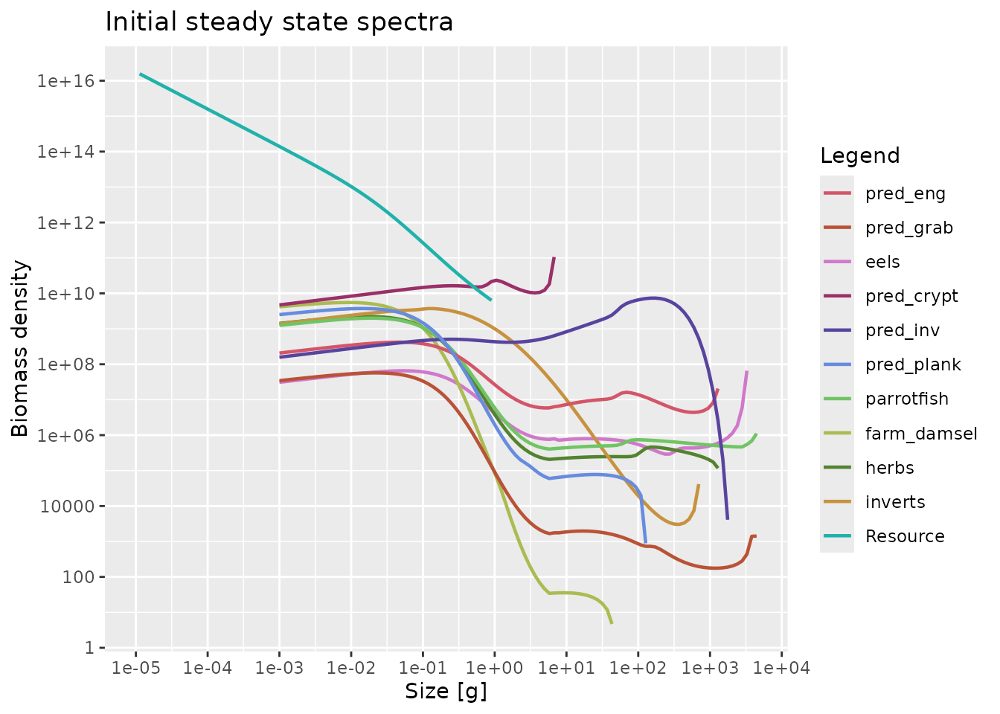
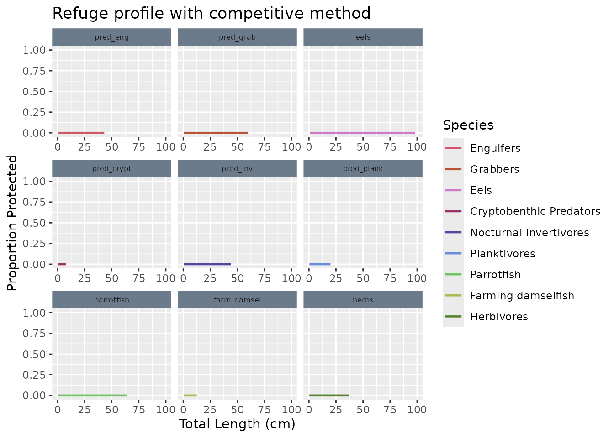
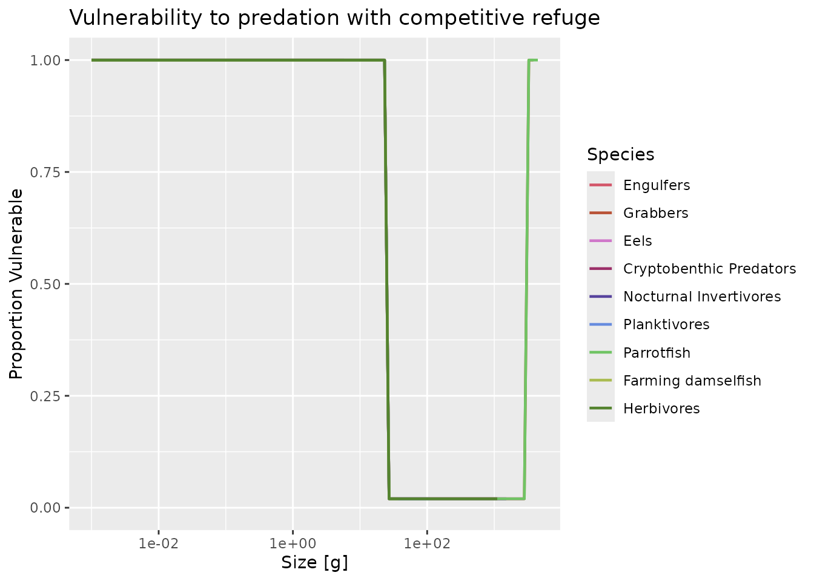
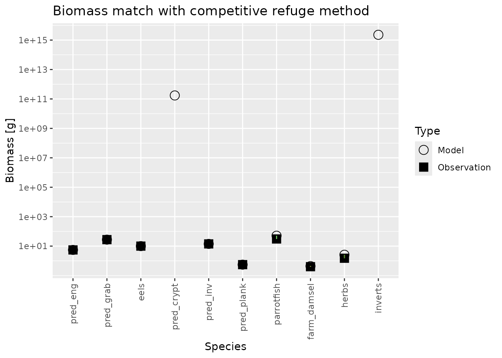

# MizerReef Steady State Recipe

## Introduction

Achieving a steady state that matches observed biomasses and growth
rates is a critical step in `MizerReef` model development. This vignette
provides a step-by-step recipe for tuning a `MizerReef` model to reach a
satisfactory steady state, using the Karpata reef example dataset.

The tuning process follows the 5-step recipe described in the [mizer
blog](https://blog.mizer.sizespectrum.org/posts/%202021-08-20-a-5-step-recipe-for-tuning-the-model-steady-state/),
with additional reef-specific steps to adjust unstructured resource
parameters and refuge dynamics.

## Prerequisites

Before starting, ensure you have:

1.  Species parameter data with reef-specific columns
2.  An interaction matrix defining predator-prey relationships  
3.  Observed biomass data for calibration
4.  A suitable refuge profile for initial tuning

``` r

library(mizerReef)
library(mizer)
library(mizerExperimental)
library(ggplot2)
library(dplyr)
library(knitr)

# Load example datasets
data("caribbean_10_species")
data("caribbean_10_interaction")
data("tuning_profile")
data("karpata_refuge")
```

## Step 1: Create the Initial Parameters Object

The first step is to create a `MizerReefParams` object using your
species parameters and interaction matrix. For initial tuning, we use a
simple binned refuge method rather than the full competitive method.

**Why use a tuning profile first?** The competitive refuge method is
density-dependent, which makes it difficult to achieve a stable steady
state before the biomasses are calibrated to observed values. We start
with a simpler constant binned profile so that we can tune abundances
first.

``` r

# Create initial parameters object with tuning refuge profile
params <- newReefParams(species_params = caribbean_10_species,
                        interaction = caribbean_10_interaction,
                        method = "binned",
                        method_params = tuning_profile)
#> ℹ No h provided for some species, so using age at maturity to calculate it.
#> ℹ Using z0 = z0pre * w_inf ^ z0exp for calculated z0 values.
#> ℹ Using f0, h, lambda, kappa and the predation kernel to calculate gamma.
```

These warnings let us know when the packages set default values for some
parameters such as the search volume, natural mortality, and maximum
consumption rates. You can change these defaults later if you have
better estimates using
[`species_params()`](https://sizespectrum.org/mizer/reference/species_params.html)
or one of the `set*()` functions.

Let’s examine the species groups and their key parameters:

``` r

# Show key species parameters
kable(caribbean_10_species[, c("species", "w_max", "w_mat", "refuge_user", 
                          "blocked_pred", "biomass_observed")],
      caption = "Key species parameters for the Karpata model")
```

## Step 2: Find an Initial Steady State

Project the model forward to reach an initial steady state. This may
require multiple iterations of
[`reefSteady()`](https://cmbeese.github.io/mizerReef/reference/reefSteady.md).

``` r

# Project to steady state - multiple calls ensure convergence
params <- params |>
    reefSteady() |> reefSteady() |> reefSteady() |> 
    reefSteady() |> reefSteady() |> reefSteady()
#> ℹ Reached the convergence tolerance after 31.5 years. The biomasses change at up to 1.6e-09 per year.
#> ℹ Reached the convergence tolerance after 1.5 years. The biomasses change at up to 6.4e-10 per year.
#> ℹ Reached the convergence tolerance after 1.5 years. The biomasses change at up to 2.6e-10 per year.
#> ℹ Reached the convergence tolerance after 1.5 years. The biomasses change at up to 1e-10 per year.
#> ℹ Reached the convergence tolerance after 1.5 years. The biomasses change at up to 4.2e-11 per year.
#> ℹ Reached the convergence tolerance after 1.5 years. The biomasses change at up to 1.7e-11 per year.
#> Warning: The following species require an unrealistic value greater than 1 for
#> `erepro`: pred_grab, pred_plank, farm_damsel

# Check convergence by plotting spectra
plotSpectra(params, biomass = TRUE) +
  ggtitle("Initial steady state spectra")
```



If you’re having trouble reaching a steady state, consider providing the
species parameter `R_max` or adjusting the `reproduction_level` like
this:

``` r

# Set reproduction levels to 0.5 for all species
rdi <- rep(0.5, nrow(caribbean_10_species))
names(rdi) <- caribbean_10_species$species

params <- setBevertonHolt(params, reproduction_level = rdi)
#> Warning: The following species require an unrealistic value greater than 1 for
#> `erepro`: pred_grab, pred_plank, farm_damsel, herbs

# Check the reproduction levels
reproduction_levels <- getReproductionLevel(params)
kable(data.frame(Species = names(reproduction_levels), 
                 Reproduction_Level = reproduction_levels),
      caption = "Initial reproduction levels")
```

|             | Species     | Reproduction_Level |
|:------------|:------------|-------------------:|
| pred_eng    | pred_eng    |                0.5 |
| pred_grab   | pred_grab   |                0.5 |
| eels        | eels        |                0.5 |
| pred_crypt  | pred_crypt  |                0.5 |
| pred_inv    | pred_inv    |                0.5 |
| pred_plank  | pred_plank  |                0.5 |
| parrotfish  | parrotfish  |                0.5 |
| farm_damsel | farm_damsel |                0.5 |
| herbs       | herbs       |                0.5 |
| inverts     | inverts     |                0.5 |

Initial reproduction levels {.table}

**Why use density-dependence?** Pure density-independence (the mizer
default) can cause instability in any model, but models with
reef-specific non-linearities (multiple resources, refuge dynamics) are
especially prone to this. Moderate density-dependence provides
stabilizing feedback without creating the steep response curves that
cause oscillations.

**Click for detailed explanation of reproduction dynamics**

### Understanding Reproduction Level and Convergence

#### What does reproduction_level control?

The `reproduction_level` parameter controls the **functional form** of
the Beverton-Holt stock-recruitment relationship. It ranges from 0
(maximum compensation) to 1 (no compensation):

- **reproduction_level = 1** (mizer default): Purely
  density-**independent**. Recruitment is directly proportional to
  spawning biomass with no compensatory feedback. Linear response.

- **reproduction_level = 0.5** (intermediate): Moderate
  density-**dependence**. Recruitment saturates somewhat as spawning
  biomass increases, providing compensatory feedback but not extreme
  non-linearity.

- **reproduction_level = 0** (maximum): Strongly density-**dependent**.
  Recruitment saturates quickly, creating steep non-linear response
  curves. Maximum compensation.

#### Why does pure density-independence (default) fail in reef models?

During
[`reefSteady()`](https://cmbeese.github.io/mizerReef/reference/reefSteady.md)
(which is also what mizer’s
[`tuneSteadyState()`](https://sizespectrum.org/mizer/reference/tuneSteadyState.html),
and its superseded alias
[`steady()`](https://sizespectrum.org/mizer/reference/superseded_steady.html),
run on a reef model), the algorithm iteratively adjusts `erepro` (egg
production efficiency) to drive each species toward equilibrium where
births equal deaths.

**With pure density-independence (reproduction_level = 1, the mizer
default):**

1.  **No stabilizing feedback**: Biomass fluctuations have no
    compensatory response in recruitment.

2.  **Compounded instability**: Reef models add multiple non-linearities
    (refuge dynamics, multiple resources). Without reproductive
    compensation to dampen fluctuations, these non-linearities interact
    chaotically.

3.  **Failed convergence**: The solver can’t find a stable equilibrium
    because small perturbations propagate without feedback.

**With moderate density-dependence (reproduction_level = 0.5):**

- **Stabilizing feedback**: If biomass drops, recruitment compensates
  somewhat, preventing runaway collapses.

- **Smooth response**: The compensation is gradual, not steep, so the
  solver can iterate without overshooting.

- **Convergence**: The system finds a stable equilibrium where
  reproductive feedback balances the reef non-linearities.

**With strong density-dependence (reproduction_level near 0):**

- **Too steep**: The compensation curve becomes so non-linear that the
  solver overshoots targets, creating oscillations again.

#### Why are reef models especially sensitive?

MizerReef models add multiple sources of non-linearity:

- **Multiple resources** (algae, detritus, plankton) with their own
  coupled dynamics
- **Refuge mechanisms** that non-linearly affect predation mortality
  based on density
- **Iterative calibration loops** (`calibrateReefBiomass`,
  `matchReefGrowth`) that compound small instabilities

With **no density-dependence** (mizer default), there’s no compensatory
feedback to stabilize these interacting non-linearities. The system has
too many sources of instability and no damping mechanism.

With **moderate density-dependence** (0.5), reproductive compensation
provides just enough stabilizing feedback without adding another steep
non-linearity. This balances the non-linearity budget and allows
convergence.

With **strong density-dependence** (near 0), the steep compensation
curve itself becomes a destabilizing non-linearity, causing
overshooting.

#### What does reproduction_level do outside of steady state?

During forward projections
([`project()`](https://sizespectrum.org/mizer/reference/project.html)),
`reproduction_level` controls how recruitment responds to biomass
perturbations:

- **Low (high density-dependence)**: Strong compensatory dynamics.
  Overfished stocks recover faster because recruitment is maintained
  even at low spawning biomass. Boom-bust cycles are naturally damped.

- **High (low density-dependence)**: Recruitment tracks spawning biomass
  more directly with less compensation. Populations are more vulnerable
  to collapse but also track environmental drivers more closely.

#### Is this biologically realistic for reefs?

For many reef fish species, **moderate density-dependence is often more
realistic** than either pure density-independence or strong
compensation:

- **Larval dispersal**: Reef fish larvae disperse widely in ocean
  currents. Local recruitment is weakly (but not completely) tied to
  local spawning stock because recruits come from both local and distant
  populations (open recruitment system). This creates weak to moderate
  density-dependence.

- **Connectivity**: Reef ecosystems are highly interconnected through
  larval exchange. Local density-dependent feedbacks exist but are
  dampened by connectivity, resulting in moderate (not strong)
  compensation.

- **Environmental variability**: Recruitment is driven by both spawning
  stock and oceanographic conditions. Pure density-independence (default
  mizer) would ignore biological reality that spawning stock matters
  *somewhat*.

Therefore, setting `reproduction_level` to 0.5 is not just numerically
convenient—it often better reflects reef fish biology than either
extreme (pure density-independence or maximum compensation).

#### Recommended workflow

1.  **During calibration**: Set `reproduction_level` to 0.5 (moderate
    density-dependence) to ensure convergence while matching biomasses
    and growth rates. This provides stabilizing feedback without extreme
    non-linearity.

2.  **After calibration**: You can optionally increase
    `reproduction_level` toward 1 (less compensation) if you believe
    recruitment is very weakly density-dependent, or decrease it toward
    0 (stronger compensation) if you need to test recovery dynamics from
    overfishing.

3.  **For reef models**: Keeping `reproduction_level` at moderate values
    (around 0.5) throughout is usually both numerically stable and
    biologically defensible for most reef fish with moderate
    connectivity.

## Step 3: Calibrate Biomasses and Growth

This is the core tuning step where we iteratively match observed
biomasses and growth rates.

### Step 4a: Match Observed Biomasses

Use
[`calibrateReefBiomass()`](https://cmbeese.github.io/mizerReef/reference/calibrateReefBiomass.md)
to adjust reproduction parameters so that modeled biomasses match
observations.

``` r

# Calibrate biomasses to match observations
params <- calibrateReefBiomass(params)
params <- matchBiomasses(params)
params <- reefSteady(params)

# Plot comparison of observed vs modeled biomasses
plotBiomassVsSpecies(params) + 
  ggtitle("Biomass comparison after initial calibration")
```

### Step 4b: Match Growth Rates

Adjust growth-related parameters to match observed growth rates using
[`matchReefGrowth()`](https://cmbeese.github.io/mizerReef/reference/matchReefGrowth.md).

``` r

# Match growth rates
params <- matchReefGrowth(params)
params <- reefSteady(params)

# Check age at maturity matches observations
age_mat_observed <- caribbean_10_species$age_mat
age_mat_model <- age_mat(params)

age_comparison <- data.frame(
  Species = caribbean_10_species$species,
  Observed = age_mat_observed,
  Model = age_mat_model,
  Difference = age_mat_model - age_mat_observed
)

kable(age_comparison, 
      caption = "Comparison of observed vs modeled age at maturity",
      digits = 2)
```

### Step 4c: Iterative Refinement

Repeat the biomass and growth matching process to fine-tune the model.

``` r

# Iterate to refine biomass and growth matches
params <- params |>
    calibrateReefBiomass() |> matchBiomasses() |> matchReefGrowth() |> 
    reefSteady() |>
    calibrateReefBiomass() |> matchBiomasses() |> matchReefGrowth() |> 
    reefSteady() |>
    calibrateReefBiomass() |> matchBiomasses() |> matchReefGrowth() |> 
    reefSteady()

# Final biomass comparison
plotBiomassVsSpecies(params) + 
  ggtitle("Final biomass comparison after iterative tuning")
```

Let’s examine the model performance after tuning:

``` r

# Check feeding levels
plotFeedingLevel(params) + 
  ggtitle("Feeding levels after tuning")

# Check predation mortality
plotPredMort(params) + 
  facet_wrap(~Species) +
  ggtitle("Predation mortality by species")
```

## Step 5: Switch to Competitive Refuge Method

Once we have a stable steady state with the tuning refuge profile, we
can switch to the full competitive refuge method, which includes
density-dependent refuge dynamics.

**Why switch methods?** The competitive method provides more realistic
refuge dynamics but requires a stable baseline to work from.

``` r

# Switch to competitive refuge method
params <- newRefuge(params,
                    new_method = "competitive", 
                    new_method_params = karpata_refuge)

# Check the new refuge profile
plotRefugeProfile(params) +
  ggtitle("Refuge profile with competitive method")
```



After switching refuge methods, we need to re-match biomasses as the
refuge dynamics will have changed:

``` r

# Re-match biomasses with new refuge method
params <- params |>
    matchBiomasses() |> reefSteady() |> 
    matchBiomasses() |> reefSteady() |>
    matchBiomasses() |> reefSteady() |>
    matchBiomasses() |> reefSteady()
#> ℹ `matchBiomasses()` has rescaled the model and so moved it off its steady state. Run `tuneSteadyState()` to settle it again. You can check with `getSteadyResidual()`.
#> ℹ Reached the convergence tolerance after 13.5 years. The biomasses change at up to 4e-05 per year.
#> ℹ Reached the convergence tolerance after 10.5 years. The biomasses change at up to 0.0011 per year. The component `algae` (up to 0.11 per year) is also changing. Components are not included in the biomass drift above, although this run does advance them; see `attr(getSteadyResidual(params), "other")` for the rates themselves.
#> ℹ Reached the convergence tolerance after 9 years. The biomasses change at up to 0.0012 per year. The component `algae` (up to 0.11 per year) is also changing. Components are not included in the biomass drift above, although this run does advance them; see `attr(getSteadyResidual(params), "other")` for the rates themselves.
#> ℹ Reached the convergence tolerance after 9 years. The biomasses change at up to 0.00037 per year.
#> Warning: ! For the following species `erepro` has been increased to the smallest possible value: erepro[eels] = 0.00929
#> ! The following species require an unrealistic value greater than 1 for `erepro`: pred_plank, farm_damsel

# Check vulnerability with new method
plotVulnerable(params) + 
  ggtitle("Vulnerability to predation with competitive refuge")
```



``` r


# Final biomass check
plotBiomassVsSpecies(params) + 
  ggtitle("Biomass match with competitive refuge method")
#> Warning: Removed 2 rows containing missing values or values outside the scale range
#> (`geom_segment()`).
```



## Step 6: Fine-tune Reproduction Parameters

The final step involves tuning reproduction parameters to achieve the
desired reproduction levels and density-dependence.

``` r

# Set reproduction efficiency to allow some density dependence
params <- setBevertonHolt(params, erepro = 0.35)
params <- reefSteady(params)

# Check reproduction levels - should be realistic for each species
final_reproduction_levels <- getReproductionLevel(params)
kable(data.frame(Species = names(final_reproduction_levels), 
                 Reproduction_Level = final_reproduction_levels),
      caption = "Final reproduction levels",
      digits = 3)

# Check ratio of density-independent to density-dependent reproduction
rdi_rdd_ratio <- getRDI(params) / getRDD(params)
kable(data.frame(Species = names(rdi_rdd_ratio), 
                 RDI_RDD_Ratio = rdi_rdd_ratio),
      caption = paste0("Ratio of density-independent to ",
                       "density-dependent reproduction"),
      digits = 2)
```

### Final Model Validation

Let’s examine the final model performance across multiple metrics:

``` r

# Overall spectra
plotSpectra(params, total = TRUE, biomass = TRUE, per_log_size = TRUE) + 
  ggtitle("Final total spectra")

# Diet composition
plotDiet(params) + 
  scale_x_log10(limits = c(1, 1e4)) +
  ggtitle("Diet composition by size")

# Growth curves
plotGrowthCurves(params) + 
  ggtitle("Growth curves")
```

## Summary

This recipe provides a systematic approach to tuning `MizerReef` models:

1.  **Start simple**: Use a binned refuge method for initial tuning
2.  **Set intermediate reproduction**: Add moderate density-dependence
    (0.5) for stability
3.  **Iterative matching**: Repeatedly match biomasses and growth rates
4.  **Add complexity**: Switch to competitive refuge method when stable
5.  **Final tuning**: Adjust reproduction parameters for realistic
    dynamics

### Key Functions Used

- [`newReefParams()`](https://cmbeese.github.io/mizerReef/reference/newReefParams.md):
  Create initial parameters object
- [`setBevertonHolt()`](https://sizespectrum.org/mizer/reference/setBevertonHolt.html):
  Set reproduction parameters
- [`reefSteady()`](https://cmbeese.github.io/mizerReef/reference/reefSteady.md):
  Project to steady state
- [`calibrateReefBiomass()`](https://cmbeese.github.io/mizerReef/reference/calibrateReefBiomass.md):
  Match observed biomasses
- [`matchReefGrowth()`](https://cmbeese.github.io/mizerReef/reference/matchReefGrowth.md):
  Match growth rates  
- [`newRefuge()`](https://cmbeese.github.io/mizerReef/reference/newRefuge.md):
  Switch refuge methods
- Various plotting functions for validation

### Complete Tuning Script

Here’s the complete script used for the Karpata model:

``` r

# Complete tuning script for Karpata model
library(mizerReef)
library(mizer)

# Load data
data("caribbean_10_species")
data("caribbean_10_interaction") 
data("tuning_profile")
data("karpata_refuge")

# 1. Create initial parameters
params <- newReefParams(species_params = caribbean_10_species,
                        interaction = caribbean_10_interaction,
                        method = "binned",
                        method_params = tuning_profile)

# 2. Set intermediate reproduction level (moderate density-dependence)
rdi <- rep(0.5, nrow(caribbean_10_species))
params <- setBevertonHolt(params, reproduction_level = rdi)

# 3. Initial steady state
params <- params |>
    reefSteady() |> reefSteady() |> reefSteady() |> 
    reefSteady() |> reefSteady() |> reefSteady()

# 4. Calibrate biomasses and growth
params <- calibrateReefBiomass(params)
params <- matchBiomasses(params)
params <- reefSteady(params)
params <- matchReefGrowth(params)
params <- reefSteady(params)

# Iterative refinement
params <- params |>
    calibrateReefBiomass() |> matchBiomasses() |> matchReefGrowth() |> 
    reefSteady() |>
    calibrateReefBiomass() |> matchBiomasses() |> matchReefGrowth() |> 
    reefSteady() |>
    calibrateReefBiomass() |> matchBiomasses() |> matchReefGrowth() |> 
    reefSteady()

# 5. Switch to competitive refuge
params <- newRefuge(params,
                    new_method = "competitive",
                    new_method_params = karpata_refuge)

# Re-match with new refuge
params <- params |>
    matchBiomasses() |> reefSteady() |> 
    matchBiomasses() |> reefSteady() |>
    matchBiomasses() |> reefSteady() |>
    matchBiomasses() |> reefSteady()

# 6. Fine-tune reproduction
params <- setBevertonHolt(params, erepro = 0.35)
params <- setBevertonHolt(params, reproduction_level = rdi)
params <- params |>
    reefSteady() |> reefSteady() |> reefSteady()

# Save final model
caribbean_10_model <- reefSteady(params)
```

### Further Reading

- [Getting started with
  MizerReef](https://cmbeese.github.io/mizerReef/articles/mizerReef.md)
- [Karpata Model
  Description](https://cmbeese.github.io/mizerReef/articles/karpata_model-description.md)
- [Mizer steady state tuning
  blog](https://blog.mizer.sizespectrum.org/posts/%202021-08-20-a-5-step-recipe-for-tuning-the-model-steady-state/)

&nbsp;

    #> R version 4.6.1 (2026-06-24)
    #> Platform: x86_64-pc-linux-gnu
    #> Running under: Ubuntu 24.04.4 LTS
    #> 
    #> Matrix products: default
    #> BLAS:   /usr/lib/x86_64-linux-gnu/openblas-pthread/libblas.so.3 
    #> LAPACK: /usr/lib/x86_64-linux-gnu/openblas-pthread/libopenblasp-r0.3.26.so;  LAPACK version 3.12.0
    #> 
    #> locale:
    #>  [1] LC_CTYPE=C.UTF-8       LC_NUMERIC=C           LC_TIME=C.UTF-8       
    #>  [4] LC_COLLATE=C.UTF-8     LC_MONETARY=C.UTF-8    LC_MESSAGES=C.UTF-8   
    #>  [7] LC_PAPER=C.UTF-8       LC_NAME=C              LC_ADDRESS=C          
    #> [10] LC_TELEPHONE=C         LC_MEASUREMENT=C.UTF-8 LC_IDENTIFICATION=C   
    #> 
    #> time zone: UTC
    #> tzcode source: system (glibc)
    #> 
    #> attached base packages:
    #> [1] stats     graphics  grDevices utils     datasets  methods   base     
    #> 
    #> other attached packages:
    #> [1] knitr_1.51              dplyr_1.2.1             ggplot2_4.0.3          
    #> [4] mizerExperimental_3.3.1 mizerReef_2.0.3         mizer_3.3.1            
    #> 
    #> loaded via a namespace (and not attached):
    #>  [1] plotly_4.12.1       sass_0.4.10         generics_0.1.4     
    #>  [4] tidyr_1.3.2         stringi_1.8.9       digest_0.6.39      
    #>  [7] magrittr_2.0.5      timechange_0.4.0    evaluate_1.0.5     
    #> [10] grid_4.6.1          RColorBrewer_1.1-3  fastmap_1.2.0      
    #> [13] plyr_1.8.9          jsonlite_2.0.0      httr_1.4.8         
    #> [16] purrr_1.2.2         viridisLite_0.4.3   scales_1.4.0       
    #> [19] textshaping_1.0.5   jquerylib_0.1.4     cli_3.6.6          
    #> [22] rlang_1.3.0         withr_3.0.3         cachem_1.1.0       
    #> [25] yaml_2.3.12         otel_0.2.0          tools_4.6.1        
    #> [28] reshape2_1.4.5      assertthat_0.2.1    vctrs_0.7.3        
    #> [31] R6_2.6.1            lubridate_1.9.5     lifecycle_1.0.5    
    #> [34] stringr_1.6.0       fs_2.1.0            htmlwidgets_1.6.4  
    #> [37] ragg_1.5.2          pkgconfig_2.0.3     desc_1.4.3         
    #> [40] pkgdown_2.2.1       pillar_1.11.1       bslib_0.12.0       
    #> [43] gtable_0.3.6        glue_1.8.1          data.table_1.18.6.1
    #> [46] Rcpp_1.1.2          systemfonts_1.3.2   xfun_0.60          
    #> [49] tibble_3.3.1        tidyselect_1.2.1    farver_2.1.2       
    #> [52] htmltools_0.5.9     labeling_0.4.3      rmarkdown_2.31     
    #> [55] compiler_4.6.1      S7_0.2.2
