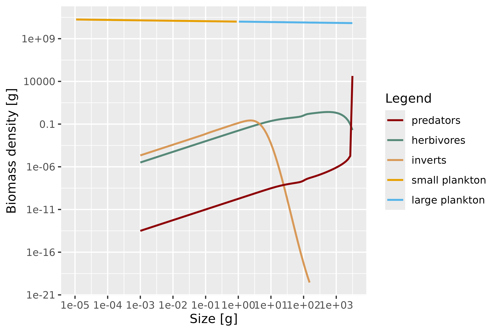
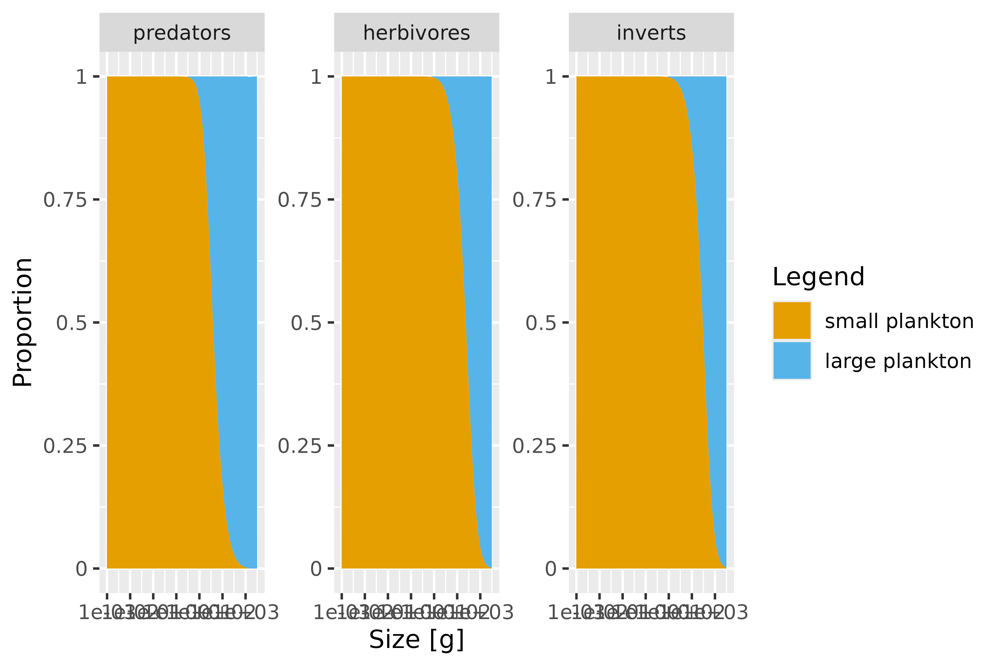
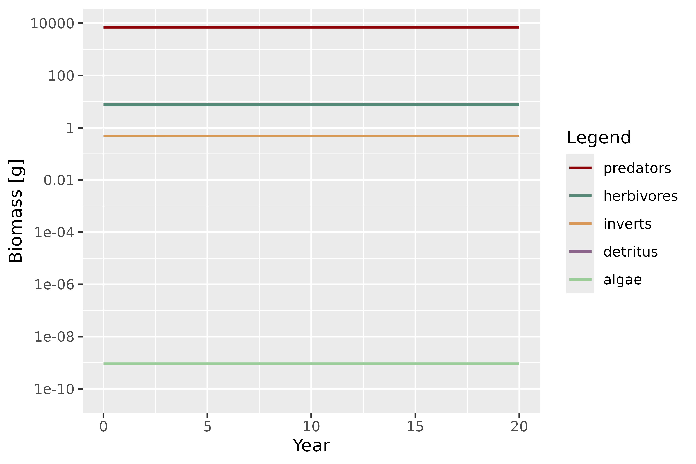

# Combining mizerReef with mizerMR: multiple background resources

## Overview

A standard mizer model has a single, size-structured background resource
spectrum that represents everything the fish community feeds on but
which is not itself resolved as a dynamic species. mizerReef keeps that
single resource and adds two *unstructured* benthic components on top of
it — algae and detritus — so that herbivores and detritivores have
somewhere to feed.

Sometimes one lumped planktonic resource is too coarse. Different parts
of the community may rely on ecologically distinct pools of prey that
occupy different size ranges and replenish at different rates. The
[mizerMR](https://sizespectrum.org/mizerMR/) extension package solves
exactly this problem: it replaces the single background resource with
any number of independent, size-structured resource spectra, and lets
each predator species have its own preference for each resource.

Because both packages are written as mizer *extensions*, they compose.
This vignette shows how to:

1.  [Load both extensions](#loading-both-extensions) and understand what
    the combined model class means.
2.  [Split the reef’s background
    resource](#splitting-the-background-resource) into several
    size-structured resources.
3.  [Give species different resource
    preferences](#giving-species-different-preferences) with an
    interaction matrix.
4.  [Retune the steady state](#retuning-the-steady-state) and [explore
    the results](#exploring-the-results).

We assume you have read
[`vignette("mizerReef")`](https://cmbeese.github.io/mizerReef/articles/mizerReef.md)
and are comfortable with the basic reef workflow. Familiarity with
[`vignette("guide-use-extension-packages", package = "mizer")`](https://sizespectrum.org/mizer/articles/guide-use-extension-packages.html)
is helpful but not required.

## Loading both extensions

Install mizerMR alongside mizerReef if you do not have it yet:

``` r

# install.packages("remotes")
remotes::install_github("sizespectrum/mizerMR")
```

Then load both packages. Each mizer extension announces itself to mizer
when it is loaded, building up an *extension chain*. The package you
load **last** sits at the front of the chain.

``` r

library(mizerReef)
library(mizerMR)
```

``` r

getRegisteredExtensions()
#>                  mizerMR                mizerReef 
#>   "sizespectrum/mizerMR" "sizespectrum/mizerReef"
```

Both extensions are now active. mizerReef ships an example model for a
generic three-group Caribbean reef, `caribbean_3_model`, with functional
groups for predators, herbivores and invertebrates:

``` r

params <- caribbean_3_model
class(params)
#> [1] "mizerReef"
#> attr(,"package")
#> [1] ".GlobalEnv"
```

The object carries the `mizerReef` class, so all of mizer’s generics
([`project()`](https://sizespectrum.org/mizer/reference/project.html),
[`plotSpectra()`](https://sizespectrum.org/mizer/reference/plotSpectra.html),
[`getBiomass()`](https://sizespectrum.org/mizer/reference/getBiomass.html),
…) dispatch to mizerReef’s methods. It has a single background resource
plus the reef’s algae and detritus components:

``` r

names(params@other_params)
#> [1] "include_sen_mort" "refuge_params"    "ext_mort_params"  "algae"           
#> [5] "detritus"         "new_refuge"
```

## Splitting the background resource

In the example model, predators feed mostly on the size-structured
background resource (think planktonic and small pelagic prey), while
herbivores and invertebrates take a smaller share of it in addition to
algae and detritus:

``` r

sp <- species_params(params)
data.frame(species = sp$species,
           interaction_resource = sp$interaction_resource,
           interaction_algae = sp$interaction_algae,
           interaction_detritus = sp$interaction_detritus)
#>               species interaction_resource interaction_algae
#> predators   predators                  1.0                 0
#> herbivores herbivores                  0.2                 1
#> inverts       inverts                  0.2                 0
#>            interaction_detritus
#> predators                     0
#> herbivores                    0
#> inverts                       1
```

Suppose we want to distinguish two planktonic pools: a **small
plankton** resource that dominates the smallest sizes and a **large
plankton** resource that carries the larger prey. mizerMR describes each
resource with one row of a `resource_params` data frame. The important
columns are the coefficient (`kappa`) and exponent (`lambda`) of the
carrying-capacity power law, the size range (`w_min`, `w_max`), and the
replenishment rate (`r_pp`, `n`). Any column you leave out is filled
with a sensible default (see
[`mizerMR::validResourceParams()`](https://sizespectrum.org/mizerMR/reference/validResourceParams.html)).

Here we give both resources the same power law that the original single
resource used, but restrict each to half of the size axis, so that
together they reproduce a continuous background spectrum:

``` r

wf <- w_full(params)
resource_params <- data.frame(
    resource = c("small plankton", "large plankton"),
    kappa    = 1e11,
    lambda   = 2.05,
    w_min    = c(min(wf), 1),
    w_max    = c(1, max(params@w)),
    r_pp     = 4,
    n        = 2 / 3
)
resource_params
#>         resource kappa lambda        w_min w_max r_pp         n
#> 1 small plankton 1e+11   2.05 8.842452e-13     1    4 0.6666667
#> 2 large plankton 1e+11   2.05 1.000000e+00  3125    4 0.6666667
```

[`setMultipleResources()`](https://sizespectrum.org/mizerMR/reference/setMultipleResources.html)
installs these resources into the model. It silences the built-in single
resource and takes over the resource dynamics, while leaving mizerReef’s
algae, detritus and refuge machinery untouched:

``` r

params <- setMultipleResources(params, resource_params = resource_params)
```

The returned object now belongs to a class that chains **both**
extensions:

``` r

class(params)
#> [1] "mizerMR"
#> attr(,"package")
#> [1] ".GlobalEnv"
is(params, "mizerReef")
#> [1] TRUE
is(params, "mizerMR")
#> [1] TRUE
```

[`class()`](https://rdrr.io/r/base/class.html) reports the most-derived
class, `mizerMR`, but the object still inherits from `mizerReef`, so
reef generics and multiple-resource generics both dispatch correctly.
The multiple resources live in a new `"MR"` component:

``` r

names(params@other_params)
#> [1] "include_sen_mort" "refuge_params"    "ext_mort_params"  "algae"           
#> [5] "detritus"         "new_refuge"       "MR"
dimnames(initialNResource(params))$resource
#> [1] "small plankton" "large plankton"
```

## Giving species different preferences

So far both resources are eaten in the same proportions as the original
single resource. The real payoff of multiple resources is that each
species can prefer different ones. This is controlled by a *resource
interaction matrix* with one row per species and one column per
resource.

Let us say predators chase the larger planktonic prey, while herbivores
and invertebrates graze mostly on the small pool:

``` r

resource_interaction <- matrix(
    c(0.2, 1.0,    # predators:  small, large
      0.2, 0.05,   # herbivores
      0.3, 0.05),  # inverts
    nrow = 3, byrow = TRUE,
    dimnames = list(sp = sp$species,
                    resource = resource_params$resource)
)
resource_interaction
#>             resource
#> sp           small plankton large plankton
#>   predators             0.2           1.00
#>   herbivores            0.2           0.05
#>   inverts               0.3           0.05
```

Note the names on the two dimensions (`sp` and `resource`): mizerMR
checks that the matrix matches the species and resources of the model,
so it is worth labelling both axes. We pass the matrix straight to
[`setMultipleResources()`](https://sizespectrum.org/mizerMR/reference/setMultipleResources.html):

``` r

params <- setMultipleResources(
    params,
    resource_params      = resource_params,
    resource_interaction = resource_interaction
)
resource_interaction(params)
#>             resource
#> sp           small plankton large plankton
#>   predators             0.2           1.00
#>   herbivores            0.2           0.05
#>   inverts               0.3           0.05
```

## Retuning the steady state

Changing the resources moves the model away from its previous steady
state, so we retune it. mizerReef’s
[`reefSteady()`](https://cmbeese.github.io/mizerReef/reference/reefSteady.md)
works exactly as it does for an ordinary reef model — it is unaware that
the background is now several resources, because the multiple-resource
dynamics are handled transparently by mizerMR’s methods further down the
chain. A couple of iterations are usually enough:

``` r

params <- reefSteady(params)
params <- reefSteady(params)
```

## Exploring the results

Every reef and multiple-resource plotting function now works on the
combined model.
[`plotSpectra()`](https://sizespectrum.org/mizer/reference/plotSpectra.html)
shows the fish community together with the two background resources,
which tile the size axis:

``` r

plotSpectra(params, biomass = TRUE, per_log_size = TRUE)
```



The diet composition resolves the two resources separately, so you can
see the ontogenetic shift between them. Predators lean on large
plankton, while the smaller-bodied groups take the small-plankton pool
(alongside algae and detritus):

``` r

plotDiet(params)
```



Biomasses of the fish groups and of the unstructured algae and detritus
components are reported by
[`getBiomass()`](https://sizespectrum.org/mizer/reference/getBiomass.html)
as before. The size-structured multiple resources are not folded into
the species biomass table; they are reported through the resource
accessors instead:

``` r

sim <- project(params, t_max = 20)
getBiomass(sim)[c(1, 21), ]
#> Biomass (2 times x 5 species) [g] 
#>     sp
#> time predators herbivores   inverts        algae     detritus
#>   0   7071.571   7.796413 0.4786376 8.993015e-10 5.870785e-11
#>   20  7072.043   7.794797 0.4785763 8.994825e-10 0.000000e+00
```

``` r

plotBiomass(sim)
```



## How the chaining works

Under the hood, both packages register themselves as *dispatching
extensions*. mizer builds an S4 class hierarchy in which the combined
object extends `mizerMR`, which extends `mizerReef`, which extends
`MizerParams`:

``` r

extends("mizerMR")
#> [1] "mizerMR"     "mizerReef"   "MizerParams"
```

When you call a generic such as
[`getEncounter()`](https://sizespectrum.org/mizer/reference/getEncounter.html)
or
[`getBiomass()`](https://sizespectrum.org/mizer/reference/getBiomass.html),
R walks this hierarchy from the outermost class inward. Each extension’s
method does its own work and then calls
[`NextMethod()`](https://rdrr.io/r/base/UseMethod.html) to let the next
extension in the chain contribute. That is why the reef’s
refuge-modified encounter and the multiple resources’ encounter both end
up in the final rate, and why a single
[`plotSpectra()`](https://sizespectrum.org/mizer/reference/plotSpectra.html)
call draws the reef community and every background resource together.
Neither package needs to know about the other; they only need to be
polite about calling
[`NextMethod()`](https://rdrr.io/r/base/UseMethod.html).

### An important caveat: chaining only combines extensions that use the same mechanism

The composability shown above is *not* automatic just because two
packages both touch mizer models — it works here because **both**
mizerReef and mizerMR are *dispatching extensions*: each registers
itself with
[`registerExtension()`](https://sizespectrum.org/mizer/reference/registerExtension.html),
defines an S4 marker class, and calls
[`NextMethod()`](https://rdrr.io/r/base/UseMethod.html) inside every
method that overrides a shared generic. mizer still supports an older,
simpler mechanism for changing a single rate calculation:
`mizer::setRateFunction(params, "Encounter", "my_fun")` swaps in one
named function, with no chaining at all. A params object uses *one
mechanism or the other* for a given rate, never both:
[`getEncounter()`](https://sizespectrum.org/mizer/reference/getEncounter.html)
(and the other rate generics) checks whether the object has been coerced
to a dispatching extension’s class at all, and if so walks the full
[`NextMethod()`](https://rdrr.io/r/base/UseMethod.html) chain — a path
that computes the encounter rate directly and never consults
`rates_funcs` — otherwise it calls the single function named in
`rates_funcs$Encounter` directly.

A concrete example:
[therMizer](https://github.com/sizespectrum/therMizer) (temperature
effects) modifies the encounter rate via
`setRateFunction(params, "Encounter", "therMizerEncounter")` — the
older, non-chaining mechanism; it does not register itself as a
dispatching extension. Once mizerReef has coerced a params object to its
own dispatching class (which happens automatically inside
[`newReefParams()`](https://cmbeese.github.io/mizerReef/reference/newReefParams.md)),
that object’s encounter rate is computed by walking mizerReef’s
[`NextMethod()`](https://rdrr.io/r/base/UseMethod.html) chain, and
`rates_funcs$Encounter` — including a `therMizerEncounter` registration
— is never consulted at all. The reverse is equally true: on an object
still carrying the base `MizerParams` class, `rates_funcs$Encounter`
runs alone and mizerReef’s refuge correction never applies. So combining
mizerReef with an extension like therMizer does not currently give you
both effects together — whichever mechanism happens to govern that rate
for the object determines the outcome, regardless of the order the two
were set up in. Getting genuine composition (as demonstrated above for
mizerReef + mizerMR) requires *both* extensions to be written as
dispatching extensions that call
[`NextMethod()`](https://rdrr.io/r/base/UseMethod.html) — even then, if
either method skips
[`NextMethod()`](https://rdrr.io/r/base/UseMethod.html), the extension
loaded **first** (further down the chain) is the one that gets shadowed.
Truly composable behaviour across *any* pair of mizer extensions,
regardless of which mechanism each uses, is still an evolving part of
the mizer ecosystem.

For more on the extension chain — including how the load order is
recorded in the object and restored when you save and reload it — see
[`vignette("guide-use-extension-packages", package = "mizer")`](https://sizespectrum.org/mizer/articles/guide-use-extension-packages.html).
