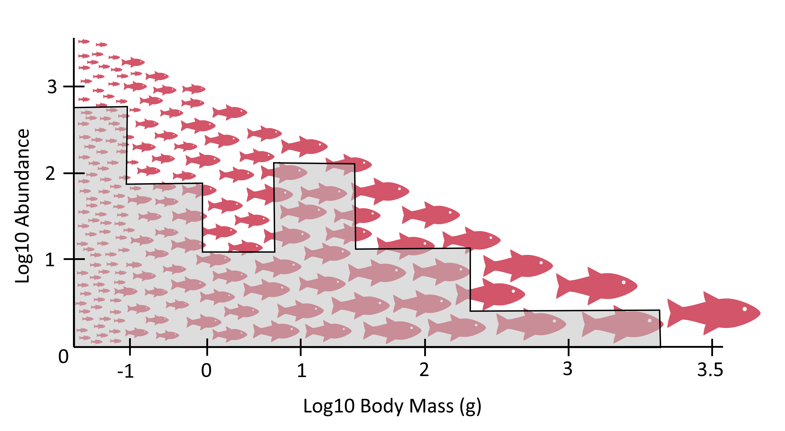
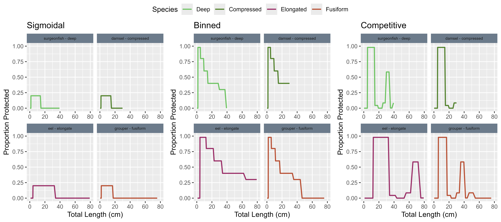
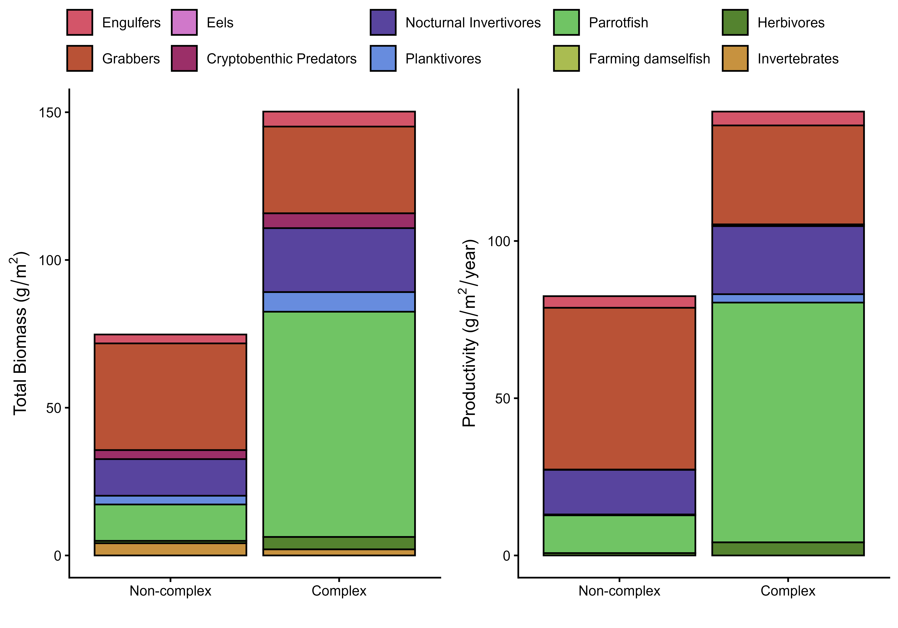

Setting up a `MizerReef` model is very similar to `mizer`. If you need to
brush up on the general `mizer` workflow, see
https://sizespectrum.org/mizer/articles/mizer.html.

This guide details setting up a simple `MizerReef` model from the
beginning, highlighting the package-specific parameters you must supply and
and some of the key functions you will use. It also includes code snippets
to demonstrate how to modify refuge profiles and other `MizerReef`-specific
settings.

Note: this vignette is intended to be runnable in RStudio after the package
has been installed. The examples use the built-in `karpata_species` and
`karpata_int` example data included with the package. See the 
[Model Description](karpata_model-description.html) for more details.

# 1. Installing MizerReef

MizerReef is currently only available from GitHub. To install the latest
version, use the `devtools` package:

```{r, eval=FALSE}
install.packages("devtools")
devtools::install_github("cmbeese/mizerReef")
```

After installation, load MizerReef in each new R session:

```{r}
library(mizerReef)
```

MizerReef depends on the `mizer` package. If not already installed, R will
prompt you to install it automatically. For best results, use a recent
version of R and RStudio.

For troubleshooting or more details, see the 
[MizerReef documentation](https://cmbeese.github.io/mizerReef/) or
 the [GitHub repository](https://github.com/cmbeese/mizerReef).

# 2. Setting up species parameters

The species parameter table is the foundation of any mizer or mizerReef
model. It describes the biological and ecological traits of each species
in your system.

## Minimum required columns for mizer

For a basic mizer model, only the following columns are strictly required:

- `species`: Name of the species or group
- `w_inf`: Asymptotic (maximum) weight

If you have data on abundance at the site you are modelling, it is also helpful to
include:

- `biomass_observed`: Observed biomass density (g/m^2) for each species
- `biomass_cutoff`: Minimum weight (g) of organisms caught by survey methods (helps with tuning)

Since MizerReef's vulnerability and refuge dynamics depend on size, it is also
good to include parameters related to growth and size rather than relying on
defaults. Therefore, we recommend including:

- `w_mat`: Maturity weight (important for life history & growth)
- `k_vb`: von Bertalanffy growth coefficient (important for growth rate)
- Predation kernel parameters (set for each species)
- Length-to-weight conversion parameters `a` and `b`

An interaction table is also required to define predator-prey relationships between
species. See the mizer documentation for details on all optional columns and their defaults.

## Additional columns for mizerReef

mizerReef extends mizer by modeling reef-specific dynamics. To utilise the predation
vulnerability and unstructured resource dynamics in MizerReef, add the following
columns to your species parameter data frame:

```{r reef-params-table, echo=FALSE}
library(knitr)
kable(
  data.frame(
    Column = c("refuge_user", "blocked_pred", "satiation", "interaction_algae", "interaction_detritus"),
    Type = c("logical", "logical", "logical", "numeric", "numeric"),
    Description = c(
      "TRUE if the group uses predation refuge (i.e., individuals hide inside habitat structure to avoid predators; typical for small-bodied or cryptic reef fish). FALSE for species that do not use refuge.",
      "TRUE if the group is blocked from accessing prey in refuge (i.e., predators that cannot reach prey hiding in refug). FALSE for species with behavioural of morphological adaptations (e.g., eels) that allow them to access prey in refuge.",
      "TRUE if group is subject to satiation on unstructured resources (algae or detritus; typically TRUE for herbivores, FALSE for carnivores).",
      "Proportion of diet from algae (0–1)",
      "Proportion of diet from detritus (0–1)"
    )
  ),
  caption = "Additional columns required for mizerReef species parameters."
)
```

By default, MizerReef will assign sensible values to any missing parameters
so that the corresponding feature is disabled, and issue a warning. See
`setRefuge()`, `setAlgaeParams()` and `setDetritusParams()` for additional
details.

The reef-specific parameters in the the `karpata_species` example dataset are shown below:

```{r setup, message=FALSE, echo = FALSE}
library(mizerReef)
data("karpata_species")
data("karpata_int")

# Note: the table below shows the actual values in the
# `karpata_species` dataset. We do not inject defaults here so you can
# inspect what the example dataset contains. In live modelling, MizerReef
# will set sensible defaults and issue warnings for missing parameters.
cols_to_show <- c('species', 'w_max', 'w_mat', 'refuge_user',
                  'bad_pred', 'satiation', 'a', 'b',
                  'interaction_algae', 'interaction_detritus')

# Ensure all requested columns exist so `kable()` doesn't error; missing
# columns will show as NA rather than creating fake defaults.
for (col in cols_to_show) {
  if (!col %in% names(karpata_species)) {
    karpata_species[[col]] <- NA
  }
}

knitr::kable(karpata_species[ , cols_to_show])
```


## 2. Setting the refuge profile

The refuge profile defines how predation refuge availability varies with prey
size (see Figure \@ref(fig:refuge-figure)). This is a key feature of MizerReef that
allows you to represent the effects of habitat structure on predator-prey
interactions.

```{r refuge-figure, echo=FALSE, fig.cap="Conceptual schematic of the refuge profile. The red fish represents the modelled fish spectrum. Individuals protected from predators by refuge are covered by the grey box. The remaining individuals are vulnerable to predation.", fig.alt="Conceptual schematic of refuge protection: fish icons show the size spectrum; the grey box marks sizes protected by refuge.", out.width="70%"}


```

`MizerReef` provides three main methods to define how refuge availability
varies with prey size:

- Sigmoidal: a smooth declining function controlled by a threshold length
  (L_refuge) and a maximum proportion protected. Good for data-poor reefs or
  when you want a simple, smooth profile.
- Binned: user-specified length bins with a constant protection proportion
  inside each bin. Good for theoretical experiments or when you have coarse
  bin information.
- Competitive (density-dependent): uses refuge density (no./m^2) for each
  length bin and divides refuges among competitors, so protection depends on
  fish density. Use this when you have empirical refuge density data.

Figure \@ref(fig:body-shape-example-params) shows example refuge profiles created using
each method and how they differ based on species body shape characteristics.

```{r body-shape-example-params, echo = FALSE, fig.cap = "Example refuge profiles for three methods (sigmoidal, binned, competitive) applied to species with different body shapes (deep, compressed, elongate,fusiform).", fig.alt = "Three-panel plot showing refuge profiles by method (sigmoidal, binned, competitive) for example species with different body shapes: each panel plots protection proportion against length for multiple species, with legend identifying species."}



```

These were the body shape parameters used for the example above:
```{r body-shape-example-table, echo = FALSE, eval = FALSE,}

sp  <- body_shape_example_species_params

knitr::kable(sp['a','b'])

```

The three panels show how the same set of functional groups can receive
different protection based on their body shape, the chosen method, and the
method-specific parameters. The binned and competitive methods allow fine
control across size ranges; the sigmoidal method provides a smooth,
shape controlled by the threshold length and max protection.

## 3. Creating your first model

Once you have your species parameters (with reef-specific columns) and
interaction matrix ready, you can create a `MizerParams` object using
the `newReefParams()` function. This function extends `mizer`'s
`newMultispeciesParams()` by adding reef-specific arguments, checking
user-supplied parameters, and setting sensible defaults for any missing
reef-specific values.

When creating a new `MizerReefParams` object, you can't use the competitive
refuge method when calibrating biomasses because it is density-dependent.
The best practice if you have refuge density data is to first create a model
using the binned method that approximates your refuge profile to tune to 
a steady state and calibrate biomasses, then switch to the competitive method.
The package includes example refuge profiles for tuning (`tuning_profile`)
and a simple step function (`step_tune`) that can be used for this purpose.

```{r create-params, eval = FALSE, echo = TRUE}

karpata_model <- newReefParams(group_params = karpata_species,
                               interaction = karpata_int,
                               method = "binned",
                               method_params = tunning_profile)

```

After creating your initial `params` object, you will typically run through a tuning
sequence to adjust reproduction, growth, and unstructured resource parameters.

### Tuning the steady state (overview and references)

Reaching a steady state that matches observed biomasses and growth rates is
an iterative process. The tuning approach used for MizerReef follows the
5-step recipe described in the mizer blog, with a few additional reef-specific
steps to adjust unstructured resource parameters: 
https://blog.mizer.sizespectrum.org/posts/2021-08-20-a-5-step-recipe-for-tuning-the-model-steady-state/

For more details on tuning MizerReef models, see the
[MizerReef Steady State recipe](steady-state-recipe.html).

The recipe in brief:

1. Start with plausible species parameters and a resource spectrum. Create
  an initial `params` object with `newReefParams()`, using a binned refuge
  profile that mimics your data.
2. Reduce the density-dependence of reproduction by reducing the reproduction level.
  Run to a steady using reefSteady(). 
3. Iterate through `calibrateReefBiomass()`, `matchBiomasses()`, `matchReefGrowth()`
  and `reefSteady()` to reach a satisfactory steady state.  
4. Change to your desired refuge method (for example, competitive) using
  `setRefuge()`, then re-tune the steady state by iterating step 3 again.
5. Tune the reproduction parameters according to the mizer blog recipe to reach
  the final steady state.


### Exploring results

Most plotting and summary functions from `mizer` also work with
`MizerReef`. The package adds helper plotting functions for refuge,
algae, and detritus (for example `plotRefuge()`, `plotAlgaeConsumption()`,
`plotDetritusProduction()`). Use `plot(sim)` for an overview and the
specialised helpers for more detail.

## 4. Changing the refuge profile

To see how changing the refuge profile affects model dynamics, you can use
the `newRefuge()` function to change the refuge profile of your model. 
You should always run back steady state with `reefSteady()` after changing
the refuge profile.

In this example, we change from the competitive refuge profile to a
non-complex (no refuge) profile and compare fisheries productivity and  biomass
between the two models using mizerReef's built in plotting functions.
```{r change-refuge, echo = TRUE, eval=FALSE, fig.cap="The biomass (left) and productivity (right) for a model with no predation refuge (non-complex) and a model with predation refuge based on data from Karpata Reef in Bonaire (complex). Colours represent species groups.", fig.alt="Two-panel plot showing total biomass and productivity for complex and non-complex refuge profiles."}

non_complex <- newRefuge(karpata_model, new_method = "noncomplex")

non_complex <- non_complex |>
    reefSteady() |> reefSteady() |> reefSteady() |> reefSteady() |> 
    reefSteady() |> reefSteady() |> reefSteady() |> reefSteady()


# Fisheries productivity and biomass comparison, L = 20 and L = 40
all_biom11 <- plot2TotalBiomass(non_complex, karpata_model,
                                name1 = "Non-complex", 
                                name2 = "Complex",
                                stack = TRUE)

all_prod11 <- plot2Productivity(non_complex, karpata_model,
                                name1 = "Non-complex", 
                                name2 = "Complex",
                                stack = TRUE) 

```

```{r refuge_effects, echo=FALSE, fig.cap="The biomass (left) and productivity (right) for a model with no predation refuge (non-complex) and a model with predation refuge based on data from Karpata Reef in Bonaire (complex). Colours represent species groups.", fig.alt="Two-panel plot showing total biomass and productivity for complex and non-complex refuge profiles.", out.width="80%"}



```

We can see that removing refuge availability reduces both biomass and
productivity across all species, see figure \@ref(fig:refuge_effects). 

To learn more about how to modify refuge profiles and their parameters,
see the `setRefuge()` function documentation.

For more information on running simulations and exploring results, see the
[mizerReef model description vignette](karpata_model-description.html) and 
the [mizerReef degradation vignette](reef-degradation-simulations.html).

## Links and further reading

- The official `mizer` getting started guide: https://sizespectrum.org/mizer/articles/mizer.html

## Model description context

For context, here is a short excerpt summarising the model purpose and the
role of habitat structure (extracted from the package model description):

"Habitat structure mediates system dynamics by providing predation refuge.
The most effective refuges fit prey while excluding predators, so refuge
use is primarily governed by body size. In systems with high structural
complexity (for example, coral reefs), refuge use patterns are reflected in
the size structure of fish assemblages. Because the protection offered by
refuges is size-dependent, size-spectrum models provide a natural
framework for exploring how benthic structure influences community
dynamics. MizerReef modifies predator–prey encounter rates to represent the
effects of habitat structure, allowing users to explicitly account for
changes in refuge availability caused by habitat degradation or
modification." 

See the full package model description vignette (`reef-model_description`)
for a complete explanation and references.

## Session info

```{r, echo = FALSE}
sessioninfo::session_info()
```
